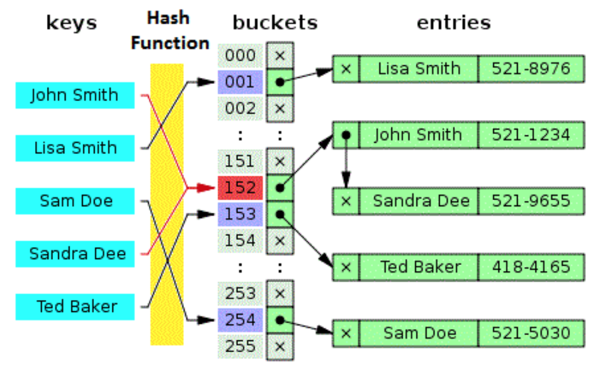

[TOC]

## 哈希/散列表hash table

### 结构特点：

- 元素：元素是键值对(key-value entry)，key 唯一且只允许1个Null值(线程安全时不允许为Null的key)，value随意；

- 存储空间：

  - 存储主体是一纬数组，size/capacity达到loadFactor(默认0.75)后自动扩容；

    

  - key经过哈希运算后的值(hashCode)作为元素的存储地址位置，即主体数组的下标；

  - 哈希冲突：由于哈希表是根据哈希值存储的，当多个key的哈希值相同时，这些元素由于使用同一个地址产生冲突/碰撞：解决办法是通过链表/红黑树，将冲突元素存储在同一个地址，如下图中的 John Smith  和 Sandra Dee 。

    

- 排序顺序：因为是感觉key的哈希值存储，所以key和value都是无序的；

- 操作的时间复杂度：

  - 顺序遍历iterator：按key遍历，时间复杂度为O(n)；

  - 随机查找get(key)：

    按key查找的时间复杂度为O(1)，因为key进行哈希计算直接得到主体数组的位置，性能仅取决于哈希算法的优越度；

  - 随机修插入/修改put(key, value)：

    按key插入/修改的时间复杂度为O(1)，原因是只需要对key进行哈希计算就能定位到在主体数组的位置;

  - 随机删除remove(key)/remove(key, value)：

    按key删除时间复杂度为O(1)，原因和插入/修改相同，并且删除后其他元素也不需要移动；

> 总结：
>
> - 哈希表的主体是一维数组，支持自动扩容，有扩容成本；用key的哈希值作为在数组中的存放的位置，不连续存储，空间利率用和元素定位依赖于哈希算法的优越度；
>
> - 哈希表的按key遍历消耗线性时间O(n)；
>
> - 链表按key进行查找、修改、插入、删除操作消耗常数时间O(1)，因为key可以直接通过哈希算法计算出存储位置；


### Java中的实现：

##### 哈希表：HashMap<K, V>(数组+单向链表/红黑树，无序）

- HashMap (jdk1.8+)原理图


- HashMap (openjdk12)源码解析

```java
public class HashMap<K,V> extends AbstractMap<K,V>
    implements Map<K,V>, Cloneable, Serializable {
     static final int DEFAULT_INITIAL_CAPACITY = 1 << 4; // aka 16
     static final int MAXIMUM_CAPACITY = 1 << 30; // MUST be a power of two <= 1<<30.
     static final float DEFAULT_LOAD_FACTOR = 0.75f;
     static final int TREEIFY_THRESHOLD = 8; // must in (2,8]
     static final int UNTREEIFY_THRESHOLD = 6; // must at most 6
     static final int MIN_TREEIFY_CAPACITY = 64; //at least 4 * TREEIFY_THRESHOLD 

    /**
     * Basic hash bin node, used for most entries.  (See below for
     * TreeNode subclass, and in LinkedHashMap for its Entry subclass.)
     */
    static class Node<K,V> implements Map.Entry<K,V> {
        final int hash;
        final K key;
        V value;
        Node<K,V> next;
        Node(int hash, K key, V value, Node<K,V> next) {
            this.hash = hash;
            this.key = key;
            this.value = value;
            this.next = next;
        }
        public final boolean equals(Object o) {
            if (o == this)
                return true;
            if (o instanceof Map.Entry) {
                Map.Entry<?,?> e = (Map.Entry<?,?>)o;
                if (Objects.equals(key, e.getKey()) &&
                    Objects.equals(value, e.getValue()))
                    return true;
            }
            return false;
        }
    }
    
    static final int hash(Object key) {
        int h;
        return (key == null) ? 0 : (h = key.hashCode()) ^ (h >>> 16);
    }
  
    transient Node<K,V>[] table;
    transient Set<Map.Entry<K,V>> entrySet;
    transient int size;
    transient int modCount;
    int threshold;
    final float loadFactor;
    public HashMap(int initialCapacity, float loadFactor) {
        if (initialCapacity < 0)
            throw new IllegalArgumentException("Illegal initial capacity: " + initialCapacity);
        if (initialCapacity > MAXIMUM_CAPACITY)
            initialCapacity = MAXIMUM_CAPACITY;
        if (loadFactor <= 0 || Float.isNaN(loadFactor))
            throw new IllegalArgumentException("Illegal load factor: " + loadFactor);
        this.loadFactor = loadFactor;
        this.threshold = tableSizeFor(initialCapacity);
    }
}
```

