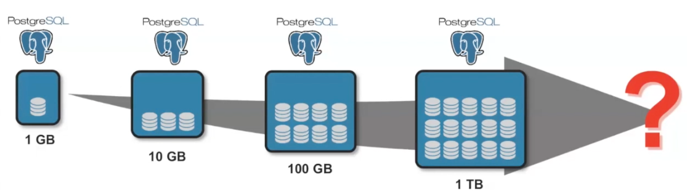
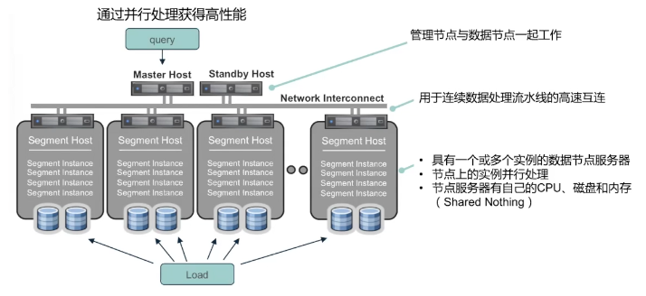
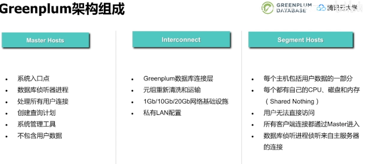

# Greenplum

### 分布式集群架构的发展

- #### sacle up 纵向扩展：

  在单节点上通过升级增加硬件资源(cpu,内存,存储)，来提高数据存储和处理能力。

  缺点：单节点的硬件性能是有极限的，一般1TB就达到了极限，可扩展性差。

  

- #### scale out 横向扩展

  通过增加结点的方式，来提高数据存储和处理能力；

  这种方式的扩展性极佳，适应于海量数据的存储和计算处理。

  

### Greenplum的架构

- 整体架构 scale out 

  目前国内用户，单一集群约200结点；

- 局部架构 shared-nothing

  master host 管理结点：

  

  

