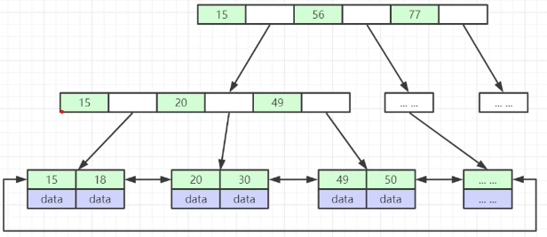

# MySQL 


## 索引

#### 索引的概念：

是帮助MySQL高效获取数据的、排好序的、数据结构。（来自MySQL官方）

#### 索引数据结构：

数据结构理解，推荐参考 University of San Francisco 官网提供的数据结构与算法的动效图[cs.usfca.edu/~galles/visualization/Algorithm](https://www.cs.usfca.edu/~galles/visualization/Algorithms.html) 。

- Hash table 哈希表

  对索引key进行hash计算，得到的值作为行数据存储的位置；

  哈希索引在随机访问时比B+Tree效率更高；

  只能满足=、IN查询条件，不支持范围查询；

  hash冲突问题：

  

- Binary tree 二叉树: 是一棵树，每个节点最多有2个子节点。

- Red-Black tree  红黑树(节点带红、黑着色的二叉平衡树):  随着数据量的增加，树的高度剧增

- B-Tree 多路平衡树:B-Tree 是为了文件系统（磁盘或其它外存设备）而设计的一种多叉平衡查找树（相对于二叉，B树每个内结点有多个分支，即多叉。

  - 叶结点具有相同的深度，叶结点的指针为空；

  - 所有索引元素不重复；

  - 结点(索引+数据)从左到右递增排列**(左子<父<右子)**；

    

- B+tree 多叉平衡树（是B-tree基础上的变种）:

  在b-tree特点的基础上：多叉树，叶结点深度相同，节点从左到右递增排列**(左子<父<=右子)**，优化特性有：

  - 非叶子结点：不存储数据，只存储索引(冗余)，可以放更多的索引；（非叶子结点只存索引，所以IO更快，查找效率更高）
  - 叶子结点：包含整张表的所有索引和数据（数据都存在叶子结点上）；

  - 叶子节点：用双向指针链接，提高区间访问的性能；

    

**因为树索引，是按照树节点从左<父<右排序的，查找是从父节点开始逐步向下查找；所以：树的高度越低，查询效率越高；所以：多叉树的效率高于二叉树，二叉树的高度不可控。**

MySQL的查找树节点的默认大小16KB，

非叶子节点-可存储数据元素的数量估算：16KB/(8byte(biting)+6byte)=1170

叶子结点-可存储数据元素的数量估算：

一棵B+树可以存储的数据量：1170 * 1170 * 16 = 2190 2400


#### 索引的类型：

MySQL 数据库中 B+ 树索引可以分为：聚集索引和辅助索引（非聚集索引）

##### 聚集索引： 

- 是指数据库表中行数据的物理顺序与键值的逻辑（索引）顺序相同；
- 每张表只能有一个聚集索引；
- 聚集索引的叶子节点存储了整个行数据；

> **Innodb 聚集索引规则如下:**
>
> - 如果定义了主键被，那么主键就是聚集索引。
> - 如果没有定义主键，那么该表的第一个唯一非空索引作为聚集索引。
> - 如果没有主键也没有合适的唯一索引；Innodb存为每行数据生成内置6字节列ROWID，作为聚集索引；该列的值会随着数据的插入自增。

##### 辅助索引（非聚集索引）：

- 辅助索引中索引的逻辑顺序与磁盘上行的物理存储顺序不同；
- 一个表中可以拥有多个非聚集索引；
- 叶子节点并不包含行记录的全部数据。
- 叶子节点除了包含键值以外，还存储了一个指向改行数据的聚集索引建的书签。

> **辅助索引（非聚集索引）的二次查询问题：**
>
> 非聚集索引叶节点仍然是索引节点，只是有一个指针指向对应的数据块，因此如果使用非聚集索引查询，而查询列中包含了其他该索引没有覆盖的列，那么他还要进行第二次的查询，查询节点上对应的数据行的数据。
>
> **如何解决非聚集索引二次查询的问题：**
>
> 查询复合索引时，只查询索引列的数据，不需要进行回表二次查询；
>
> 如：idx(col1, col2)，执行语句：select col1, col2 from t1 where col1 = '213';


## MySQL 存储引擎

MySQL 存储引擎是表级别的，每张表可以定义自己的存储引擎。

#### InnoDB (MySQL 5.5之后，是默认存储引擎)

##### 表的存储

使用InnoDB 的表test，在data目录下有2个文件：

- test.**frm**  存储表的**结构**

- test.**ibd**   存储表的**数据和索引**

  表数据本身就按照 B+tree 来组织的，形成一个B+tree索引结构的文件。

##### 建议使用InnoDB的表必须建主键（整型、自增字段），原因是什么？

因为InnoDB是采用聚集索引的，整型、自增的key效率更高。

##### 操作

页（page）作为磁盘和内存之间交互的基本单位；

一个页内可能有一行或多行数据。

##### 应用场景

事务性、安全性操作较多的情况；


#### MyISAM

表 test  (使用存储引擎MyISAM)

data目录下有3个相关文件：

- test.**frm**    存储表的**结构**

- test.**MYD**  存储表的**数据**
- test.**MYI**    存储表的**索引**

##### 特点

不提供对事务的支持，不支持行级锁，不支持外键；

##### 应用场景

执行大量SELECT查询的情况。


### Memory


## 索引的创建与使用

#### 最左索引(列)原则

使用复合索引，需要满足最左侧索引原则，即若 WHERE 条件里没有最左边的一到多列，索引就不会起作用。因为复合索引是对索引列从左向右顺序排列的。

```
假设创建了复合索引index(A,B,C)，那么其实相当于创建了如下三个组合索引：
 index(A,B,C)
 index(A,B)
 index(A)
```


## 分库分表原则

##### 分库原则


##### 分表原则


## SQL 优化

##### 1 explain 查看执行计划


##### 2 内核查询优化器


##### 3 索引


##### 4 SQL


## JSON

```mysql
-- tb_stu_segment definition
CREATE TABLE `tb_stu_segment` (
  `user_id` bigint(20) DEFAULT NULL COMMENT '用户ID',
  `course_id` int(11) DEFAULT NULL COMMENT '课程id',
  `chapter_id` int(11) DEFAULT NULL COMMENT '章节id',
  `lesson_id` int(11) DEFAULT NULL COMMENT '课节id',
  `segement_id` int(11) DEFAULT NULL COMMENT '环节id',
  `interact_count` tinyint(4) DEFAULT NULL COMMENT '本环节-互动题总数（固定值）',
  `finish_time` datetime DEFAULT CURRENT_TIMESTAMP COMMENT '本环节-本次学完时间',
  `star_count` tinyint(4) DEFAULT NULL COMMENT '本环节-本次获得星星总数',
  `answer` json DEFAULT NULL COMMENT '本环节-本次答题路径 Map<String, List<String>>',
  `express_count` tinyint(4) DEFAULT NULL COMMENT '本环节-语音跟读题-答题次数',
  `sid` bigint(20) NOT NULL AUTO_INCREMENT,
  `goods_plan_id` int(11) DEFAULT NULL COMMENT '商品期数id',
  PRIMARY KEY (`sid`)
) ENGINE=InnoDB AUTO_INCREMENT=1 DEFAULT CHARSET=utf8 COMMENT='学员-环节-学完记录';


-- insert test data
INSERT INTO tb_stu_segment (user_id,course_type,course_id,chapter_id,lesson_id,segement_id,interact_count,finish_time,star_count,answer,express_count,goods_plan_id,`tss.answer->'$[0]'`,`tss.answer->'$[1]'`) VALUES 
(1263814329964630018,NULL,95,172,912,2,3,'2020-07-06 15:25:39.0',6,'[{"id": 1, "star": 2, "type": 201, "count": 2, "answer": ["A", "B"]}, {"id": 2, "star": 2, "type": 203, "count": 2, "answer": ["stu-record/xxbgd.mp3"]}, {"id": 3, "star": 2, "type": 204, "count": 2, "answer": ["stu-record/yuan.png"]}]',2,20,'{"id": 1, "star": 2, "type": 201, "count": 2, "answer": ["A", "B"]}','{"id": 2, "star": 2, "type": 203, "count": 2, "answer": ["stu-record/xxbgd.mp3"]}')
;


-- select json array
 select user_id, segement_id , answer->'$[0].count' from tb_stu_segment where answer->'$[0].id'=1;
 
 
```

