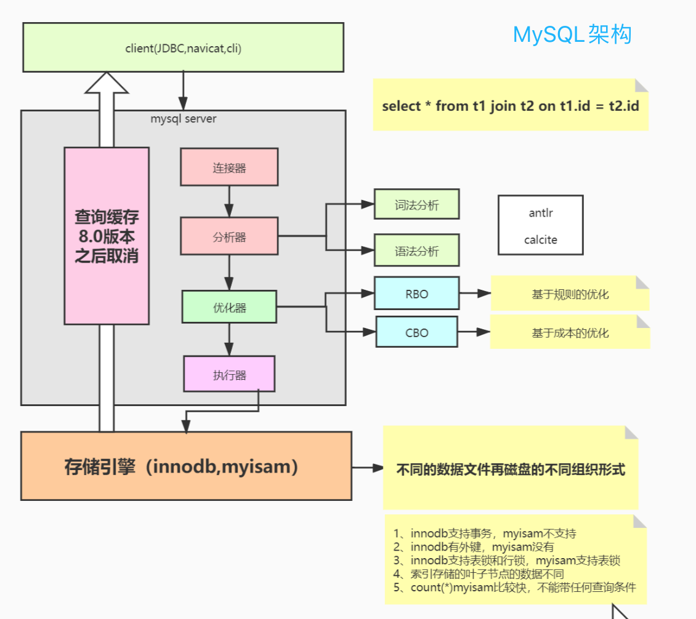
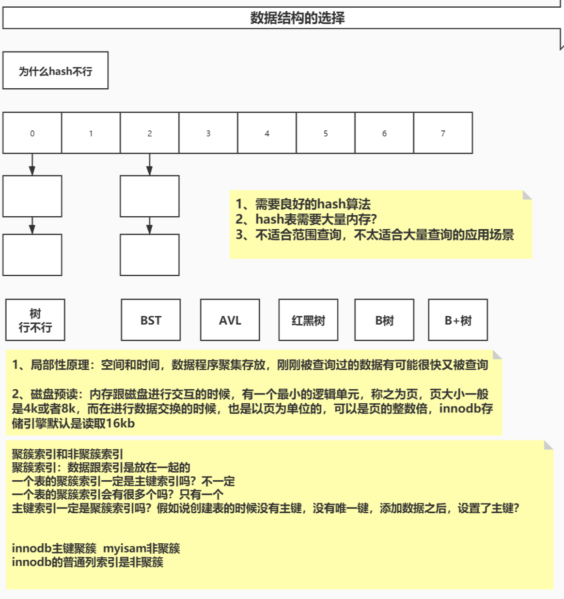
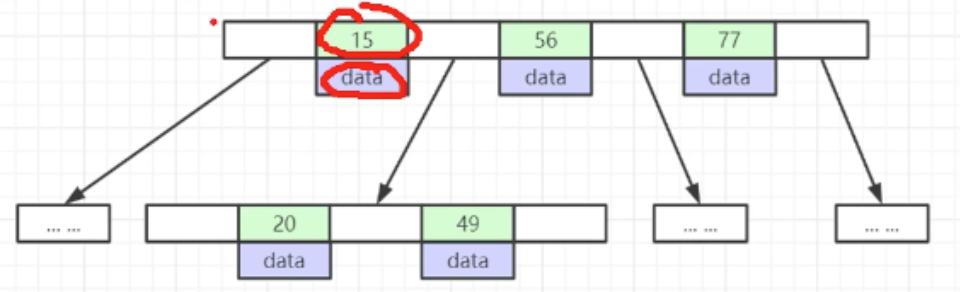

# MySQL 

[TOC]

## MySQL 内核基础架构



MySQL Query Cache 是缓存我们所执行的SELECT语句以及该语句的结果集;

MySQL 在实现 Query Cache 的具体技术细节上类似典型的 KV 存储，就是将 SELECT 语句和该查询语句的结果集做了一个 HASH 映射并保存在一定的内存区域中。当客户端发起 SQL 查询时，Query Cache 的查找逻辑是，先对 SQL 进行相应的权限验证，接着就通过 Query Cache 来查找结果（注意必须是完全相同，即使多一个空格或者大小写不同都认为不同，即使完全相同的SQL，如果使用不同的字符集、不同的协议等也会被认为是不同的查询，而分别进行缓存）。它不需要经过Optimizer模块进行执行计划的分析优化，更不需要发生同任何存储引擎的交互，减少了大量的磁盘IO和CPU运 算，所以有时候效率非常高。


## 索引的概念

是帮助MySQL高效获取数据的、排好序的、数据结构。(来自MySQL官方)


## 索引的数据结构



数据结构理解，推荐参考 University of San Francisco 官网提供的数据结构与算法的动效图[cs.usfca.edu/~galles/visualization/Algorithm](https://www.cs.usfca.edu/~galles/visualization/Algorithms.html) 。

#### Hashtable 哈希表

对索引key进行hash计算，得到的值作为行数据存储的位置；

哈希索引在随机访问时比B+Tree效率更高；

只能满足=、IN查询条件，不支持范围查询；

hash冲突问题：

#### Binary-Tree 二叉树:

是一棵树，每个节点最多有2个子节点。

#### Red-Black-Tree 红黑树-节点带红、黑着色的二叉平衡树): 

 随着数据量的增加，树的高度剧增

#### B-Tree 多路平衡查找树:

B-Tree 是为了文件系统（磁盘或其它外存设备）而设计的一种多叉平衡查找树（相对于二叉，B树每个内结点有多个分支，即多叉。

- 叶结点具有相同的深度，叶结点的指针为空；

- 所有索引元素不重复；

- 结点(索引+数据)从左到右递增排列**(左子<父<右子)**；

  

#### B+tree 多路平衡查找树(B-tree基础上的增强变种):

在b-tree特点的基础上：多叉树，叶结点深度相同，节点从左到右递增排列**(左子<父<=右子)**，优化特性有：

- 非叶子结点：不存储数据，只存储索引(冗余)，可以放更多的索引；（非叶子结点只存索引，所以IO更快，查找效率更高）
- 叶子结点：包含整张表的所有索引和数据（数据都存在叶子结点上）；

- 叶子节点：用双向指针链接，提高范围查询的性能；

  

**因为树索引，是按照树节点从左<父<右排序的，查找是从父节点开始逐步向下查找；所以：树的高度越低，查询效率越高；所以：多叉树的效率高于二叉树，二叉树的高度不可控。**

MySQL的查找树节点的默认大小16KB，

非叶子节点-可存储数据元素的数量估算：16KB/(8byte(biting)+6byte)=1170

叶子结点-可存储数据元素的数量估算：

一棵B+树可以存储的数据量：1170 * 1170 * 16 = 2190 2400


## 索引的类型：

MySQL 数据库中 B+ 树索引可以分为：聚集索引和辅助索引（非聚集索引）。

- MySQL InnoDB 中是聚集索引
- MySQL MyISAM 中是非聚集索引

### 聚集索引(clustered index )： 

- 是指数据库表中行数据的物理顺序与键值的逻辑顺序（索引顺序）相同；
- 每张表只能有一个聚集索引；
- 聚集索引的叶子节点存储了整个行数据；

> **Innodb 聚集索引规则如下:**
>
> - 如果定义了主键被，那么主键就是聚集索引。
> - 如果没有定义主键，那么该表的第1个唯一非空索引，作为聚集索引。
> - 如果没有主键，也没有合适的唯一索引；Innodb会为每行数据生成内置6字节列ROWID，作为聚集索引，该列的值会随着数据的插入自增。

### 非聚集索引/辅助索引/二级索引(Sendary Index）：

- 辅助索引中索引的逻辑顺序与磁盘上行的物理存储顺序不同；
- 一个表中可以拥有多个非聚集索引；
- 叶子节点并不包含行记录的全部数据；叶子节点包含键值，以及指向该行数据的聚集索引键的书签。

#### 辅助索引的回表二次查询问题

辅助索引的叶节点只保存：索引节点和指向对应的数据块的指针；

以复合索引为条件查询时：

- 只查询索引列的数据时，不需要回表二次查询；

- 若查询索引列之外的数据时，需要回表二次查询非索引列数据

**所以，尽量使用覆盖索引(只查询索引列)，减少 SELECT * 语句，以避免回表二次查询。**

```mysql
create table tab2 (
    id int primary key,
    name varchar(20),
    sex varchar(5),
    index(name)
)engine=innodb;

mysql> EXPLAIN select * from tab2 where id =1 ; # 走id的主键聚集索引
| id | select_type | table | partitions | type  | possible_keys | key     | key_len | ref   | rows | filtered | Extra |
+----+-------------+-------+------------+-------+---------------+---------+---------+-------+------+----------+-------+
|  1 | SIMPLE      | tab1  | NULL       | const | PRIMARY       | PRIMARY | 4       | const |    1 |   100.00 | NULL  |


mysql> EXPLAIN select name  from tab2 where name='lily'; #走name的辅助索引
| id | select_type | table | partitions | type | possible_keys | key  | key_len | ref   | rows | filtered | Extra       |
+----+-------------+-------+------------+------+---------------+------+---------+-------+------+----------+-------------+
|  1 | SIMPLE      | tab2  | NULL       | ref  | name          | name | 23      | const |    1 |   100.00 | Using index |


mysql> EXPLAIN select * from tab2 where name='lily'; # 由于name辅助索引不能得到所有数据，需要回表二次查询
| id | select_type | table | partitions | type | possible_keys | key  | key_len | ref   | rows | filtered | Extra |
+----+-------------+-------+------------+------+---------------+------+---------+-------+------+----------+-------+
|  1 | SIMPLE      | tab2  | NULL       | ref  | name          | name | 23      | const |    1 |   100.00 | NULL  |

```


## 索引的使用

| idx(a, b, c) 的使用场景                        | 走索引 | 说明                                     |
| ---------------------------------------------- | ------ | ---------------------------------------- |
| WHERE a=1                                      | 是     |                                          |
| WHERE a=1 AND b=2                              | 是     |                                          |
| WHERE a=1 AND b=2 AND c=3                      | 是     |                                          |
| WHERE b=2  或  WHERE c=2 或 WHERE b=2  AND c=3 | 否     |                                          |
| WHERE a=1 AND c=3                              | 部分   | 只用a，没使用c，因为中间的b中断了        |
| WHERE a=1 AND b>2 AND c=3                      | 部分   | 只用a和b，没使用c，因为c不能用在范围之后 |
| WHERE a=1 AND b LIKE ‘lil%’ AND c=3            | 是     | LIKE ‘lil%’ 相当于常量匹配               |
| WHERE a=1 AND b LIKE ‘lil%ly%’ AND c=3         | 是     | 同上                                     |
| WHERE a=1 AND b LIKE ‘%ly’ AND c=3             | 部分   | 只用a，LIKE ‘%ly’ 相当于范围匹配         |
| WHERE a=1 AND b LIKE ‘%lily%’ AND c=3          | 部分   | 只用a，LIKE ‘%lily%’ 相当于范围匹配      |

### 最左索引(字段)匹配原则

使用复合索引，需要满足最左侧索引原则，即若 WHERE 条件里没有最左边的一到多列，索引就不会起作用。因为复合索引是对索引列从左向右顺序排列的。

> 组合索引 idx(A,B,C)，实际作用相当于三个组合索引：
>
> - idx(A,B,C)
> - idx(A,B)
> - idx(A)

### 模糊查询： LIKE

- LIKE KK% ：相当于常量匹配/等值，走索引；

- LIKE %KK 和 LIKE %KK%  ：相当于范围，索引失效；
- LIKE '$abc...'： 以通配符开头时，索引失效，会变成全表扫描操作；


### 范围查询

MySQL 中，对于范围查询，内部优化器会根据检索比例、表大小等多个因素，整体评估是否使用索引。

- 使用 不等于(!=或者<>)，NOT IN ，NOT  EXISTS 时，无法使用索引，会导致全表扫描；

- 使用 IS NULL、IS NOT NULL，在一般情况下也无法使用索引；

- 使用  < 小于、 > 大于、 <=、>= ，内部优化器会根据检索比例、表大小等多个因素整体评估是否使用索引;

- 使用 OR、IN，不一定使用索引，内部优化器会根据检索比例、表大小等多个因素整体评估是否使用索引，详见范围查询优化


### 不在索引列上做任何操作(计算、函数、(自动or手动)类型转换)，以避免索引失效而转向全表扫描；


