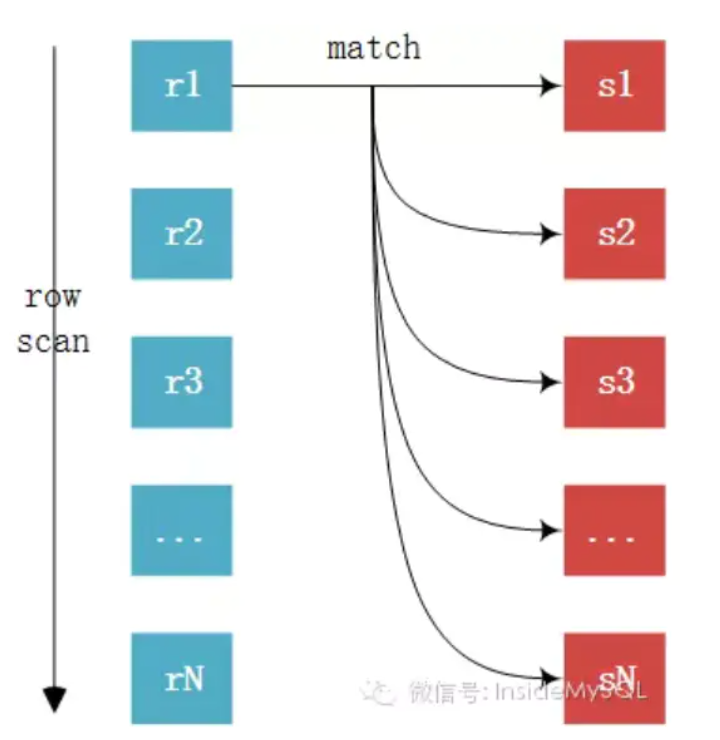
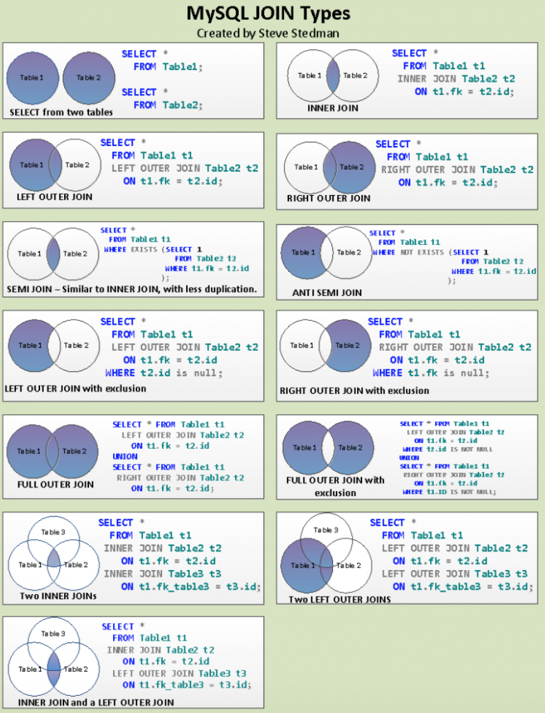

# JOIN 算法与语法

[TOC]

## JOIN 算法

### Hash join 哈希连接

- build table    驱动表/内表(较小的表)

- probe table  匹配表/外表
- JOIN KEY       连接键/条件列

Hash JOIN 是做大数据集连接时的常用方式；优化器使用两个表中较小的表(或较小的数据集)，对 JOIN KEY 进行 HASH 并在内存中建立 hashtable，将数据存储到 hashtable 中，然后扫描较大的表，同样对 JOIN KEY 进行 HASH 后探测 hashtable，找出 hashtable 中与之匹配的行数据。

需要注意：如果 HASH 表太大，无法一次构造在内存中，则分成若干个partition，写入磁盘的temporary segment，则会多一个写的I/O代价，会降低效率，此时需要有较大的 temporary segment 从而尽量提高I/O的性能。


### Sort merge join 排序合并连接

适用于用在数据没有索引，但是已经排序的情况下。将两个表分别排序，然后再进行join，其中排序成本较高(如果有索引则按索引排序，否则会使用快速排序)。

通常情况下，hash join 的效果都比 sort merge join要好；然而如果行源已经被排过序，在执行排序合并连接时不需要再排序了，这时 sort merge join 的性能会优于 hash join。可以使用USE_MERGE(table_name1 table_name2) 来强制使用 sort merge join。


### Nest-loop join 嵌套循环连接

> 参考：[MySQL JOIN 算法](https://zhuanlan.zhihu.com/p/54275505)  [MySQL JOIN 语法](https://my.oschina.net/u/3678773/blog/4528631)

- outer table    驱动表/外表

- inner table    匹配表/内表

#### Simple Nested-Loop Join

M为驱动表(m行)，N为匹配表(n行)，从M中分别取出M1、M2、......、Mm去与N表的条件列匹配，然后再合并数据，对数据库开销大。匹配次数=m*n(即对匹配表进行m次遍历)。



#### Block Nested-Loop Join（次优）

将驱动表的数据分段缓存，然后用缓存数据批量与匹配表的进行条件匹配，减少了对驱动表的IO，提高了性能。


#### Index Nested-Loop Join（最优）

要求匹配表(被驱动表)的条件列上有索引；驱动表的条件列直接与匹配表的索引进行匹配，避免了对匹配表的逐行遍历，极大提高了join的性能。匹配次数=驱动表的行数 * 被驱动表的索引高度。


#### 


## MySQL 的 JOIN 优化

老版的 MySQL 只支持一种 JOIN 算法：Nested-Loop Join（嵌套循环连接），但它有3个变种：Simple Nested-Loop Join，Index Nested-Loop Join，Block Nested-Loop Join；新版本中开始支持 Hash Join 算法。

MySQL中 ，如果被驱动表的条件列有索引则走 Index Nested-Loop Join；如果没有索引则默认走Block Nested-Loop Join([optimizer_switch设置value为block_nested_loop=on ](https://link.zhihu.com/?target=https%3A//link.juejin.im/%3Ftarget%3Dhttp%3A//click.aliyun.com/m/40952/)默认为开启)；如果optimizer_switch 设置 value 为 block_nested_loop=off 则走 Simple Nested-Loop Join。

> - 开启 block nested loop join 配置方法(optimizer_switch)：
>
> ```
> Show variables like 'optimizer_switc%';
> ```
>
> 
>
> - join buffer 配置方法(join_buffer_size)：
>
> ```
> Show variables like 'join_buffer_size%';
> ```
>
> 


Index Nested-Loop Join 是通过索引机制减少与被驱动表条件列匹配次数，达到优化效果；而 Block Nested-Loop Join 是通过一次缓存多条数据来批量匹配的方式，来减少驱动表的扫表 IO 次数，通过理解 JOIN 算法原理可以得出以下表连接查询的优化思路：

- 永远用小结果集驱动大结果集 (用小表做驱动表，本质是减少对匹配表的遍历次数)；

- 为匹配的条件列增加索引 (使用索引查找匹配，减少对匹配表行数据的匹配次数，避免全表遍历)；
- 开启 block nest-loop join (默认的)，尽量不要修改；

- 增大 join buffer size 的大小 (一次缓存的数据越多，那么驱动表的扫表次数就越少)；

- 减少不必要的字段查询 (字段越少，join buffer 所缓存的数据就越多)；


## JOIN 语法

### LEFT  [OUTER]  JOIN 

以左边表为基础，连接右边表中符合连接条件的结果（无符合结果的用NULL补齐）；

### RIGHT  [OUTER]  JOIN

以右边表为基础，连接左边表中符合连接条件的结果（无符合结果的用NULL补齐）；

### [INNNER]  JOIN

取左边表和右边表中符合连接条件的结果。

### FULL  [OUTER]  JOIN

返回所有联接的行，再为不匹配的左手行（在右边扩展为空）加一行，再为不匹配的右手行（左边扩展在为空）加一行。

### CROSS JOIN (慎用：产生笛卡尔积m*n个结果)

CROSS JOIN 等价于 INNER JOIN ON (TRUE)。这种联接类型只是一种符号上的方便，因为它完成的工作用 FROM 和 WHERE 也能完成。





## GROUP BY grouping_element [, ...] ]

分组表达式中字段的值相同的一行或多行压缩为一行。

```sql
--查询会三种语言技能的人
select name, count(1) as num
from person_skill 
where course in (select lang from skill)
group by name
having count(course)=3::bigint
```


## HAVING condition [, ...] ]

HAVING条件 与 WHERE条件的声明形式是一样的；HAVING条件中的字段必须是GROUP BY的字段或者在查询中使用了聚合函数的字段；

WHERE 过滤的是使用 GROUP BY 之前的独立行，而 HAVING 过滤的是  GROUP BY 创建的组行；


## SQL练习

### SQL求集合的中位数

已知数字的集合，求中位数：

```sql
/*利用HAVING子句求中位数*/
create table graduates(id int, income int);
insert into graduates values(1,1),(2,3),(3,5),(4,7),(5, 9);

select T1.income from graduates T1,graduates T2
group by T1.income
having sum(case when T2.income >= T1.income then 1 else 0 end) >= count(*)/2
and sum(case when T2.income <= T1.income then 1 else 0 end) >= count(*)/2
```


已知集合中的所有数字及其出现的次数，求中位数

```sql
/*使用窗口函数求累加值*/
create table m1(num int, fre int);
insert into m1 values(1, 3),(4, 2), (3,5), (6,8);

select a.num, a.cal_fre, a.sum_fre
from (
select num, fre
 , sum(fre) over( order by num) as cal_fre
 , (select sum(fre) from m1) as sum_fre
from m1 t) as a
where a.cal_fre>=a.sum_fre/2 
limit 1
```


当数据条数是奇数时
当数据条数是偶数时