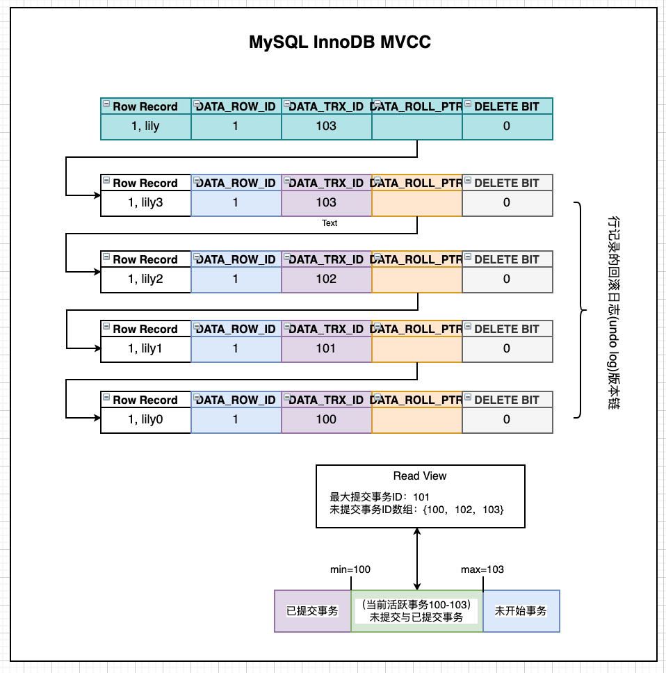

# 关系型数据库(MySQL)事务原理

[TOC]

## 事务的ACID4大特性

如果说数据库支持事务，就是说数据库具备事务的四大特征。数据库中事务具有四大特性（ACID）：

### 1 原子性 Atomicity

事务包含的所有操作，要么全部成功，要么全部失败会滚。

> mysql的原子性是基于undo/redo log来实现的。

### 2 一致性 Consistency

一致性是指事务必须使数据库从一个一致性状态变换到另一个一致性状态，也就是说一个事务执行之前和执行之后都必须处于一致性状态。（银行存钱、取钱）

### 3 隔离性 Isolation

隔离性是当多个用户并发访问数据库时，比如操作同一张表时，数据库为每一个用户开启的事务，不能被其他事务的操作所干扰，多个并发事务之间要相互隔离。

### 4 持久性 Durability

持久性是指已被提交的事务对数据库的修改应该永久保存在数据库中。

即一个事务一旦被提交了，那么对数据库中的数据的改变就是永久性的，即便是在数据库系统遇到故障的情况下也不会丢失提交事务的操作。


## 数据库的锁(锁是对MVCC的补充，但并不常用)

### 1按性能分：乐观锁(用版本比对实现) & 悲观锁

- 乐观锁：不加锁，通过版本比对，不符合时执行失败，失败后可以重试；

- 悲观锁：

### 2 按操作分：读锁/共享锁Shared Lock & 写锁/排他锁 Exclusive Lock

- 读锁，对其他事务不阻塞读，但阻塞写；(读数据时加读锁)

- 写锁，对其他事务阻塞写，也阻塞读；(写数据时加写锁)

注意：

- 数据库的增、删、改操作会加排它锁；
- 而查询操作并不会加锁，只能通过在 select 语句后显式加 lock in share mode 来加共享锁 或者 for update 来加排它锁。

给表加读锁：

```mysql
mysql> lock table t1 read;
mysql> select * from t1;
+----+---------+-------+
| id | name    | sex   |
+----+---------+-------+
|  1 | ff      | 0     |
+----+---------+-------+

mysql> insert into t1 values(5, 'jj','man');
ERROR 1099 (HY000): Table 't1' was locked with a READ lock and can't be updated
```

给表加写锁：

```mysql
mysql> lock table t1 write;
# 事务B
mysql> beigin;
mysql> select * from t1;//本步骤阻塞，直到t1解锁。

```

### 3 按操作粒度： 行锁Record Lock & 表锁Table Lock

- 行锁只锁定数据行，锁的粒度小，加锁慢，发生锁冲突的概率小，并发度高；(保证可重复读隔离就需要加行锁，保证行更新阻塞)

- 表锁则锁定整个表，锁的粒度大，加锁快，开销小，但是锁冲突的概率大，并发度低；（一般用在整表数据迁移的情况，解决幻读就需要加表锁，保证insert也阻塞）

注意：update 有 where 条件时，若是有索引的条件，则直接锁定指定行；若是没有索引的条件下，就获取所有行，都加上行锁，然后MySQL会再次过滤符合条件的行并释放锁，只有符合条件的行才会继续持有锁；

> MySQL中：
>
> - InnoDB 支持行锁，也支持事务；
>
> - MyISAM 不支持事务，也不支持行锁。

加行锁：

```mysql
SELECT * FROM test WHERE id=1 FOR UPDATE;
# 它会在 id=1 的记录上加上记录锁，以阻止其他事务插入，更新，删除 id=1 这一行。
```

加表锁

```mysql
#手动增加表锁
lock table 表名称 read/write,表名称2 read/write;
#查看表上加过的锁 
show open tables;
#删除表锁 
unlock tables;
```

### 4 间隙锁(范围锁) Gap Locks 

**间隙锁**：封锁索引记录中的间隙，或者第一条索引记录之前的范围，又或者最后一条索引记录之后的范围。

间隙锁就是锁住行记录之间的空隙，从而防止其他事务进行插入。间隙锁常用于可重复读隔离级别 (MySQL 默认级别)，在某些情况下可以解决幻读问题。

> 当采用范围条件查询数据时，InnoDB 会对这个范围内的数据进行加锁。
>
> 比如有 id 为：1、3、5、7 的 4 条数据，我们查找 1-7 范围的数据。
>
> - 那么 1-7 都会被加上锁。
> - 2、4、6 也在 1-7 的范围中，但实际不存在。这些 2、4、6 就被称为间隙。
>
> - 范围查找时，会把整个范围的数据全部锁定，包括所有间隙：比如我要在 1、3、5、7 中插入 2，这个时候 1-7 都被锁定住了，所以根本无法插入 2。在某些场景下会严重影响性能。

```mysql
SELECT * FROM user WHERE id>3 AND id<5 FOR UPDATE;
# 会在区间 (3，5) 之间加上 Gap Locks。
```

### 4 临键锁 Next-Key Locks

Next-Key Locks 是 Gap Locks + Record Locks 形成闭区间锁(加区间锁并给区间内所有行加行锁)；

```mysql
select * from User where id>=3 and id=<5 for update;
# 会在区间 [3,5] 之间加上 Next-Key Locks。
```


## 事务的4种隔离级别

以下四种隔离级别的，隔离性由弱到强，并发处理性能由强到弱。


### 1 读未提交 READ UNCOMMITTED

读未提交，即可以读取其他事务未提交的数据。

最低的隔离级别，事务之间没什么隔离性限制，但是并发性能最高。

存在**脏读**问题。

> **脏读(dirty read)**：
>
> 事务A读到了事务B未提交的内容，这就造成了脏读；
>
> | 事务A                                                | 事务B                     |
> | ---------------------------------------------------- | ------------------------- |
> | Begin;                                               | Begin;                    |
> |                                                      | insert/delete/update tab1 |
> | select * from tab1;  读到了事务B未提交的数据（脏读） |                           |
> |                                                      | Rollback;                 |

### 2 读已提交 READ COMMITTED

读已提交，即只能读到其他事务已经提交数据(未提交的读取不到)。

解决了脏读的问题；存在 **不可重复读（虚读）** 问题。

> **不可重复读/虚读(Non-Repeatable Read)**：(主要update引起)  在一个事务内两次读到的数据是不一样的，即原始读取不可重复。
>
> **解决不可重复读问题只需锁住满足条件的行。**
>
> | 事务A                                                        | 事务B                                  |
> | ------------------------------------------------------------ | -------------------------------------- |
> | Begin;                                                       |                                        |
> | 读取T表的数据(id=1, name='lily')                             | Begin;                                 |
> |                                                              | update t1 set name = 'lyy' where id=1; |
> |                                                              | Commit;                                |
> | 读取T表数据(id=1, name='lyy')，数据和原先读取的已经变了（不可重复读）； |                                        |

### 3 可重复读 REPEATABLE READ 

解决了不可重复读/虚读(通过对数据加行锁，其他事务update行时会阻塞)；存在**幻读**问题：

> **幻读(Phantom Read)**：(insert引起) 事务A对全表update，中间事务B执行insert并提交，结果事务A查询时出现未更新的行。
>
> **解决幻读需要锁表**。
>
> | 事务A                                                   | 事务B                                         |
> | ------------------------------------------------------- | --------------------------------------------- |
> | Begin;                                                  |                                               |
> | update t1 set sex='0';                                  | Begin;                                        |
> |                                                         | insert into t1 values(3, 'yolanda', 'woman'); |
> |                                                         | Commit;                                       |
> | select * from t1; 结果存在sex != ‘0’ 的行数据。（幻读） |                                               |

### 4 串行化 SERIALIZABLE

串行化，即所有的事务串行执行，一个事务完成(commit/rollback)后另一个事务才能执行操作；

最高的隔离级别，并行处理性能极差。

### 数据库的隔离级别设置

#### Oracle提供了2种隔离级别（从低到高）：

- **READ COMMITTED (默认级别)**
- SERIALIZABLE 

#### PostgreSQL提供了4种隔离级别：

- READ UNCOMMITTED
- **READ COMMITTED（默认级别）**
- REPEATABLE READ
- SERIALIZABLE

使用方法：

```sql
BEGIN TRANSACTION ISOLATION LEVEL REPEATABLE READ;
COMMIT/ROLLBACK;
```

#### MySQL提供了4种隔离级别（从低到高）：

- READ UNCOMMITTED
- READ COMMITTED
- **REPEATABLE READ（默认级别）**
- SERIALIZABLE 

MySQL设置数据库隔离级别：

```
#查看隔离级别
SELECT @@tx_isolation;
show variables like 'tx_isolation';
#设置隔离级别
SET [GLOBAL | SESSION] TRANSACTION ISOLATION LEVEL 隔离级别名称；
SET tx_isolation='REPEATABLE-READ';
```

**注意：**

- **设置数据库的隔离级别一定要是在开启事务之前，否则无效！**

- **隔离级别的设置只对当前连接有效。**

> - 对于使用MySQL命令窗口而言，一个窗口就相当于一个连接，当前窗口设置的隔离级别只对当前窗口中的事务有效；
>
> - 对于JDBC操作数据库来说，一个 Connection 对象相当于一个链接，而对于Connection对象设置的隔离级别只对该Connection对象有效，与其他链接Connection对象无关。

#### JDBC的隔离级别设置：

```java
    int TRANSACTION_NONE             = 0;//transactions are not supported
    int TRANSACTION_READ_UNCOMMITTED = 1;
    int TRANSACTION_READ_COMMITTED   = 2;
    int TRANSACTION_REPEATABLE_READ  = 4;
    int TRANSACTION_SERIALIZABLE     = 8;
```

JDBC设置事务隔离级别：

```java
Connection conn = null;
try{
    conn = JdbcUtil.getConnection(jdbcInfo);
    //设置事务隔离级别
  	conn.setTransactionIsolation(Connection.TRANSACTION_SERIALIZABLE);
    //开启事务（非自动提交事务）
    conn.setAutoCommit(false);
    //...
    //提交事务
    conn.commit(); 
}finally{
    if(conn != null){
       //还原事务为自动提交
       conn.setAutoCommit(true);
       //及时关闭连接
       conn.close();
    }
}
```


## 事务多版本并发控制(MVCC)

MVCC (Multi-Version Concurrency Control)事务的多版本并发控制机制，MySQL InnoDB 引擎(支持事务也支持锁)、PostgreSQL、Oracle都有实现。

相比串行处理而言，并发事务处理能大大提高数据库的资源利用率，提高数据库系统的事务吞吐量，从而可以支持更大的用户量。但并发事务处理也会带来一些问题，主要有：

1. 更新丢失（`Lost Update`）：当两个或多个事务选择同一行，然后基于最初选定的值更新该行时，由于每个事务都不知道其他事务的存在，就会发生丢失更新问题 —— 最后的更新覆盖了其他事务所做的更新。如何避免这个问题呢，最好在一个事务对数据进行更改但还未提交时，其他事务不能访问修改同一个数据。
2. 脏读（`Dirty Reads`）
3. 不可重复读（`Non-Repeatable Reads`）
4. 幻读（`Phantom Reads`）

解决更新丢失可以交给应用，但是后三者需要数据库提供事务间的隔离机制来解决。实现隔离机制的方法主要有两种：

- 加读写锁;

- 一致性快照读，即 MVCC;

但本质上，隔离级别是一种在并发的性能和副作用之间的妥协，通常数据库均倾向于采用 Weak Isolation。加锁会造成阻塞，MVCC性能更高，所以加锁一般不常用仅作为MVCC的补充。

### MySQL InnoDB 事务隔离级别的实现机制

| MySQL InnoDB 事务隔离级别 | 实现机制                |      |
| ------------------------- | ----------------------- | ---- |
| 读未提交                  | 无隔离                  |      |
| 读已提交                  | MVCC                    |      |
| 可重复读                  | MVCC                    |      |
| 串行化                    | 互斥锁/写锁(读写均阻塞) |      |

读已提交/可重复读是通过MVCC机制来实现的：对一行数据的读和写两个操作，默认不通过加锁互斥来保证隔离性，避免了频繁加锁互斥，提高了读写操作的性能。

> InnoDB 日志：
>
> - undo log 回滚日志：事务提交前的原行数据，用于事务Rollback；
>
> - redo log 重做日志：事务提交后的新行数据，用于事务Commit;
>
>   redo log是WAL， 每次数据库DML都会先写WAL日志大盘磁盘(顺序写，速度快)，再写数据到磁盘(随机写，速度慢)，这保证了宕机时的数据丢失(使用WAL重演即可补齐数据)。
>
> MySQL binlog：所有操作的日志；

### MySQL InnoDB 的 MVCC 实现

#### InnoDB 行记录的数据结构

MySQL InnoDB 行记录中，除了行数据本身，还存了一些额外信息：DATA_TRX_ID，DATA_ROLL_PTR，DB_ROW_ID，DELETE BIT 。

| 行记录的结构组成 | 长度  | 备注                                                         |
| ---------------- | ----- | ------------------------------------------------------------ |
| 行数据           | 变长  | 本行数据自身                                                 |
| DATA_TRX_ID      | 6byte | 标记了最新更新这条行记录的 transaction id，每处理一个事务，值自动+1； |
| DATA_ROLL_PTR    | 7byte | 指向当前记录项的 rollback segment 的undo log记录，找之前版本的数据就是通过这个指针 |
| DB_ROW_ID        | 6byte | InnoDB自动产生聚集索引时，聚集索引包括这一列，否则聚集索引中不包括这个值。 |
| DELETE BIT       |       | 位用于标识该记录是否被删除，这里的不是真正的删除数据，而是标志出来的删除。真正的删除是在commit的时候。 |

#### InnoDB 事务ID

- MySQL  InnoDB 中，每个事务都有一个自己的事务id，并且是唯一的、递增的 。

- 对于每个数据行，每次事务更新数据时，都会生成一个新事务版本，存储在该数据行的 trx_id 中。

- 执行 begin/start 命令时，不会为事务分配新的id；只有事务中执行到第一个DML时，事务才真正启动，MySQL 会为事务分配一个id，MySQL时严格按照事务启动顺序来分配事务id的。




#### 读的一致性视图 read-view ：

事务开启后，执行任何查询sql时，首先会生成当前事务的 **一致性视图read-view**，该视图由执行查询时所有未提交事务id数组(数组里最小的id为min_id)和已创建的最大事务id(max_id)组成，事务里的任何sql查询结果需要从对应版本链里的最新数据开始逐条跟 read-view 做比对从而得到最终的快照结果。

- 读已提交隔离级别-在每次执行查询sql时都会重新生成read-view；
- 可重复度隔离级别-在初次执行查询sql时生成read-view，在该事务结束之前都不会变；

#### 行记录的事务回滚日志(undolog)版本链比对规则：

1. 若row的 trx_id 落在紫色部分( trx_id<min_id )，表示这个版本是已提交的事务生成的，这个数据是可见的; 
2. 如row的 trx_id 落在蓝色部分( trx_id>max_id )，表示这个版本是由将来启动的事务生成的，是不可见的(若 row 的 trx_id 就是当前自己的事务是可见的);
3. 若 row 的 trx_id 落在绿色部分(min_id <=trx_id<= max_id)，那就包括两种情况：
   - 若 row 的 trx_id 在视图数组中，表示这个版本是由还没提交的事务生成的，不可见。(若 row 的 trx_id 就是当前自己的事务，则是可见的);
   -  若 row 的 trx_id 不在视图数组中，表示这个版本是已经提交了的事务生成的，可见。

对于删除的情况，可以认为是 update 的特殊情况，会将版本链上最新的数据复制一份，然后将 trx_id 修改成删除操作的 trx_id，同时在该条记录的头信息(record header)里的(deleted_flag)标记位写上true，来表示当前记录已经被 删除，在查询时按照上面的规则查到对应的记录如果delete_flag标记位为true，意味着记录已被删除，则不返回数据。

| 事务100                                 | 事务101                                              | 事务102                                 | 事务103                                              | 可重复读                                                    | 读已提交                                                     |
| --------------------------------------- | ---------------------------------------------------- | --------------------------------------- | ---------------------------------------------------- | ----------------------------------------------------------- | ------------------------------------------------------------ |
| update t1 set name=‘lily0‘ where id=1； |                                                      |                                         |                                                      | readview：99，{100};                       查询结果：1,lily | readview：99，{100};                       查询结果：1,lily  |
|                                         | update t1 set name=‘lily1‘ where id=1；  **commit;** |                                         |                                                      |                                                             |                                                              |
|                                         |                                                      |                                         |                                                      | readview：99，{100};                   查询结果：1,lily     | readview：101，{100,101};                       查询结果：**1,lily1** |
|                                         |                                                      | update t1 set name=‘lily2‘ where id=1； |                                                      | readview：99，{100};                   查询结果：1,lily     | readview：101，{100,101,102};        查询结果：**1,lily1**   |
|                                         |                                                      |                                         | update t1 set name=‘lily3‘ where id=1；  **commit;** |                                                             |                                                              |
|                                         |                                                      |                                         |                                                      | readview：99，{100};                   查询结果：1,lily     | readview：103，{100,101,102,103};查询结果：**1,lily3**       |


## InnoDB SQL执行的 BufferPool 缓存机制


为什么MySQL不能直接更新磁盘上的数据而设置这么一套复杂的机制来执行SQL了? 因为来一个请求就直接对磁盘文件进行随机读写，然后更新磁盘文件里的数据性能可能相当差。

- 因为磁盘随机读写的性能是非常差的，所以直接更新磁盘文件是不能让数据库抗住很高并发的。

- MySQL这套机制看起来复杂，但它可以保证每个更新请求都是更新内存BufferPool，然后顺序写日志文件，同时还能保证各种异常情况下的数据一致性。 

  更新内存的性能是极高的，然后顺序写磁盘上的日志文件的性能也是非常高的，要远高于随机读写磁盘文件。 正是通过这套机制，才能让MySQL数据库在较高配置的机器上可以抗下每秒几千的读写请求。

