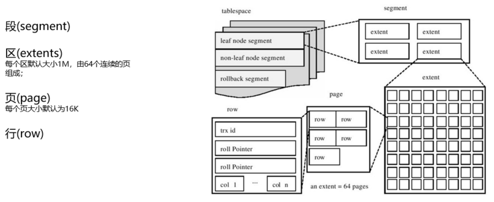

# 数据库、SQL优化

[TOC]

数据库性能优化可以从运维(硬件、数据库系统优化)、研发(其他)人员角度进行，本文重点介绍软件方面的优化。

## 硬件升级/垂直扩展

- cpu：核数增多、使用运算速度更高的cpu；
- 内存：容量扩大；
- 硬盘(文件存储系统)：容量扩大、使用更快的ssd固态硬盘。
- 网络系统：升级更高带宽的网络；

## 水平扩展(集群架构)

- 高可用（H-A）: 一主多备、多主多备、备库再备。一个高可用系统至少是一主两备。
- 水平扩展（scale-out）：表分区、分表、分库、读写分离、分布式、集群；

## 数据库系统优化

- 系统参数优化：
  - 硬件适配（CPU参数）
  - IO、缓存
  - 内存垃圾回收

- 日志配置优化：
  - 记录操作日志，用于误操作排查；
  - 记录慢SQL日志、记录性能日志，用于系统性能监控和优化；

## 选择合适的存储引擎

- InnoDB 聚集索引，支持事务处理、支持锁；
- MyISAM 非聚集索引，不支持事务处理、表级别锁。

## 设计恰当的表结构、字段

### 字段类型选择

1. 【强制】小数类型使用 decimal，禁止使用 float 和 double。
   说明：loat 和 double 在存储的时候，存在精度损失的问题，很可能在值的比较时，得到不 正确的结果。如果存储的数据范围超过 decimal 的范围，建议将数据拆成整数和小数分开存储。

2. 【强制】如果存储的字符串长度几乎相等，使用 char 定长字符串类型。

3. 【强制】varchar 是可变长字符串，不预先分配存储空间，长度不要超过 5000，如果存储长 度大于此值，定义字段类型为 text，独立出来一张表，用主键来对应，避免影响其它字段索引效率。

4.  【参考】合适的字符存储长度，不但节约数据库表空间、节约索引存储，更重要的是提升检 索速度。

   正例:如下表，其中无符号值可以避免误存负数，且扩大了表示范围。

5. 【参考】合适的字符存储长度，不但节约数据库表空间、节约索引存储，更重要的是提升检索速度。

   > 正例: 如下表，其中无符号值可以避免误存负数，且扩大了表示范围。
   >
   > | 对象     | 年龄区间   | 类型              | 字节 | 表示范围                      |
   > | -------- | ---------- | ----------------- | ---- | ----------------------------- |
   > | 人       | 150 岁之内 | tinyint unsigned  | 1    | 无符号值: 0-255               |
   > | 龟       | 数百岁     | smallint unsigned | 2    | 无符号值: 0-65535             |
   > | 恐龙化石 | 数千万年   | int unsigned      | 4    | 无符号值: 0-约 42.9 亿        |
   > | 太阳     | 约 50 亿年 | bigint unsigned   | 8    | 无符号值:0 到约 10 的 19 次方 |

   

### 表结构/字段设计

- 【强制】对象或字段名称禁用保留字，如 desc、range、match、delayed 等，请参考 MySQL 官方保留字。

- 【强制】表必备三字段: id,  gmt_create,  gmt_modified。 

  说明：其中id必为主键，类型为bigint unsigned、单表时自增、步长为1。gmt_create, gmt_modified 的类型均为 datetime 类型，前者现在时表示主动创建，后者过去分词表示被 动更新。

- 【推荐】字段允许适当冗余，以提高查询性能，但必须考虑数据一致。

  冗余字段应遵循: 

   1) 不能是频繁修改的字段。
   2) 不能是 varchar 超长字段，更不能是 text 字段。

  正例: 商品类目名称使用频率高，字段长度短，名称基本一成不变，可在相关联的表中冗余存 储类目名称，避免关联查询。

- 【参考】避免单表字段数量过多，过多时可以拆表(垂直拆分)，从而提高查询效率：

  建议单表尽量不超过20个字段，若超过20个字段则从领域模型上考虑重新划分，进而通过重构演进系统设计；

  > MySQL物理存储的结构由段-区-页-行组成：每个区是1M大小，由连续的64个16k的页组成，每个页又由N行组成。
  >
  > 
  >
  > 在MySQL内存加载过程中，数据加载的最小单位是页(每个页16k)。所以每个页中存储的行越多，则数据加载的页会越少，查找性能越高。
  >
  > 假设1页16k=160行，则1行=100字节，100字节=10个字段=>1个字段=10字节，所以这里看下1行存储10个10字节的字段，这样一页能存储160行数据

- 【推荐】单表行数超过 500w 行或者单表容量超过 2GB，才推荐进行分库分表。 

  说明：如果预计三年后的数据量根本达不到这个级别，请不要在创建表时就分库分表。


## 索引设计

- 【推荐】尽量创建主键、优先使用自增的、数字类型：主键便于主备复制和异构移植，自增便于建立索引(insert时索引结构不需要大调)，数字类型比较速度快于字符串(字符串中逐个字符转ASCII码后比较)，只有当bigint长度不够时才用字符串类型做主键；

- 【参考】优先使用B+树索引：因为适用于大部分场景的查询，hash索引虽然随机查找速度快一点，但是范围查找和按顺序扫描速度慢很多；

- 【强制】业务上具有唯一特性的字段，即使是多个字段的组合，也必须建成唯一索引。 

  说明：不要以为唯一索引影响了 insert 速度，这个速度损耗可以忽略，但提高查找速度是明显的；另外，即使在应用层(尤其是分布式系统中)做了非常完善的校验控制，只要没有唯一索引，根据墨菲定律，必然有脏数据产生。

- 【强制】不得使用外键与级联，一切外键概念必须在应用层解决；外键与级联更新适用于单机低并发，不适合分布式、高并发集群；级联更新是强阻塞，存在数据库更新风暴的风险；外键影响数据库的插入速度。

  说明：以学生和成绩的关系为例，学生表中的 student_id 是主键，那么成绩表中的 student_id 则为外键。如果更新学生表中的 student_id，同时触发成绩表中的 student_id 更新，即为 级联更新。

- 【强制】超过三个表禁止 join。需要 join 的字段，数据类型必须绝对一致；多表关联查询时，保证被关联的字段要有有效索引。
   说明：即使双表 join 也要注意表索引、SQL 性能。

- 【强制】在 varchar 字段上建立索引时，必须指定索引长度，没必要对全字段建立索引，根据实际文本区分度决定索引长度即可。

  说明：索引的长度与区分度是一对矛盾体，一般对字符串类型数据，长度为 20 的索引，区分度会高达 90% 以上，可以使用 count(distinct left(列名, 索引长度))/count(*) 的区分度来确定。

- 【强制】页面搜索严禁左模糊或者全模糊，如果需要请走搜索引擎来解决。 

  说明：索引文件具有 B-Tree 的最左前缀匹配特性，如果左边的值未确定，那么无法使用此索引。

  > **MySQL 模糊查询**
  >
  > LIKE 关键字主要用于搜索匹配字段中的指定内容。其语法格式如下：
  >
  > ```
  > [NOT] LIKE '字符串'
  > ```
  >
  > - NOT ：可选参数，字段中的内容与指定的字符串不匹配时满足条件。
  >
  > - 字符串：指定用来匹配的字符串。“字符串”可以是一个很完整的字符串，也可以包含通配符。
  >
  >   LIKE 关键字支持的通配符：
  >
  >   - “%”百分号： 是 MySQL 中最常用的通配符，能代表任何长度的字符串，字符串的长度可以为 0。例如，`a%b`表示以字母 a 开头，以字母 b 结尾的任意长度的字符串。该字符串可以代表 ab、acb、accb、accrb 等字符串。 
  >   - “_”下划线： 只能代表单个字符，字符的长度不能为 0。例如，`a_b`可以代表 acb、adb、aub 等字符串。

- 【推荐】如果有 order by 的场景，请注意利用索引的有序性。order by 最后的字段是组合索引的一部分，并且放在索引组合顺序的最后，避免出现 file_sort 的情况，影响查询性能。 

  正例：where a=? and b=? order by c; 索引:a_b_c 

  反例：索引中有范围查找，那么索引有序性无法利用，如: WHERE a>10 ORDER BY b; 索引 a_b 无法排序。

- 【推荐】利用覆盖索引来进行查询操作，避免回表。
   说明：如果一本书需要知道第 11 章是什么标题，会翻开第 11 章对应的那一页吗?目录浏览 一下就好，这个目录就是起到覆盖索引的作用。

   正例：能够建立索引的种类分为主键索引、唯一索引、普通索引三种，而覆盖索引只是一种查询的效果，用explain的结果，extra列会出现: using index。

  > **覆盖索引（covering index）**：只需要在一棵索引树上就能获取SQL所需的所有列数据，无需回表，速度更快。MySQL官网，类似说法出现在 explain 查询计划优化章节，即 explain 的输出结果 Extra 字段为 **Using index** 时，能够触发索引覆盖。
  >
  > **实现覆盖索引的常见方法：将被查询的字段，建立到联合索引里去。**
  >
  > 举例说明：
  >
  > ```mysql
  > create table user (
  >     id int primary key,
  >     name varchar(20),
  >     sex varchar(5),
  >     index(name)
  > )engine=innodb;
  > ```
  >
  > 第一个 SQL 语句:
  >
  > ```mysql
  > mysql> EXPLAIN SELECT id, name FROM t1 WHERE name='lily';
  > +----+-------------+-------+------------+------+---------------+------+---------+-------+------+----------+-------------+
  > | id | select_type | table | partitions | type | possible_keys | key  | key_len | ref   | rows | filtered | Extra       |
  > +----+-------------+-------+------------+------+---------------+------+---------+-------+------+----------+-------------+
  > |  1 | SIMPLE      | t1    | NULL       | ref  | name          | name | 23      | const |    1 |   100.00 | Using index |
  > +----+-------------+-------+------------+------+---------------+------+---------+-------+------+----------+-------------+
  > 1 row in set, 1 warning (0.00 sec)
  > ```
  >
  > 能够命中name索引，索引叶子节点存储了主键id，通过name的索引树即可获取id和name，无需回表，符合索引覆盖，效率较高。
  >
  > **Extra：Using index**。
  >
  > 第二个SQL语句：
  >
  > ```mysql
  > mysql> EXPLAIN SELECT id, name, sex FROM t1 WHERE name='lily';
  > +----+-------------+-------+------------+------+---------------+------+---------+-------+------+----------+-------+
  > | id | select_type | table | partitions | type | possible_keys | key  | key_len | ref   | rows | filtered | Extra |
  > +----+-------------+-------+------------+------+---------------+------+---------+-------+------+----------+-------+
  > |  1 | SIMPLE      | t1    | NULL       | ref  | name          | name | 23      | const |    1 |   100.00 | NULL  |
  > +----+-------------+-------+------------+------+---------------+------+---------+-------+------+----------+-------+
  > 1 row in set, 1 warning (0.00 sec)
  > ```
  >
  > 能够命中name索引，索引叶子节点存储了主键id，但sex字段必须回表查询才能获取到，不符合索引覆盖，需要再次通过id值扫码聚集索引获取sex字段，效率会降低。
  >
  > **Extra：Using index condition**。
  >
  > 

- 【推荐】利用延迟关联或者子查询优化超多分页场景。
  说明: MySQL 并不是跳过 offset 行，而是取 offset+N 行，然后返回放弃前 offset 行，返回 N 行，那当 offset 特别大的时候，效率就非常的低下，要么控制返回的总页数，要么对超过特定阈值的页数进行 SQL 改写。
  正例: 先快速定位需要获取的 id 段，然后再关联:

  SELECT a.* FROM 表 1 a, (select id from 表 1 where 条件 LIMIT 100000,20 ) b where a.id=b.id

- 【推荐】SQL 性能优化的目标:至少要达到 range 级别，要求是 ref 级别，如果可以是 consts 最好。

  说明:

  1)consts 单表中最多只有一个匹配行(主键或者唯一索引)，在优化阶段即可读取到数据。 

  2)ref 指的是使用普通的索引(normal index)。
  3)range 对索引进行范围检索。

  反例: explain 表的结果，type=index，索引物理文件全扫描，速度非常慢，这个 index 级别比较 range 还低，与全表扫描是小巫见大巫。

- 【推荐】建组合索引的时候，区分度最高的在最左边。
   正例: 如果 where a=? and b=? ，如果 a 列的几乎接近于唯一值，那么只需要单建 idx_a 索引即可。 

  说明: 存在非等号和等号混合时，在建索引时，请把等号条件的列前置。如: where c>? and d=? 那么即使 c 的区分度更高，也必须把 d 放在索引的最前列，即索引 idx_d_c。

- 【推荐】防止因字段类型不同造成的隐式转换，导致索引失效。

- 【参考】创建索引时避免有如下极端误解: 

  1)宁滥勿缺。认为一个查询就需要建一个索引。 

  2)宁缺勿滥。认为索引会消耗空间、严重拖慢更新和新增速度。 

  3)抵制唯一索引。认为业务的唯一性一律需要在应用层通过“先查后插”方式解决。


## SQL查询优化

### SQL诊断：explain 查看执行计划&内核查询优化器

```mysql
mysql> ANALYZE TABLE t1;
+----------+---------+----------+----------+
| Table    | Op      | Msg_type | Msg_text |
+----------+---------+----------+----------+
| mysql.t1 | analyze | status   | OK       |
+----------+---------+----------+----------+
1 row in set (0.00 sec)


mysql> EXPLAIN t1;
+-------+-------------+------+-----+---------+-------+
| Field | Type        | Null | Key | Default | Extra |
+-------+-------------+------+-----+---------+-------+
| id    | int(11)     | NO   | PRI | NULL    |       |
| name  | varchar(20) | YES  | MUL | NULL    |       |
| sex   | varchar(5)  | YES  |     | NULL    |       |
+-------+-------------+------+-----+---------+-------+
3 rows in set (0.00 sec)


mysql> EXPLAIN SELECT id, name FROM t1 WHERE name='lily';
+----+-------------+-------+------------+------+---------------+------+---------+-------+------+----------+-------------+
| id | select_type | table | partitions | type | possible_keys | key  | key_len | ref   | rows | filtered | Extra       |
+----+-------------+-------+------------+------+---------------+------+---------+-------+------+----------+-------------+
|  1 | SIMPLE      | t1    | NULL       | ref  | name          | name | 23      | const |    1 |   100.00 | Using index |
+----+-------------+-------+------------+------+---------------+------+---------+-------+------+----------+-------------+
1 row in set, 1 warning (0.00 sec)


mysql> EXPLAIN FORMAT=JSON SELECT id, name FROM t1 WHERE name='lily';
-- EXPLAIN --
{
  "query_block": {
    "select_id": 1,
    "cost_info": {
      "query_cost": "1.20"
    },
    "table": {
      "table_name": "t1",
      "access_type": "ref",
      "possible_keys": [
        "name"
      ],
      "key": "name",
      "used_key_parts": [
        "name"
      ],
      "key_length": "23",
      "ref": [
        "const"
      ],
      "rows_examined_per_scan": 1,
      "rows_produced_per_join": 1,
      "filtered": "100.00",
      "using_index": true,
      "cost_info": {
        "read_cost": "1.00",
        "eval_cost": "0.20",
        "prefix_cost": "1.20",
        "data_read_per_join": "40"
      },
      "used_columns": [
        "id",
        "name"
      ]
    }
  }
} 
```


### JOIN 操作规约：

> JOIN算法：
>
> - Loop join（嵌套循环）  即首先遍历 A，将A表中的每一条记录与 B表进行连接比较，如果满足A.di=B.id，则返回记录；
> - Merge join（合并连接）即首先对A、B表进行排序，然后同时遍历A和B表，进行A.id=B.id的验证，直到遍历到A和B表结束；
> - Hash join（哈希连接）即首先对A表所有记录的id进行hash计算，最终形成一个hash表，然后join时，遍历B表，对B表每条记录的id进行hash运算，然后在A的Hash表中验证是否一致，最后得出结果。

- 避免交叉连接(cross join会产生笛卡尔积n*m次连接)；
- 永远用小结果集驱动大结果集：用小表做驱动表，本质是减少对匹配表的遍历次数；

- 为匹配的条件列增加索引 ：使用索引查找匹配，减少对匹配表行数据的匹配次数，避免全表遍历；
- 确保无索引时优先使用 blocked_nest_loop join (默认的blocked_nest_loop=on，尽量不要修改)；

- 增大 join_buffer_size 的大小 (一次缓存的数据越多，那么驱动表的扫表次数就越少)；

- 减少不必要的字段查询 (字段越少，join buffer 所缓存的数据就越多)；


### COUNT 操作规约

- 【强制】不要使用 count(列名)或 count(常量)来替代 count( * )，count( * )是 SQL92 定义的 标准统计行数的语法，跟数据库无关，跟 NULL 和非 NULL 无关。
  说明: count( * ) 会统计值为 NULL 的行，而 count(列名)不会统计此列为 NULL 值的行。

- 【强制】count(distinct col) 计算该列除 NULL 之外的不重复行数，注意 count(distinct col1, col2) 如果其中一列全为NULL，那么即使另一列有不同的值，也返回为0。

- 【强制】当某一列的值全是 NULL 时，count(col)的返回结果为 0，但 sum(col)的返回结果为 NULL，因此使用 sum()时需注意 NPE 问题。 

> 正例:可以使用如下方式来避免sum的NPE问题:
>
> SELECT IF(ISNULL(SUM(g)),0,SUM(g)) FROM table;

- 【强制】使用 ISNULL()来判断是否为 NULL 值。 说明:NULL 与任何值的直接比较都为 NULL。

  1) NULL<>NULL的返回结果是NULL，而不是false。 

  2) NULL=NULL的返回结果是NULL，而不是true。

   3) NULL<>1的返回结果是NULL，而不是true。

### SELECT 其他规约

- 【强制】 在代码中写分页查询逻辑时，若 count 为 0 应直接返回，避免执行后面的分页语句。

- 【推荐】in 操作能避免则避免，若实在避免不了，需要仔细评估 in 后边的集合元素数量，控 制在 1000 个之内。

- 【参考】如果有国际化需要，所有的字符存储与表示，均以 utf-8 编码，注意字符统计函数的区别。

  > 说明:
  > SELECT LENGTH("轻松工作");   --返回为12
  > SELECT CHARACTER_LENGTH("轻松工作");   --返回为4 
  >
  > 如果需要存储表情，那么选择 utf8mb4 来进行存储，注意它与 utf-8 编码的区别。

### 其他操作规约

- 【参考】TRUNCATE TABLE 比 DELETE 速度快，且使用的系统和事务日志资源少，但 TRUNCATE 无事务且不触发 trigger，有可能造成事故，故不建议在开发代码中使用此语句。 

  > 说明:
  >
  > TRUNCATE TABLE 在功能上与不带 WHERE 子句的 DELETE 语句相同。

- 【强制】数据订正(特别是删除、修改记录操作)时，要先 select，避免出现误删除，确认无误才能执行更新语句。
- 【强制】禁止使用存储过程，存储过程难以调试和扩展，更没有移植性。


