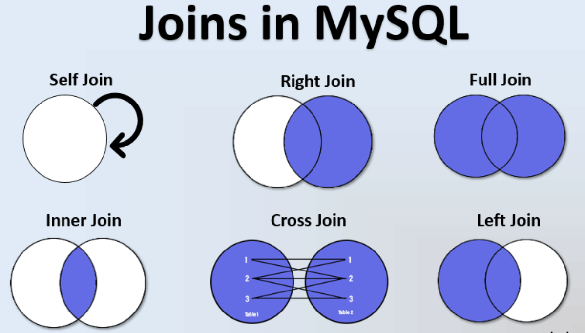

# SELECT 语法

[TOC]

## JOIN

### LEFT  [OUTER]  JOIN 

以左边表为基础，连接右边表中符合连接条件的结果（无符合结果的用NULL补齐）；

### RIGHT  [OUTER]  JOIN

以右边表为基础，连接左边表中符合连接条件的结果（无符合结果的用NULL补齐）；

### [INNNER]  JOIN

取左边表和右边表中符合连接条件的结果。

### FULL  [OUTER]  JOIN

返回所有联接的行，再为不匹配的左手行（在右边扩展为空）加一行，再为不匹配的右手行（左边扩展在为空）加一行。

### CROSS JOIN (慎用：产生笛卡尔积m*n个结果)

CROSS JOIN 等价于 INNER JOIN ON (TRUE)。这种联接类型只是一种符号上的方便，因为它完成的工作用 FROM 和 WHERE 也能完成。




## GROUP BY grouping_element [, ...] ]

分组表达式中字段的值相同的一行或多行压缩为一行。

```sql
--查询会三种语言技能的人
select name, count(1) as num
from person_skill 
where course in (select lang from skill)
group by name
having count(course)=3::bigint
```


## HAVING condition [, ...] ]

HAVING条件 与 WHERE条件的声明形式是一样的；HAVING条件中的字段必须是GROUP BY的字段或者在查询中使用了聚合函数的字段；

WHERE 过滤的是使用 GROUP BY 之前的独立行，而 HAVING 过滤的是  GROUP BY 创建的组行；


## join实现原理

### hash join


### merge join


### nestloop join


## 练习

### SQL求集合的中位数

已知数字的集合，求中位数：

```sql
/*利用HAVING子句求中位数*/
create table graduates(id int, income int);
insert into graduates values(1,1),(2,3),(3,5),(4,7),(5, 9);

select T1.income from graduates T1,graduates T2
group by T1.income
having sum(case when T2.income >= T1.income then 1 else 0 end) >= count(*)/2
and sum(case when T2.income <= T1.income then 1 else 0 end) >= count(*)/2
```


已知集合中的所有数字及其出现的次数，求中位数

```sql
/*使用窗口函数求累加值*/
create table m1(num int, fre int);
insert into m1 values(1, 3),(4, 2), (3,5), (6,8);

select a.num, a.cal_fre, a.sum_fre
from (
select num, fre
 , sum(fre) over( order by num) as cal_fre
 , (select sum(fre) from m1) as sum_fre
from m1 t) as a
where a.cal_fre>=a.sum_fre/2 
limit 1
```


当数据条数是奇数时
当数据条数是偶数时