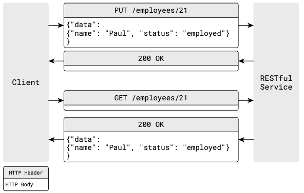
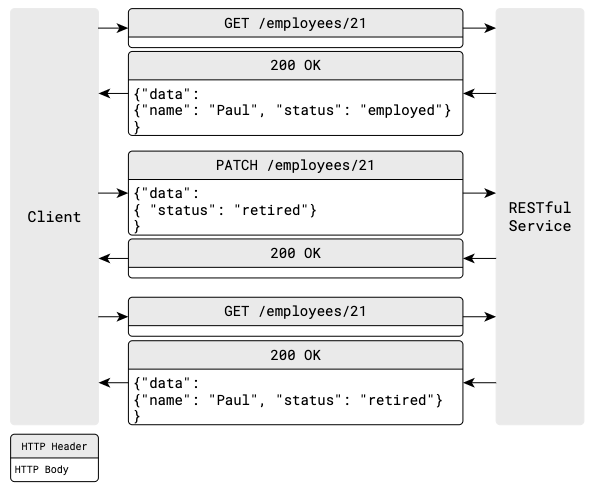

#  RESTful API 设计规范

[TOC]

参考

- [RESTful API 接口最佳实践(中文翻译版)](https://juejin.im/entry/6844903503953920007)
- [RESTful API Design. Best Practices in a Nutshell](https://blog.philipphauer.de/restful-api-design-best-practices/)

## 一、URL 设计

### 1 根路径要简洁

### 2 在URL中强制加入版本号

从始至终，都使用版本号发布您的RESTful API。将版本号放在URL中以是必需的。如果您有不兼容和破坏性的更改，版本号将让你能更容易的发布API。发布新API时，只需在增加版本号中的数字。这样的话，客户端可以自如的迁移到新API，不会因调用完全不同的新API而陷入困境。 使用直观的 “v” 前缀来表示后面的数字是版本号。

```
/v1/employees
```

不要使用次级版本号（“v1.2”），因为不应该频繁的去发布API版本。

Pros:

- Extremely simple for API developers.
- Extremely simple for API clients.
- URLs can be copied and pasted.

Cons:

- Not RESTful.
- Breaking URLs. Clients have to maintain and update the URLs.

Strictly speaking, this approach is not RESTful because URLs should never change. This prevents easy evolvability. Putting the version in the URL will break the API some day and your clients have to fix the URLs. The question is, how much effort would it take the clients to update the URLs? If the answer is “only a little” then URL versioning might be fine.

Due to its simplicity, URL versioning is [very popular and widely used](http://www.lexicalscope.com/blog/2012/03/12/how-are-rest-apis-versioned/) by companies like Facebook, Twitter, Google/YouTube, Bing, Dropbox, Tumblr, and Disqus.

> #### 通过 `Accept` HTTP Header (Content Negotiation) 进行版本化
>
> The more RESTful way for versioning is to utilize content negotiation via the `Accept` HTTP request header.
>
> ```nohighlight
> GET /employees
> Accept: application/vnd.myapi.v2+json
> ```
>
> In this case, the client requests the version 2 of the `/employees` resource. So we treat the different API versions as different representations of the `/employees` resource, which is pretty RESTful. You can make the `v2` optional and default to the latest version when the client only requests with `Accept: application/vnd.myapi+json`. But be fair and give him a warning that his app may break in the future if he doesn’t pin the version.
>
> Pros:
>
> - URLs keep the same
> - Considered as RESTFul
> - HATEOAS-friendly
>
> Cons:
>
> - Slightly more difficult to use. Clients have to pay attention to the headers.
>
> - URLs can’t be copied and pasted anymore.
>
>   

### 3 资源用名词复数表示

#### 每个资源使用2个URL

```
/employees         #资源集合的 URL
/employees/11      #资源个体的 URL
```

#### 资源用名词(不要用动词)表示

反例：

```html
GET /getAllEmployees
GET /getAllExternalEmployees
POST /createEmployee
PUT /updateEmployee
```

正例，使用名词的设计，api看起来更简洁，URL数目更少：

```
GET  /employees
GET  /employees?state=external
POST /employees
PUT  /employees/11
```

#### 用名词复数不要用单数

推荐使用复数，因为这种用法更常见更直观，尤其是在集合URL上使用GET（GET / employee 返回多个员工会容易混淆）时。

#### 避免混合使用复数形式和单数形式的名词，这会造成混淆并且容易出错

正例：

```nohighlight
/employees
/employees/21
```

反例：

```nohighlight
/employee
/employee/21
```

### 4 操作(非资源请求)用动词表示

有时API调用并不涉及资源，如计算，翻译或转换，例如：

```
GET /translate?from=de_DE&to=en_US&text=Hallo
GET /calculate?para2=23&para2=432

//Trigger an operation that changes the server-side state
POST /restartServer
//no body

POST /banUserFromChannel
{ "user": "123", "channel": "serious-chat-channel" }
```

在这种情况下，不涉及任何资源。而是，服务器执行一个操作并将结果返回给客户端。因此，您应该在URL中使用动词而不是名词，来区分REST端点（领域建模的资源）和操作（RPC样式的API）。

对于操作而言，适合使用RPC样式的API，而不是REST API。通常，它比尝试使用RESTful操作更简单，更直观（例如使用 `{“ restart”：true}` 的 `PATCH / server`）。根据经验，REST 非常适合于领域模型，而RPC适合于操作。有关更多详细信息，请查看[Understanding RPC Vs REST For HTTP APIs](https://www.smashingmagazine.com/2016/09/understanding-rest-and-rpc-for-http-apis/)。

### 5 提供分页信息

一次性返回数据库所有资源不是一个好主意。因此，需要提供分页机制。通常使用数据库中众所周知的参数offset和limit。

```
/employees?offset=30&limit=15 #返回30 到 45的员工
```

如果客户端没有传这些参数，则应使用默认值。通常默认值是`offset = 0`和`limit = 10`。如果数据库检索很慢，应当减小`limit`值。

```
/employees #返回0 到 10的员工
```

此外，如果您使用分页，客户端需要知道资源总数。例：请求：

```
GET /employees
```

响应：

```
{
  "offset": 0,
  "limit": 10,
  "total": 3465,
  "employees": [
    //...
  ]
}
```


### 6 考虑特定资源搜索和跨资源搜索

提供对特定资源的搜索很容易。只需使用相应的资源集合URL，并将搜索字符串附加到查询参数中即可。

```
GET /employees?query=Paul
```

如果要对所有资源提供全局搜索，则需要用其他方法。前文提到，对于非资源请求URL，使用动词而不是名词。因此，您的搜索网址可能如下所示：

```
GET /search?query=Paul //返回 employees, customers, suppliers 等等.
```


## 二、用 HTTP方法 操作资源

### HTTP 方法的语义理解

Definition of [Idempotence](https://en.wikipedia.org/wiki/Idempotence): A HTTP methods is *idempotent* when we can safely execute the request over and over again and all requests lead to the same state.

> - GET
>   - Idempotent
>   - Read-only. GET *never* changes the state of the resource on the server-side. It must not have side-effects.
>   - Hence, the response can be cached safely.
>   - Examples:
>     - `GET /employees` - Lists all employees
>     - `GET /employees/1` - Shows the details of the employee 1
> - PUT
>   - Idempotent!
>   - Can be used for both creating and updating
>   - Commonly used for updating (full updates).
>     - Example: `PUT /employees/1` - updates employee 1 (uncommon: creates employee 1)
>   - To use PUT for creating, the client needs to know the whole URL (including the ID) upfront. That’s uncommon as the server usually generates the ID. So PUT for creating is typically used when there is only one element and the URL is unambiguous.
>     - Example: `PUT /employees/1/avatar` - creates or updates the avatar of employee 1. There is only one avatar for each employee.
>   - Always include the whole payload in the request. It’s all or nothing. PUT is not meant to be used for partial updates (see PATCH).
> - POST
>   - Not idempotent!
>   - Used for creating
>   - Example: `POST /employees` creates a new employee. The new URL is delivered back to the client in the `Location` Header (e.g. `Location: /employees/12`). Multiple POST requests on `/employees` lead to many new different employees (that’s why POST is not idempotent).
> - PATCH
>   - Idempotent
>   - Used for partial updates.
>   - Example: `PATCH /employees/1` - updates employee 1 with the fields contained in the payload. The other fields of employee 1 are not changed.
> - DELETE
>   - Idempotent
>   - Used for deletion.
>   - Example: `DELETE /employees/1`

### HTTP 方法的使用场景

- 用 URL 指定要用的资源；
- 用 HTTP 方法指定资源的处理方式。

使用四种HTTP方法POST，GET，PUT，DELETE可以提供CRUD功能（创建，获取，更新，删除）。

- **Create**： POST/PUT 用于创建新资源。

- **Read**：    GET 用于读取资源。

  GET请求从不改变资源的状态。无副作用。GET方法是幂等的。GET方法具有只读的含义。因此，你可以完美的使用缓存。

- **Update**：PUT/PATCH 用于更新现有资源。

- **Delete**：  DELETE 用于删除现有资源

2 个URL乘以 4 个 HTTP 方法就是一组很好的api设计，如下：

|               | POST（创建）  | GET（读取）        | PUT（更新）        | DELETE（删除） |
| ------------- | ------------- | ------------------ | ------------------ | -------------- |
| /employees    | 创建1个新员工 | 列出所有员工       | 批量更新员工信息   | 删除所有员工   |
| /employees/56 | （错误）      | 获取56号员工的信息 | 更新56号员工的信息 | 删除56号员工   |


### 用 POST URL来创建新资源

创建一个新资源时，客户端与服务器是怎么交互的呢？

在资源集合URL上使用POST来创建新的资源过程：


1. 客户端向资源集合URL`/employees`发送POST请求。HTTP body 包含新资源的属性 “Albert Stark”。
2. RESTful Web服务器为新员工生成ID，在其内部模型中创建员工，并向客户端发送响应。这个响应的HTTP头部包含一个Location字段，指示创建资源可访问的URL。


### 用 PUT URL来更新资源个体

使用PUT更新已有资源：


1. 客户端向具体资源的URL发送PUT请求`/employee/21`。请求的HTTP body中包含要更新的属性值（21号员工的新名称“Bruce Wayne”）。

2. REST服务器更新ID为21的员工名称，并使用HTTP状态码200表示更改成功。

   

### 用 URL PATCH 来部分更新资源个体




## 三、接口参数设计

### 对可选的、复杂的参数，使用查询字符串(?)

不推荐做法：

```
GET /employees
GET /externalEmployees
GET /internalEmployees
GET /internalAndSeniorEmployees
```

为了让 URL 更小、更简洁。为资源设置一个base URL，将base URL固定，将可选的、复杂的参数用查询字符串表示：

```
GET /employees?state=internal&maturity=senior
```

API 使用 JSON 类型参数过滤时，如下：

```
GET /employees?filter[state]=internal&filter[title]=senior
GET /employees?filter[id]=1,2
```


## 四、返回数据设计

### 将返回数据封装到 JSON

`GET /employees` 返回对象集合封装到 `data` 属性中:

```json
{
  "data": [
    { "id": 1, "name": "Larry" }
    , { "id": 2, "name": "Peter" }
  ]
}
```

`GET /employees/1` 返回对象个体封装到 `data` 属性中:

```json
{
  "data": { 
    "id": 1, 
    "name": "Larry"
  }
}
```

The payload of PUT, POST and PATCH requests should also contain the `data` field with the actual object.

Advantages:

- There is space left to add metadata (e.g. for pagination, links, deprecation warnings, error messages)
- Consistency
- Compatible with the [JSON:API Standard](http://jsonapi.org/)


### 使用小驼峰命名法

使用小驼峰命名法作为属性标识符。

```
{ "yearOfBirth": 1982 }
```

不要使用下划线（`year_of_birth`）或大驼峰命名法（`YearOfBirth`）。通常，RESTful Web服务将被JavaScript编写的客户端使用。客户端会将JSON响应转换为JavaScript对象（通过调用`var person = JSON.parse(response)`），然后调用其属性。因此，最好遵循JavaScript代码通用规范。
对比：

```
person.year_of_birth // 不推荐，违反JavaScript代码通用规范
person.YearOfBirth // 不推荐，JavaScript构造方法命名
person.yearOfBirth // 推荐
```


### 使用HTTP状态码

RESTful Web服务应使用合适的HTTP状态码来响应客户端请求：

- 2xx - 成功 - 一切工作正常
- 4xx - 客户端错误 - 如果客户端发生错误（例如客户端发送无效请求或未被授权）
- 5xx – 服务器错误 - 如果服务器发生错误（例如，尝试处理请求时出错）

参考[维基百科上的HTTP状态代码](https://en.wikipedia.org/wiki/List_of_HTTP_status_codes)。但，其中的大部分都不会被用到，只会用其中的一小部分，常用到以下几个：

| 2xx：成功   | 3xx：重定向           | 4xx：客户端错误  | 5xx：服务器错误           |
| ----------- | --------------------- | ---------------- | ------------------------- |
| 200 OK      | 301 Moved Permanently | 400 Bad Request  | 500 Internal Server Error |
| 201 Created | 304 Not Modified      | 401 Unauthorized |                           |
|             |                       | 403 Forbidden    |                           |
|             |                       | 404 Not Found    |                           |
|             |                       | 410 Gone         |                           |

**Don’t overuse 404**. Try to be more precise. If the resource is available, but the user is not allowed to view it, return a 403 Forbidden. If the resource existed once but now has been deleted or deactivated, use 410 Gone.


### 返回有用的错误提示

除了合适的状态码之外，还应该在HTTP响应正文中提供有用的错误提示和详细的描述。这是一个例子。请求：

```
GET /employees?state=super
```

响应：

```
// 400 Bad Request
{
    "message": "You submitted an invalid state. Valid state values are 'internal' or 'external'",
    "errorCode": 352,
    "additionalInformation" : 
    "http://www.domain.com/rest/errorcode/352"
}
```


### 在响应参数中添加浏览其它API的链接

理想情况下，不会让客户端自己构造使用REST API的URL。让我们思考一个例子。
客户端想要访问员工的薪酬表。为此，他必须知道他可以通过在员工URL（例如`/employees/21/salaryStatements`）中附加字符串“salaryStatements”来访问薪酬表。这个字符串连接很容易出错，且难以维护。如果你更改了访问薪水表的REST API的方式（例如变成了`/employees/21/salary-statement`或`/employees/21/paySlips`），所有客户端都将中断。
更好的方案是在响应参数中添加一个`links`字段，让客户端可以自动变更。
请求：

```
GET /employees/
```

响应：

```json
//...
   {
      "id":1,
      "name":"Paul",
      "links": [
         {
            "rel": "salary",
            "href": "/employees/1/salaryStatements"
         }
      ]
   },
//...
```

如果客户端完全依靠`links`中的字段获得薪资表，你更改了API，客户端将始终获得一个有效的URL（只要你更改了`link`字段，请求的URL会自动更改），不会中断。另一个好处是，你的API变得可以自我描述，需要写的文档更少。
在分页时，您还可以添加获取下一页或上一页的链接示例。只需提供适当的偏移和限制的链接示例。

```json
GET /employees?offset=20&limit=10
{
  "offset": 20,
  "limit": 10,
  "total": 3465,
  "employees": [
    //...
  ],
  "links": [
     {
        "rel": "nextPage",
        "href": "/employees?offset=30&limit=10"
     },
     {
        "rel": "previousPage",
        "href": "/employees?offset=10&limit=10"
     }
  ]
}
```


## 五、确保API的可扩展性

### 避免破坏性的修改

理想情况下，REST API（与每个API一样）应该是稳定的。基本上，不会发生重大更改（例如更改整个有效负载格式或URL方案）。但是我们如何在不破坏客户的情况下仍能发展我们的API？

- 进行向后兼容的更改。添加字段没有问题（只要客户端是[tolerant](https://martinfowler.com/bliki/TolerantReader.html) )。
- 复制和弃用。为了更改现有字段（重命名或更改结构），可以在旧字段旁边添加新字段，并在文档中弃用旧字段。一段时间后，您可以删除旧字段。
- 利用超媒体和HATEOAS。只要API客户端使用响应中的链接浏览API（并且不会手动制作网址），您就可以安全地更改网址而不会破坏客户端。
- 用新名称创建新资源。如果新的业务需求导致了全新的域模型和工作流程，则可以创建新的资源。域名模型无论如何都有一个新名称（源自公司名称），因此通常很直观。示例：现在，出租服务还出租自行车和电动代步车。因此带有资源“ / cars”的旧概念“汽车”已不再适用。引入了具有新资源“ / vehicles”的新领域模型“ vehicle”。它与旧的/ cars资源一起提供。


### 将业务逻辑放在服务端

不要让您的服务成为直接通过公开您的数据库模型（低级API）来提供CRUD功能的转储数据访问层。这产生了高耦合。

- 业务逻辑转移到客户端，并且通常在客户端和服务器之间复制（只考虑验证）。我们必须保持同步。
- 通常，客户端与服务器的数据库模型耦合。

我们应该避免创建转储数据访问API，因为它们会导致服务器和客户端之间的高度耦合，因为业务工作流正在客户端和服务器之间分布。反过来，这使得新的业务需求可能需要更改客户端和服务器，并破坏API。因此，API /系统不是那么容易发展。

因此，我们应该构建基于高层/基于工作流的API，而不是基于底层API。例如：不为数据库中的订单实体提供简单的CRUD服务。不需要客户知道要取消订单，客户必须将订单放入具有一定取消负载（反映数据库模型）的通用`/ order / 1`资源。这导致高度耦合（客户端的业务逻辑和领域知识；公开的数据库模型）。而是提供一个专用的资源“ / order / 1 / cancelation”，并在订单资源的有效负载中添加一个链接。客户端可以导航到取消URL并发送定制的取消有效负载。将有效负载映射到数据库模型的业务逻辑是在服务器中完成的。而且，服务器可以轻松更改URL而不会破坏客户端，因为客户端只需跟随链接即可。此外，服务器中现在是否存在可以取消订单的决策逻辑：如果可能取消，则服务器会将链接添加到订单有效负载中的取消资源。因此，客户只需检查是否存在取消链接（例如，知道他是否应该绘制取消按钮）。因此，我们将领域知识从客户端转移回了服务器。只需触摸服务器，即可轻松应用取消条件的更改，从而使系统具有发展性。无需更改API。

如果您想阅读有关此主题的更多信息，我建议由Oliver Gierke发表演讲 [REST beyond the obvious – API design for ever evolving systems](https://www.youtube.com/watch?time_continue=1&v=mQkf85S9UoQ)。

