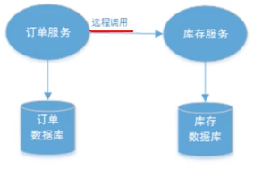
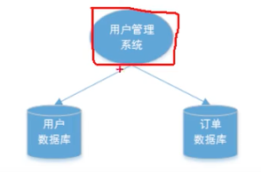
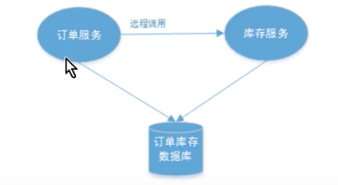

# 分布式事务

[TOC]

## 事务：

可以看多一次大活动，由多个不同的小活动组成，这些活动要么成功，要么全失败。

## 本地事务(即数据库事务)

基于关系型数据库的事务，被称为本地事务。

### 数据库事务的4大特性ACID：

- ##### Atomic 原子性: 

  事务中的子操作，要么全部执行成功，要么全部失败。不会在中间的任何环节结束。

- ##### Consistency 一致性:

  数据库在事务执行前后，数据都是完整一致的。如果事务执行失败，那么需要回滚到执行前的状态。

  对外界来说，看到的要么是事务提交前的数据，要么是事务提交后的数据，从而达到一致性。

- ##### Isolation 隔离性:

  事务与事务之间是完全隔离的。并发环境下，不同事务同时修改相同数据时，一个未完成事务不会影响另一个未完成事务。只有事务提交后其它事务才可以查询到最新的数据。

- ##### Duration 持久性:

  事务一旦完成，对数据的改变会永久性的存储在数据库，改变是永久的。即使发生断电宕机数据依然在。

### MySQL 的实现：

- begin： 开启事务

- undo log：记录修改前数据（回滚时使用）
- redo log:   记录修改后数据（提交时使用）
- commit：提交事务
- rollback：回滚事务

### Java 的实现：

Spring 通过事务注解 @Transactional，在生成bean时，用代理注入了数据库事务的 begin、commit、rollback。

## 分布式事务(跨库、跨服务)

分布式系统会把一个应用系统拆分为可独立部署的多个服务，因此需要服务与服务之间远程协作才能完成事务操作。**这种，分布式系统环境下，不同的服务之间通过网络远程协作完成事务称之为分布式事务。**如： 

## 1 分布式事务的产生场景：

##### 1典型的场景：微服务架构

##### 2 单体系统 访问 多个数据库实例

##### 3 多个服务 访问 同1个数据库实例

## 2 [分布式事务控制理论基础](https://www.zhihu.com/question/64921387)

### 2.1 CAP理论 - 分布式平衡理论

CAP 理论是分布式事务处理的理论基础，分布式系统设计中，要求：

- ##### Consistency 一致性: 

  所有数据库节点的数据是强一致的。

- ##### Availability 可用性: 

  分布式系统中的所有服务，能始终保证可用（即当用户发出请求后，服务能在有限时间内返回结果）。

- ##### Partition tolerence 分区容忍性:

  要求被分区的结点，可以正常对外提供服务(特指对网络分区的容忍性)。

#### CAP的权衡

事实上，任何系统只可能满足其中2个，无法3者兼顾。那么就会有以下3种组合：

- ##### CA：放弃分区容忍性，加强一致性和可用性；

  关系数据库按照CA进行设计。

- ##### AP：放弃(强)一致性，加强可用性和分区容忍性，追求最终一致性；

  NoSQL数据库按照AP进行设计。如 HBase、MongoDB 等

  > 注意：
  >
  > - 放弃一致性是指放弃强一致性，强一致性就是写入成功立刻要查询出最新数据；
  >
  > - 追求最终一致性是指允许暂时的数据不一致，只要最终在用户接受的时间内数据 一致即可。

- ##### CP：放弃可用性，加强一致性和分区容忍性；

  一些强一致性要求的系统按CP进行设计，比如：跨行转账，一次转账请求要等待双方银行系统都完成整个事务才算完成。

#### 总结

在分布式系统中，分区容忍性是一个基本要求

在分布式系统设计中AP的应用较多，即保证分区容忍性和可用性，牺牲数据的强一致性（写操作后立刻读取到最新数据），保证数据最终一致性。比如：订单退款，今日退款成功，明日账户到账，只要在预定的用户可以接受的时间内退款事务走完即可。

### 2.2 BASE 理论 - 最终一致性的支撑理论

- ##### 基本可用(Basically Available)：

  指分布式系统在出现故障时，允许损失部分的可用性来保证核心可用。

- ##### 软状态(Soft State)：

  指允许分布式系统存在中间状态，该中间状态不会影响到系统的整体可用性。

- ##### 最终一致性(Eventual Consistency)：

  指分布式系统中的所有副本数据经过一定时间后，最终能够达到一致的状态。

### 2.3 一致性模型

数据的一致性模型可以分为以下三种，分布式系统数据的强一致性、弱一致性和最终一致性可以通过[Quorum NRW算法](https://link.zhihu.com/?target=https%3A//en.wikipedia.org/wiki/Quorum_(distributed_computing))分析。

- 强一致性

  数据更新成功后，任意时刻所有副本中的数据都是一致的，一般采用同步的方式实现；

- 弱一致性

  数据更新成功后，系统不承诺立即可以读到最新写入的值，也不承诺具体多久之后可以读到。

- 最终一致性

​       弱一致性的一种形式，数据更新成功后，系统不承诺立即可以返回最新写入的值，但是保证最终会返回上一次更新操作的值。

### 2.4 刚性事务与柔性事务

- 刚性事务：实现了ACID特性的事务；
- 柔性事务：实现了BASE特性的事务；

## 3 分布式事务解决方案

分布式事务解决方案主要有：

- 强一致性的：
  - 两阶段提交协议：
  - 三阶段提交协议

- 最终一致性的：
  - 可靠事件队列模式
  - 补偿模式
  - Seata 蚂蚁金服分布式事务中间件 (TCC模式)

### 1 XA 协议 - X/Open DTP模型

### 协议

XA协议，是最早的分布式事务模型，是由 X/Open 国际联盟提出的[X/Open Distributed Transaction Processing（DTP）模型](https://pubs.opengroup.org/onlinepubs/009680699/toc.pdf)。

XA协议通过一个全局事务管理器与多个资源管理器进行交互。全局事务管理器负责管理全局事务状态和参与事务的资源，资源管理器则负责具体的资源操作；

XA协议使用两阶段提交来保证分布式事务的原子性，它将提交过程分为准备阶段和提交/回滚阶段。两阶段提交也是XA协议的标准实现。

XA协议与应用程序的关系如图所示。

### 1 两阶段提交协议 (Two-Phase Commit，简称2PC) ：

两阶段提交协议，是关系型数据库层面实现的，是传统的分布式事务解决方案。

该协议将参与整个过程的实体分成了两类角色：

- ##### 事务管理器（或事务协调者)：即事务发起方；

- ##### 资源管理器：即事务参与者；

该协议将整个过程分成了两个阶段；

- ##### Prepare phase 准备阶段

  事务管理器给每个参与者发送 Prepare消息，每个数据库参与者在本地执行事务，并写本地的Undo/Redo日志，此时事务没有提交。

  - uodo log:  记录修改前的数据，用于数据库回滚；

  - redo log：记录修改后的数据，用于提交事务后，写入数据库文件；

- ##### Commit phase 提交阶段

  - 当事务管理器收到参数者执行失败或者超时的消息时，直接给每个参与者发送回滚(Rollback)消息；

  - 否则，发送提交(Commit)消息 ；

### 2 三阶段提交协议：2PC的改良版

1. ##### 【预备阶段】

2. ##### 准备阶段

3. ##### 提交阶段

  另外，增加**【超时机制】**，解决同步阻塞问题。

### 3 最终一致性

#### 3.1 TCC 协议（Try-Confirm-Commit）

TCC协议是基于2PC实现的业务层事务控制协议。

TCC 协议中，各个参与者需要实现3个操作：Try、Confirm 和 Cancel，3个操作对应2个阶段：

- Try：是指一阶段的资源检测和预留，
- Confirm 和 Cancel ：是指二阶段的提交和回滚。

注意：TCC 的 try/confirm/cancel 接口都要实现幂等性，在try、confirm、cancel 失败后要不断重试。

##### TCC实现框架:  tcc-transaction

#### 3.2 补偿模式

- ##### 重试机制：

- ##### 每次更新时的修复：

- ##### 定时校对：

  - 未完成的定时重试
  - 定时核对：

> ##### 定时任务框架
>
> - 单机场景：Quartz
> - 分布式场景：Elastic-Job、XXL-JOB、SchedulerX

#### 3.1 可靠事件模型 实现最终一致性

> ##### 消息队列MQ
>
> 在分布式系统中，MQ在服务端架构中地位重要，主要解决：1 同步通信机制造成的阻塞，2 通过消息队列实现了业务解藕。
>
> - 异步处理
> - 系统解耦
> - 流量削峰

可靠事件模式是指：

通过引入可靠的消息队列，只要保证事件投递是可靠的，并保证事件传递至少一次，保证事件能被订阅者消费掉，即可。

（MQ方案是将分布式事务拆分成多个本地事务来完成，并且由消息队列异步协调完成。）

存在的问题：

- 事件投递时，可能因为MQ不可用而无法发送消息；
- MQ发送消息后，可能从业务(消费者)因为宕机而无法消费。

总结：

引入消息队列并不能保证可靠消息投递，换言之，由于网络等各种原因而导致消息丢失，不能保证其最终的一致性。因此，需要通过**正反向消息机制**确保消息队列实现可靠的事件投递，并且使用**补偿机制**尽可能在一段时间内将未完成的消息重新投递。

优点 ：
由MQ按异步的方式协调完成事务，性能较高。
不用实现try/confirm/cancel接口，开发成本比TCC低。
缺点：
此方式基于关系数据库本地事务来实现，会出现频繁读写数据库记录，浪费数据库资源，另外对于高并发操作不是最佳方案。

#### 3.2 缓存数据实现最终一致性

#### 5 MQ最大努力通知

最大努力通知方案是分布式事务中对一致性要求最低的一种，适用于一些最终一致性时间敏感度低的业务； 最大努力通知方案需要实现如下功能：

- 消息重复通知机制；
- 消息校对机制；

#### 

