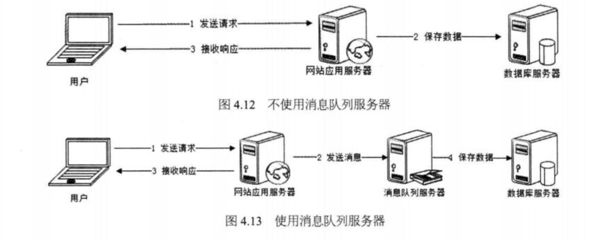

# 消息队列MQ

消息中间件：RobbitMQ、kafark；

## 消息队列：通过异步处理提高系统性能

如上图，在不使用消息队列服务器的时候，用户的请求数据直接写入数据库，在高并发的情况下数据库压力剧增，使得响应速度变慢。

但是在使用消息队列之后，

- 用户的请求数据发送给消息队列之后立即返回，
- 再由消息队列的消费者进程从消息队列中获取数据，异步写入数据库。由于消息队列服务器处理速度快于数据库(消息队列也比数据库有更好的伸缩性)，因此响应速度得到大幅改善。

通过以上分析可以得出：**消息队列具有很好的削峰作用的功能**——即通过异步处理，将短时间高并发产生的事务消息存储在消息队列中，从而削平高峰期的并发事务。 举例：在电子商务一些秒杀、促销活动中，合理使用消息队列 可以有效抵御促销活动刚开始大量订单涌入对系统的冲击。如下图所示:

因为用户请求数据写入消息队列之后就立即返回给用户了，但是请求数据在后续的业务校验、写数据库等操作中可能 失败。因此使用消息队列进行异步处理之后，需要适当修改业务流程进行配合，比如用户在提交订单之后，订单数据

## 消息队列中间件

消息队列中间件是分布式系统中重要的组件，主要解决异步消息、应用解耦、流量削锋等问题，实现高性能、高可用、可伸缩和最终一致性架构。目前使用较多的消息队列有ActiveMQ，RabbitMQ，ZeroMQ，Kafka，MetaMQ，RocketMQ。

### 异步处理

### 应用解藕

### 日志处理

### 消息通讯