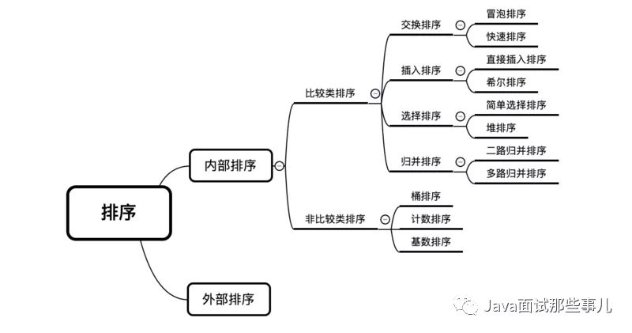

# 手撕算法

## 加密算法概念

**数据加密** 的基本过程，就是对原来为 **明文** 的文件或数据按 **某种算法** 进行处理，使其成为 **不可读** 的一段代码，通常称为 **“密文”**。通过这样的途径，来达到 **保护数据** 不被 **非法人窃取**、阅读的目的

**解密**是**加密** 的 **逆过程**，即将该 **编码信息** 转化为其 **原来数据** 的过程。

**1 数字签名**：简单来说就是通过提供 **可鉴别** 的 **数字信息** 验证 **自身身份** 的一种方式。

一套 **数字签名** 通常定义两种 **互补** 的运算，一个用于 **签名**，另一个用于 **验证**。分别由 **发送者**持有能够 **代表自己身份** 的 **私钥** (私钥不可泄露)，由 **接受者** 持有与私钥对应的 **公钥** ，能够在 **接受** 到来自发送者信息时用于 **验证** 其身份。

**2 对称加密算法**：加密和解密使用同一个密钥。是应用较早的加密算法。

**3 非对称加密算法**：又称为 **公开密钥加密算法**。它需要两个密钥，一个称为 **公开密钥**(`public key`)，即 **公钥**，另一个称为 **私有密钥** (`private key`)，即 **私钥**。

因为 **加密** 和 **解密** 使用的是两个不同的密钥，所以这种算法称为 **非对称加密算法**。

1. 如果使用 **公钥** 对数据 **进行加密**，只有用对应的 **私钥** 才能 **进行解密**。
2. 如果使用 **私钥** 对数据 **进行加密**，只有用对应的 **公钥** 才能 **进行解密**。


## 加密算法之间的比较

| 加密算法     | **密钥管理**                         | **安全性** | 加密速度                                                     |
| ------------ | ------------------------------------ | ---------- | ------------------------------------------------------------ |
| 对称加密算法 | 较难，不适合互联网，一般用于内部系统 | 中         | 快好 **几个数量级** (软件加解密速度至少快 `100` 倍，每秒可以加解密数 MB 数据)，适合大数据量的加解密处理 |
| 非对称加算法 | 较容易                               | 高         | 比较慢，适合 **小数据量** 加解密或数据签名                   |


| 对称加密算法 | 密钥名称        | 运行速度 | 安全性 | 资源消耗 |
| ------------ | --------------- | -------- | ------ | -------- |
| DES          | 56位            | 较快     | 低     | 中       |
| 3DES         | 112位或168位    | 慢       | 中     | 高       |
| **AES**      | 128、192、256位 | 快       | 高     | 低       |

| 非对称加密算法 | 成熟度 | 安全性 | 运算速度 | 资源消耗 |
| -------------- | ------ | ------ | -------- | -------- |
| **RSA**        | 高     | 高     | 中       | 中       |
| ECC            | 高     | 高     | 慢       | 高       |

| 散列加密算法（信息摘要算法） | 安全性 | 速度 |
| ---------------------------- | ------ | ---- |
| SHA-1                        | 高     | 慢   |
| MD5                          | 中     | 快   |


## 常见加密算法

### md5 算法

`MD5` 用的是 **哈希函数**，它的典型应用是对一段信息产生 **信息摘要**，以 **防止被篡改**。

严格来说，`MD5` 不是一种 **加密算法** 而是 **摘要算法**。无论是多长的输入，`MD5` 都会输出长度为 `128bits` 的一个串 (通常用 `16` **进制** 表示为 `32` 个字符)。

```java
public static final byte[] computeM5(byte[] content) {
    try {
        MessageDigest md5 = MessageDigest.getInstance("MD5");
        return md5.digest(content);
    } catch (NoSuchAlgorithmException e) {
        throw new RuntimeException(e);
    }
}
```


### SHA1算法

`SHA1` 是和 `MD5` 一样流行的 **消息摘要算法**，然而 `SHA1` 比 `MD5` 的 **安全性更强**。

对于长度小于 `2 ^ 64` 位的消息，`SHA1` 会产生一个 `160` 位的 **消息摘要**。

基于 `MD5`、`SHA1` 的信息摘要特性以及 **不可逆** (一般而言)，可以被应用在检查 **文件完整性** 以及 **数字签名** 等场景。

```java
public static byte[] computeSHA1(byte[] content) {
    try {
        MessageDigest sha1 = MessageDigest.getInstance("SHA1");
        return sha1.digest(content);
    } catch (NoSuchAlgorithmException e) {
        throw new RuntimeException(e);
    }
}
```


###  HMAC算法

`HMAC` 是密钥相关的 **哈希运算消息认证码**（Hash-based Message Authentication Code），`HMAC` 运算利用 **哈希算法** (`MD5`、`SHA1` 等)，以 **一个密钥** 和 **一个消息** 为输入，生成一个 **消息摘要** 作为 **输出**。

`HMAC` **发送方** 和 **接收方** 都有的 `key` 进行计算，而没有这把 `key` 的第三方，则是 **无法计算**出正确的 **散列值**的，这样就可以 **防止数据被篡改**。


```java
package net.pocrd.util;
import net.pocrd.annotation.NotThreadSafe;
import net.pocrd.define.ConstField;
import org.slf4j.Logger;
import org.slf4j.LoggerFactory;
import javax.crypto.Mac;
import javax.crypto.SecretKey;
import javax.crypto.spec.SecretKeySpec;
import java.util.Arrays;

@NotThreadSafe
public class HMacHelper {
    private static final Logger logger = LoggerFactory.getLogger(HMacHelper.class);
    private Mac mac;
		/**
 		* MAC算法可选以下多种算法
 		* HmacMD5/HmacSHA1/HmacSHA256/HmacSHA384/HmacSHA512
 		*/
		private static final String KEY_MAC = "HmacMD5";
  
		public HMacHelper(String key) {
    	try {
        SecretKey secretKey = new SecretKeySpec(key.getBytes(ConstField.UTF8), KEY_MAC);
        mac = Mac.getInstance(secretKey.getAlgorithm());
        mac.init(secretKey);
    	} catch (Exception e) {
        logger.error("create hmac helper failed.", e);
    	}
		}
  
		public byte[] sign(byte[] content) {
    	return mac.doFinal(content);
		}

		public boolean verify(byte[] signature, byte[] content) {
    	try {
        byte[] result = mac.doFinal(content);
        return Arrays.equals(signature, result);
    	} catch (Exception e) {
        logger.error("verify sig failed.", e);
    	}
    	return false;
		}
}
```


## 8大排序算法

参考：

- https://zhuanlan.zhihu.com/p/121122555

- https://zhuanlan.zhihu.com/p/34168443



### 1 冒泡排序：

基本思想：持续比较相邻的两数字，如果左边比右边大，就交换他们两个。直到没有任何一对数字需要比较。（即：每当两相邻的数比较后，发现它们的排序与排序要求相反时，就将它们互换。）

- 冒泡排序最好的时间复杂度为O(n)。冒泡排序的最坏时间复杂度为O(n^2)。因此冒泡排序总的平均时间复杂度为O(n^2)。
- 算法适用于少量数据的排序，是稳定的排序方法。

```java
public static void bubbleSort(int[] array)
{
            int tmp;
            boolean flag = false;//设置是否发生交换的标志
            for(int i=array.length-1; i>=0; i--)
            {
                for(int j=0; j<i; j++)
                {//每一轮都找到一个最大的数放在右边
                    if(array[j]>array[j+1])
                    {
                        tmp = array[j];
                        array[j] = array[j+1];
                        array[j+1] = tmp;
                        flag = true;//发生了交换
                    }
                }
                if(!flag)  
                  break;//这一轮循环没有发生交换，说明排序已经完成，退出循环
           }
}
```

### 2 快速排序

选择一个**基准元素**（通常选择第一个元素或者最后一个元素），通过一趟扫描，将待排序列分成两部分：一部分比基准元素小,一部分大于等于基准元素；此时基准元素在其排好序后的正确位置，然后再用同样的方法递归地排序划分的两部分。


### 3 选择顺序

- 基本思想：每一次从待排序的数据元素中选出最小（或最大）的一个元素，存放在序列的起始位置，直到全部待排序的数据元素排完。
- 选择排序是不稳定的排序方法。时间复杂度 O(n^2)。

```java
public static void selectSort(int[] array)
{
        for(int i=0; i<array.length-1; i++)
        {
            int min = array[i];
            int minindex = i;
            for(int j = i; j<array.length; j++)
            {
                if(array[j]<min)
                {//选择当前最小的数
                    min = array[j];
                    minindex = j;
                }
            }
            if(i != minindex) 
            {//若i不是当前元素最小的，则和找到的那个元素交换
                array[minindex] = array[i];
                array[i] = min;
            }
        }
}
```


