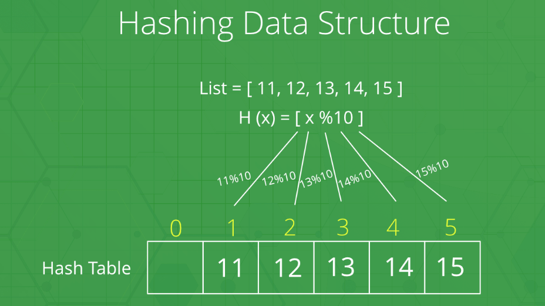
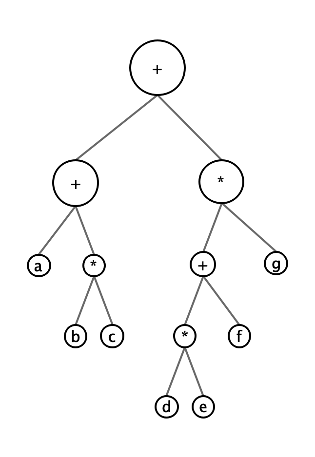
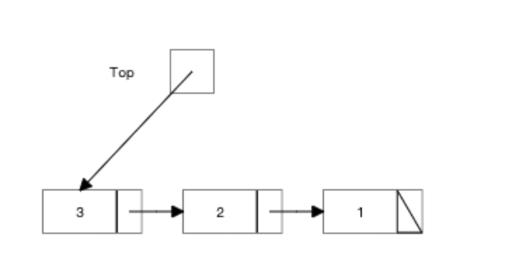
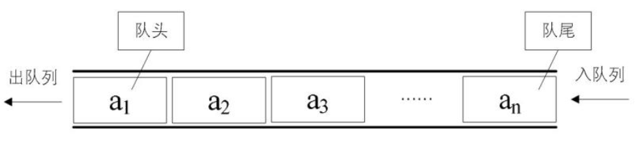
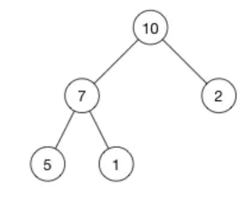

# 数据结构

[TOC]

## 汇总表

| 数据结构           | 结构特点                                                     | Java实现类    | 使用特点                                                     |
| ------------------ | ------------------------------------------------------------ | ------------- | ------------------------------------------------------------ |
| Array List数组列表 | 顺序、连续存储，元素可重复、可NULL。                         | ArrayList     | 底层通过数组实现，可动态扩展；可以快速随机访问，添加时有扩容的成本，删除时有元素移动成本。 |
| Link list   链表   | 无序、存储空间不连续。单向链表只有next链，双向链表有pre链和next链。 | LinkedList    | 底层是双向链表，无法快速随机访问，添加、删除元素时成本低。   |
|                    |                                                              |               |                                                              |
| Hash Table 哈希表  | key-value 映射，主体通过数组存储，根据key的hashCode将value散列存储到对应的bucket中，哈希冲突value通过拉链法用链表/红黑树存储。 | HashMap       | key值唯一，key/value都允许为null。get的时间复杂度为O(1)，遍历的时间复杂度为O(n)； |
|                    |                                                              | HashTable     | (线程安全)key值唯一，key/value都不允许为null。               |
|                    |                                                              | LinkedHashMap |                                                              |
|                    |                                                              |               |                                                              |
| Set 集合           | 无序、元素唯一。                                             | Set接口       |                                                              |
|                    |                                                              | HashSet       | 元素唯一、无序。内部通过 HashMap 存储所有元素，元素当作 key，value共一个 new Object() 。 |
|                    |                                                              | TreeSet       |                                                              |
|                    |                                                              | LinkedHashSet | 内部通过 LinkedHashMap 来存储所有元素。                      |
|                    |                                                              |               |                                                              |
| Stack              |                                                              |               |                                                              |
| Queue              |                                                              |               |                                                              |
| Heap               |                                                              |               |                                                              |


**参考：**

- [Data Structures and Algorithm Analysis in Java (Third Edition)](https://users.cs.fiu.edu/~weiss/#dsaajava3)  (by [Mark Allen Weiss](https://users.cs.fiu.edu/~weiss/))
- [usfca Data Structure Visualizations](https://www.cs.usfca.edu/~galles/visualization/Algorithms.html)
- Java 8+ Source Code


## 抽象数据类型(ADT)

**抽象数据类型**（Abstract data type，ADT）：是带有一组操作的一些对象的集合。

**基本操作**：printList打印所有元素，makeEmpty置空，find返回某一项首次出现的位置，insert插入元素，remove删除元素，findKth返回某位置上的元素。


## 线性表(list)：顺序、可重复、可为0

**空表（empty list）**：大小为0的特殊表。**除空表外，列表中的元素都是依次连续存储的。**列表有时称为序列。

**表的实现：**

- 数组列表-顺序连续存储，元素可重复、可为null；
- 链表-无序不连续存储，元素可重复、可为null；

### 数组列表(Array List)

数组可以实现列表上的所有操作，列表最简单的实现是通过数组。但是数组是定长的，列表是变长的，因此会涉及数组的扩展以保证可增长性。

```java
//数组扩展的实现
int[] arr = new int[10];
//创建新的数组，将原数组元素逐一复制过去
int oldCap = arr.length;
int newCap = oldCap + oldCap>>1;
int[] newArr = new int[newCap];
for(int i=0; i<arr.lenght; i++){
  newArr[i] = arr[i];
}
newArr = arr;
```

**操作消耗**：

- 遍历(printList)消耗线性时间，随机查找(findKth)消耗常数时间；

- **但插入和删除潜藏着昂贵开销**（为了保证连续存储，开销取决于操作元素的位置，平均需要移动一半元素，因此仍然需要线性时间）。

#### Java ArrayList-自增长数组

底层通过数组实现，容量可在创建时传入，默认是10；

添加元素时，如果容量用尽时，则自动扩容 newCapacity = oldCapacity + (oldCapacity >> 1) ，取值范围在[oldCapacity+1, Integer.MAX_VALUE]。

删除元素时，不会自动缩容，提供了手动缩容方法 trimToSize 。

ArrayList 的 get/set/size/isEmpty/iterator/listIterator 操作的花费时间为常量，add操作的花费时间为摊销常量时间O(n)，其他操作大致需要线性时间，并且其常量因子低于LinkedList的。

核心方法

- boolean add(E e) 增，自动扩容
- E remove(int index) / boolean remove(Object o)  删，不自动缩容
- E set(int index, E element) 改
- E get(int index) 查
- void trimToSize()  手动缩容

特点

- 优点：因为顺序连续存储，序号即为索引，元素的随机访问、更新、遍历的速度快；

- 缺点：添加时可能有扩容成本，删除时则有元素移动的成本。

源码：

```java
    /**
     * Returns a capacity at least as large as the given minimum capacity.
     * Returns the current capacity increased by 50% if that suffices.
     * Will not return a capacity greater than MAX_ARRAY_SIZE unless
     * the given minimum capacity is greater than MAX_ARRAY_SIZE.
     *
     * @param minCapacity the desired minimum capacity
     * @throws OutOfMemoryError if minCapacity is less than zero
     */
    private int newCapacity(int minCapacity) {
        // overflow-conscious code
        int oldCapacity = elementData.length;
        int newCapacity = oldCapacity + (oldCapacity >> 1);
        if (newCapacity - minCapacity <= 0) {
            if (elementData == DEFAULTCAPACITY_EMPTY_ELEMENTDATA)
                return Math.max(DEFAULT_CAPACITY, minCapacity);
            if (minCapacity < 0) // overflow
                throw new OutOfMemoryError();
            return minCapacity;
        }
        return (newCapacity - MAX_ARRAY_SIZE <= 0)
            ? newCapacity
            : hugeCapacity(minCapacity);
    }
```


### 链表(Linked List)

为了避免插入和删除的线性开销，需要列表可以不连续存储。链表就用来解决这个问题。

#### 简单链表/单向链表(single linked list)

单向链表由一系列的节点组成，这些节点在内存中不需要连续，每个节点含有：自身元素和后继节点的链(next link)；

最后一个节点的 next 链引用 null。

**操作消耗**：

- 执行printList或find(x)是从第一个节点开始并通过后继next链来遍历点，这样消耗的时间是线性的，和数组实现时一样；

- findKth操作不如数组实现时效率高，花费O(i)时间；

- remove方法可以通过修改一个next引用来实现；insert方法需要用new操作从系统中取得一个节点，然后执行两次引用的调整，这两个操作只涉及常数个节点链的改变。

#### 双向链表(double linked list)

是在单向链表特性的基础上，每个节点含有：元素、后继节点的链(next link)、前驱节点的链(pre link)。

第一个节点的pre链为null，最后一个节点的next链为null。


#### Java LinkedList-双向链表，

特性：

优点: 在变动位置已知时，新项插入和现有项删除，只需要修改节点的两个链，开销均很小;

缺点:由于存储位置无序不连续，不容易作索引，因此get调用昂贵，除非调用端点附近的，遍历成本也很昂贵。

源码：

```java
   // 结点对象定义
   private static class Node<E> {
        E item; //元素
        Node<E> next; //前驱
        Node<E> prev; //后继
        Node(Node<E> prev, E element, Node<E> next) {
            this.item = element;
            this.next = next;
            this.prev = prev;
        }
    }

   // 随机访问：如果index位于链的前半部分，则从头结点往后查，否则则从尾结点往前查；
   public E get(int index) {
        checkElementIndex(index);
        return node(index).item;
   }
   Node<E> node(int index) {
        // assert isElementIndex(index);
        if (index < (size >> 1)) {
            Node<E> x = first;
            for (int i = 0; i < index; i++)
                x = x.next;
            return x;
        } else {
            Node<E> x = last;
            for (int i = size - 1; i > index; i--)
                x = x.prev;
            return x;
        }
    }
```


## 哈希表/散列表(hash table): 无序，key唯一

哈希表/散列表(hash table)的实现常叫做哈希/散列(hashing)，是通过散列法来存储元素的线性表。通常，散列表的存储空间是一个一维数组，其哈希地址为数组的下标。另外，哈希表是字典的一种替代方法。

将key通过**哈希函数(hash function)**映射为元素在哈希表中的存放位置地址，这种方法叫**哈希(hashing)**。

哈希表处理插入、删除、查找的时间成本可以为O(1)。



### **哈希冲突**： 

由于哈希表是根据哈希值存储的，当多个key的哈希值相同时，这些元素共享由于使用同一个地址产生冲突；

解决办法是通过链表/红黑树，将冲突元素存储在同一个地址。如下图中的 John Smith  和 Sandra Dee 。


### Java HashMap-数组+单向链表/红黑树，无序


### Java LinkedHashMap-链表，按插入(默认)/访问排序

```java
    transient LinkedHashMap.Entry<K,V> head;
    transient LinkedHashMap.Entry<K,V> tail;
    final boolean accessOrder;
    
    static class Entry<K,V> extends HashMap.Node<K,V> {
        Entry<K,V> before, after;
        Entry(int hash, K key, V value, Node<K,V> next) {
            super(hash, key, value, next);
        }
    }
```


## 树(tree)

### 表达式树(expression tree)

二元操作的表达式树：所有的树叶都是**操作数(operand)**，所有的父节点都是**操作符(operator)**。如：


$$
(a+b*c) + ((d*e+f)*g)
$$


> 注意：一目减运算符（unary minus operator）的表达式树中：一个节点只有一个子节点。如：-1。

中序遍历（inorder traversal）：左子，节点，右子；

后序遍历（inorder traversal）：左子，右子，节点；


### 二叉树（binary tree）

二叉树（binary tree）是一棵树，每个节点最多有2个子节点。

一棵平均二叉树的深度要比节点个数N小得多，这个性质有时很重要。二叉树的平均深度为:
$$
O(\sqrt{N})
$$
二叉树有两个作用：

- 一个是用于查找（二叉查找树）；
- 另一个是用于编译器的设计领域（表达式树）。

```
//二叉树节点类
class BinaryNode {
	Object     element;//data in the node
	BinaryNode left;//left child
	BinaryNode right;//right child
}
```


#### 二叉查找树（binary search tree）

二叉查找树中，任意结点中的项，大于左子树中任意节点中的项，小于右子树中任意节点中的项。

二叉查找树要求所有节点中的项都能够排序（即可比较的，Java中二叉查找树的类需要实现Comparable接口，使用compareTo方法来进行两项间比较，如：TreeMap和TreeSet）。

[BinarySearchTree.java](https://users.cs.fiu.edu/~weiss/dsaajava3/code/BinarySearchTree.java)


#### AVL树：带平衡条件（balance condition）的二叉树

平衡条件必须容易保持，并且保证树的深度必须是：O(log N)。

平衡条件：

要求根节点的左、右子树具有相同的高度；（这会出现左子树只有左节点，右子树只有右接节点的情况。）

要求每个节点的具有相同高度的左、右子树。如果空子树的高度定义为-1（通常如此），那么只有具有（2的k次方-1）节点的理想平衡树满足这个条件。因此这种平衡树保证了树的深度小，但是它太严格而难以使用，需要方框条件。

**一棵AVL树是其每个节点的左子树和右子树的高度最多差1的二叉查找树（空树的高度定义为-1）。**实际AVL树的高度只略大于logN。

向AVL树中插入新节点可能会破坏平衡，通过对树进行简单修正来达到平衡条件的要求，这称作旋转（rotation）。

[AvlTree.java](https://users.cs.fiu.edu/~weiss/dsaajava3/code/AvlTree.java)


#### 红黑树（red black tree）：节点带红、黑着色的二叉查找树

历史上AVL树流行的一个变种是红黑树（red black tree）。红黑树的最大时间复杂度为O(log N)。

**红黑树是具有下列着色性质的二叉查找树：**

- 每个节点要么着黑色，要么着红色；
- 根节点是黑色；
- 如果一个节点是红色，那么其子节点必须是黑色；
- 从任一节点到一个null引用的每一条路径，必须包含相同数目的黑色节点。

着色法则的一个结论是，红黑树的高度最多是2log(N+1) 。

**操作消耗**：向一个红黑树中插入一个新的节点项，是困难的，**需要颜色的改变和树的旋转**。

[RedBlackTree.java](https://users.cs.fiu.edu/~weiss/dsaajava3/code/RedBlackTree.java)


#### B-Tree（平衡多路查找树）

B-tree 又叫平衡多叉查找树。一棵 m 阶的 B-tree (m 叉树)的特性如下(其中 ceil(x)是一个取上限的函数):

> 1. 树中每个结点至多有 m 个孩子;
>
> 2. 除根结点和叶子结点外，其它每个结点至少有有 ceil(m / 2)个孩子;
>
> 3. 若根结点不是叶子结点，则至少有 2 个孩子(特殊情况:没有孩子的根结点，即根结点为叶子
>
>    结点，整棵树只有一个根节点);
>
> 4. 所有叶子结点都出现在同一层，叶子结点不包含任何关键字信息(可以看做是外部结点或查询
>
>    失败的结点，实际上这些结点不存在，指向这些结点的指针都为 null);
>
> 5. 每个非终端结点中包含有 n 个关键字信息: (n，P0，K1，P1，K2，P2，......，Kn，Pn)。其中:
>
>
> a) Ki (i=1...n)为关键字，且关键字按顺序排序 K(i-1)< Ki。
>
> b) 1)。
>
> Pi 为指向子树根的接点，且指针 P(i-1)指向子树种所有结点的关键字均小于 Ki，但都大于 K(i- c) 关键字的个数 n 必须满足: ceil(m / 2)-1 <= n <= m-1。
>


**B-Tree 是为了文件系统（磁盘或其它外存设备）而设计的一种多叉平衡查找树（相对于二叉，B树每个内结点有多个分支，即多叉）。**

> 系统从磁盘读取数据到内存时是以磁盘块（block）为基本单位的，位于同一个磁盘块中的数据会被一次性读取出来，而不是需要什么取什么。
>
> MySQL的InnoDB存储引擎中有页（Page）的概念，页是其磁盘管理的最小单位。InnoDB存储引擎中默认每个页的大小为16KB，可通过参数innodb_page_size将页的大小设置为4K、8K、16K，在[MySQL](http://lib.csdn.net/base/mysql)中可通过如下命令查看页的大小：
>
> ```
> mysql> show variables like 'innodb_page_size';
> - 1
> - 1
> ```
>
> 而系统一个磁盘块的存储空间往往没有这么大，因此InnoDB每次申请磁盘空间时都会是若干地址连续磁盘块来达到页的大小16KB。InnoDB在把磁盘数据读入到磁盘时会以页为基本单位，在查询数据时如果一个页中的每条数据都能有助于定位数据记录的位置，这将会减少磁盘I/O次数，提高查询效率。

**B-Tree结构的数据可以让系统高效的找到数据所在的磁盘块。**为了描述B-Tree，首先定义一条记录为一个二元组[key, data] ，key为记录的键值，对应表中的主键值，data为一行记录中除主键外的数据。对于不同的记录，key值互不相同。

一棵m阶的B-Tree有如下特性： 
\1. 每个节点最多有m个孩子。 
\2. 除了根节点和叶子节点外，其它每个节点至少有Ceil(m/2)个孩子。 
\3. 若根节点不是叶子节点，则至少有2个孩子 
\4. 所有叶子节点都在同一层，且不包含其它关键字信息 
\5. 每个非终端节点包含n个关键字信息（P0,P1,…Pn, k1,…kn） 
\6. 关键字的个数n满足：ceil(m/2)-1 <= n <= m-1 
\7. ki(i=1,…n)为关键字，且关键字升序排序。 
\8. Pi(i=1,…n)为指向子树根节点的指针。P(i-1)指向的子树的所有节点关键字均小于ki，但都大于k(i-1)

B-Tree中的每个节点根据实际情况可以包含大量的关键字信息和分支，如下图所示为一个3阶的B-Tree： 


B-Tree结构的数据可以让系统高效的找到数据所在的磁盘块。为了描述B-Tree，首先定义一条记录为一个二元组[key, data] ，key为记录的键值，对应表中的主键值，data为一行记录中除主键外的数据。对于不同的记录，key值互不相同。


#### B+Tree

B+Tree是在B-Tree基础上的一种优化，使其更适合实现数据库索引（外存储索引结构）。

> MySQL的InnoDB存储引擎就是用B+Tree实现其索引结构。

从上面B-Tree结构图中可以看到每个节点中不仅包含数据的key值，还有data值。而每一个页的存储空间是有限的，如果data数据较大时将会导致每个节点（即一个页）能存储的key的数量很小，当存储的数据量很大时同样会导致B-Tree的深度较大，增大查询时的磁盘I/O次数，进而影响查询效率。在B+Tree中，所有数据记录节点都是按照键值大小顺序存放在同一层的叶子节点上，而非叶子节点上只存储key值信息，这样可以大大加大每个节点存储的key值数量，降低B+Tree的高度。

**B+Tree相对于B-Tree有几点不同：**

1. **非叶子节点只存储键值信息。**
2. **所有叶子节点之间都有一个链指针。**
3. **数据记录都存放在叶子节点中。**

将上一节中的B-Tree优化，由于B+Tree的非叶子节点只存储键值信息，假设每个磁盘块能存储4个键值及指针信息，则变成B+Tree后其结构如下图所示： 


通常在B+Tree上有两个头指针，一个指向根节点，另一个指向关键字最小的叶子节点，而且所有叶子节点（即数据节点）之间是一种链式环结构。因此可以对B+Tree进行两种查找运算：一种是对于主键的范围查找和分页查找，另一种是从根节点开始，进行随机查找。

可能上面例子中只有22条数据记录，看不出B+Tree的优点，下面做一个推算：

InnoDB存储引擎中页的大小为16KB，一般表的主键类型为INT（占用4个字节）或BIGINT（占用8个字节），指针类型也一般为4或8个字节，也就是说一个页（B+Tree中的一个节点）中大概存储16KB/(8B+8B)=1K个键值（因为是估值，为方便计算，这里的K取值为〖10〗^3）。也就是说一个深度为3的B+Tree索引可以维护10^3 * 10^3 * 10^3 = 10亿 条记录。

实际情况中每个节点可能不能填充满，因此在数据库中，B+Tree的高度一般都在2~4层。[mysql](http://lib.csdn.net/base/mysql)的InnoDB存储引擎在设计时是将根节点常驻内存的，也就是说查找某一键值的行记录时最多只需要1~3次磁盘I/O操作。


> **数据库中的B+Tree索引：可以分为聚集索引（clustered index）和辅助索引（secondary index）。**
>
> 上面B+Tree示例图，在数据库中的实现即为聚集索引，聚集索引的B+Tree中的叶子节点存放的是整张表的行记录数据。
>
> 辅助索引与聚集索引的区别在于辅助索引的叶子节点并不包含行记录的全部数据，而是存储相应行数据的聚集索引键，即主键。
>
> 当通过辅助索引来查询数据时，MySQL 的 InnoDB存储引擎会遍历辅助索引找到主键，然后再通过主键在聚集索引中找到完整的行记录数据。
>
> **为什么说B+树比B树更适合数据库索引？**
>
> 1B+Tree的磁盘读写代价更低：B+树的内部节点并没有指向关键字具体信息的指针，因此其内部节点相对B树更小，如果把所有同一内部节点的关键字存放在同一盘块中，那么盘块所能容纳的关键字数量也越多，一次性读入内存的需要查找的关键字也就越多，相对IO读写次数就降低了。
>
> 2 B+Tree的查询效率更加稳定：由于非终结点并不是最终指向文件内容的结点，而只是叶子结点中关键字的索引。所以任何关键字的查找必须走一条从根结点到叶子结点的路。所有关键字查询的路径长度相同，导致每一个数据的查询效率相当。
>
> 3 由于B+Tree的数据都存储在叶子结点中，分支结点均为索引，方便扫库，只需要扫一遍叶子结点即可，但是B树因为其分支结点同样存储着数据，我们要找到具体的数据，需要进行一次中序遍历按序来扫，所以B+树更加适合在区间查询的情况，所以通常B+树用于数据库索引。


## 栈(stack)- LIFO-Array/LinkedList实现

栈(stack)是限制插入和删除只能在末端的表，这个位置称作栈的顶（top）。

栈有时又称作**后进先出（LIFO）表**。

**基本操作**：

- 进栈(push)，相当于插入；

- 出栈(pop)，是删除最后插入的元素。

**特性：**

- 对空栈，进行 pop 或 top，一般认为是栈ADT错误；

- 当运行 push 时，空间用尽是一个实现限制，但不是ADT错误。


**栈的实现:**

由于栈是一个表，因此任何实现表的操作都能实现栈。ArrayList 和 LinkedList 都支持栈操作，并在99%情况下是最合理的选择，偶尔设计特殊目的实现可能会更快。

- [栈的链表实现](https://www.cs.usfca.edu/~galles/visualization/StackLL.html)

  

- [栈的数组实现](https://www.cs.usfca.edu/~galles/visualization/StackArray.html)

  


## 队列(queue)-FIFO-Array/LinkedList实现

像栈一样，队列（queue）也是表。但使用队列时，插入在一端进行，而删除则在另一端进行。

是**先进先出（FIFO）表**。

**基本操作：**

- 入队（enqueue）

- 出队（dequeue）



**堆的实现：**

- [数组实现](https://www.cs.usfca.edu/~galles/visualization/QueueArray.html)
- [链表实现](https://www.cs.usfca.edu/~galles/visualization/QueueLL.html)


## [堆(heap)](https://www.cs.usfca.edu/~galles/visualization/BinomialQueue.html)-优先队列-数组实现的完全二叉树

堆，就是一棵被完全填满的二叉树，只有底层例外，底层上的元素从左往右填入；这样的二叉树称为**完全二叉树**。

堆就是用**数组**实现的完全二叉树，所以它没有使用父指针或者子指针。**堆根据“堆属性”来排序**，“堆属性”决定了树中节点的位置。

**堆属性**

堆分为两种：*最大堆*和*最小堆*，两者的差别在于节点的排序方式。

- 在最大堆中：父节点的值比每一个子节点的值都要大。

- 在最小堆中：父节点的值比每一个子节点的值都要小。

这就是所谓的“堆属性”，并且这个属性对堆中的每一个节点都成立。

**堆的性质**

- 结构性
- 堆序性（heap-order property）

对堆的一次操作可能破坏这堆的两个性质中的一个，因此，对堆的操作必须到堆所有性质都被满足才能终止。

**堆的实现**


**应用场景**

- 构建优先队列
- 快速找出一个集合中的最小值(最小堆)或者最大值(最大堆)；
- 支持堆排序


## 位图

位图的原理就是用一个 bit 来标识一个数字是否存在，采用一个 bit 来存储一个数据，所以这样可 以大大的节省空间。 bitmap 是很常用的数据结构，比如用于 Bloom Filter 中;用于无重复整数的 排序等等。bitmap 通常基于数组来实现，数组中每个元素可以看成是一系列二进制数，所有元素 组成更大的二进制集合。


## 二叉树节点与数组元素的位置关系

树节点在数组中的位置及其父节点、子节点的索引之间有一个映射关系。

如果 `i` 是节点的索引，那么下面的公式就给出了它的父节点和子节点在数组中的位置：

```go
parent(i) = floor((i - 1)/2)
left(i)   = 2i + 1
right(i)  = 2i + 2
且
array[parent(i)] >= array[i]
```

例如：

二叉树：



数组：[ 10, 7, 2, 5, 1 ]

二叉树节点与数组元素的位置关系：

| Node | Array index (`i`) | Parent index | Left child | Right child |
| ---- | ----------------- | ------------ | ---------- | ----------- |
| 10   | 0                 | -1           | 1          | 2           |
| 7    | 1                 | 0            | 3          | 4           |
| 2    | 2                 | 0            | 5          | 6           |
| 5    | 3                 | 1            | 7          | 8           |
| 1    | 4                 | 1            | 9          | 10          |


