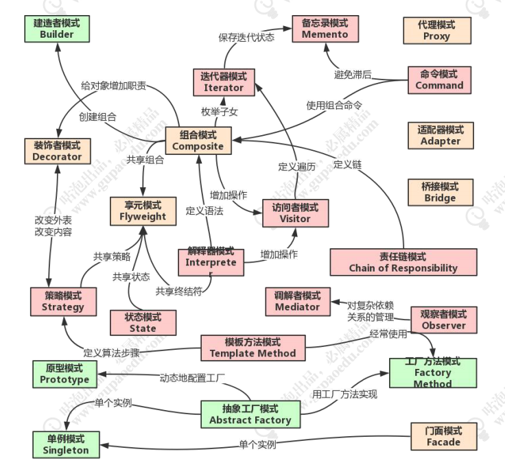

# 设计模式

[TOC]

设计结构对系统性能的影响要远高于代码优化。熟悉一些典型的设计模式和方法，有助于设计高性能软件。

## 概念和分类

设计模式（Design pattern）代表了最佳的实践，是软件开发人员在软件开发过程中面临的一般问题的解决方案。

设计模式是一套被反复使用的、多数人知晓的、经过分类编目的、代码设计经验的总结。使用设计模式是为了重用代码、让代码更容易被他人理解、保证代码可靠性。设计模式使代码编制真正工程化，设计模式是软件工程的基石。

根据设计模式的参考书 **Design Patterns - Elements of Reusable Object-Oriented Software（中文译名：设计模式 - 可复用的面向对象软件元素）** 中所提到的，总共有 23 种设计模式。这些模式可以分为3大类：创建型模式（Creational Patterns）、结构型模式（Structural Patterns）、行为型模式（Behavioral Patterns）。

以下是网上经典的设计模式关系图：



## 单例模式（Singleton Pattern）

单例模式是最简单的设计模式之一。

单例模式是一种创建型模式，提供了创建对象实例的最佳方式 - 确保系统中一个类只产生一个实例。

**意图：**1 对频繁使用的对象，可以节约创建与销毁对象所花费的时间 ，尤其是对重量级对象；2 new操作的次数减少，因此对系统内存的使用频率也降低，这将减轻GC压力，缩短GC停顿时间。

**核心：**保证系统中一个类只有一个实例，并提供一个访问它的全局访问点（构造函数必须私有）。

**主要参与者**：单例类和使用者；

**使用场景：** 

1 要求生产唯一序列号；

2 web中的计数器，不必每次刷新都在数据库里加一次，先用单例缓存起来

3 创建的对象需要消耗的资源过多，比如I/O与数据库的连接等。

4 配置文件的读取

```java
//最简单的单实例实现，不能做到延迟加载实例。(饿汉式，可保证线程安全)
public class Singleton {
  //私有化构造方法
  private Singleton(){
      //todo
  }
  private static Singleton instance = new Singleton();
	public static Singleton getInstance() {
		return instance;
	}
}

/*
* 使用内部类来实现单实例，实例是在类加载时完成创建。
* 既做到了延迟加载，又对多线程友好（不必使用synchronized关键字），是一种比较完善的实现。
*/
public class StaticSingleton {
  //私有化构造方法
  private StaticSingleton(){
      //todo
  }
  
  private static class InstanceHolder {
		private static StaticSingleton instance = new StaticSingleton();//在类加载时创建对象实例
	}
	public static StaticSingleton getInstance() {
		return InstanceHolder.instance;
	}
}
```


## 代理模式（Proxy Pattern）

**代理模式：**使用代理对象完成用户请求，屏蔽用户对真实对象的访问。（如同现实生活中的代理人一样）

**主要参与者：**

| 角色           | 作用                                                         |
| -------------- | ------------------------------------------------------------ |
| 主题接口       | 定义代理类和真实主题的公共对外方法，也是代理类代理真实主题的方法 |
| 真实主题       | 真正实现业务逻辑的类                                         |
| 代理类         | 用来代理和封装真实主题                                       |
| Main（客户端） | 使用代理类和主题接口完成一些工作                             |

**应用场景：**用于远程调用的网络代理、考虑安全因素的安全代理、延迟加载。

代理模式用于延迟加载，可以有效提升系统的启动速度，对改善用户体验有很大帮助。

##### 静态代理

```
//code 

```

##### 动态代理

是指在运行时动态生成并加载代理类。即：代理类的字节码将在运行时生成并载入当前的ClassLoader。

**生成动态代理类的方法：**

- JDK自带的动态代理：内置在JDK中，无需引入第三方jar，使用简单；

- CGLIB和Javassist：都是高级的字节码生成库，总体性能比JDK自带的动态代理好，且功能十分强大；

- ASM库：是低级的字节码生成工具，使用ASM近乎使用Java bytecode编码，对开发人员要求高，当然也是性能最好。但是ASM程序可维护性差，如非性能要求苛刻，还是建议使用CGLIB和Javassist。

###### **JDK 自带的动态代理**

-  java.lang.reflect.Proxy: 生成动态代理类和对象；
-  java.lang.reflect.InvocationHandler（处理器接口）：可以通过invoke方法实现

对真实角色的代理访问。

每次通过 Proxy 生成的代理类对象都要指定对应的处理器对象。

```
//code

```


## 享元模式（Flyweight Pattern）

主要用于减少创建对象的数量，以减少内存占用和提高性能。它属于**结构型模式**。它提供了减少对象数量从而改善应用所需的对象结构的方式。


## 值对象模式（Value Object Pattern）

当一组属性需要同时访问时，分别访问将会繁琐难维护；**值对象模式将远程调用的传递数据封装在一个串行化的对象中进行传输**。用封装后的对象的在网络中传递，从而使系统拥有更好的交互模式；并减少网络通信数据，从而提高系统性能。


## 观察者模式（Observer Pattern）

观察者模式（Observer Pattern）用于一个对象的行为依赖另一个对象的状态的情况。比如，当一个对象被修改时，则会自动通知它的依赖对象。它属于**行为型模式**。

**意义：**在单线程中，使得某一对象，及时得知自身所依赖对象的状态变化（要考虑到易用和低耦合，保证高度的协作）。

**主要解决：**一个对象状态改变时给其他对象通知的问题，而且要考虑到易用和低耦合，保证高度的协作。

**使用场景：**事件监听、通知发布等，确保观察者在不使用轮询监控的情况下，及时收到相关消息和事件。

**注意：** 1 JDK已经实现了一套观察者模式，可以直接复用相关代码。 2 避免循环引用。 3 如果顺序执行，某一观察者错误会导致系统卡壳，一般采用异步方式。

**观察者模式最典型的应用便是：Swing框架的JButton实现。**当按钮被单击时，通过AbstractButton的fireActionPerformed()方法，回调ActionListener.actionPerformed()方法实现。应用开发中，只需实现ActionListener接口（Observer），就可将其添加到按钮（Subject）的观察者列表中，当点击事件发生，就自动触发监听器的业务处理函数。

