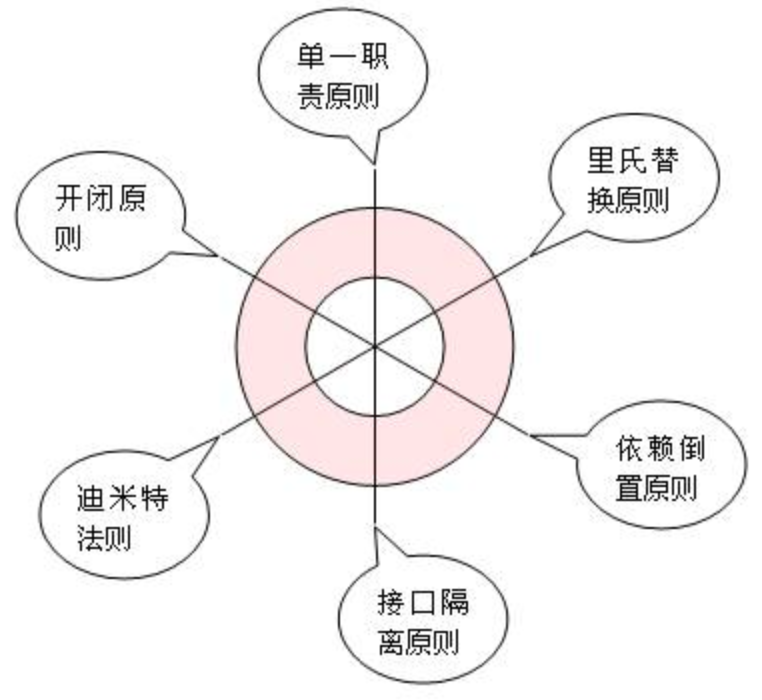
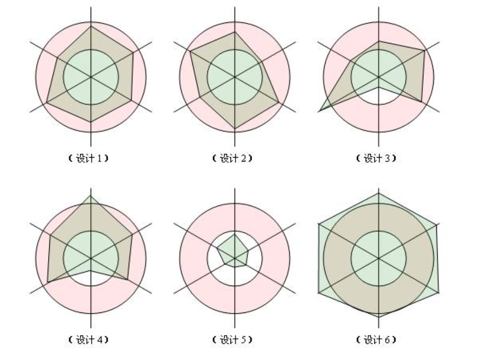

# 面向对象设计六原则

[TOC]

设计结构对系统性能的影响要远高于代码优化。熟悉设计原则、设计模式和方法，有助于设计高性能软件。

## 面向对象设计的6个原则

**软件编程的总原则：低耦合，高内聚**。无论是面向过程编程还是面向对象编程，只有使各个模块之间的耦合尽量的低，才能提高代码的复用率。

在面向对象的程序设计中，需要遵循6个设计原则：

### 1 Single Responsibility Principle 单一职责原则

**适用**：**不只是面向对象设计所特有的**，只要是模块化的程序设计，都适用单一职责原则。

**定义**：仅有一个引起类变化的原因。通俗的说即：一个类只负责一项职责（类中应该是一组相关性很高的函数及数据的封装）。

**优点**：可以降低类的复杂度，一个类只负责一项职责，其逻辑肯定要比负责多项职责简单的多；提高类的可读性，提高系统的可维护性；变更引起的风险降低，变更是必然的，如果单一职责原则遵守的好，当修改一个功能时，可以显著降低对其他功能的影响。


### 2 Open Close Principle 开闭原则

**开闭原则是面向对象设计中最基础的设计原则。**由[Bertrand Meyer（勃兰特.梅耶）](https://link.zhihu.com/?target=https%3A//en.wikipedia.org/wiki/Bertrand_Meyer)在1988年出版的[《面向对象软件构造》](https://link.zhihu.com/?target=https%3A//en.wikipedia.org/wiki/Object-Oriented_Software_Construction)中提出的。

**定义**：一个软件实体（如类、模块和函数）应该**对扩展开放，对修改关闭**。即软件实体应尽量在不修改原有代码的情况下进行扩展。（提倡一个类一旦开发完成，后续增加新的功能就不应该通过修改这个类来完成，而是通过继承，增加新的类。）

- 问题由来：在软件的生命周期内，因为变化、升级和维护等原因需要对软件原有代码进行修改时，可能会给旧代码中引入错误，也可能会使我们不得不对整个功能进行重构，并且需要原有代码经过重新测试。

- 解决方案：当软件需要变化时，尽量通过扩展软件实体的行为来实现变化，而不是通过修改已有的代码来实现变化。

  

### 3 Liskov Substitution Principle 里氏替换原则

**适用**：**是面向对象设计的基本原则之一**。

**定义**：

最早在1988年，由麻省理工学院的一位姓里的女士（Barbara Liskov）提出来的。

**所有引用基类的地方必须能透明地使用其子类的对象。**也就是说，只有满足以下2个条件的OO设计才可被认为是满足了LSP原则：

- 不应该在代码中出现 if/else 之类对子类类型进行判断的条件。

- 子类应当可以替换父类并出现在父类能够出现的任何地方，或者说如果我们把代码中使用基类的地方用它的子类所代替，代码还能正常工作。

通俗的来讲就是：**子类可以扩展父类的功能，但不能改变父类原有的功能。**它包含以下4层含义：

- 子类可以实现父类的抽象方法，但不能覆盖父类的非抽象方法。
- 子类中可以增加自己特有的方法。
- 当子类的方法重载父类的方法时，方法的前置条件（即方法的形参）要比父类方法的输入参数更宽松。【注意区分重载和重写】
- 当子类的方法实现父类的抽象方法时，方法的后置条件（即方法的返回值）要比父类更严格。

**特点：**不遵循里氏替换原则的代码也能正常跑，但是会增加出现问题的几率。

```java
public class Test {
  //符合里氏替换原则
	public static void eat(Animal any) {
		any.eat();
	}
	public static void main(String[] args) {
		Test.eat(new Rabbit());
		Test.eat(new Tigger());
	}
}
//父类动物
public abstract class Animal {
	public abstract void eat();
}
//子类兔子
public class Rabbit extends Animal {
	@Override
	public void eat() {
		System.out.println("eat grass...");
	}
}
```


### 4 Dependence Inversion Principle 依赖倒置原则

实现开闭原则的关键是抽象化，并且从抽象化导出具体化实现，如果说开闭原则是面向对象设计的目标的话，那么**依赖倒转原则就是面向对象设计的主要手段**。

**定义：**

**抽象不应该依赖于细节（具体），细节（具体）应当依赖于抽象。**换言之：要针对接口（抽象）编程，而不是针对实现编程，这样就降低了客户与实现模块间的耦合。该原则关键有3点：

- 高层模块不应该依赖低层模块，二者都应该依赖其抽象；

- 抽象不应该依赖细节；

- 细节应该依赖抽象。

**依赖倒置原则的核心思想是面向接口（抽象）编程。**使用接口或者抽象类的目的是制定好规范和契约，而不去涉及任何具体的操作，把展现细节的任务交给他们的实现类去完成。

在实际编程中做到如下3点：

- 低层模块尽量都要有抽象类或接口，或者两者都有。【可能会被人用到的】
- 变量的声明类型 尽量是抽象类或接口。
- 使用继承时遵循里氏替换原则。


### 5 Interface Segregation Principle 接口隔离原则

字面意思：使用多个隔离的接口，比使用单个总接口要好。本意降低类之间的耦合度。

**定义**：使用多个专门的接口，而不使用单一的总接口；即客户端不应该依赖那些它不需要的接口。一个类对另一个类的依赖应该建立在最小的接口上。

含义：建立单一接口，不要建立庞大臃肿的接口，尽量细化接口，接口中的方法尽量少。

采用接口隔离原则对接口进行约束时，要注意以下几点：

- **接口尽量小，但是要有限度。**对接口进行细化可以提高程序设计灵活性是不挣的事实，但是如果过小，则会造成接口数量过多，使设计复杂化。所以一定要适度。
- **为依赖接口的类定制服务，只暴露给调用的类它需要的方法，它不需要的方法则隐藏起来。**只有专注地为一个模块提供定制服务，才能建立最小的依赖关系。
- **提高内聚，减少对外交互。**使接口用最少的方法去完成最多的事情。

**特点：**接口隔离原则运用一定要适度，接口设计的过大或过小都不好。

```java
//不合时宜的总接口
interface IHuman{
    void eat();
    void sleep();
    void laiDaYiMa();//来大姨妈，这个接口方法对男性是不适用的
}

//根据接口隔离原则，修改为两个细分接口后：
interface IHuman{
    void eat();
    void sleep();
}
interface ISpecialForWoman{
    void laiDaYiMa();//来大姨妈
}
```


### 6 Demeter Principle / Least Knowledge Principle 迪米特法则（又名最少知道原则） 

迪米特法则来自于1987年美国东北大学(Northeastern University)一个名为 Demeter 的研究项目，又称最少知识原则(LeastKnowledge Principle, LKP)。

**定义**：一个对象应该对其他对象保持最少的了解。

> 问题由来：类与类之间的关系越密切，耦合度越大，当一个类发生改变时，对另一个类的影响也越大。
>
> 解决方案：尽量降低类与类之间的耦合。

通俗的来讲，

一个类对自己依赖/调用的类知道的越少越好。也就是说，被依赖/调用的类内部如何实现、如何逻辑复杂，都尽量将逻辑封装在类的内部，对外除了提供的public方法，不对外泄漏任何信息。


## 六原则的总结

而开闭原则是总纲，它告诉我们要**对扩展开放，对修改关闭**。

其余5个设计原则告诉我们：**用抽象构建框架，用实现扩展细节的注意事项**：

- 单一职责原则告诉我们实现**类要职责单一**；
- 里氏替换原则告诉我们**不要破坏继承体系**；
- 依赖倒置原则告诉我们要**面向接口编程**；
- 接口隔离原则告诉我们**在设计接口的时候要精简单一**；
- 迪米特法则告诉我们**要降低耦合**。


## 六原则的遵守

对这六个原则的遵守并不是**是和否**的问题，而是**多和少**的问题，需要根据实际情况灵活运用。对他们的遵守程度只要在一个合理的范围内，就算是良好的设计。

图解：每一条维度各代表一项原则，依据对这项原则的遵守程度在维度上画一个点：如果对这项原则遵守的合理，则这个点应该落在同心圆红色区域内部；如果遵守的差，点将会在小圆内部；如果过度遵守，点将会落在大圆外部。

一个良好的设计体现在图中，应该是六个顶点都在同心圆中的六边形（设计1、设计2是良好的设计）。**参考：**https://www.cnblogs.com/pony1223/p/7594803.html






