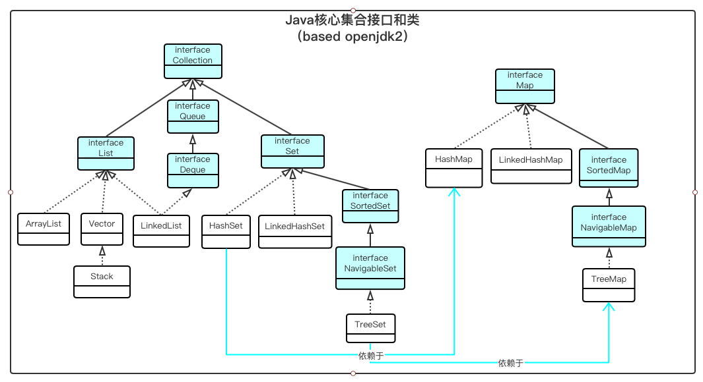
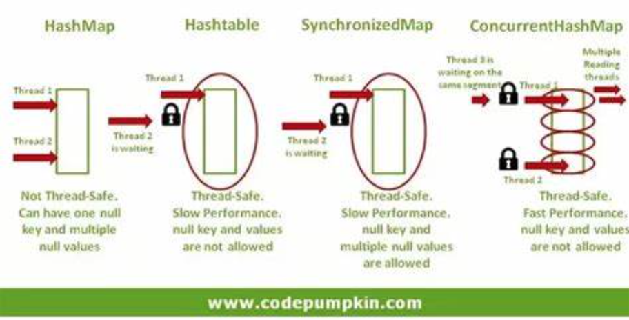

## Java 集合

[TOC]

### 参考：

- [Java Platform Standard Edition 8 Documentation](https://docs.oracle.com/javase/8/docs/)

- [Java 集合框架](https://www.runoob.com/java/java-collections.html)


## 集合框架

**效益：**减少编程工作量；提高程序速度和质量；允许无关 APIs 之间的相互操作；减少学习和使用新APIs的精力；减少设计新APIs的精力；促进软件复用。

**位置：**Java 集合框架位于包 java.util 中。

**概念**：集合框架是用于表示和操作集合的统一体系结构。所有集合框架都包含以下内容：

##### 1 接口（Interfaces）

代表集合的抽象数据类型 。接口允许独立于其表示的细节来操纵集合。在面向对象的语言中，接口通常形成层次结构。

接口类： Collection、List、Set、SortedSet(元素排序)、Map、SortedMap(元素的key排序)。

##### 2 实现（Implementations）

这些是集合接口的具体实现（类）。本质上，它们是可重用的数据结构。

实现类：ArrayList、LinkedList；

​			   HashMap、LinkedHashMap、TreeMap；

​               HashSet、LinkedHashSet、TreeSet；

##### 3 算法（Algorithms）

是实现集合接口的对象里的方法执行的一些有用的计算，例如：搜索和排序。这些算法被称为多态，那是因为相同的方法在相似的接口上有着不同的实现。

算法类：Collections, Iterator（集合元素迭代器）。




## 集合接口（interface）

>Java中数据存储方式分为两种数据结构：
>
>1 数组：连续空间、顺序存储，寻址迅速，但是在增、删元素可能需要较大幅度的移动；
>
>​             特点：查询速度快，增、删较慢。
>
>2 链表：空间不连续，寻址困难，增、删元素只需修改指针；
>
>​              特点：查询速度慢，增、删快。
>
>3 散列表

### **Collection** 

集合层次架构的根；表示一组对象（称作元素）的集合。

- List - 按插入顺序连续存储的集合（有时称为序列）。列表可以包含重复的元素。

- Set - 不包含重复元素的集合。（内部使用Map实现，元素作为key，value统一为一个空Object对象。）

  - SortedSet(升序Set) - 默认按升序排列其元素的Set。

- Queue - 用于在处理之前保存多个元素的集合。

  队列通常但不一定以FIFO（先进先出）的方式对元素进行排序。

- Deque - 用于在处理之前容纳多个元素的集合。

  Deque可同时用作FIFO（先进先出）和LIFO（先进先出）。

### **Map** 

映射集合层次架构的根，键值对（key-value entry）映射的集合。

将键（key）映射到值（value）的对象。映射不能包含重复的键；每个键最多可以映射到一个值。

- SortedMap —一个默认按键的升序排列其映射的Map。

**注意**：要实现集合元素的排序和不可重复，元素对象必须正确实现 [Object 的 equals() 和 hashCode() 方法](https://howtodoinjava.com/java/basics/java-hashcode-equals-methods/) ，如：Set是通过元素的hashCode来比较，Map通过元素的Key的hashCode来比较。


## 集合实现类（Implements）

普通实现类：

| Interfaces | Hash table Implementations | Resizable array Implementations | Tree Implementations  | Linked list Implementations | Hash table + Linked list Implementations | thread-safe implementations |
| ---------- | -------------------------- | ------------------------------- | --------------------- | --------------------------- | ---------------------------------------- | --------------------------- |
| Set        | `HashSet`                  |                                 | `TreeSet` (SortedSet) |                             | `LinkedHashSet`                          |                             |
| List       |                            | `ArrayList`                     |                       | `LinkedList`                |                                          | Vector                      |
| Queue      |                            |                                 |                       |                             |                                          |                             |
| Deque      |                            | `ArrayDeque`                    |                       | `LinkedList`                |                                          |                             |
| Map        | `HashMap`                  |                                 | `TreeMap` (SortedMap) |                             | `LinkedHashMap`                          | Hashtable                   |

并发实现类：

| Concurrent Interfaces          | Concurrent Implementation(thread-safe) |      |
| ------------------------------ | -------------------------------------- | ---- |
| BlockingQueue  (extends Queue) |                                        |      |
| ConcurrentMap  (extends Map)   | ConcurrentHashMap                      |      |
|                                |                                        |      |

集合核心实现类介绍：

### List列表(按插入顺序、连续存储，元素允许重复、null)

- Arraylist（数组实现）: 

  基于Object 数组实现，按插入顺序、连续存储，超出数组容量时进行扩容；

  特点：因为顺序存储便于建立索引，所以随机查找和便利速度快；插入（需要扩容时会新建更大数组并将原有元素复制进去）和删除（删除非末端元素时需移动后续元素）存在潜在的巨大开销。

  **Array和ArrayList区别：容量上定长和可增长；ArrayList只能是添加对象类型，Array支持对象和基础类型。**

- LinkedList（双向链表实现）: 

  基于双向链表(jdk1.6之前为循环链表，jdk1.7取消了循环) ，存储不一定连续；

  特点：因为带有链所以动态插入和删除快；因为存储不连续从而不容易作索引，所以随机访问和顺序遍历比较慢。

- Vector（数组实现，线程同步）: 

  实现与Arraylist实现类似，另外使用 synchronized 保证线程安全。

  特点：线程同步的开销导致它比ArrayList慢。

### [Map](https://docs.oracle.com/javase/tutorial/collections/implementations/map.html) 映射（key不重复）

   **常规用途实现**

- [HashMap](https://docs.oracle.com/javase/8/docs/api/java/util/HashMap.html) （数组+链表/红黑树，key的hashCode()值作为entry的存储位置）:  

  jdk1.8之前，HashMap由**数组(Node<k,v>哈希桶的数组)+链表(哈希桶)**组成，数组是主体，链表则主要为了解决哈希冲突而存在的(（“拉链法”解决哈希冲突；key经过哈希函数后得到的地址值出现重复，即为哈希冲突)；jdk1.8以后，HashMap由**数组+链表/红黑树**组成，在解决哈希冲突时有了较大的变化，**当链表长度大于阈值(默认为8)时，将链表转化为红黑树，以减少搜索时间，性能达到最大化。**

   **扩容：**将原来数组中的哈希桶挪到新的更大数组中，是一个很耗时的操作，所以当程序员在使用HashMap的时候，估算map的大小，初始化时候要给一个合适数值，避免map进行频繁的扩容。

  - **capacity**：当前数组容量，始终保持 `2^n`，可以扩容，扩容后数组大小为当前的 2 倍。

  - **loadFactor**：负载因子，默认为`0.75`。

    > 负载因子是可以修改的，也可以大于1，但是建议不要轻易修改，除非情况非常特殊。
    >
    > 默认的负载因子0.75是对空间和时间效率的一个平衡选择，建议大家不要修改，除非在时间和空间比较特殊的情况下：
    >
    > - 如果内存空间很多而又对时间效率要求很高，可以降低负载因子Load factor的值；
    >
    > - 相反，如果内存空间紧张而对时间效率要求不高，可以增加负载因子loadFactor的值，这个值可以大于1。

  - **threshold**：扩容的阈值，等于 `capacity * loadFactor`

    > threshold是HashMap所能容纳的最大数据量的Node(键值对)个数：
    >
    > ​		threshold = length * Loadfactor
    >
    > 也就是说，在数组定义好长度之后，负载因子越大，所能容纳的键值对个数越多。

  

**特点**：以key的hashCode()值作为哈希桶的存储地址，随机存储（key允许一个null值 ，value允许多个null值），可以快速定位元素，以及添加、删除元素。但因为是随机存储，所以顺序访问比较慢。

- [LinkedHashMap](https://docs.oracle.com/javase/8/docs/api/java/util/LinkedHashMap.html) （按元素插入顺序）:  

  继承自 HashMap，其底层仍然是由**数组和链表/红黑树**组成。另外增加了一条双向链表，来维护键值对的插入顺序，实现了元素的访问顺序。

  特点：近乎HashMap的性能，iterator按插入顺序遍历，先插入的数据先得到。

- [TreeMap](https://docs.oracle.com/javase/8/docs/api/java/util/TreeMap.html)（按key排序，默认升序） :  

  实现了SortedMap接口方法，使用红黑树(自平衡的排序二叉树)原理排序，默认按key的升序排列。

  > 在使用 TreeMap 时，key 必须实现 Comparable 接口或者在构造 TreeMap 传入自定义的 Comparator，否则会在运行时抛出 java.lang.ClassCastException 类型的异常。

- HashTable（线程安全的）:  

  **key 和 value 都不允许为null。**

  底层数据结构 与jdk1.8之前的 HashMap 类似，都是采用 **数组+链表**，数组是主体，链表则主要为了解决哈希冲突。

  特点：**使用synchronzied关键字，对数据对象整体加单锁**，随着元素增多并发效率急剧下降；在并发实践中优先使用效率更高的ConcurrentHashMap而不推荐Hashtable。

  **并发实现  **

- [ConcurrentHashMap](https://docs.oracle.com/javase/8/docs/api/java/util/concurrent/ConcurrentHashMap.html) 

  **key 和 value 都不允许为 null。**
  
  实现了 [java.util.concurrent](https://docs.oracle.com/javase/8/docs/api/java/util/concurrent/package-summary.html) 包中的  [ConcurrentMap](https://docs.oracle.com/javase/8/docs/api/java/util/concurrent/ConcurrentMap.html) 接口 （该接口继承了 Map 的原子方法（CAS） `putIfAbsent`, `remove` 和 `replace` ）。
  
  - jdk1.8之前，将**主体分为多个Segment**（Segment size = capacity / concurrencyLevel ），来对每个 Segment 加一个 lock，达到锁分离，来提高并发效率；
  -  jdk1.8之后，直接用**Node数组+链表/红黑树**的数据结构来实现，并发控制使用Synchronized和CAS来操作，整个看起来就像是优化过且线程安全的HashMap，虽然在JDK1.8中还能看到Segment的数据结构，但已经简化，只是为了兼容旧版本。

ConcurrentHashMap 支持全并发的检索和高度并发的更新，其所有操作都是线程安全的（虽然在检索时没有加锁，在更新时也未对数据整体加锁）。 允许客户端选择用于更新的并发级别（concurrencyLevel：估计的执行并发更新的线程数）。

ConcurrentHashMap旨在替代Hashtable，它支持Hashtable特有的所有方法，只是实现线程安全的细节不同。


**区分HashMap、Hashtable、ConcurrentHashMap，如下：**



   

**特殊用途实现**

- [EnumMap](https://docs.oracle.com/javase/8/docs/api/java/util/EnumMap.html) : EnumMap 在内部实现为数组，是一种用于枚举键的高性能Map实现。此实现将Map接口的丰富性和安全性与接近数组的速度结合在一起。如果要将枚举映射到值，则应始终使用EnumMap优先于数组。
- [WeakHashMap](https://docs.oracle.com/javase/8/docs/api/java/util/WeakHashMap.html) : WeakHashMap 是Map接口的实现，该接口仅存储对其键的弱引用。当不再在WeakHashMap外部引用键值对时，仅存储弱引用将允许对键值对进行垃圾回收。此类提供了利用弱引用功能的最简单方法。这对于实现“类似注册表的”数据结构非常有用，在这种结构中，当任何线程都无法再访问其键时，该条目的实用程序就会消失.
- [IdentityHashMap](https://docs.oracle.com/javase/8/docs/api/java/util/IdentityHashMap.html) : IdentityHashMap 是基于哈希表的基于身份的Map实现。此类对于保留拓扑的对象图转换（例如序列化或深度复制）很有用。要执行这样的转换，您需要维护一个基于身份的“节点表”，以跟踪已经看到的对象。基于身份的映射还用于在动态调试器和类似系统中维护对象到元信息的映射。最后，基于身份的映射在阻止“欺骗攻击”中很有用，这是故意不正当的equals方法的结果，因为IdentityHashMap从未在其键上调用equals方法。此实现的另一个好处是它速度很快。

### Set集合（元素无序，不重复）

- HashSet (用HashMap存元素)：

  内部采用 HashMap 来保存所有元素，将元素对象作为key，value则统一用一个 new Object()；

- LinkedHashSet（有序，HashSet + LinkedHashMap）：

  LinkedHashSet 继承于 HashSet，内部是通过 LinkedHashMap 来保存所有元素。

  内部增加了一条针对多有entry的双向链表，来保证元素的顺序。

- TreeSet(可排序，用TreeMap保存元素)：

  内部采用 TreeMap 来保存所有元素；

  使用红黑树(自平衡的排序二叉树)原理。每次新添加对象时，都要按照排序规则（升序/降序）进行排序，将对象插入二叉树的指定位置。（删除对象时则需要重新平衡树结构）

  > **注意：**
>
  > Integer 和 String 对象都可以进行默认的 TreeSet 排序，而自定义的类必须实现 Comparable 接口，并且覆写相应的 compareTo()函数，才可以正常使用。
>
  > 在覆写 compare() 函数时，要返回相应的值才能使 TreeSet 按照一定的规则来排序比较此对象与指定对象的顺序。如果该对象小于、等于或大于指定对象，则分别返回负整数、零或正整数。

### Queue队列（FIFO）

**概念**

队列是数据结构中比较重要的一种类型，它支持 FIFO，尾部添加、头部删除(先进队列的元素先出队列)，跟生活中的排队类似。

**种类**

- 单队列：单队列就是常见的队列, 每次添加元素时，都是添加到队尾，存在“假溢出”的问题也就是明明有位置却不能添加的情况。
- 循环队列：避免了“假溢出”的问题。

**Java 集合框架中的队列** 

队列接口 java.util.Queue 继承自 Collection 接口 ，其实现有：Deque, LinkedList, PriorityQueue, BlockingQueue 等。

#### 接口java.util.Queue FIFO队列

Queue 用来存放等待处理元素的集合，这种场景一般用于缓冲、并发访问。 除了继承 Collection 接口的一些方法，Queue 还添加了额外的添加、删除、查询操作。

**1 在尾部添加:**

```
boolean add(E e);
boolean offer(E e);
```

相同：两者的实现类禁止添加 null 元素，否则会报空指针 NullPointerException；

不同： add() 方法在添加失败（比如队列已满）时，会报 一些运行时错误错；而 offer() 方法在添加失败时，不会崩溃只会返回 false。

> **注意：**
>
> Queue 是个接口，它提供的 add, offer 方法初衷是希望子类能够禁止添加元素为 null，这样可以避免在查询时返回 null 究竟是正确还是错误。大多数 Queue 的实现类遵循了 Queue 接口的这个规定，如 ArrayBlockingQueue，PriorityBlockingQueue 等；但还是有一些实现类没有遵循这个规定，如 LinkedList ，允许添加null值。

**2 删除并返回头部**：

```
E remove();
E poll();
```

当队列为空时： remove() 方法会报 NoSuchElementException 错; 而 poll() 不会报错，只会返回 null。

当队列为空时 remove() 方法会报 NoSuchElementException 错; 而 poll() 不会奔溃，只会返回 null。

**3 获取但不删除：**

```
E element();
E peek();
```

当队列为空时： element() 抛出异常；peek() 不会崩溃，只会返回 null。


#### 接口Deque 双端队列

Deque（double ended queue），发音为“ deck”。 

支持在队头/队尾两端进行插入/删除元素的线性集合。支持固定容量大小和无固定容量大小的双端队列。

该接口定义了访问双端队列两端的元素的方法。提供了用于插入，删除和检查元素的方法。这些方法均以两种形式存在：如果操作失败，一个将引发异常，另一个将返回一个特殊值 null 或 false ，具体取决于操作。插入操作的后一种形式专门设计用于容量受限的Deque实现；在大多数实现中，插入操作不会失败。


#### 接口BlockingQueue  阻塞队列

BlockingQueue除继承的Queue的操作方法外，还额外支持以下操作：**在检索元素时等待队列变为非空，并在存储元素时等待队列中的空间变为可用。**

**BlockingQueue的方法有四种形式**，它们以不同的方式处理操作，这些操作无法立即满足，但将来可能会满足：一种抛出异常；第二种返回特殊值（null或false，具体取决于操作）；第三种将无限期地阻塞当前线程，直到操作成功为止；第四种仅在给定的最大时间限制内放弃。下表总结了这些方法：

|         | Throws exception | Special value | Blocks   | Times out              |
| :------ | ---------------- | ------------- | -------- | ---------------------- |
| Insert  | `add(e)`         | `offer(e)`    | `put(e)` | `offer(e, time, unit)` |
| Remove  | `remove()`       | `poll()`      | `take()` | `poll(time, unit)`     |
| Examine | `element()`      | `peek()`      | N/A      | N/A                    |

**BlockingQueue不接受null元素。**实现类在尝试add、put、offer处理null时抛出NullPointerException。null用作指示值来指示 poll 操作失败。

**BlockingQueue可能受容量限制。**在任何给定时间，它可能具有剩余容量，超过该容量就不能放置其他元素而不会阻塞。没有任何内部容量约束的BlockingQueue始终报告Integer.MAX_VALUE的剩余容量。

**BlockingQueue实现被设计为主要用于生产者-消费者队列，但另外还支持Collection接口。**因此，例如：可以使用remove（x）从队列中删除任意元素。但是，这样的操作通常不能非常有效地执行，并且仅用于偶尔的使用，例如在取消排队的消息时。

**BlockingQueue实现是线程安全的**。所有排队方法都可以使用内部锁或其他形式的并发控制来原子地实现其效果。但是，除非在实现中另行指定，否则批量Collection操作addAll，containsAll，retainAll和removeAll不一定是原子执行的。因此，例如，仅在c中添加一些元素之后，addAll（c）可能会失败（引发异常）。

BlockingQueue本质上不支持任何类型的 close 或 shutdown 操作，以指示将不再添加任何项目。这些功能的需求和使用往往取决于实现。例如，一种常见的策略是让生产者插入特殊的流尾对象或有毒对象，这些特殊对象在被消费者拿走时会被相应地解释。

以下是基于典型生产者-使用者方案的使用示例。请注意，BlockingQueue 可以安全地与多个生产者和多个使用者一起使用。

```java
class Producer implements Runnable {
   private final BlockingQueue queue;
   Producer(BlockingQueue q) { queue = q; }
   public void run() {
     try {
       while (true) { queue.put(produce()); }
     } catch (InterruptedException ex) { ... handle ...}
   }
   Object produce() { ... }
 }

 class Consumer implements Runnable {
   private final BlockingQueue queue;
   Consumer(BlockingQueue q) { queue = q; }
   public void run() {
     try {
       while (true) { consume(queue.take()); }
     } catch (InterruptedException ex) { ... handle ...}
   }
   void consume(Object x) { ... }
 }

 class Setup {
   void main() {
     BlockingQueue q = new SomeQueueImplementation();
     Producer p = new Producer(q);
     Consumer c1 = new Consumer(q);
     Consumer c2 = new Consumer(q);
     new Thread(p).start();
     new Thread(c1).start();
     new Thread(c2).start();
   }
 }}
```

内存一致性效果：与其他并发集合一样，先在一个线程中将对象放入 BlockingQueue 的操作 [*happen-before*](https://docs.oracle.com/en/java/javase/12/docs/api/java.base/java/util/concurrent/package-summary.html#MemoryVisibility) 随后在另一线程从 BlockingQueue 中访问或移除该元素的操作。（并发集合的happens-before原则：插入先于访问和删除）

#### 实现类 PriorityQueue 优先队列

基于优先级堆的无界限优先级队列。根据使用的构造函数：在Comparator不提供或者为null时，优先级队列的元素根据其**自然顺序进行排序**；提供则通过**在队列构建时提供的Comparator进行排序**。**优先级队列不允许null元素**。依赖自然顺序的优先级队列也不允许插入不可比较的对象（这样做可能会导致ClassCastException）。

根据指定的顺序，队头是最小的元素。如果值最小的元素有多个，那么队头是其中任意元素之。**队列检索操作poll，remove，peek 和 element 访问在队头的元素。**

优先级队列是无界的，但是具有内部容量来控制用于在队列上存储元素的数组的大小。它总是至少与队列大小一样大。**将元素添加到优先级队列时，其容量会自动增长。**未指定增长政策的详细信息。

此类及其迭代器实现了 Collection 和 Iterator 接口的所有可选方法。方法iterator()中提供的Iterator和方法spliterator()中提供的Spliterator不能保证以任何特定顺序遍历优先级队列的元素。**如果需要有序遍历，请考虑使用Arrays.sort(pq.toArray())**。

**注意，此实现类是未同步。**如果任何线程修改了队列，则多个线程不应同时访问PriorityQueue实例。而是**使用线程安全的  java.util.concurrent.PriorityBlockingQueue 类**。

实现类注意事项：此实现类为入队和出队方法（`offer`, `poll`, `remove()` 和 `add`) 提供的时间复杂度为 **O(log(n))** ； remove(Object)和contains(Object) 方法是**线性时间**；检索方法(`peek`, `element`, 和 `size`)是**常量时间**。


### 队列的实现类

(1) ArrayBlockingQueue：基于数组结构的有界阻塞队列，按FIFO排序任务； 
(2) LinkedBlockingQuene：基于链表结构的阻塞队列，按FIFO排序任务，吞吐量通常要高于ArrayBlockingQuene； 
(3) SynchronousQuene：一个不存储元素的阻塞队列，每个插入操作必须等到另一个线程调用移除操作，否则插入操作一直处于阻塞状态，吞吐量通常要高于LinkedBlockingQuene； 
(4) PriorityBlockingQuene：具有优先级的无界阻塞队列（无界队列的风险：容易内存溢出）；

> LinkedBlockingQueue比ArrayBlockingQueue：在插入删除节点性能方面更优，但是二者在put(), take()任务的时均需要加锁；
>
> SynchronousQueue使用无锁算法，根据节点的状态判断执行，而不需要用到锁，其核心是Transfer.transfer()。


## Iterator - 集合统一迭代器

 Iterator 模式总是用同一种逻辑来遍历集合。使得客户端自身不需要来维护集合的内部结构，所有的内部状态都由 Iterator 来维护。客户端从不直接和集合类打交道，它总是控制 Iterator，向它发送”向前”，”向后”，”取当前元素”的命令，就可以间接遍历整个集合。

在 Java 中 ，Iterator 是一个接口，它只提供了迭代了基本规则，在 JDK 中他是这样定义的：对 collection 进行迭代的迭代器。（通俗来说，对集合的所有实现，提供了一组元素迭代的统一方法，尽管每种集合实现类的具体迭代实现有所不同）

在 Java Collections Framework 中，迭代器取代了原来的 Enumeration，迭代器与枚举有两点不同：

- 1 迭代器允许调用者利用定义良好的语义在迭代期间从迭代器所指向的 collection 移除元素。

- 2 方法名称得到了改进。

  >Iterator可用来遍历Set和List集合，但是ListIterator只能用来遍历List。 
  >Iterator对集合只能是前向遍历，ListIterator既可以前向也可以后向。 
  >ListIterator实现了Iterator接口，并包含其他的功能，比如：增加元素、替换元素、获取前一个和后一个元素的索引等等。

```java
/*接口定义*/
public interface Iterator<E> {
    boolean hasNext();
    E next();　void remove();
    default void remove() {
        throw new UnsupportedOperationException("remove");
    }
}

/*接口使用*/
Iterator iter = collection.iterator();
while (iter.hasNext())
	System.out.print(iter.next() + " ");
}
System.out.println();
```


## 集合的遍历方法

### 0 使用Iterator（ 适用于所有类型的集合）:

```
for(Iterator<Person> it=roster.iterator(); it.hasNext();){
  	System.out.println(it.next().getName());
}  
```

### 1 使用 for循环（适用于简单操作）：

```java
//for循环在简单操作时，比以下等效的forEach代码更简洁
//注意：list和set是直接遍历对象元素，map是遍历Entery元素：for(Entry<String, String> entry : yourMap.entrySet())
for (Person p : roster) {
    System.out.println(p.getName());
}
//等效的forEach
roster
    .stream()
    .forEach(e -> System.out.println(e.getName());          
```


### 2 使用聚合操作 forEach（适用于复杂操作）：

```
//forEach比以下等效的for循环代码更简洁
roster
    .stream()
    .filter(e -> e.getGender() == Person.Sex.MALE)
    .forEach(e -> System.out.println(e.getName()));      
<==>
for (Person p : roster) {
    if (p.getGender() == Person.Sex.MALE) {
        System.out.println(p.getName());
    }
}
```

 [聚合操作](https://docs.oracle.com/javase/tutorial/collections/streams/index.html)

Pipelines - A *pipeline* is a sequence of aggregate operations. The following example prints the male members contained in the collection `roster` with a pipeline that consists of the aggregate operations `filter` and `forEach`:

A pipeline contains the following components:

- A source: This could be a collection, an array, a generator function, or an I/O channel. In this example, the source is the collection `roster`.

- Zero or more *intermediate operations*. An intermediate operation, such as `filter`, produces a new stream.

  A *stream* is a sequence of elements. Unlike a collection, it is not a data structure that stores elements. Instead, a stream carries values from a source through a pipeline. This example creates a stream from the collection `roster` by invoking the method `stream`.

  The `filter` operation returns a new stream that contains elements that match its predicate (this operation's parameter). In this example, the predicate is the lambda expression `e -> e.getGender() == Person.Sex.MALE`. It returns the boolean value `true` if the `gender` field of object `e` has the value `Person.Sex.MALE`. Consequently, the `filter` operation in this example returns a stream that contains all male members in the collection `roster`.

- A *terminal operation*. A terminal operation, such as `forEach`, produces a non-stream result, such as a primitive value (like a double value), a collection, or in the case of `forEach`, no value at all. In this example, the parameter of the `forEach` operation is the lambda expression `e -> System.out.println(e.getName())`, which invokes the method `getName` on the object `e`. (The Java runtime and compiler infer that the type of the object `e` is `Person`.)

The following example calculates the average age of all male members contained in the collection `roster` with a pipeline that consists of the aggregate operations `filter`, `mapToInt`, and `average`:

```java
double average = roster
    .stream()
    .filter(p -> p.getGender() == Person.Sex.MALE)
    .mapToInt(Person::getAge)
    .average()
    .getAsDouble();
```

- 使用 Iterators 迭代器

  ```java
  for(Iterator<Person> it=roster.iterator(); it.hasNext();){
    	System.out.println(it.next().getName());
  }        
  ```

Aggregate operations, like `forEach`, appear to be like iterators. However, they have several fundamental differences:

- **They use internal iteration**: Aggregate operations do not contain a method like `next` to instruct them to process the next element of the collection. With *internal delegation*, your application determines *what* collection it iterates, but the JDK determines *how* to iterate the collection. With *external iteration*, your application determines both what collection it iterates and how it iterates it. However, external iteration can only iterate over the elements of a collection sequentially. Internal iteration does not have this limitation. It can more easily take advantage of parallel computing, which involves dividing a problem into subproblems, solving those problems simultaneously, and then combining the results of the solutions to the subproblems. See the section [Parallelism](https://docs.oracle.com/javase/tutorial/collections/streams/parallelism.html) for more information.
- **They process elements from a stream**: Aggregate operations process elements from a stream, not directly from a collection. Consequently, they are also called *stream operations*.
- **They support behavior as parameters**: You can specify [lambda expressions](https://docs.oracle.com/javase/tutorial/java/javaOO/lambdaexpressions.html) as parameters for most aggregate operations. This enables you to customize the behavior of a particular aggregate operation.


## 源码分析

### 1 序列：ArrayList、LinkedList

**元素的插入删除：**

ArrayList是采用数组存储结构，所以add(E e)是在末尾追加，时间复杂度为O(1); add(int i, E e)和remove(int i)的时间复杂度就是O(n-i)，因为此时第i个和第i个元素之后的（n-i）个元素都要执行向后/向前移一位的操作。

LinkedList采用双向链表存储，所以插入、删除元素的时间复杂度都不受元素位置影响。

**元素的快速随机访问：**

 LinkedList 不支持高效的随机元素访问，而 ArrayList 支持。

快速随机访问就是通过元素的序号快速获取元素对象(对应于get(int index)方法)。实现了RandomAccess接口类（该类仅用于标识，内部什么也没有）的就是支持快速随机访问的。

```java
/*
 * Marker interface used by {@code List} implementations to indicate that
 * they support fast (generally constant time) random access.  The primary
 * purpose of this interface is to allow generic algorithms to alter their
 * behavior to provide good performance when applied to either random or
 * sequential access lists.
 */
public interface RandomAccess {
}
```

**遍历方式:**

实现了RandomAccess接口的，优先选择for循环，其次foreach；

未实现RandomAccess接口的，优先选择iterator遍历(foreach遍历底层也是通过iterator实现的)；

**注意：大size的数据，千万不要使用普通for循环。**

**内存空间占用：**

ArrayList的空间浪费主要是结尾会预留一定容量空间；

LinkedList每个元素需要存放直接前驱、直接后继及数据，这比ArrayList元素耗费更多空间。

##### **底层数据结构：**

**List** is An ordered collection (also known as a <i>sequence</i>).

**ArrayList** is Resizable-array implementation of the {@code List} interface.Implements all optional list operations, and permits all elements, including {@code null}.

```java
public class ArrayList<E> extends AbstractList<E> 
  implements List<E>, RandomAccess, Cloneable, java.io.Serializable{
  
 private static final int DEFAULT_CAPACITY = 10;
 public ArrayList(int initialCapacity) {
 		this.elementData = new Object[initialCapacity];
 ...}
 public ArrayList() {
    this.elementData = DEFAULTCAPACITY_EMPTY_ELEMENTDATA;
 }
```

**LinkedList** is Doubly-linked list implementation of the {@code List} and {@code Deque} interfaces. Implements all optional list operations, and permits all elements (including {@code null}).

```java
public class LinkedList<E> extends AbstractSequentialList<E>
  implements List<E>, Deque<E>, Cloneable, java.io.Serializable{
  
	transient int size = 0;
	// Pointer to first node.
	transient Node<E> first;
	//Pointer to last node.
	transient Node<E> last;
```

**Vector** The {@code Vector} class implements a growable array of objects. Like an array, it contains components that can be accessed using an integer index. However, the size of a {@code Vector} can grow or shrink as needed to accommodate adding and removing items after the {@code Vector} has been created. 

```java
public class Vector<E> extends AbstractList<E>
    implements List<E>, RandomAccess, Cloneable, java.io.Serializable{
  
    /**
     * The array buffer into which the components of the vector are
     * stored. The capacity of the vector is the length of this array buffer,
     * and is at least large enough to contain all the vector's elements.
     *
     * <p>Any array elements following the last element in the Vector are null.
     *
     * @serial
     */
    protected Object[] elementData;
     /**
     * Constructs an empty vector so that its internal data array
     * has size {@code 10} and its standard capacity increment is zero.
     */
    public Vector() {
        this(10);
    }
```

>**Vector 与 ArrayList**
>
>底层都是数组实现的；
>
>ArrayList不是同步的，不能保证线程安全；Vector是同步的，可以保证线程安全，要保证同步需要额外的时间消耗。因此单线程时优先使用ArrayList，需要保证线程安全时只能用Vector。


> **数据结构基础之双向链表**
>
> 双向链表也叫双链表，是链表的一种，它的每个数据结点中都有两个指针，分别指向直接后继和直接前驱。所以，从双向链表中的任意一个结点开始，都可以很方便地访问它的前驱结点和后继结点。一般我们都构造双向循环链表，如下图所示，同时下图也是LinkedList底层使用的双向循环链表数据结构。
>
> 


### 2 映射：HashMap、Hashtable、ConcurrentHashMap

Java为数据结构中的映射定义了一个接口java.util.Map，此接口主要有四个常用的实现类，分别是HashMap、Hashtable、LinkedHashMap和TreeMap。

**定义：**

**HashMap**的底层是**数组和链表**结合起来使用，也就是**链表散列**。HashMap通过key.hashCode()经过扰动函数（即hash(Object key)）处理过后得到hash值，然后通过判断当前元素存放的位置(这里的n指的是数组的长度)；如果当前位置存在元素的话，就判断该元素与要存入的元素的hash值以及key是否相同，如果相同的话直接覆盖，不相同就通过拉链法解决冲突。

所谓**扰动函数**指的就是HashMap的hash(Object key)方法。使用hash方法是为了防止一些实现比较差的hashCode()方法，换句话说使用扰动函数之后可以减少碰撞（碰撞在这里意思是不同的key值，得到了相同的hash值）。

所谓**拉链法**指的就是将链表和数组相结合。也就是说创建一个链表数组，数组中每一格就是一个链表。若遇到哈希冲突，则将冲突的值加到链表中即可。


**线程安全**：

HashMap 非线程安全的；

ConcurrentHashMap是线程安全的，

Hashtable 是线程安全的，**它使用 synchronized 来保证线程安全，效率低下**。当一个线程访问同步方法时，其他线程也访问同步方法，可能会进入阻塞或轮询状态，如使用put添加元素，另一个线程不能使用put添加元素，也不能使用get，竞争越激烈效率越低。

**效率：**

因为保证线程安全会产生额外的消耗，因此效率上: 

​	HashMap  >  ConcurrentHashMap > Hashtable。

**对Null值的支持：**

HashMap支持null用作key；

Hashtable必须non-null用作key;

ConcurrentHashMap必须non-null用作key。

**初始容量和每次的扩充容量：**

**底层数据结构：**

jdk1.8之后的HashMap在解决哈希冲突时有较大变化，当链表长度大于阀值（默认为8）时，将链表转化为红黑树，以减少搜索时间。

> ConcurrentHashMap是高效并发的Hashtable；
>
> 因此，在需要保证线程安全时推荐使用ConcurrentHashMap，否则使用HashMap，基本不推荐使用Hashtable。


**ConcurrentHashMap的线程安全的底层实现：**

##### **底层数据结构**

**HashMap** is **Hash table based** implementation of the **Map** interface. This implementation provides all of the optional map operations, and **permits {@code null} values and the {@code null} key**.  (The {@code HashMap} class is roughly equivalent to {@code Hashtable}, except that it is unsynchronized and permits nulls.) This class makes no guarantees as tothe order of the map; in particular, it does not guarantee that the order will remain constant over time.

```java
public class HashMap<K,V> extends AbstractMap<K,V>
    implements Map<K,V>, Cloneable, Serializable {
    // The default initial capacity - MUST be a power of two.
    static final int DEFAULT_INITIAL_CAPACITY = 1 << 4; // aka 16
    // Returns a power of two size for the given target capacity.
    static final int tableSizeFor(int cap) {
        int n = -1 >>> Integer.numberOfLeadingZeros(cap - 1);
        return (n < 0) ? 1 : (n >= MAXIMUM_CAPACITY) ? MAXIMUM_CAPACITY : n + 1;
    }
 
    /* ---------------- Static utilities -------------- */
    /**
     * Computes key.hashCode() and spreads (XORs) higher bits of hash
     * to lower.  Because the table uses power-of-two masking, sets of
     * hashes that vary only in bits above the current mask will
     * always collide. (Among known examples are sets of Float keys
     * holding consecutive whole numbers in small tables.)  So we
     * apply a transform that spreads the impact of higher bits
     * downward. There is a tradeoff between speed, utility, and
     * quality of bit-spreading. Because many common sets of hashes
     * are already reasonably distributed (so don't benefit from
     * spreading), and because we use trees to handle large sets of
     * collisions in bins, we just XOR some shifted bits in the
     * cheapest possible way to reduce systematic lossage, as well as
     * to incorporate impact of the highest bits that would otherwise
     * never be used in index calculations because of table bounds.
     */
    static final int hash(Object key) {
        int h;
        /*
        * key.hashCode():返回散列值也就是hashcode
				* ^ :按位异或
				* >>>:无符号右移，忽略符号位；空位都以0补齐
				*/
        return (key == null) ? 0 : (h = key.hashCode()) ^ (h >>> 16);
    }

    /* ---------------- Fields -------------- */
    /**
     * The table, initialized on first use, and resized as
     * necessary. When allocated, length is always a power of two.
     * (We also tolerate length zero in some operations to allow
     * bootstrapping mechanics that are currently not needed.)
     */
    transient Node<K,V>[] table;
    // Holds cached entrySet(). Note that AbstractMap fields are used for keySet() and values().
    transient Set<Map.Entry<K,V>> entrySet;
    
```

**ConcurrentHashMap** is a hash table supporting full concurrency of retrievals and high expected concurrency for updates. This class obeys the same functional specification as {@link java.util.Hashtable}, and includes versions of methods corresponding to each method of  {@code Hashtable}. However, even though all operations are thread-safe, retrieval operations do <em>not</em> entail locking, and there is <em>not</em> any support for locking the entire table in a way that prevents all access. This class is fully interoperable with {@code Hashtable} in programs that rely on its thread safety but not on its synchronization details.

```java
public class ConcurrentHashMap<K,V> extends AbstractMap<K,V>
    implements ConcurrentMap<K,V>, Serializable {
  
```

  

**Hashtable(注意table首字母小写)** class implements a hash table, which maps keys to values. **Any non-{@code null} object can be used as a key or as a value**. To successfully store and retrieve objects from a hashtable, the objects used as keys must implement the {@code hashCode} method and the {@code equals} method. 

```java
public class Hashtable<K,V> extends Dictionary<K,V>
    implements Map<K,V>, Cloneable, java.io.Serializable {
    // The hash table data.
    private transient Entry<?,?>[] table;
    // The total number of entries in the hash table.
    private transient int count;
```

 

**LinkedHashMap** is hash table and linked list implementation of the {@code Map} interface, with predictable iteration order. This implementation differs from {@code HashMap} in that it maintains a doubly-linked list running through all of its entries. This linked list defines the iteration ordering, which is normally the order in which keys were inserted into the map  (<i>insertion-order</i>). Note that insertion order is not affected if a key is <i>re-inserted</i> into the map. (A key {@code k} is reinserted into a map {@code m} if {@code m.put(k, v)} is invoked when {@code m.containsKey(k)} would return {@code true} immediately prior to the invocation.)

``` java
public class LinkedHashMap<K,V> extends HashMap<K,V>
    implements Map<K,V> {
    private static final long serialVersionUID = 3801124242820219131L;

    // The head (eldest) of the doubly linked list.
    transient LinkedHashMap.Entry<K,V> head;

    // The tail (youngest) of the doubly linked list.
    transient LinkedHashMap.Entry<K,V> tail;
  
```


**TreeSet** is a Red-Black tree based {@link NavigableMap} implementation. The map is sorted according to the {@linkplain Comparable natural ordering} of its keys, or by a {@link Comparator} provided at map creation time, depending on which constructor is used.

```
public class TreeMap<K,V> extends AbstractMap<K,V>
    implements NavigableMap<K,V>, Cloneable, java.io.Serializable
{

```

 

