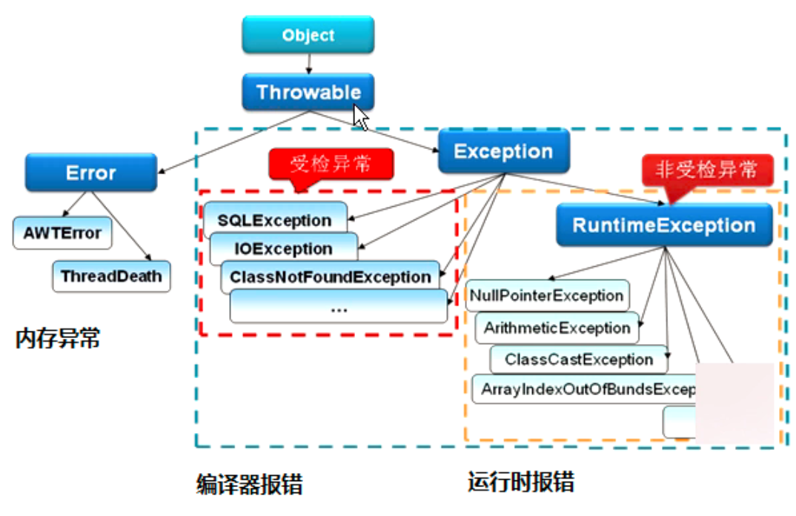

# Java异常分类及处理

[TOC]

## 异常分类

### Throwable

是 Java 语言中所有错误或异常的超类。下一层分为 Error 和 Exception。

#### Error（内存异常）

是J ava 运行时系统的内部错误和资源耗尽错误。

应用程序不会抛出该类对象。如果出现此类的错误，除了告知用户，剩下的就是尽力使程序安全的终止。

#### Exception

下一层分为：运行时异常 RuntimeException 和检查异常 CheckedException。

##### RuntimeException 运行时异常（运行时报错，不受检查）

 是那些可能在 Java 虚拟机正常运行期间抛出的异常的超类。 如果出现 RuntimeException，那么一定是程序员的错误。 如 : NullPointerException 、 ClassCastException ; 

##### CheckedException 检查异常（编译器报错，受检查）

一般是外部错误，这种异常都发生在编译阶段，Java 编译器会强制程序去捕获此类异常，即会出现要求你把这段可能出现异常的程序进行 try catch，该类异常一般包括几个方面:

- 试图在文件尾部读取数据；

- 试图打开一个错误格式的 URL；

- 试图根据给定的字符串查找 class 对象，而这个字符串表示的类并不存在；

## 异常的处理方式

遇到问题不进行具体处理，而是继续抛给调用者 ，抛出异常有三种形式：一是 throw，一是 throws，还有一种系统自动抛异常。捕获异常使用try catch。

### throw 与 throws 的区别

位置不同：

- throw用在函数上，后面跟的是异常类，可以跟多个；而throw用在函数内，后面跟的是异常对象。

功能不同:

- throws 用来声明异常，让调用者知道函数可能出现的问题，可以给出预先的处理方式；throw 抛出具体的问题对象，执行到 throw 功能就已经结束了，跳转到调用者，并将具体的问题对象抛给调用者。

  也就是说 throw 语句独立存在时，后面不能定义其他语句因为执行不到。

- throws 表示出现异常的一种可能性，并不一定会发生这些异常；throw 则是抛出了异常，执行 throw 则一定抛出了某种异常对象。

- 两者都是消极处理异常的方式，只是抛出或者可能抛出异常，但是不会由函数去处理异常，真正的处理异常由函数的上层调用处理。

