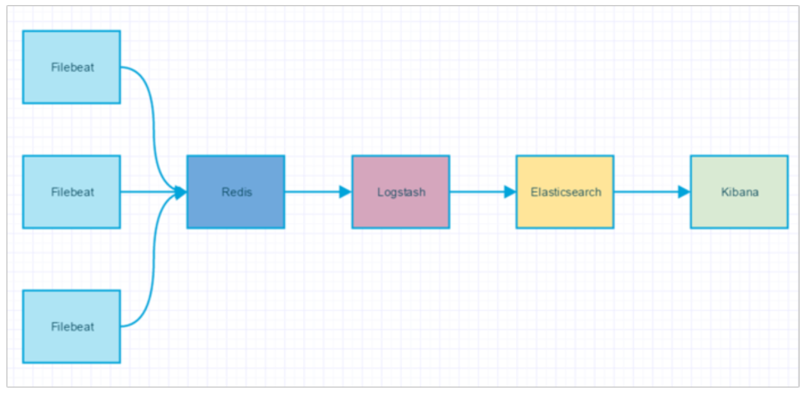

# Java 程序的日志

[TOC]

## Slf4j - Java日志输出统一接口

slf4j （ Simple Loging Facade For Java），它仅仅是一个为 Java 程序提供日志输出的统一接口，并非一个具体的日志实现方案。比如： JDBC仅为标准规则，pgjdbc才是具体实现。

所以单独的 slf4j 是不能工作的，必须搭配其具体的日志实现方案使用，比如： apache 的 org.apache.log4j.Logger，JDK 自带的 java.util.logging.Logger 等。

## Log4j 

Log4j 是 Apache 的一个开源项目，通过使用 Log4j，我们可以控制日志信息输送的目的地是控制台、 文件、GUI 组件，甚至是套接口服务器、NT 的事件记录器、UNIX Syslog 守护进程等;我们也可以控制每一条日志的输出格式；通过定义每一条日志信息的级别，我们能够更加细致地控制日志的生成过程。Log4j 由三个重要的组成构成：日志记录器(Loggers)，输出端(Appenders)、日志格式化器(Layout)。

- Logger：控制要启用或禁用哪些日志记录语句，并对日志信息进行级别限制 

- Appenders：指定了日志将打印到控制台还是文件中
- Layout：控制日志信息的显示格式

Log4j 中将要输出的 Log 信息定义了 5 种级别，依次为：DEBUG、INFO、WARN、ERROR 和 FATAL， 通过设置级别可以控制日志的打印（设为DEBUG打印所有日志），而不需要更改代码。

## LogBack

Logback 是一个 Java 领域的日志框架。它被认为是 Log4J 的继承人。

**Logback 的三个组成模块：**

- logback-core：是其它模块的基础设施，其它模块基于它构建，显然，logback-core 提供了一些关键的 通用机制。
- logback-classic：的地位和作用等同于 Log4J，它也被认为是 Log4J 的一个改进版，并且它实现了简单日志门面 SLF4J;
- logback-access：主要作为一个与 Servlet 容器交互的模块，比如说 tomcat 或者 jetty，提供一些与 HTTP 访问相关的功能。

**Logback 的优点：**

- 同样的代码路径，Logback 执行更快

- 更充分的测试
- 原生实现了 SLF4J API(Log4J 还需要有一个中间转换层)
- 内容更丰富的文档
- 支持 XML 或者 Groovy 方式配置
- 配置文件自动热加载

- 从 IO 错误中优雅恢复
- 自动删除日志归档
- 自动压缩日志成为归档文件
- 支持 Prudent 模式，使多个 JVM 进程能记录同一个日志文件
- 支持配置文件中加入条件判断来适应不同的环境
- 更强大的过滤器
- 支持 SiftingAppender(可筛选 Appender)
- 异常栈信息带有包信息

## ELK（Elasticsearch、Logstash、Kibana）

ELK 是软件集合 Elasticsearch、Logstash、Kibana 的简称，由这三个软件及其相关的组件可以打 造大规模日志实时处理系统。

- Elasticsearch **是一个基于 Lucene 的、支持全文索引的分布式存储和索引引擎**，主要负责将日志索引并存储起来，方便业务方检索查询。
- Logstash **是一个日志收集、过滤、转发的中间件**，主要负责将各条业务线的各类日志统一收 集、过滤后，转发给 Elasticsearch 进行下一步处理。
- Kibana **是一个可视化工具，主要负责查询 Elasticsearch 的数据并以可视化的方式展现给业务方**，比如各类饼图、直方图、区域图等。

