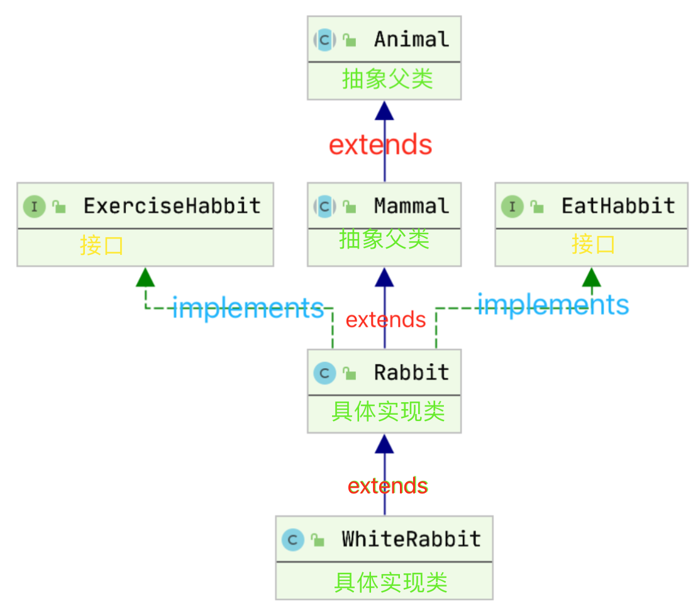

# Java面向对象编程(OOP)基础

[TOC]

## 0 类(抽象类/具体类)、对象/实例、接口

### 所有类的父类(超级父类)-Object：

- public final native Class<?> getClass();

  对象的运行时类

- public String **toString**() {  return getClass().getName() + "@" + Integer.toHexString(hashCode());  //对象哈希码的无符号十六进制表示}

  对象的字符串描述

- public native int **hashCode**()

  返回对象的哈希码值，支持此方法是为了使哈希表（例如HashMap的提供的哈希表）受益；对哈希码的规定如下：

  - 在1个Java应用程序的1次操作中多次调用同1个对象时：必须始终返回相同的整数，前提是在对象equals比较中使用的信息，没有被修改；此整数不必在统一应用程序的两次执行中保持一致。

  - 如果两个对象通过equals比较相同，那么他们的hashCode也必须相同；
  - 如果两个对象通过equals比较不同，那么并不强制他们的hashCode必须不同；但是程序员应该知道：提供不同的哈希值，可以提升哈希表的性能。

  

- public boolean **equals**(Object obj)  { return (this == obj); }

  对于非空引用(null)对象x，y；

  - x.equals(x)   ==  true；
  - 对于 x.equals(y)  == true ，有且仅有 y.equals(x) == true
  - 如果 x.equals(y) == true 且 y.equals(z) ，可以得出 x.equals(z)
  - x.equals(null) == false

  类 Object 的 equals 方法在对象上实现了最有区别的对等关系。也就是说，对于任何非空引用值x和y，当且仅当x和y引用同一对象时(即(x==y)==true)，此方法才返回 x.equals(y)==true；。

  请注意，通常每当重写此方法时，都必须重写{@code hashCode}方法，以维护{@code hashCode}方法的常规协定，该协定规定相等的对象必须具有相等的哈希码。

```java
public class Person {
    private Integer id;
    private String name;
    public Person(Integer id, String name){
        this.id = id;
        this.name = name;
    }
    public void setId(Integer id){
        this.id = id;
    }
}

public class TestObject {
    public static void main(String[] args) {
        Person p1 = new Person(1, "lily");
        printAll(p1);
      
        Person p2 = p1; //对象传递
        p2.setId(2); // 对象的属性修改后，hashCode也变化
        printAll(p1);
        printAll(p2);
        System.out.println(p1.equals(p2) + "|" + (p1==p2));

        Person p3 = new Person(2, "lily");
        System.out.println(p1.equals(p3) + "|" + (p1==p3));  //Objects的equal和==比较的对象存储地址
    }

    public static void printAll(Object obj){
        System.out.print("class=" + obj.getClass().getName());
        System.out.print(",toString=" + obj.toString());
        System.out.print(",hashCode=" + obj.hashCode());
        System.out.println();
    }

}
输出结果：
class=com.lyy.oop.Person,toString=Person(id=1, name=lily),hashCode=3325401
class=com.lyy.oop.Person,toString=Person(id=2, name=lily),hashCode=3325401
class=com.lyy.oop.Person,toString=Person(id=2, name=lily),hashCode=3325401 
true|true
false|false


```


```java
public class Object {
    private static native void registerNatives();
    static {
        registerNatives();
    }
    /**
     * Constructs a new object.
     */
    @HotSpotIntrinsicCandidate
    public Object() {}
    
    @HotSpotIntrinsicCandidate
    public final native Class<?> getClass();
    
    @HotSpotIntrinsicCandidate
    public native int hashCode();
    public boolean equals(Object obj) {
        return (this == obj);
    }
    
    HotSpotIntrinsicCandidate
    protected native Object clone() throws CloneNotSupportedException;
    
    public String toString() {
        return getClass().getName() + "@" + Integer.toHexString(hashCode());
    }

		@HotSpotIntrinsicCandidate
    public final native void notify();
    @HotSpotIntrinsicCandidate
    public final native void notifyAll();
    
    public final void wait() throws InterruptedException {
        wait(0L);
    }
    public final native void wait(long timeoutMillis) throws InterruptedException;
		public final void wait(long timeoutMillis, int nanos) throws InterruptedException {
        if (timeoutMillis < 0) {
            throw new IllegalArgumentException("timeoutMillis value is negative");
        }
        if (nanos < 0 || nanos > 999999) {
            throw new IllegalArgumentException(
                                "nanosecond timeout value out of range");
        }
        if (nanos > 0 && timeoutMillis < Long.MAX_VALUE) {
            timeoutMillis++;
        }

        wait(timeoutMillis);
    }
    
    @Deprecated(since="9")
    protected void finalize() throws Throwable { }
}
```


- 类：电路的设计蓝图；

  - 抽象类(abstract class Animal，只被子类extends)：

    可以有抽象方法(方法需要显式声明 abstract )，也可以有具体方法；

  - 具体类(class Rabbit，只被子类extends)：

    不能有抽象方法

- 接口(interface EatHabbit，只被子类implements)：电路的遥控器的设计蓝图；

  接口中只支持抽象方法(不需要显式声明abstract);

- 对象/实例)：依据蓝图生成的电路实际主体；

  类进行实例化(即new)得到实际的具体对象(rabbit = new Rabbit("rabbit")；

  

```java
/** 动物抽象父类 **/
public abstract class Animal {
    private String name;
    public Animal(String name){
        this.name = name;
    }
    abstract String hair(); //抽象方法，必须显式地注明 abstract
    public String introduce(){
        return "I am " + name;
    }
}
/** 哺乳动物接口父类 **/
public abstract class Mammal extends Animal{
    public Mammal(String name) {
        super(name);
    }

    abstract String isEatMeat();
    public String isHeatStable(){
        return ",isHeatStable=true";
    }
}
/** 饮食习惯接口 **/
public interface EatHabbit {
    String eat(); // 抽象方法，可以不显式地注明 abstract
    default String eatStep(){
        return ",find and eat";
    }
}
/** 兔子实现类 **/
public class Rabbit extends Mammal implements EatHabbit, ExerciseHabbit {
    public Rabbit(String name) {
        super(name);
    }
    @Override
    String hair() {
        return ",short hair";
    }
    @Override
    String isEatMeat() {
        return ",isEatMeat=false";
    }
    @Override
    public String eat() {
        return ",eat grass";
    }
    @Override
    public String run() {
        return ",run fast";
    }
}
/**白兔子实现类**/
public class WhiteRabbit extends Rabbit {
    public WhiteRabbit(String name) {
        super(name);
    }
    @Override
    public String hair(){
        return ",white short hair";
    }
}

```


```java
public class TestOOP {
    public static void main(String[] args) {
        // 数据类型的缩小/向上转换，是自动的：
        Animal animal = new Rabbit("animal"); // Rabbit 转为 Animal
        System.out.print(animal.introduce());
        System.out.print(animal.hair());
        // 其他Rabbit的属性，Animal的实例对象无法访问
        System.out.println();

        // 数据类型的扩大转换/向下转换，是被动的，需要显式的强制类型转换：
        Rabbit rabbitFromAnimal = (Rabbit)animal; // Animal 转 Rabbit
        printAll(rabbitFromAnimal);
        System.out.println("animalHashCode=" + animal.hashCode()
                        + ",rabbitFromAnimalHashCode=" + rabbitFromAnimal.hashCode()
                        + ",equals=" + animal.equals(rabbitFromAnimal));

        Rabbit rabbit = new Rabbit("rabbit");
        printAll(rabbit);

        WhiteRabbit whiteRabbit = new WhiteRabbit("white rabbit");
        printAll(whiteRabbit);
    }
    public static void printAll(Rabbit rabbit){
        System.out.print(rabbit.introduce());
        System.out.print(rabbit.hair());
        System.out.print(rabbit.isEatMeat());
        System.out.print(rabbit.isHeatStable());
        System.out.print(rabbit.eat());
        System.out.print(rabbit.eatStep());
        System.out.print(rabbit.run());
        System.out.print(", toString=" + rabbit.toString());
        System.out.print(", hashCode=" + rabbit.hashCode());
        System.out.println();
    }
}

//输出结果：
I am animal,short hair
I am animal,short hair,isEatMeat=false,isHeatStable=true,eat grass,find and eat,run fast, toString=com.lyy.oop.Rabbit@3b764bce, hashCode=997608398
animalHashCode=997608398,rabbitFromAnimalHashCode=997608398,equals=true
I am rabbit,short hair,isEatMeat=false,isHeatStable=true,eat grass,find and eat,run fast, toString=com.lyy.oop.Rabbit@759ebb3d, hashCode=1973336893
I am white rabbit,white short hair,isEatMeat=false,isHeatStable=true,eat grass,find and eat,run fast, toString=com.lyy.oop.WhiteRabbit@45fe3ee3, hashCode=1174290147

```


## 1 面向对象编程的三大特征：封装( 类)、继承、多态

### 封装(Encapsulation)

在面向对象程式设计方法中，封装是一种将抽象性函式接口的实现细节部分包装、隐藏起来的方法（private 或者 final修饰的任何外部类均不可修改）。

封装可以被认为是一个保护屏障，防止该类的代码和数据被外部类定义的代码随机访问。

把客观的事物封装成抽象的类，用封装来实现高内聚、低耦合。

   - 内聚：是指一个模块内部各个部分之间的关联程度;
   - 耦合：指各个模块之间的关联程度;


### 继承(extends)

**继承是Java面向对象编程技术的一块基石**，因为它允许创建分等级层次的类。

继承就是子类继承父类的特征和行为，使得子类对象(实例）具有父类的实例域和方法，或子类从父类继承方法，使得子类具有父类相同的行为。

**类的继承格式：**

在 Java 中通过 extends 关键字可以申明一个类是从另外一个类继承而来的，一般形式如下：

```java
class 父类 { }  
class 子类 extends 父类 { }
```

#### Java的单继承多实现：

#### 仅支持继承1个父类，不支持多继承，但支持多重继承：这是为了避免方法调用的歧义性/二义性；

假设类 B 和类 C 继承自类 A，且都重写了类 A 中的同一个方法do()，而类 D 同时继承了类 B 和类 C，那么此时类 D 会继承 B、C 的方法do，那类 D 继承的是哪个类中的方法do()呢，是类B还是类C？这里就会产生歧义。

#### 支持实现多个接口：这是因为接口中都是抽象方法(没有方法体)，不会产生方法调用的歧义，还能起到拓展子类功能的作用。


### 多态(polymorphism)

多态是同一个行为，具有多个不同表现形式或形态的能力。

多态就是同一个接口，使用不同的实例而执行不同操作。

**多态的实现方式：**

- 重写(@override)：将父类方法的行为重写；
- 接口(interface)：被具体类继承，对接口中的抽象方法实现不同行为；
- 抽象类和抽象方法：被具体类实现，从而对抽象方法实现不同的行为；

**多态存在的三个必要条件**：

- 继承(extends)
- 重写(@override)
- 父类引用指向子类的对象

```java
//继承
class Cat extends Animal {  
    //重写
    @Override
    public void eat() {  
        System.out.println("吃鱼");  
    }  
    @Override
    public void work() {  
        System.out.println("抓老鼠");  
    }  
}

public class Test {
    public static void main(String[] args) {            
      //父类指向子类
      Animal a = new Cat();  // 类型向上/缩小转换
      show(a);
    }  
    public static void show(Animal a)  {
        a.eat(); //具体动物类重写了该方法
        a.work(); 
    } 
」
```


## 2 抽象类与抽象方法(abstract)

在面向对象的概念中，所有的对象都是通过类来描绘的，但是反过来，并不是所有的类都是用来描绘对象的；**如果一个类中没有包含足够的信息来描绘一个具体的对象，这样的类就是抽象类。**

**抽象类不能实例化对象之外，除此之外，类的其它功能依然存在，成员变量、成员方法和构造方法的访问方式和普通类一样。**

由于抽象类不能实例化对象，所以抽象类必须被继承，才能被使用。也是因为这个原因，通常在设计阶段决定要不要设计抽象类。

在 Java 中，抽象类表示的是一种继承关系，**一个类只能继承一个抽象类，而一个类却可以实现多个接口**。

### 抽象方法

如果你想设计这样一个类，该类包含一个特别的成员方法，该方法的具体实现由它的子类确定，那么你可以在父类中声明该方法为抽象方法。

Abstract 关键字同样可以用来声明抽象方法，抽象方法只包含一个方法名，而没有方法体。

**声明抽象方法会造成以下两个结果**：

- 如果一个类包含抽象方法，那么该类必须是抽象类。
- 任何子类必须重写父类的抽象方法，或者声明自身为抽象类。


## 3 接口(interface）：接口不是类，不具有类的功能

接口（Interface），在JAVA编程语言中是一个抽象类型**，是抽象方法的集合**，接口通常以interface来声明。一个类通过继承接口的方式，从而来继承接口的抽象方法。

接口并不是类，编写接口的方式和类很相似，但是它们属于不同的概念。类描述对象的属性和方法。接口则包含类要实现的方法。

除非实现接口的类是抽象类，否则该类要实现接口中的所有方法。

接口无法被实例化，但是可以被实现。一个实现接口的类，必须实现接口内所描述的所有方法，否则就必须声明为抽象类。另外，在 Java 中，接口类型可用来声明一个变量，他们可以成为一个空指针，或是被绑定在一个以此接口实现的对象。

```
//接口的声明语法格式如下：
[可见度] interface 接口名称 [extends 其他的接口名] {        
		// 声明变量        
		// 抽象(abstract)方法 
}

//接口的实现语法各式如下：
...implements 接口名称[, 其他接口名称, 其他接口名称..., ...] ...
```

**接口与类相似点：**

- 一个接口可以有多个方法。
- 接口文件保存在 .java 结尾的文件中，文件名使用接口名。
- 接口的字节码文件保存在 .class 结尾的文件中。
- 接口相应的字节码文件必须在与包名称相匹配的目录结构中。

**接口与类的区别：**

- 接口不能用于实例化对象。
- 接口没有构造方法。
- 接口中所有的方法必须是抽象方法。
- 接口不能包含成员变量，除了 static 和 final 变量。
- 接口不是被类继承了，而是要被类实现。
- 接口支持多继承。

### 标记接口

定义：标记接口是没有任何方法和属性的接口；它仅仅表明它的类属于一个特定的类型，供其他代码来测试允许做一些事情。

作用：简单形象的说就是给某个对象打个标（盖个戳），使对象拥有某个或某些特权。例如：java.uitl 包中的 RandomAccess 接口，主要用于标记集合是支持快速随机访问的。

标记接口主要用于以下两种目的：

- 建立一个公共的父接口：

  正如EventListener接口，这是由几十个其他接口扩展的Java API，你可以使用一个标记接口来建立一组接口的父接口。例如：当一个接口继承了EventListener接口，Java虚拟机(JVM)就知道该接口将要被用于一个事件的代理方案。

- 向一个类添加数据类型：

  这种情况是标记接口最初的目的，实现标记接口的类不需要定义任何接口方法(因为标记接口根本就没有方法)，但是该类通过多态性变成一个接口类型。

### 抽象类和接口的区别

- 抽象类中的方法可以有方法体，就是能实现方法的具体功能；但是接口中的方法只能是抽象方法。

- 抽象类中的成员变量可以是各种类型的，而接口中的成员变量只能是 **public static final** 类型的。

- 接口中不能含有静态代码块以及静态方法(用 static 修饰的方法)，而抽象类是可以有静态代码块和静态方法。

  > **注**：JDK 1.8 以后，接口里可以有静态方法和方法体了。

- 一个类只能继承一个抽象类，而一个类却可以实现多个接口。

  

## 4 Java包(package)

为了更好地组织类，Java 提供了包机制，用于区别类名的命名空间。

**包的作用**

- 1 把功能相似或相关的类或接口组织在同一个包中，方便类的查找和使用。
- 2 如同文件夹一样，包也采用了树形目录的存储方式。同一个包中的类名字是不同的，不同的包中的类的名字是可以相同的，当同时调用两个不同包中相同类名的类时，应该加上包名加以区别。因此，包可以避免名字冲突。
- 3 包也限定了访问权限，拥有包访问权限的类才能访问某个包中的类。

Java 使用包（package）这种机制是为了防止命名冲突，访问控制，提供搜索和定位类（class）、接口、枚举（enumerations）和注释（annotation）等。

**包语句的语法格式为：**

```
package pkg1[．pkg2[．pkg3…]];
```


## 5 方法的重写(override)、重载(overload) 

### 方法(非构造函数)的重写(override)

重写是子类对父类的允许访问的方法的实现过程进行重新编写, 返回值和形参都不能改变。**即外壳不变，核心重写。**

重写的好处在于子类可以根据需要，定义特定于自己的行为。 即子类能够根据需要实现父类的方法。

#### 方法的重写规则

- 参数列表必须完全与被重写方法的相同。
- 返回类型与被重写方法的返回类型可以不相同，但是必须是父类返回值的派生类（java5 及更早版本返回类型要一样，java7 及更高版本可以不同）。
- 访问权限不能比父类中被重写的方法的访问权限更低。例如：如果父类的一个方法被声明为 public，那么在子类中重写该方法就不能声明为 protected。
- 父类的成员方法只能被它的子类重写。
- 声明为 final 的方法不能被重写。
- 声明为 static 的方法不能被重写，但是能够被再次声明。
- 子类和父类在同一个包中，那么子类可以重写父类所有方法，除了声明为 private 和 final 的方法。
- 子类和父类不在同一个包中，那么子类只能够重写父类的声明为 public 和 protected 的非 final 方法。
- 重写的方法能够抛出任何非强制异常，无论被重写的方法是否抛出异常。但是，重写方法不能抛出新的检查异常，或者比被重写方法申明更加宽泛的异常。例如： 父类的一个方法申明了一个检查异常 IOException，但是在重写这个方法的时候不能抛出 Exception 异常，因为 Exception 是 IOException 的父类，只能抛出 IOException 的子类异常
- 构造方法不能被重写。
- 如果不能继承一个方法，则不能重写这个方法。


### 方法(常为构造函数)的重载(overload) 

重载(overloading) 是在一个类里面，方法名字相同，而参数不同，返回类型可以相同也可以不同。

每个重载的方法（或者构造函数）都必须有一个独一无二的参数类型列表。

最常用的地方就是构造器的重载。

#### 方法/构造函数的重载规则

- 被重载的方法必须改变参数列表(参数个数或类型不一样)；

- 被重载的方法可以改变返回类型；

- 被重载的方法可以改变访问修饰符；

- 被重载的方法可以声明新的或更广的检查异常；

- 方法能够在同一个类中或者在一个子类中被重载。

- 无法以返回值类型作为重载函数的区分标准。

  


## 6 类修饰关键字及访问控制：private、(缺省)、procted、public 


## 7 final 关键字

final 关键字声明类可以把类定义为不能继承的，即最终类；或者用于修饰方法，该方法不能被子类重写。

- 声明类：

  ```
  final class 类名 {//类体}
  ```

- 声明方法：

  ```
  修饰符(public/private/default/protected) final 返回值类型 方法名(){//方法体}
  ```


## 8 super 与 this 关键字

- super关键字：我们可以通过super关键字来实现对父类成员的访问，用来引用当前对象的父类。

  使用：当需要在子类中调用父类的被重写方法时，要使用 super 关键字，如：

  ```java
  class Dog extends Animal{
     public void move(){
        super.move(); // 应用super类的方法
        System.out.println("狗可以跑和走");
     }
  }
  ```


- this关键字：指向自己的引用。

  使用：常用于（构造）方法中，区别类的引用(this.x)与方法参数列表中的引用(x)。

  ```java
  public class Person {
   	private String name;
  	public Person(String name){
  		this.name = name;
    }
  }
  ```

  


## 9 Java 基础数据类型、引用数据类型

