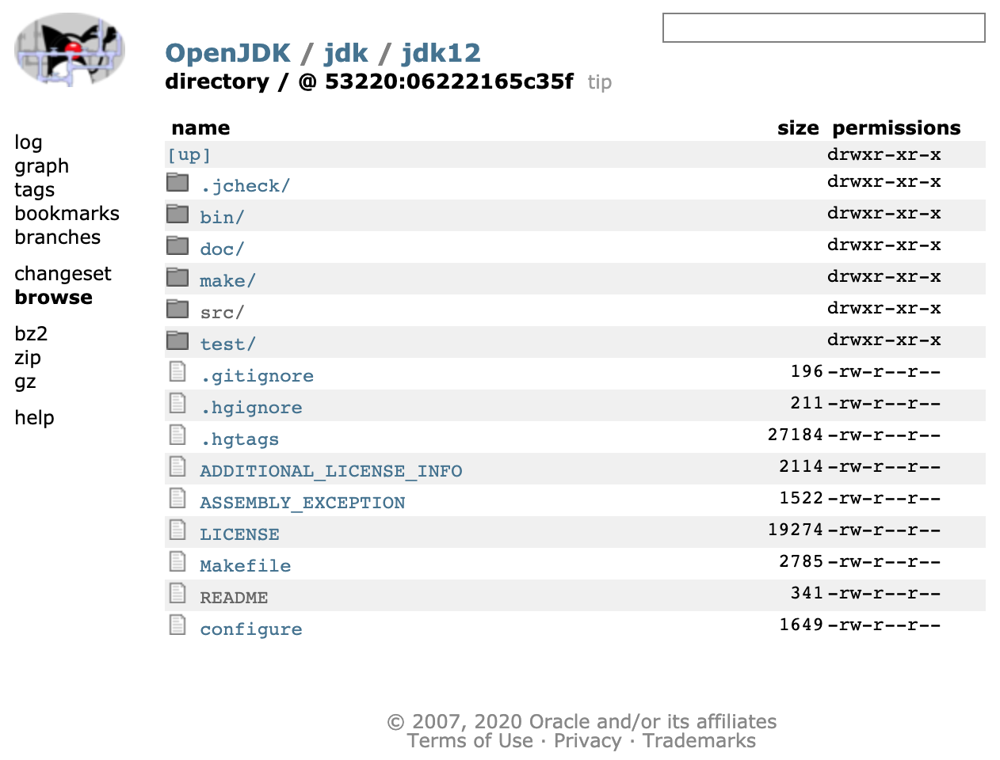

## Java技术体系架构

**参考：**

- [Java Platform Standard Edition 8 Documentation](https://docs.oracle.com/javase/8/docs/)

- 《深入理解Java虚拟机（第三版）周志明》

[TOC]

### Java技术体系概念图

以上 Java 体系概念图是基于[Java Platform Standard Edition 8 Documentation](https://docs.oracle.com/javase/8/docs/) 的，并附有[每个概念的解释](https://docs.oracle.com/javase/8/docs/technotes/guides/desc_jdk_structure.html)。

### Java语言与JVM标准规范

[Java Language and Virtual Machine Specifications](https://docs.oracle.com/javase/specs/)

### Java技术体系分为4个平台

按照Java技术关注的重点业务领域来划分，Java技术体系分为4个平台：

- Java Card：支持一些java小程序（applet）运行在小内存设备（如智能卡）上的平台；

- Java ME(Micro Edition)：支持Java程序运行在移动终端（手记、PDA）上的平台；对Java API所有简化，并加入了针对移动终端的支持，这个版本以前成为J2ME。

- Java SE(Standard Edition)：支持面向桌面级的java平台，提供完成的Java核心API，这个版本以前称为J2SE。

- Java EE(Enterprise Edition)：支持使用多层架构的企业应用（如ERP、CRM应用）的java平台，除了提供Java SE API之外，还对其做了大量的扩充并提供了相关的部署支持，这个版本以前称为J2EE。

  

### Java SE & JDK、JRE

Oracle（收购了Sun）有两个实现了Java Platform Standard Edition (Java SE) 8的产品：Java SE Development Kit (JDK) 8 和 Java SE Runtime Environment (JRE) 8。

JDK 8 是 JRE 8 的超集，并且包含JRE 8中的一切，以及开发小程序（applets）和应用程序（applications）所需的工具，例如编译器（compilers）和调试器（debuggers）。 JRE 8 提供了库、Java虚拟机（JVM）和其他组件，用于运行用Java编程语言编写的小程序和应用程序。请注意，JRE包含Java SE规范要求之外的组件，包括标准和非标准Java组件。

- Java SE -- 规范/标准；

- JDK、JRE -- 实现/产品；JDK是JRE的超集（JRE是JDK的子集）。

### JVM 、Sun HotSpot VM、OpenJDK

JVM，是一种能够运行java字节码的虚拟机。不仅支持Java编程语言，还支持很多其他语言（符合其编译文件格式要求的），如kotlin、scala。

JVM是一个标准，JVM的实现产品有许多个，有HotSpot VM、JRockit、J9等。但HotSpot是 Sun 公司开发的，JDK和OpenJDK都是用的HotSpot虚拟机。

- JVM - 规范/标准 

- HotSpot - 产品/实现

  HotSpot 是 Sun/Oracle 公司开发的，所以在Java世界广泛使用。 

- OpenJDK - 项目 -- 代码（c++）

  Openjdk 使用了 HotSpot VM，项目源码中含有HotSpot的开源部分。

  http://openjdk.java.net/groups/hotspot/docs/HotSpotGlossary.html

### Sun/Oracle JDK & OpenJDK

### OpenJDK 源码

Oracle JDK 是闭源的，OpenJDK是开源的。我们可以查看OpenJDK的源码，也可以查看其中的Hotspot（c/c++）的开源部分。

- OpenJDK 总览：https://hg.openjdk.java.net/jdk/

- OpenJDK12 源码：https://hg.openjdk.java.net/jdk/jdk12/file/06222165c35f

### Java 程序开发 IDE 

- Sun Netbeans IDE 
- IBM Eclipse IDE（性能更好）
- XCode + Command Line Tools for XCode （仅macos）

### Java技术发展的时间线

### 附：Java知识点学习小技巧

1 查阅读、相关Javadoc/书/博客 ;

2 确认使用的什么虚拟机； 

3 手动编码/通过监控参数来证明。

