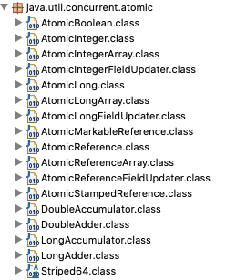

## 多线程篇

#### synchronized关键字

synchronized关键字解决多个线程之间访问资源的同步性，可以保证被它修饰的 **方法或代码块** 在任意时刻只能有一个线程执行。

##### 使用方式：

用于实例方法：作用于当前对象实例加锁，进入同步代码前要获得当前对象实例的锁；

用于静态方法：作用于当前类对象加锁，进入同步代码前要获得当前类对象的锁；

用于代码块：作用于给定对象加锁，进入同步代码库前要获得给定对象的锁。


#### Volatile关键字

volatile 关键字的主要作用就是保证 **变量** 的可见性，然后还有一个作用是防止指令重排序。将变量声明为 volatile，这就指示 JVM这个变量是不稳定的，每次使用它都到主存中进行读取。


- volatile关键字是线程同步的**轻量级实现**，所以volatile性能肯定比synchronized关键字要好。（synchronized关键字在 JavaSE1.6 之后为了减少获得锁和释放锁带来的性能消耗，而引入的偏向锁和轻量级锁及其它各种优化之后，执行效率有了显著提升；实际开发中使用 synchronized 关键字的场景还是更多一些。 ）

- volatile关键字主要解决变量在多个线程之间的可见性，而synchronized关键字解决的是多个线程之间访问资源的同步性。

  volatile关键字只能用于变量，而synchronized关键字可以修饰方法和代码块。

- 多线程访问volatile关键字不会发生阻塞，而synchronized关键字可能会发生阻塞。
- volatile关键字能保证数据的可见性，但不能保证数据的原子性。synchronized关键字两者都能保证。


#### Runnable和Callable


#### Atomic原子类

这里的Atomic是指一个操作是不可中断的。即使在多个线程一起执行时，一个操作一旦开始就不会被其他线程干扰。所以，所谓原子类说简单点就是具有原子操作特征的类。
原子类都存放在 java.util.concurrent.atomic 下，如下图所示。



JUC包中的原子类：

```
基本类型：使用原子的方式更新基本类型
AtomicInteger:整形原子类 
AtomicLong:长整型原子类
AtomicBoolean :布尔型原子类

数组类型：使用原子的方式更新数组里的某个元素
AtomicIntegerArray:整形数组原子类 
AtomicLongArray:长整形数组原子类 
AtomicReferenceArray :引用类型数组原子类

引用类型
AtomicReference:引用类型原子类 
AtomicStampedRerence:原子更新引用类型里的字段原子类 
AtomicMarkableReference :原子更新带有标记位的引用类型

对象的属性修改类型 
AtomicIntegerFieldUpdater:原子更新整形字段的更新器
AtomicLongFieldUpdater:原子更新长整形字段的更新器
AtomicStampedReference :原子更新带有版本号的引用类型。该类将整数值与引用关联起来，可用于解决原 子的更新数据和数据的版本号，可以解决使用 CAS 进行原子更新时可能出现的 ABA 问题。
```


#### 线程池

《阿里巴巴Java开发手册》中强制线程池不允许使用 Executors去创建，而是通过 ThreadPoolExecutor 的方式，这样更加明确线程池的运行规则，规避资源耗尽的风险。

> Executors 返回线程池对象的弊端如下:
>
> - FixedThreadPool 和 SingleThreadExecutor : 允许请求的队列长度为 Integer.MAX_VALUE,可能堆积 大量的请求，从而导致OOM。
> -  CachedThreadPool 和 ScheduledThreadPool : 允许创建的线程数量为 Integer.MAX_VALUE ，可能 会创建大量线程，从而导致OOM。


##### 创建线程池

通过ThreadPoolExecutor构造方法实现：


通过Executor的工具类Executors来实现(下图绿框中的方法内部是ThreadPoolExecutor实现的):

