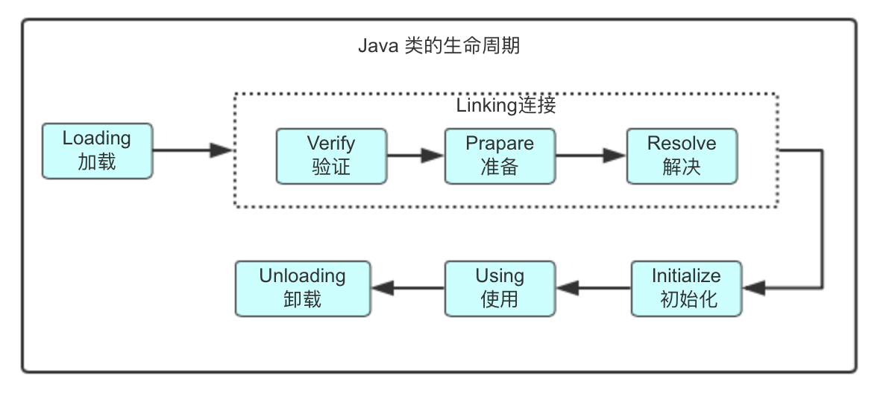
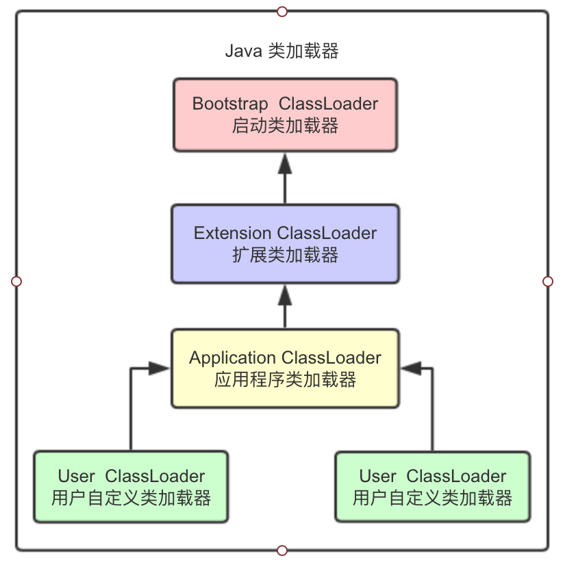
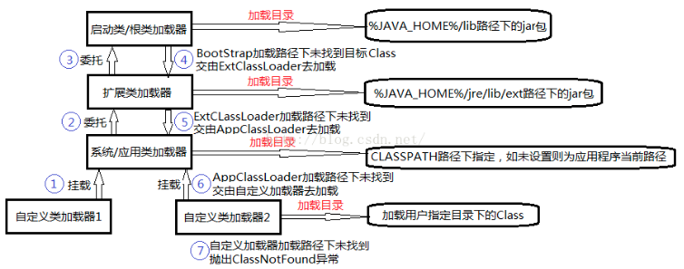

# 类加载机制

[TOC]

### 类的生命周期



**加载 > 连接 [验证 > 准备 > 解析] > 初始化 > 使用 >  卸载**

- 加载load： 将类的class文件从磁盘读到内存中，在内存中生成一个代表该类的 java.lang.Class 对 象，作为方法区这个类的各种数据的入口；

  > 注意：加载即可以从一个class文件获取，也可以从 ZIP 包中读取(比如从 jar 包和 war 包中读取)，也可以在运行时计算生成(动态代理)， 也可以由其它文件生成(比如将 JSP 文件转换成对应的class类)。

- 连接link：

  - 验证verify：验证class文件的字节流中包含的信息是否符合当前虚拟机的要求；

  - 准备prapare：为类的静态变量分配内存空间，并赋予默认值（此处是虚拟机中的默认初始值），即：在方法区分配这些变量所使用的内存空间。

  - 解析resolving：类装载器装入类所引用的其他所有类，即：虚拟机将常量池中的符号引用替换为直接引用的过程

    >- 符号引用：符号引用与虚拟机实现的布局无关，引用的目标并不一定要已经加载到内存中。各种虚拟 机实现的内存布局可以各不相同，但是它们能接受的符号引用必须是一致的，因为符号引 用的字面量形式明确定义在 Java 虚拟机规范的 Class 文件格式中
    >- 直接引用：直接引用可以是指向目标的指针，相对偏移量或是一个能间接定位到目标的句柄。如果有了直接引用，那引用的目标必定已经在内存中存在。

- 初始化initialize：为类的静态变量赋予正确的初始值（此处是程序员为变量分配的真正的初始值），执行静态代码块；

  > 初始化阶段是类加载最后一个阶段，前面的类加载阶段之后，除了在加载阶段可以自定义类加载器以外，其它操作都由 JVM 主导。到了初始阶段，才开始真正执行类中定义的 Java 程序代码。
  >
  > 初始化阶段是执行类构造器<client>方法的过程。<client>方法是由编译器自动收集类中的类变量的赋值操作和静态语句块中的语句合并而成的。虚拟机会保证子<client>方法执行之前，父类 的<client>方法已经执行完毕，如果一个类中没有对静态变量赋值也没有静态语句块，那么编译 器可以不为这个类生成<client>()方法。
  >
  > 注意以下几种情况不会执行类初始化:
  >
  > 1. 通过子类引用父类的静态字段，只会触发父类的初始化，而不会触发子类的初始化。
  > 2. 定义对象数组，不会触发该类的初始化。
  > 3. 常量在编译期间会存入调用类的常量池中，本质上并没有直接引用定义常量的类，不会触
  > 发定义常量所在的类。
  > 4. 通过类名获取 Class 对象，不会触发类的初始化。
  > 5. 通过 Class.forName 加载指定类时，如果指定参数 initialize 为 false 时，也不会触发类初
  > 始化，其实这个参数是告诉虚拟机，是否要对类进行初始化。
  > 6. 通过 ClassLoader 默认的 loadClass 方法，也不会触发初始化动作。

- 使用use：使用

- 卸载unload：销毁

**例子**：

```
public static int v = 8080;
此情况，变量 v 在“准备”阶段过后的初始值为 0 而不是 8080，将 v 赋值为 8080 的 put static 指令是 程序被编译后，存放于类构造器<client>方法之中。

public static final int v = 8080;
此情况，在编译阶段会为 v 生成 ConstantValue 属性，在“准备”阶段虚拟机会根据 ConstantValue 属性将 v 赋值为 8080。
```


### 类加载器种类

#### 四种列加载器：

- **启动类加载器**（Bootstrap  ClassLoader  ）：c++编写的

负责加载核心类库， JAVA_HOME\lib目录下，如rt.jar, charsets.jar等;

具体可由启动类加载器加载到的路径可通过`System.getProperty(“sun.boot.class.path”)`查看。由于启动类加载器无法被Java程序直接引用，因此JVM默认直接使用 null 代表启动类加载器。

- **扩展类加载器**（Extension ClassLoader ）：sun.misc.Launcher$ExtClassLoader

负责加载jre扩展目录JAVA_HOME\lib\ext 中的jar类包；

扩展类加载器加载到的路径可通过`System.getProperty("java.ext.dirs")`查看

- **系统/应用程序类加载器**（Application ClassLoader）：sun.misc.Launcher$AppClassLoader

负责加载ClassPath路径下的类包；

系统类加载器加载到的路径可通过`System.getProperty("java.class.path")`查看

-  **用户自定义类加载器**（User  ClassLoader）

负责加载自定义路径下的类包；

通过继承extends java.lang.ClassLoader并重写findClass()方法可以实现自定义类加载器。

#### 类加载机制：双亲委派模型

JVM 通过双亲委派模型（逐层向上委派）进行类的加载：当类加载器有加载类的需求时，先委托父类装载器从其搜索路径中寻找目标类，只有在parent找不到的情况下，才由自己从自己的类路径中查找并装载目标类。

**双亲委派模型的好处：**

- Java类随着它的类加载器一起具备了一种**带有优先级的层次关系**，通过这种层级关可以**避免类的重复加载**，当父亲已经加载了该类时，就没有必要子ClassLoader再加载一次。
- 其次是出于安全考虑，java核心api中定义类型不会被随意替换，假设通过网络传递一个名为java.lang.Integer 的类，通过双亲委托模式传递到启动类加载器，而启动类加载器在核心Java API发现这个名字的类，发现该类已被加载，就不会重新加载网络传递的过来的java.lang.Integer，而直接返回已加载过的Integer.class，这样便可以**防止核心API库被随意篡改**。





**自定义类加载器：**

```java
public class FileSystemClassLoader extends ClassLoader {
	public static void main(String[] args) throws ClassNotFoundException, InstantiationException, IllegalAccessException {
		     //打印类加载器的树状图
		     ClassLoader loader = FileSystemClassLoader.class.getClassLoader();
		     while (loader != null) {
			     System.out.println(loader.toString());
			     loader = loader.getParent();
		     }
		
		    //创建类加载器
		    FileSystemClassLoader fcl = 
				   new FileSystemClassLoader("/Users/liuyuanyuan/eclipse-workspace/test/src");
		    //加载类，得到Class对象
        Class<?> clazz = fcl.loadClass("jvm.Spiderman");
		    //得到类的实例
        Spiderman animal= (Spiderman) clazz.newInstance();
        animal.say();
        System.out.println(animal.getClass().getClassLoader());
        System.out.println(animal.getClass().getClassLoader()
        		.getParent());
        System.out.println(animal.getClass().getClassLoader()
        		.getParent().getParent());
        System.out.println(animal.getClass().getClassLoader()
        		.getParent().getParent().getParent());
	}
	
	private String rootDir;
	public FileSystemClassLoader(String rootDir) {
		this.rootDir = rootDir;
	}

  @override
  protected Class<?> findClass(String name) throws ClassNotFoundException {
		byte[] classData = getClassData(name);
		if (classData == null) {
			throw new ClassNotFoundException();
		} else {
			return defineClass(name, classData, 0, classData.length);
		}
	}

	private byte[] getClassData(String className) {
		String path = classNameToPath(className);
		InputStream ins = null;
		ByteArrayOutputStream baos = null;
		try 
		{
			ins = new FileInputStream(path);
			baos = new ByteArrayOutputStream();
			int bufferSize = 4096;
			byte[] buffer = new byte[bufferSize];
			int bytesNumRead = 0;
			while ((bytesNumRead = ins.read(buffer)) != -1) {
				baos.write(buffer, 0, bytesNumRead);
			}
			return baos.toByteArray();
		} catch (IOException e) 
		{
			e.printStackTrace();
		} finally 
		{
			if (baos != null) {
				try {
					baos.close();
				} catch (IOException e) {
					e.printStackTrace();
				}
			}
			if (ins != null) {
				try {
					ins.close();
				} catch (IOException e) {
					e.printStackTrace();
				}
			}
		}
		return null;
	}

	private String classNameToPath(String className) {
		return rootDir + File.separatorChar + className.replace('.', File.separatorChar) + ".class";
	}
}

```

实战验证：

```java
//Java中用c/c++实现的类，其类加载器打印为null）
public class Test {
	public static void main(String[] args)throws Exception {
		Map map = new HashMap();
		System.out.println(Test.class.getClassLoader());
		System.out.println(ClassLoader.getSystemClassLoader());  
    System.out.println(ClassLoader.getSystemClassLoader().getParent());  
    System.out.println(ClassLoader.getSystemClassLoader().getParent().getParent());
    }
}
/* 
output:
jdk.internal.loader.ClassLoaders$AppClassLoader@10f87f48
sun.misc.Launcher$AppClassLoader@6d06d69c  
sun.misc.Launcher$ExtClassLoader@70dea4e  
null
*/
```


### 类加载机制

- 全盘负责委托机制

  最简单的，当前类中引用的类，依然使用当前类的加载器；

- 双亲委派机制

  当一个类收到了类加载请求，他不会先尝试自己去加载这个类，而是把这个请求委派给父

  类去完成，每一个层次的类加载器都是如此，因此所有的加载请求都应该传送启动类加载器中，

  只有当父类加载器反馈自己无法完成这个请求的时候(在它的加载路径下没有找到所需加载的

  Class)，子类加载器才会尝试自己去加载。

  优势：逐层委托直到顶层启动类加载器进行加载，这样避免类的重复加载，防止对系统类的篡改；比如加载位于 rt.jar 包中的类 java.lang.Object，不管是哪个加载器加载这个类，最终都是委托给顶层的启动类加载器进行加载，这样就保证了使用不同的类加载器最终得到的都是同样一个 Object 对象。





