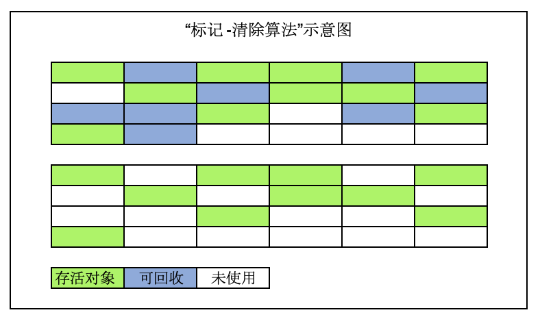
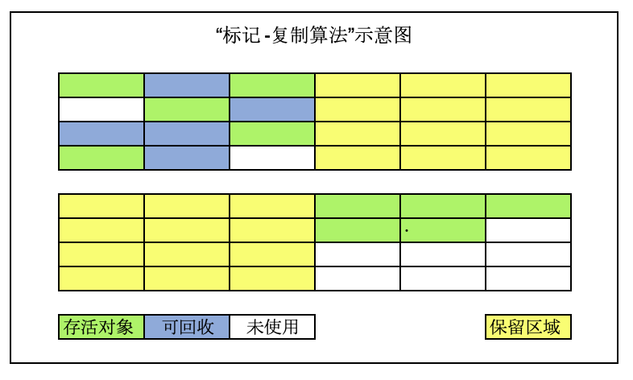
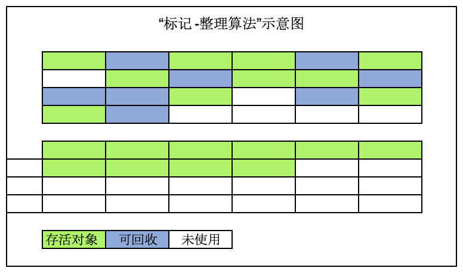

#  垃圾收集GC与内存分配

[TOC]

垃圾收集 （Garbage Collection， 简称GC)，历史比Java更悠久。早在1960年MIT诞生的Lisp是第一门开始使用内存动态分配和垃圾收集技术的语言。

垃圾收集要完成三件事：

-  哪些内存需要回收（或者说哪些内存是垃圾）？

- 什么时候回收？

- 如何回收？

  

## 判定对象消亡的算法

### 引用计数算法（reference counting）

**原理**：在对象中添加一个引用计数器，每当有一个地方引用它时，计数器值就+1；当引用失效时，计数器值就-1；任何时刻计数器为0的对象是不可能再被引用的。

**特点**：概算占用了少量的内存空间来计数，但原理简单，判定效率高；但是该算法不够完善，有很多例外的情况需要考虑，比如对象之间的相互循环引用的问题。

### 可达性分析算法（Reachability Analysis）

当前主流的商用程序语言（java、c#以及上溯古老的Lisp）的内存管理都是通过可达性分析算法来判断对象是否存活。

**原理**：通过一系列成为”GC Root“的根对象作为起始节点集，从这些节点开始根据引用关系向下搜索，搜索过程所走过的路径成为”引用链（reference chain）“，如果某对象到GC Root间没有任何引用链相连，或者用图论的话说就是炒年糕GC Root到这个对象不可达，则证明这个对象是不可能再被使用的。

**在Java技术体系中，固定可以作为GCRoot的对象包括：**

- 在虚拟机栈中（栈帧中的本地变量表）中引用的对象，如各线程中被调用的方法堆栈中使用的参数、局部变量、临时变量等。
- 方法区中类静态属性引用的对象，如Java类的引用类型静态变量；
- 方法区中常量引用的对象，如字符串常量池（String table）里的引用；
- 本地方法栈中JNI引用的对象；
- JVM内部的引用，如基本数据类型对应的class对象， 一些常驻的异常对象如NullPointerException、OutOfMemoryError。
- 所有被同步锁持有（synchronized修饰的）对象；
- 反映JVM内部情况的JMXBean、JVMTI中注册的回调、本地代码缓存等；

## 附：Java中引用的概念

JDK1.2之后，Java对引用的概念进行了扩充，强度由强到弱，将引用分为：

- 强引用 Strongly Reference：是最传统的“引用”的定义。

  是指在程序代码中普遍存在的引用赋值，即类似`Object obj = new Obejct();` 这种引用关系。

  任何情况下，只要强引用关系还在，垃圾收集器就永远不会收集被引用的对象。

- 软引用Soft Reference：是JDK1.2之后新增的。

  用来描述还有用但非必须的对象；

-  弱引用Weak Reference：是JDK1.2之后新增的。

  用来描述还有用但非必须的对象；

- 虚引用 Phantom Reference：是JDK1.2之后新增的。

​       最弱的一种引用关系。

## 垃圾收集算法

根据判定对象消亡的算法，垃圾收集算法分为两大类：

- 引用计数式垃圾收集 Reference counting GC（也称作直接垃圾收集）
- 追踪式垃圾收集 Tracing GC（也称作间接垃圾收集）

引用计数式垃圾收集算法在主流JVM中均为涉及，以下所有垃圾收集算法均属于追踪式垃圾收集。

### 分代收集理论

当前商业虚拟机的垃圾收集器，大都遵循了“分代收集（Generation Collection）”理论进行设计，分代收集名理论，实际是一套符合大多数程序运行实际情况的经验法则，它建立在2个分代假说之上：

- 弱分代假说（Weak Generational Hypothesis）：绝大多数对象都是朝生夕灭的。
- 强分代假说（Strong Generational Hypothesis）：熬过越多次垃圾收集过程的对象就越难一消亡。

分代收集的情况：

**部分收集Partial GC：**指目标不是完整收集整个Java堆的垃圾收集。

- 新生代收集（Minor GC/Young GC）：目标只是新生代的垃圾收集；

- 老年代收集（Major GC/Old GC）：目标只是老年代的垃圾收集；目前只有CMS收集器会有单独收集老年代代行为。另外请注意“Major GC”这个说法现在有点混淆，在不同资料上常有不同所指，读者需要按上下文区分到底是指老年代代收集还是整堆收集。

- 混合代收集（Mixed GC）：目标是收集整个新生代以及部分老年代代垃圾收集。目前只有**G1收集器**会有这种行为。

**整堆收集Full GC：**指收集整个Java堆和方法区的垃圾收集；

### 标记-清除（mark-sweap）算法：

是最早出现的，也是最基础的垃圾收集算法，在1960年由Lisp之父John McCarthy所提出。

算法分两个阶段：首先标记出所需要回收的对象，在标记完成后，统一回收掉所有被标记的对象。（也可以反过来标记存活的对象，统一回收所有未被标记的对象。（标记过程就是对象是否属于垃圾的判定过程）

缺点：1执行效率不稳定：如果Java堆中的包含大量对象，且其中大都需要被回收，此时效率随对象增长而降低；2 内存空间的碎片化问题：标记、清除之后会产生大量不连续的内存碎片，在程序运行中需要分配较大对象时无法找到足够的连续内存，而不得不提前触发另一次垃圾收集动作。

### 标记-复制（mark-copy）算法（新生代）：

1969年Fenichel提出了一种称为**“半区复制（Smisplace Copying）”**的垃圾收集算法。它将可用内存按容量划分为大小相等的两块，每次使用其中一块（保留另一块），这块用完后，直接将存活对象复制到保留的那块，然后将使用的那块一次清理掉。

现在商用Java虚拟机大都优先采用这种收集算法回收**新生代**。

1989  年，Andrew Appel针对具备“朝生夕灭”（即IBM专项研究中新生代中98%的对象熬不过第一轮垃圾收集）特点的对象，提出了一种更优化的半区复制分代策略，现称为**“Appel式回收”**。HotSpot虚拟机的**Serial、ParNew垃圾收集器**均采用了这种策略来设计新生代代的内存布局。Appel式回收具体做法：把新生代分为一块较大的Eden空间和两块较小的Survivor空间，每次分配内存只使用Eden和其中一块Survivor空间；发生垃圾搜索时，将Eden和Survivor中仍然存活的对象，一次复制到另一块Survivor空间；然后直接清理掉Eden和用过的那块Survivor空间。

**HotSpot VM 默认Eden和Survior的大小比例时8:1。**即在新生代的容量中，Eden占80%，Survior1占10%， Survior2占10%；每次只使用90%（Eden+Survior1），保留10%（Survior2）。这种设计适只用于每次回收后存活对象<10%的情况，但实际无法保证一定如此，因此Appel式回收还有一个充当罕见情况的“逃生门”的安全设计，当Survior空间不足以容纳一次MinorGC后存活的对象时，就依赖其他内存区域（实际单多时老年嗲）进行分配担保（Handle Promotion）。

### 标记-整理（mark-compact）算法（老年代）：

针对老年代对象的存亡特征（应对对象100%存活的极端情况），1974年Edward Lueders提出了另外一种有针对性的“标记-整理（mark-compact）算法“，其中的标记过程仍然“与标记-清除算法”一样，后续步骤是：让所有存活的对象都向内存空间一端移动，然后直接清理掉边界以外的内存。

标记-整理算法是移动式的回收算法，而标记-清除算法是非移动式的回收算法，这是二者的本质差异。

在老年代这种每次回收都有大量对象存活区域的，移动存活对象并更新所有引用这些对象的地方将是一种极为负重的操作，而这种对象移动操作必须全程暂停用户应用程序才能进行，像这样的停顿被最初的虚拟机设计者形容为“Stop The World”。鉴于此，必须小心权衡该算法的利弊。

HotSpot VM里面关注吞吐量的**Parallel Scavenge收集器**是基于标记-整理算法的，而关注延迟的CMS收集器则是标记-清除算法的。

## HotSpot 算法实现细节

根节点（GC Roots）枚举

安全点（Safepoint）

安全区域（Safe Region）

记忆集（Remembered Set）与卡表（Card Table）

写屏障（Write Barrier）

并发的可达性分析

## 现流行的垃圾收集器

### Serial 收集器（单线程，标记-复制算法）：

是最基础、历史最悠久的垃圾收集器；使用标记-复制算法；在JDK1.3之前是Hotspot VM新生代收集器的唯一选择。

是一个单线程工作的收集器；它进行垃圾收集时，必须暂停其他所有工作线程，直到它收集结束。

迄今为止，它依然是Hotspot vm运行在**Client模式**的**新生代**的默认收集器。它的简单高效（与其他收集器的单线程相比）优于其他收集器。

运行示意图：

### ParNew 收集器（Serial+多线程）

实际上是**Serial收集器**的**多线程**并行版本。除了使用多条线程进行垃圾收集之外，其他行为都与Serial收集器一致。

ParNew收集器默认开启和CPU数目相同的线程数，可以通过-XX:ParallelGCThreads参数来控制垃圾收集器的线程数。

ParNew是很多JVM运行在**Server模式**下**新生代**的默认垃圾收集器。

>在谈论垃圾收集器的上下文中，并行和并发的理解如下：
>
>- 并行：同一时间有多条垃圾收集器的线程在协同工作，通常默认此时用户线程是处于等待状态。
>
>- 并发：同一时间垃圾收集器线程和用户线程都在运行。

运行示意图：

### Parallel Scavenge收集器（多线程，标记-复制算法）

Parallel Scavenge是一个新生代垃圾收集器，使用标记-复制算法，多线程，它重点关注的是程序达到一个可控制的吞吐量。高吞吐量可以最高效率的利用CPU时间，尽快完成程序的运行任务，主要适用于在**后台运算**而不需要太多交互的任务；自适应调节策略也是Parallel Scavenge收集器与ParNew收集器的区别。

> 吞吐量(Thoughput)，是 CPU用于运行用户代码的时间CPU总消耗时间，即
> $$
> 吞吐量 = 运行用户代码时间/(运行用户代码时间+垃圾收集时间)
> $$
> 

### Serial Old 收集器

Serial Old 是 Serial 收集器的老年代版本，是**单线程**的，使用**标记-整理算法**。

该收集器的意义也是**Client模式**下的HotSpot VM的默认的**老年代**的垃圾收集器。

### Parallel Old 收集器

Parallel Old 是 Parallel Scavenfe 收集器的**老年代**版本，支持**多线程**并发收集，基于**标记-整理**算法实现。

从JDK1.6开始提供。是为了在年老代同样提供**吞吐量优先**的垃圾回收器。

> 对于对吞吐量要求高的系统，可以新生代Parallel Scavenge 和 老年代 Parallel Old收集器搭配使用。

### CMS （Concurrent Mark Sweap）收集器

CMS （Concurrent Mark Sweap）收集器是老年代的垃圾收集器， 主要目标是获取最**短垃圾回收停顿时间**，使用**多线程**的**标记-清除算法**。

最短的垃圾回收停顿可以为交互比较高的程序提高用户体验。

CMS工作机制比其他垃圾收集器更复杂，整个过程分四个阶段：

- 初始标记：只标记GC Roots能直接关联的对象，速度很快，仍需 暂停所有的工作线程；
- 并发标记：进行GC Roots跟踪的过程，和用户线程一起工作，不需暂停工作线程；
- 重新标记：为了修正在并发标记期间，因用户程序继续运行而导致标记产生变动的那部分对象的标记记录，仍需暂停所有工作线程；
- 并发清除：清除GC Roots不可达对象，和用户线程一起工作，不需暂停工作线程。

总体上看GC与用户线程是并发进行的。

### Garbage First （G1）收集器

是目前垃圾收集器理论发展的最前沿成果， 相比于CMS收集器，G1收集器两个突出的改进：

- 基于标记-整理算法，不产生内存碎片；
- 可以非常精确控制停顿时间，在不牺牲吞吐量的前提下，实现低停顿垃圾回收。

## 调优

### JVM调优的两个主要指标

- 停顿时间：

- 吞吐量：

### GC调优

1 打印GC日志；

javr -jar	-XX:+PrintGCDetails -XX:+PrintGCTimeStamps -XX:PrintGCDateStamps -Xloggc:./gc.log -XXMeraspaceSize=128M  app.jar

2 分析GC日志（通过工具，如GCeasy）得到当前停顿时间和吞吐量；

3 分析GC原因，调优JVM参数；