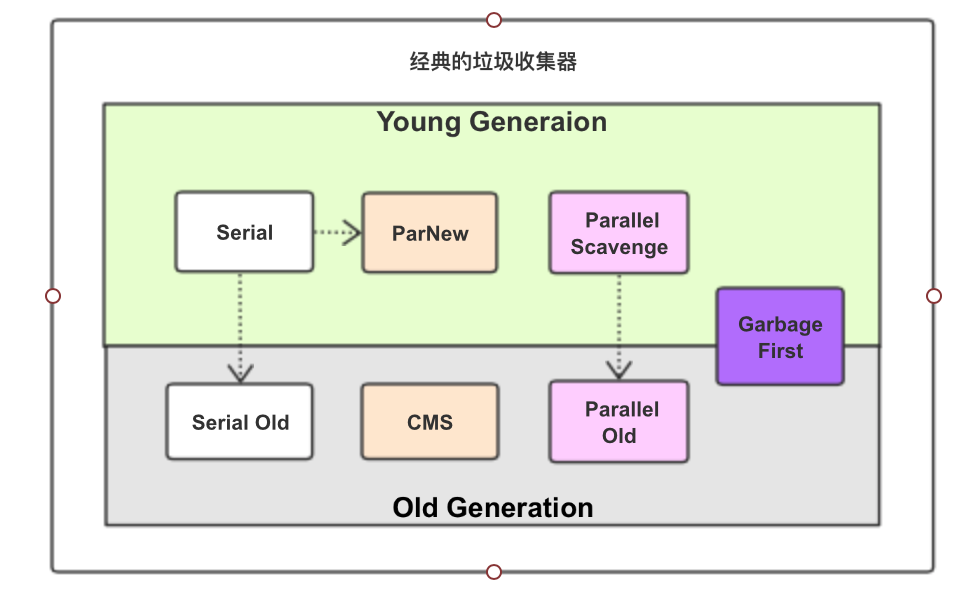
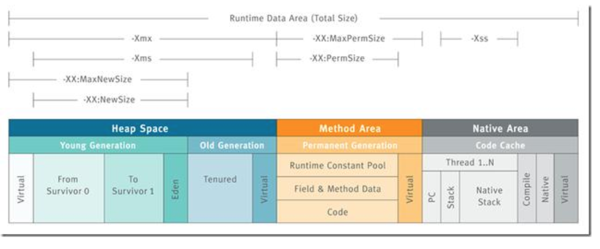
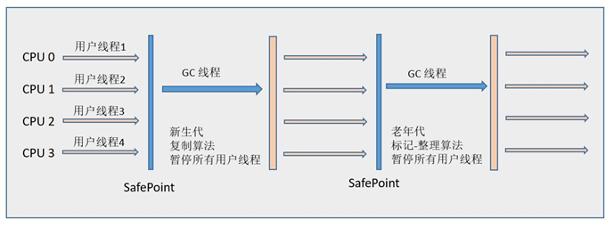
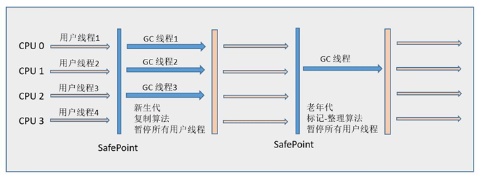
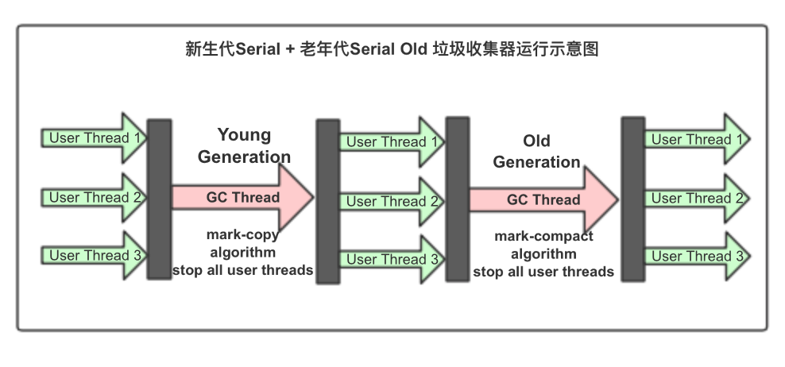
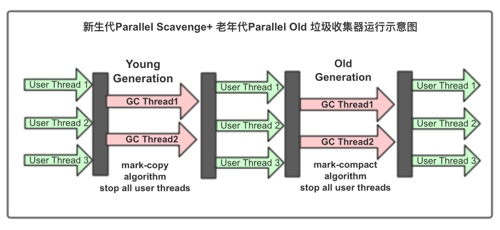
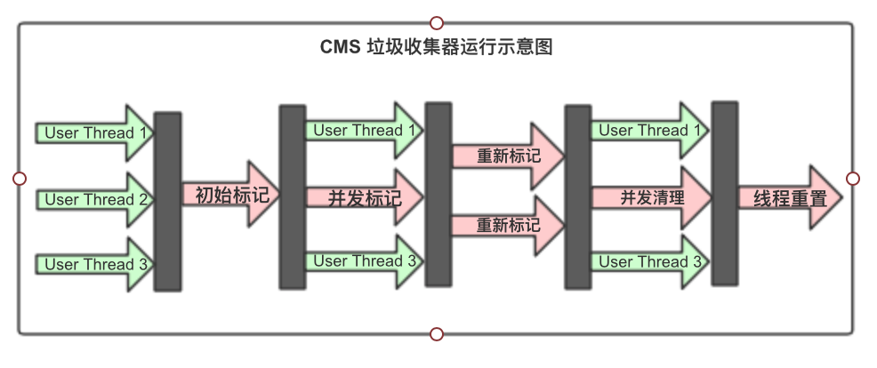
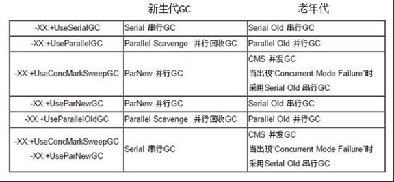
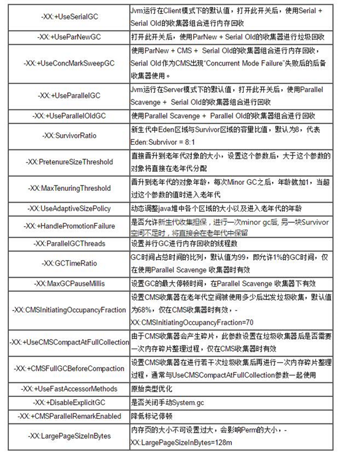

#  垃圾收集GC与内存分配

[TOC]

垃圾收集 （Garbage Collection， 简称GC)，历史比Java更悠久。早在1960年MIT诞生的Lisp是第一门开始使用内存动态分配和垃圾收集技术的语言。

垃圾收集要完成三件事：

-  哪些内存需要回收（或者说哪些内存是垃圾）？

- 什么时候回收？

- 如何回收？

  

## 判定对象消亡的算法

### 引用计数算法（reference counting）

**原理**：在对象中添加一个引用计数器，每当有一个地方引用它时，计数器值就+1；当引用失效时，计数器值就-1；任何时刻计数器为0的对象是不可能再被引用的。

**特点**：概算占用了少量的内存空间来计数，但原理简单，判定效率高；但是该算法不够完善，有很多例外的情况需要考虑，比如**对象之间的相互循环引用的问题**。

### 可达性分析算法（Reachability Analysis）（主流）

当前主流的商用程序语言（java、c#以及上溯古老的Lisp）的内存管理都是通过可达性分析算法来判断对象是否存活。

**原理**：通过一系列称为”GC Root“的根对象作为起始节点集，从这些节点开始根据引用关系向下搜索，搜索过程所走过的路径成为”引用链（reference chain）“，如果某对象到GC Root间没有任何引用链相连，或者用图论的话说就是GC Root到这个对象不可达，则证明这个对象是不可能再被使用的。

**在Java技术体系中，固定可以作为GCRoot的对象包括：**

- 在虚拟机栈中（栈帧中的本地变量表）中引用的对象，如各线程中被调用的方法堆栈中使用的参数、局部变量、临时变量等。
- 方法区中**类静态属性引用的对象**，如Java类的引用类型静态变量；
- 方法区中常量引用的对象，如字符串常量池（String table）里的引用；
- 本地方法栈中 JNI 引用的对象；
- JVM内部的引用，如：类加载器加载的class对象，基本数据类型对应的class对象， 一些常驻的异常对象如 NullPointerException、OutOfMemoryError；
- 反映JVM内部情况的JMXBean、JVMTI中注册的回调、本地代码缓存等；
- 处于激活状态的线程；
- 所有被同步锁持有（synchronized修饰的）对象；


## 附：Java中引用的概念

JDK1.2之后，Java对引用的概念进行了扩充，强度由强到弱，将引用分为：

- 强引用 Strongly Reference：是最传统的“引用”的定义。

  是指在程序代码中普遍存在的引用赋值，即类似`Object obj = new Obejct();` 这种引用关系。

  任何情况下，只要强引用关系还在，垃圾收集器就永远不会收集被引用的对象。

- 软引用Soft Reference：是JDK1.2之后新增的。

  用来描述还有用但非必须的对象；

-  弱引用Weak Reference：是JDK1.2之后新增的。

  用来描述还有用但非必须的对象；

- 虚引用 Phantom Reference：是JDK1.2之后新增的。

​       最弱的一种引用关系。


## 垃圾收集算法

如何判定对象可回收?

根据判定对象消亡的算法，垃圾收集算法分为两大类：

- 引用计数式垃圾收集 Reference counting GC（也称作直接垃圾收集）
- 追踪式垃圾收集 Tracing GC（也称作间接垃圾收集）

引用计数式垃圾收集算法在主流JVM中均未涉及，以下所有垃圾收集算法均属于追踪式垃圾收集。


### 分代收集理论

当前商业虚拟机的垃圾收集器，大都遵循了“分代收集（Generation Collection）”理论进行设计，分代收集名理论，实际是一套符合大多数程序运行实际情况的经验法则，它建立在2个分代假说之上：

- **弱分代假说（Weak Generational Hypothesis）**：绝大多数对象都是朝生夕灭的。
- **强分代假说（Strong Generational Hypothesis）**：熬过越多次垃圾收集过程的对象就越难一消亡。

分代收集的情况：

**部分收集Partial GC：**指目标不是完整收集整个**Java堆**的垃圾收集。

- **新生代收集（Minor GC/Young GC）**：目标**只是新生代的垃圾收集**；【标记-复制算法】

- **老年代收集（Major GC/Old GC）**：目标**只是老年代的垃圾收集**；目前只有CMS收集器会单独收集老年代代行为。【标记-清除算法】

  > 另外请注意Major GC这个说法现在有点混淆，在不同资料上常有不同所指，读者需要按上下文区分到底是指老年代代收集还是整堆收集。

- **混合代收集（Mixed GC）**：目标是收集**整个新生代以及部分老年代的垃圾收集**。目前只有**G1收集器**会有这种行为。

**整堆收集Full GC：**指对**整个Java堆和方法区**进行的垃圾收集（包括新生代和老年代）；


**Java堆内存（线程共享）从 GC 的角度还可以细分为**: **新生代**(Eden 区、From Survivor 区 和 To Survivor 区)和**老年代**。

- 新生代：存放新创建的对象，由于对象创建、回收频繁，所以MinorGC频繁；

   一次MiniorGC(标记复制>清空>互换)包括：

  - 对Eden和FromSurvivor进行标记，将存活者复制到ToSurvivor，存活者年龄+1，达到指定的老年代年龄（默认是 15 岁，可通过参数设定）的存活对象会复制到老年代区域；(如果 ToServivor 区域的位置不够也会被放到老年区);
  - 然后清空Eden和FromSurvivor区；

  - 将FromSurvivor和ToSurvivor互换；

- 老年代：存放达到指定的老年年龄的对象(**默认是 15 岁，可以通过参数 -XX:MaxTenuringThreshold 来设定)**，对象生命周期长且较稳定，不需要频繁MajorGC。

  如果老年代空间占满，会导致OOM异常。


- 除此之外，还有一个存放class和元数据的区域，在jdk1.8之前叫 Permanent 永久代，在jdk1.8之后叫元数据区。该区域不会在运行时进行GC，存满后会抛出OOM异常。


**堆内存分代区域中使用的垃圾收集器概况：**

- 新生代垃圾收集器

  Serial （单线程GC+stop，标记-复制算法） `-XX:+UseSerialGC`

​       ParNew（多线程GC+stop， 标记-复制算法 ）

​       Parallel Scavenge（多线程GC+并发，标记-复制）

- 老年代垃圾收集器

  Serial Old（单线程GC+stop，标记-复制算法）

  Parallel Old（多线程GC+stop， 标记-整理算法）`-XX:+UseParallelOldGC `

  CMS(Concurrent Mark Sweap) (多线程GC+并发，标记-清除算法)

- 新生代、老年代：G1(Garbage First)（多线程+并发，标记-整理算法）




**JVM 参数详解**：https://www.cnblogs.com/rinack/p/9888692.html



```
-Xmn 新生代大小；
-XX:NewRatio 新生代区（Eden+2*Survivor）/老年代区（不包含永久代）比率；
-XX:SurvivorRatio  新生代的Eden/1个Survivor比率（新生代=Eden+2*Survivor）;
-XX: PretenureSizeThreshold 晋升老年代的对象的年龄标志;

-Xms 设置堆的最小空间大小。
-Xmx 设置堆的最大空间大小。
-Xmn 设置年轻代大小
-XX:NewSize 设置新生代最小空间大小。
-XX:MaxNewSize 设置新生代最大空间大小。
-XX:PermSize 设置永久代最小空间大小。
-XX:MaxPermSize 设置永久代最大空间大小。
-Xss 设置每个线程的堆栈大小
-XX:+UseParallelGC 选择垃圾收集器为并行收集器。此配置仅对年轻代有效。即上述配置下,年轻代使用并发收集,而年老代仍旧使用串行收集。
-XX:ParallelGCThreads=20 配置并行收集器的线程数,即:同时多少个线程一起进行垃圾回收。此值最好配置与处理器数目相等。
```


### 标记-清除（mark-sweap）算法：

是最早出现的，也是最基础的垃圾收集算法，在1960年由Lisp之父John McCarthy所提出。

算法分两个阶段：首先标记出所需要回收的对象，在标记完成后，统一回收掉所有被标记的对象。（也可以反过来标记存活的对象，统一回收所有未被标记的对象。（标记过程就是对象是否属于垃圾的判定过程）

缺点：1执行效率不稳定：如果Java堆中的包含大量对象，且其中大都需要被回收，此时效率随对象增长而降低；2 内存空间的碎片化问题：标记、清除之后会产生大量不连续的内存碎片，在程序运行中需要分配较大对象时无法找到足够的连续内存，而不得不提前触发另一次垃圾收集动作。


### 标记-复制（mark-copy）算法（新生代）：

1969年Fenichel提出了一种称为**“半区复制（Smisplace Copying）”**的垃圾收集算法。它将可用内存按容量划分为大小相等的两块，每次使用其中一块（保留另一块），这块用完后，直接将存活对象复制到保留的那块，然后将使用的那块一次清理掉。

现在商用Java虚拟机大都优先采用这种收集算法回收**新生代**。

1989  年，Andrew Appel针对具备“朝生夕灭”（即IBM专项研究中新生代中98%的对象熬不过第一轮垃圾收集）特点的对象，提出了一种更优化的半区复制分代策略，现称为**“Appel式回收”**。HotSpot虚拟机的**Serial、ParNew垃圾收集器**均采用了这种策略来设计新生代的内存布局。Appel式回收具体做法：把新生代分为一块较大的Eden空间和两块较小的Survivor空间，每次分配内存只使用Eden和其中一块Survivor空间；发生垃圾搜索时，将Eden和Survivor中仍然存活的对象，一次复制到另一块Survivor空间；然后直接清理掉Eden和用过的那块Survivor空间。

**HotSpot VM 默认Eden和Survior的大小比例时8:1。**即在新生代的容量中，Eden占80%，Survior1占10%， Survior2占10%；每次只使用90%（Eden+Survior1），保留10%（Survior2）。这种设计适只用于每次回收后存活对象<10%的情况，但实际无法保证一定如此，因此Appel式回收还有一个充当罕见情况的“逃生门”的安全设计，当Survior空间不足以容纳一次MinorGC后存活的对象时，就依赖其他内存区域（实际单多时老年嗲）进行分配担保（Handle Promotion）。


### 标记-整理（mark-compact）算法（老年代）:对象移动时StopTheWorld

针对老年代对象的存亡特征（应对对象100%存活的极端情况），1974年Edward Lueders提出了另外一种有针对性的“标记-整理（mark-compact）算法“，其中的标记过程仍然“与标记-清除算法”一样，后续步骤是：让所有存活的对象都向内存空间一端移动，然后直接清理掉边界以外的内存。


标记-整理算法是移动式的回收算法，而标记-清除算法是非移动式的回收算法，这是二者的本质差异。

在老年代这种每次回收都有大量对象存活区域的，移动存活对象并更新所有引用这些对象的地方将是一种极为负重的操作，而这种对象移动操作必须全程暂停用户应用程序才能进行，像这样的停顿被最初的虚拟机设计者形容为“Stop The World”。鉴于此，必须小心权衡该算法的利弊。

HotSpot VM里面关注吞吐量的**Parallel Scavenge收集器**是基于标记-整理算法的，而关注延迟的CMS收集器则是标记-清除算法的。


## HotSpot 中的GC算法实现细节

根节点（GC Roots）枚举

安全点（Safepoint）

安全区域（Safe Region）

记忆集（Remembered Set）与卡表（Card Table）

写屏障（Write Barrier）

并发的可达性分析


## 经典的垃圾收集器


- 新生代垃圾收集器

  - Serial （单线程GC+stop，标记-复制算法） 

    `-XX:+UseSerialGC` ：Serial + Serial Old， 在**Client**模式下的默认配置值；

  - ParNew（多线程GC+stop， 标记-复制算法 ） 

    `-XX:+UseParNewGC`：ParNew+Serial Old，在JDK1.8被废弃，在JDK1.7还可使用；

    `-XX:+UseConcMarkSweepGC`，ParNew+CMS+Serial Old

  - Parallel Scavenge（多线程GC+并行，标记-复制，吞吐量）

    `-XX:+UseParallelOldGC`：Parallel Scavenge+Parallel Old；

- 老年代垃圾收集器

  - Serial Old（单线程GC+stop，标记-复制算法）
  - Parallel Old（多线程GC+stop， 标记-整理算法）
  - CMS(Concurrent Mark Sweap) (多线程GC+并行，标记-清除算法)

- 新生代、老年代：G1(Garbage First)（多线程+并发，标记-整理算法）

     `-XX:+UseG1GC`：G1 + G1。

使用场景：

- 
- 注重吞吐量及CPU资源敏感的场合，优先考虑Parallel Scavenge(新生代) + Parallel Old(老年代)收集器。适合吞吐量优先。
- 

JVM 参数详解：https://www.cnblogs.com/rinack/p/9888692.html


```
-Xmn 新生代大小；
-XX:NewRatio 新生代区（Eden+2*Survivor）/老年代区（不包含永久代）比率；
-XX:SurvivorRatio  新生代的Eden/1个Survivor比率（新生代=Eden+2*Survivor）;
-XX: PretenureSizeThreshold 晋升老年代的对象的年龄标志;

-Xms 设置堆的最小空间大小。
-Xmx 设置堆的最大空间大小。
-Xmn 设置年轻代大小
-XX:NewSize 设置新生代最小空间大小。
-XX:MaxNewSize 设置新生代最大空间大小。
-XX:PermSize 设置永久代最小空间大小。
-XX:MaxPermSize 设置永久代最大空间大小。
-Xss 设置每个线程的堆栈大小
-XX:+UseParallelGC 选择垃圾收集器为并行收集器。此配置仅对年轻代有效。即上述配置下,年轻代使用并发收集,而年老代仍旧使用串行收集。
-XX:ParallelGCThreads=20 配置并行收集器的线程数,即:同时多少个线程一起进行垃圾回收。此值最好配置与处理器数目相等。
```


### Serial 收集器（单线程，STW, 标记-复制算法）：

是最基础、历史最悠久的垃圾收集器；使用标记-复制算法；在JDK1.3之前是Hotspot VM新生代收集器的唯一选择。

是一个单线程工作的收集器；它进行垃圾收集时，必须暂停其他所有工作线程，直到它收集结束。

迄今为止，它依然是Hotspot vm运行在**Client模式**的**新生代**的默认收集器。它的简单高效（与其他收集器的单线程相比）优于其他收集器。

```bash
#serial收集器相关参数#
-XX:+UseSerialGC
```

运行示意图：



**缺点：**由于Stop The World，给用户带来不良体验，比如，计算机每运行一段时间就会暂停响应几分钟来处理垃圾收集。

**优点：**

1）简单而高效（与其他收集器的单线程比）；
2）对于限定单个CPU的环境来说，Serial收集器由于没有线程交互的开销，专心做垃圾收集自然可以获得最高的单线程收集效率。

**应用场景：**

1）VM运行在**Client**模式下的默认新生代收集器；
2）在用户的桌面应用场景中，停顿时间完全可以控制在几十毫秒最多一百多毫秒以内，不频繁发生，是可接受的

### ParNew 收集器（Serial+多线程,STW）

实际上是**Serial收集器**的**多线程**并行版本。除了使用多条线程进行垃圾收集之外，其他行为都与Serial收集器一致。

ParNew收集器默认开启和CPU数目相同的线程数，可以通过-XX:ParallelGCThreads参数来控制垃圾收集器的线程数。

ParNew是很多JVM运行在**Server模式**下**新生代**的默认垃圾收集器。

>在谈论垃圾收集器的上下文中，并行和并发的理解如下：
>
>- 并行：同一时间有多条垃圾收集器的线程在协同工作，通常默认此时用户线程是处于等待状态。
>
>- 并发：同一时间垃圾收集器线程和用户线程都在运行。

```shell
#参数配置
-XX:+UseConcMarkSweepGC 选项后默认新生代收集器为ParNew收集器；
-XX:+UseParNewGC 选项强制指定使用ParNew收集器；
-XX:ParallelGCThreads 参数限制垃圾收集的线程数；
```

运行示意图：用户线程》GC多线程(stop the world)》用户线程



**缺点：**在单CPU的环境中绝对不会有比Serial收集器更好的效果，甚至存在线程交互的开销。

**优点：**

1）除了Serial收集器外，只有ParNew收集器能与CMS收集器配合工作。
2）CMS（Concurrent Mark Sweep）第一次实现让垃圾收集线程与用户线程（基本上）同时工作。

**应用场景：**运行在Server模式下的VM首选新生代收集器。

### Parallel Scavenge收集器（多线程，标记-复制算法）

Parallel Scavenge是一个**新生代**垃圾收集器，使用**标记-复制算法**，**多线程**，它重**点关注的是程序达到一个可控制的吞吐量**。高吞吐量可以最高效率的利用CPU时间，尽快完成程序的运行任务，主要适用于在**后台运算**而不需要太多交互的任务；自适应调节策略也是Parallel Scavenge收集器与ParNew收集器的区别。

> 吞吐量(Thoughput)，是 CPU用于运行用户代码的时间CPU总消耗时间，即
> $$
> 吞吐量 = 运行用户代码时间/(运行用户代码时间+垃圾收集时间)
> $$

```
参数控制：
1）用户精确控制吞吐量
• -XX:MaxGCPauseMillis 控制最大垃圾收集停顿时间
• -XX:GCTimeRatio 直接设置吞吐量大小
• -XX:+UseAdaptiveSizePolicy 开关参数，GC自适应的调节策略
2）MaxGCPauseMillis 允许的值是一个大于0的毫秒数，收集器尽可能保证内存回收时间不超过设定值。
	GC停顿时间缩短牺牲吞吐量和新生代空间——若将MaxGCPauseMillis该值调小带来的问题：系统把新生代调小一些，收集发生更频繁一些，吞吐量下降。
 	GCTimeRatio参数值是一个大于0且小于100的整数，即垃圾收集时间占总时间的比率，相当于吞吐量的倒数。如设置为19，则最大GC时间占1/(1+19)=5%，默认值为99.则最大允许1/(1+99)=1%的垃圾收集时间。
	UseAdaptiveSizePolicy开关参数：VM会根据当前系统的运行情况收集性能监控信息，动态调整这些参数以提供最合适的停顿时间或最大吞吐量。自适应调节策略是Parallel Scavenge收集器与ParNew收集器的重要区别。
```

**应用场景：**主要适合后台运算而不需要太多交互的任务

### Serial Old 收集器（单线程，STW, 标记-整理算法）

Serial Old 是 Serial 收集器的老年代版本，是**单线程**的，使用**标记-整理算法**。

该收集器的意义也是**Client模式**下的HotSpot VM的默认的**老年代**的垃圾收集器。



 **应用场景：**

1）主要给Client模式下的VM使用。
2）若在Server模式下用，两大用途：1.在JDK1.5及之前的版本中与Parallel Scavenge收集器搭配使用；2.作为CMS收集器备选，并在Concurrent Mode Failure时使用。

### Parallel Old 收集器（多线程，STW, 标记-整理算法）

Parallel Old 是 Parallel Scavenfe 收集器的**老年代**版本，支持**多线程**并发收集，基于**标记-整理**算法实现。

从JDK1.6开始提供。是为了在年老代同样提供**吞吐量优先**的垃圾回收器。

> 对于对吞吐量要求高的系统，可以新生代Parallel Scavenge 和 老年代 Parallel Old收集器搭配使用。



```bash
#Parallel收集器相关参数#
# 使用多线程对年轻代进行 GC，对老年代仍采用单线程的 GC
-XX:+UseParallelGC
# 对年轻代和老年代都使用多线程进行 GC，同时使用多线程对老年代进行
# 压缩（compacting）。以 Hotspot 为例，默认情况下，JVM 对年轻代使
# 用 coping，对老年代使用compacting
-XX:+UseParallelOldGC
# 设置 GC 的线程数       
-XX:ParallelGCThreads=<desired number>
# 设置每次年轻代垃圾回收的最长时间，如果无法满足此时间，JVM 会
# 自动调整年轻代大小，以满足此值
-XX:MaxGCPauseMillis=<n>
# 设置 GC 时间的占比       
-XX:GCTimeRatio=<n>
# 设置并行收集器自动选择年轻代区大小和相应的 Survivor 区比例
# 以达到目标系统规定的最低相应时间或者收集频率等，此值建议使
# 用并行收集器时一直打开
-XX:+UseAdaptiveSizePolicy
```

**使用场景：**注重吞吐量以及CPU资源敏感的场合，优先考虑Parallel Scavenge + Parallel Old收集器。适合吞吐量优先。

### CMS （Concurrent Mark Sweap）并发低停顿(标记清除)s收集器（多线程并发，标记-清除算法）

CMS （Concurrent Mark Sweap）收集器是**老年代**的垃圾收集器， 主要目标是获取最**短垃圾回收停顿时间**，使用**多线程**的**标记-清除算法**。

最短的垃圾回收停顿可以为交互比较高的程序提高用户体验。

CMS工作机制比其他垃圾收集器更复杂，整个过程分四个阶段：

- 初始标记：只标记GC Roots能直接关联的对象，速度很快，仍需暂停所有的工作线程；
- 并发标记：进行GC Roots跟踪的过程，和用户线程一起工作，不需暂停工作线程；
- 重新标记：**为了修正在并发标记期间，因用户程序继续运行而导致标记产生变动的那部分对象的标记记录，**仍需暂停所有工作线程；
- 并发清除：清除GC Roots不可达对象，和用户线程一起工作，不需暂停工作线程。

总体上看GC与用户线程是并发进行的。

**优点**：并发收集、低停顿。
**缺点**：并发阶段会降低吞吐量；使用标记-清理算法会产生内存碎片；并行阶段无法标记浮动垃圾，导致垃圾标记过程长。



```bash
#CMS相关参数设置#
# 使用 CMS 并且指定 GC 的线程数
-XX:+UseConcMarkSweepGC -XX:ParallelCMSThreads=<n>
# 设置运行多少次 GC 以后对内存空间进行压缩整理
#（默认 JVM 不会压缩整理内存）
-XX:CMSFullGCsBeforeCompaction
# 打开对年老代的压缩。虽然可以消除碎片，但可能会影响
# 性能，不建议采用，还是应该加大堆的大小
-XX:+UseCMSCompactAtFullCollection

-XX:CMSInitiatingOccupancyFraction #提高触发老年代CMS垃圾回收的百分比；
-XX:+UseCMSCompactAtFullCollection #开关参数：默认开启，用于CMS收集器要进行Full GC时开启内存碎片合并整理过程，非并发的过程；
-XX:CMSFullGCsBeforeCompaction #用于设置执行多少次不压缩的Full GC后，紧接着一次带压缩的（默认为0，表示每次进入Full GC时就进行碎片整理）
```

**优点：**并发收集；低停顿（并发低停顿收集器）

**缺点：**

1）CMS收集器对CPU资源非常敏感；
2）CMS收集器无法处理浮动垃圾，可能出现"Concurrent Mode Failure"失败（备选用Serial Old）而导致另一次Full GC的产生；
3）CMS是一款基于“标记-清除”算法的收集器，在收集结束后会产生大量空间碎片。
**缺点具体分析**
1）**对CPU资源敏感**：在并发阶段会占用一部分线程而导致应用程序变慢，总吞吐量降低；（解决方法是“增量式并发收集器”，但不提倡使用，i-CMS收集器是与单CPU年代PC机操作系统使用抢占式模拟多任务机制的思想，在并发标记、清理的时候让GC线程、用户线程交替执行，尽量减少GC线程的独占资源的时间）
2）**无法处理浮动垃圾**：CMS并发清理阶段用户线程还在运行，会产生新的垃圾，这部分垃圾出现在标记过程之后，CMS无法在当次收集中处理它们，只好留到下一次GC时再处理。CMS需要预留一部分提供并发收集时的程序运行使用，CMS收集时老年代不能填满再收集。
3）**收集后产生大量空间碎片**：“标记-清除”算法的缺点，解决方案是使用-XX:+UseCMSCompactAtFullCollection和-XX:CMSFullGCsBeforeCompaction参数

**应用场景：**在互联网站或者B/S系统的服务端上，重视服务的响应速度，希望系统停顿时间最短，给用户带来较好的体验。

### Garbage First (G1)收集器（标记-整理）

是目前垃圾收集器理论发展的最前沿成果， 相比于CMS收集器，G1收集器两个突出的改进：

- 基于标记-整理算法，不产生内存碎片；
- 可以非常精确控制停顿时间，在不牺牲吞吐量的前提下，实现低停顿垃圾回收。

可以用于新生代，也可以用于老年代。

```bash
#G1相关参数#
# 启用 G1
-XX:+UseG1GC
# 设置 G1 收集过程目标（预期）时间，默认值 200 ms。
-XX:MaxGCPauseMillis
# 设置触发标记周期的 Java 堆占用率阈值。默认值是 45%，
# 这里的堆占比指的是 non_young_capacity_bytes，包括 
# old+humongous
-XX:InitiatingHeapOccupancyPercent
# 设置Region大小，并非最终值
-XX:G1HeapRegionSize=n
# 新生代最小值，默认值 5%
-XX:G1NewSizePercent
# 新生代最大值，默认值 60%
-XX:G1MaxNewSizePercent
# stop-the-world 期间，并行 GC 线程数
-XX:ParallelGCThreads
# 并发标记阶段，并行执行的线程数
-XX:ConcGCThreads=n
```


## 垃圾收集器的配置参数

### GC器的使用



### GC器的参数




## JVM调优

VM 中和性能相关的关键组件包括：

- JIT Compiler (Just-in-time Compiler)  即时编译器
- Heap 堆内存
- GC (Garbage Collection) 垃圾收集

现代 JVM 中由 JIT 编译的 Java 代码几乎和 C++ 一样快，通常不用调整；所以通常对于 JVM 的调优只涉及对其 Heap 大小和 GC 算法的调整。

### 评价GC性能的2大指标

- 最大停顿时间（响应能力）：中断应用程序来做垃圾回收的应用停顿时间。

- 吞吐量：吞吐量=运行用户代码时间/(运行用户代码时间+垃圾收集时间)

### GC调优

1 首先要准备恰当的环境，包括

- 使用与生产系统一样的系统
- 使用真实的数据，对数据进行测量并且多次运行测试数据

2 遵循主要调优原则：加快对新对象的内存分配，以及减少GC时 Stop The World 停顿时间。

比如： **GC 收集器精准选型、增大堆空间、调整 Eden 和 Survivor 的空间、设置对象存活的最大年龄**等。

**2.1 记录与分析 GC 日志数据**

1 打印GC日志；

GC 的日志数据可以使用 `jstat` 命令观测，或使用 JVM 参数 `-Xloggc: -verbose:gc ` 开启。

例如：`-Xloggc:/home/test/gc.log -verbose:gc -XX:+PrintGCDateStamps` 

其中 `-verbose:gc` 的可用参数包括：

```bash
-XX:+PrintGCDetails
-XX:+PrintGCTimeStamps
-XX:+PrintHeapAtGC
-XX:+PrintGCDateStamps
-XX:+PrintTenuringDistribution # 显示JVM所使用的将对象提升进入老年代的年龄阈值
-XX:+HeapDumpOnOutOfMemoryError # 生成堆内存转储文件, 例如: java_xxx.hprof
```

2 得到 GC 的日志数据之后，主要从以下几方面分析：

- GC 的类型

- GC 发生的时间

- GC 运行的时间

- GC 各代的比率，如：分配率（Allocation Rate），年轻代的大小除以年轻代的收集时间、提升率（Promotion Rate），老年代随时间变化的使用率（不包括收集时间）和存活率（The Survivor Death Ratio），年龄是 N 的幸存者大小除以年龄是 N-1 的岁幸存者大小

- GC 引起的 Stop The World 的时间

- GC 的清理结果（释放了多少内存）

  

**2.2 生成与分析 dump (转储)文件**

**Warning：无论是生成 heap dump(堆转储) 还是 thread dump(线程转储)，都会造成 JVM 的停顿，因此需要在生产环境上谨慎执行。**

生成与分析 dump 文件也是常用来分析 JVM 运行的一种手段，JVM 的 dump 文件包括两类

- Thread Dump（文本格式），保存某一时刻 JVM 中各线程的运行快照，用于分析死锁、资源竞争等线程共享的问题。

  如果要产生 heap dump 文件可以使用 `jmap -dump:live,format=b,file=heap-dump-file pid` 命令产生，其中 `live` 选项会触发一次 Full GC 只 dump 存活对象，如果不加该选项可以得到历史对象。

- Heap Dump（二进制格式），保存某一时刻 JVM 堆（heap）中对象使用内存的情况，用于分析内存泄露等于内存相关的问题。

  而要产生 thread dump 文件则可以使用 `jstack [options] pid > thread-dump-file`（推荐）或 `kill -3` 向 JVM 发送 `SIGQUIT` 信号，JVM 接收到该信号后打印线程栈到标准输出中，产生 dump 文件。

> 注意：OpenJDK 使用 `jstack` 会有问题，可能需要安装：`sudo yum --enablerepo='*-debug*' install java-1.6.0-openjdk-debuginfo.x86_64`

产生 dump 文件后，可以使用 `jvisualvm` 或 [Eclipse Memory Analyzer (MAT)](https://link.zhihu.com/?target=http%3A//www.eclipse.org/mat/) 或 [IBM Thread and Monitor Dump Analyzer for Java](https://link.zhihu.com/?target=https%3A//www.ibm.com/developerworks/community/groups/service/html/communitystart%3FcommunityUuid%3D2245aa39-fa5c-4475-b891-14c205f7333c) 进行分析。


**2.3 其它工具**

JVM 本身提供了许多有用的工具用来调试 Java 程序，这些程序可以在 `$JDK_HOME/bin` 下找到， 如：

- `jps` 查找 Java 进程
- `jinfo` 打印 Java 进程的相关配置信息（参数）
- `jmc`（Java Mission Control）JMC 采用采样技术而不是传统的代码植入的技术，其对应用性能的影响非常小，可以用来实时监控、分析 Java 程序。
- [gchisto](https://link.zhihu.com/?target=https%3A//github.com/jewes/gchisto) 分析 GC 日志
- [gcplot](https://link.zhihu.com/?target=https%3A//github.com/dmart28/gcplot)


**参考：**https://www.cnblogs.com/Andya/p/12445429.html

