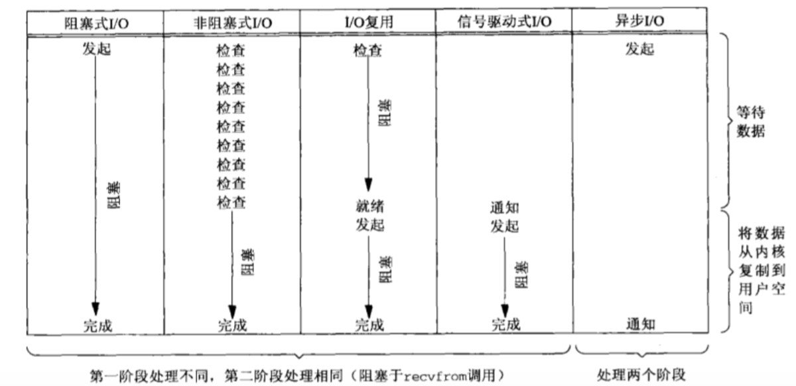
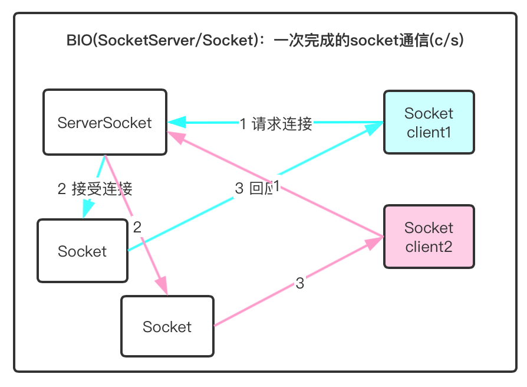
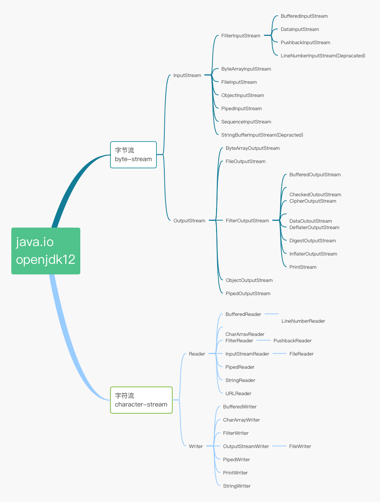
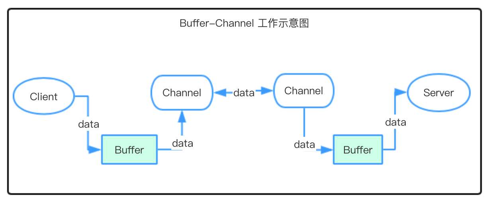
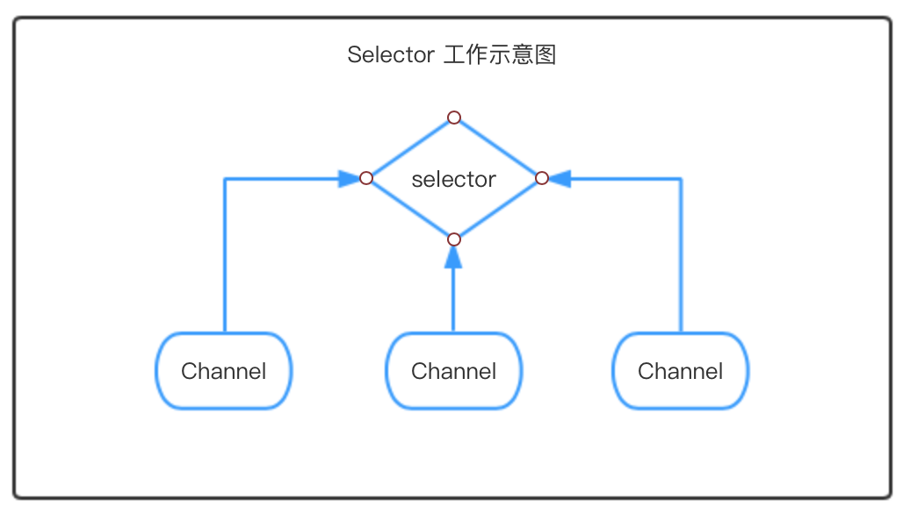

# Java IO &  NIO

[TOC]

**参考**：

-  [Java SE 12 Doc - Base -  IO/NIO ](https://docs.oracle.com/en/java/javase/12/docs/api/java.base/java/io/package-summary.html)

- [深入分析 Java I/O 的工作机制](https://www.ibm.com/developerworks/cn/java/j-lo-javaio/)

- [Java IO、NIO、AIO详解（带图解）](https://www.jianshu.com/p/4ba0e7df71ec)

  

## 预备知识：同步/异步、阻塞/非阻塞

**同步和异步**

**同步：用户线程发起I/O请求后，需要等待或者轮询内核I/O操作完成后才能继续执行。**

> 如果有多个任务或者事件发生，这些任务或者事件必须逐个地进行，一个事件或者任务的执行会导致整个流程的暂时等待，这些事件没有办法并发地执行；（串行）

**异步：用户线程发起I/O请求后，可以继续执行，当内核I/O操作完成后会通知用户线程，或者调用用户线程注册的回调函数，然后用户线程可以获取资源（将资源从内核拷贝到用户线程）。**

> 如果有多个任务或者事件发生，这些事件可以并发地执行，一个事件或者任务的执行不会导致整个流程的暂时等待。（并发）

举例说明：假如有一个任务包括两个子任务A和B，对于同步，当A在执行的过程中，B只有等待，直至A执行完毕，B才能执行；而对于异步，就是A和B可以并发地执行，B不必等待A执行完毕之后再执行，这样就不会由于A的执行导致整个任务的暂时等待。


**阻塞与非阻塞**

**阻塞：I/O操作需要彻底完成后才能返回给用户。**

> 当某个事件或者任务在执行过程中，它发出一个请求操作，但是由于该请求操作需要的条件不满足，那么就会一直在那等待，直至条件满足；

**非阻塞：指I/O操作被调用后立即返回一个状态值，无需等I/O操作彻底完成。**

> 当某个事件或者任务在执行过程中，它发出一个请求操作，如果该请求操作需要的条件不满足，会立即返回一个标志信息告知条件不满足，不会一直在那等待。

举例说明：假如我要读取一个文件中的内容，如果此时文件中没有内容可读，对于同步来说就是会一直在那等待，直至文件中有内容可读；而对于非阻塞来说，就会直接返回一个标志信息告知文件中暂时无内容可读。


## I/O模型

### 1 阻塞IO模型（Blocking-IO）

是最传统的一种IO模型，即在读、写数据时发生阻塞现象。

当用户线程发出IO请求之后，内核会去查看数据是否就绪，如果没有就绪就会等待数据就绪，而用户线程就会处于阻塞状态，用户线程交出 CPU。当数据就绪之后，内核会将数据拷贝到用户线程，并返回结果给用户线程，用户线程才解除 block 状态。

典型的阻塞 IO 模型的例子为:

```java
data = socket.read(); //一直阻塞在 read 方法，直到返回请求的数据。
```

### 2 非阻塞模型（NoneBlocking-IO ）

当用户线程发起一个 read 操作后，并不需要等待，而是马上就得到了一个结果。如果结果是一个 error 时，它就知道数据还没有准备好，于是它可以再次发送 read 操作。一旦内核中的数据准备好了，并且又再次收到了用户线程的请求，那么它马上就将数据拷贝到了用户线程，然后返回。 所以事实上，在非阻塞 IO 模型中，用户线程需要不断地询问内核数据是否就绪，也就说非阻塞 IO 不会交出 CPU，而会一直占用 CPU。

典型的非阻塞 IO 模型一般如下:

```java
while(true){
	data = socket.read(); // 返回请求的数据或者error标记信息
	if(data!= error){ 
		//处理数据
		break;
	}
}
```

注意：对于非阻塞 IO 有一个严重的问题，在 while 循环中需要不断地询问内核数据是否就绪，这样会导致 CPU 占用率非常高，因此一般很少使用 while 循环这种方式来读取数据。

>**一个完整的IO读请求操作包括两个阶段：**
>
>- 1查看数据是否就绪
>- 2 进行数据拷贝（内核将数据拷贝到用户线程）
>
>那么阻塞（blocking IO）和非阻塞（non-blocking IO）的区别就在于第一个阶段，如果数据没有就绪，在查看数据是否就绪的过程中是一直等待（阻塞），还是直接返回一个标志信息（非阻塞）。

### 3 多路复用IO模型(multiplexed IO)

**是目前使用比较多的模型。Java NIO 实际上就是多路复用 IO。**

在多路复用 IO 模型中，会有一个线程不断去轮询多个 socket 的状态，只有当 socket 真正有读写事件时，才真正调用实际的 IO 读写操作。因为在多路复用 IO 模型中，只需要使用一个线程就可以管理多个 socket，系统不需要建立新的进程或者线程，也不必维护这些线程和进程，并且仅在真正有 socket 读写事件进行时，才会使用 IO 资源，所以它大大减少了资源占用。在 Java NIO 中，是通 过selector.select()去查询每个通道是否有到达事件，如果没有事件，则一直阻塞在那里，因此这 种方式会导致用户线程的阻塞。多路复用 IO 模式，通过一个线程就可以管理多个 socket，只有当 socket 真正有读写事件发生才会占用资源来进行实际的读写操作。因此，多路复用 IO 比较适合连 接数比较多的情况。	

> 多路复用IO 比 非阻塞IO 的效率高的原因：
>
> 在非阻塞IO 中，不断询问 socket 状态是通过用户线程去进行的；而在多路复用 IO 中，轮询每个 socket 状态是在内核进行的，这个效率要比用户线程要高的多。 								

注意：多路复用 IO 模型是通过轮询的方式来检测是否有事件到达，并且对到达的事件逐一进行响应。因此对于多路复用 IO 模型来说，一旦事件响应体很大，那么就会导致后续的事件迟迟得不到处理，并且会影响新的事件轮询。


### 4 信号驱动IO模型（SIG-IO）

在信号驱动 IO 模型中，当用户线程发起一个 IO 请求操作，会给对应的 socket 注册一个信号函数，然后用户线程会继续执行，当内核数据就绪时会发送一个信号给用户线程，用户线程接收到信号之后，便在信号函数中调用 IO 读写操作来进行实际的 IO 请求操作。


### 5 异步IO模型（Async-IO）

**异步 IO 模型是最理想的 IO 模型。但是因为性能随OS有所不同，因此应用并不广泛。**

在异步 IO 模型中，当用户线程发起 read 操作之后，立刻就可以开始去做其它的事。而另一方面，从内核的角度，当它收到一个 asynchronous read 之后， 它会立刻返回，说明 read 请求已经成功发起了，因此不会对用户线程产生任何 block。然后，内核会等待数据准备完成，然后将数据拷贝到用户线程，当这一切都完成之后，内核会给用户线程 发送一个信号，告诉它 read 操作完成了。也就说用户线程完全不需要知道实际的整个 IO 操作是如何进行的，只需要先发起一个请求，当接收内核返回的成功信号时表示 IO 操作已经完成，可以直接去使用数据了。

也就说在异步 IO 模型中，IO 操作的两个阶段都不会阻塞用户线程，这两个阶段都是由内核自动完成，然后发送一个信号告知用户线程操作已完成。用户线程中不需要再次调用 IO 函数进行具体的读写。这点是和信号驱动模型有所不同的，在信号驱动模型中，当用户线程接收到信号表示数据已经就绪，然后需要用户线程调用 IO 函数进行实际的读写操作；而在异步 IO 模型中，收到信号表示 IO 操作已经完成，不需要再在用户线程中调用 IO 函数进行实际的读写操作。

注意：异步 IO 是需要操作系统的底层支持，在 Java 7 中，提供了 AsynchronousIO。参考：http://www.importnew.com/19816.html 。



## BIO、NIO、AIO  概述

参考： https://docs.oracle.com/javase/tutorial/essential/io/bytestreams.html

Java 的 I/O 类大大简化了IO操作；Java的序列化允许程序将整个对象写入流，并从流中再读取出来。I/O 操作类在包 java.io 下，大概有将近 80 个类：

- 根据传输数据的格式：
  - 基于字节（操作媒体文件）操作的 I/O 接口：InputStream 和 OutputStream
  - 基于字符（操作文本文件）操作的 I/O 接口：Writer 和 Reader

- 根据数据传输的方式：
  - 基于磁盘操作的 I/O 接口：File
  - 基于网络操作的 I/O 接口：Socket

- 根据功能的发展：
  - BIO 同步阻塞（同步阻塞IO模型）
  - NIO 同步非阻塞（多路复用、同步非阻塞的IO模型）
  - AIO 异步非阻塞（异步阻塞IO模型）

### BIO(java.io) - 同步阻塞

传统的java.io包，基于流模型实现。

提供了我们最熟悉的一些IO功能，如File抽象、输入输出流等；

交互方式是：同步、阻塞的方式，线程的调用是可靠的串行。

优点：代码比较简单、直观；

缺点： IO 效率和扩展性存在局限性，容易成为应用性能的瓶颈。

> 很多时候，人们把 java.net下面提供的部分网络 API，比如 Socket、ServerSocket、HttpURLConnection 也归类到同步阻塞 IO 类库，因为网络通信同样是 IO 行为。

### NIO(java.nio包) - 同步非阻塞、多路复用

在 Java 1.4 中引入了 NIO 框架（java.nio 包）;

提供了 Channel、Selector、Buffer 等新的抽象;

可以构建多路复用的、同步非阻塞 IO 程序;

同时提供了更接近操作系统底层的高性能数据操作方式。

### AIO(java.nio.AsynchronousX) - 异步非阻塞

在Java 1.7 中，NIO 有了进一步的改进，也就是 NIO 2，引入了异步非阻塞 IO 方式，也有很多人叫它 AIO（Asynchronous IO）。

异步 IO 操作基于事件和回调机制：可以简单理解为，应用操作直接返回，而不会阻塞在那里，当后台处理完成，操作系统会通知相应线程进行后续工作。

**AsynchronousChannel**：支持异步通道，实现类有：AsynchronousSocketChannel、AsynchronousServerSocketChannel、AsynchronousFileChannel、AsynchronousDatagramChannel；


作者：一点点努力
链接：https://www.jianshu.com/p/45f84a946047
来源：简书
著作权归作者所有。商业转载请联系作者获得授权，非商业转载请注明出处。。

**CompletionHandler**：用户处理器。定义了一个用户处理就绪事件的接口，由用户自己实现，异步io的数据就绪后回调该处理器消费或处理数据。

**AsynchronousChannelGroup**：一个用于资源共享的异步通道集合。处理IO事件和分配给CompletionHandler。

### [Java I/O 流细分列表](https://docs.oracle.com/javase/tutorial/essential/io/streams.html)

- [Byte Streams](https://docs.oracle.com/javase/tutorial/essential/io/bytestreams.html) 字节流，处理原始二进制数据的IO；

  InputStream

  OutputStream

- [Character Streams](https://docs.oracle.com/javase/tutorial/essential/io/charstreams.html) 字符流，处理字符数据的IO，自动处理本地字符集的翻译；

  Reader

  Write

- [Buffered Streams](https://docs.oracle.com/javase/tutorial/essential/io/buffers.html) 缓冲流，通过减少native API方法的调用，来优化输入和输出；

   [`BufferedInputStream`](https://docs.oracle.com/javase/8/docs/api/java/io/BufferedInputStream.html) and [`BufferedOutputStream`](https://docs.oracle.com/javase/8/docs/api/java/io/BufferedOutputStream.html)

   [`BufferedReader`](https://docs.oracle.com/javase/8/docs/api/java/io/BufferedReader.html) and [`BufferedWriter`](https://docs.oracle.com/javase/8/docs/api/java/io/BufferedWriter.html)

- [Scanning and Formatting](https://docs.oracle.com/javase/tutorial/essential/io/scanfor.html) 扫描和格式化，允许程序读取和写入格式化的文本；

  ```
  Scanner s = null;
  s = new Scanner(new BufferedReader(new FileReader("xanadu.txt")));
  while (s.hasNext()) {
     System.out.println(s.next());
  }
  ```

  ```
  System.out.format("The square root of %d is %f.%n", i, r);
  ```

- [I/O from the Command Line](https://docs.oracle.com/javase/tutorial/essential/io/cl.html) 来自命令行的IO，描述标准流和控制台对象。

  ```
  InputStreamReader cin = new InputStreamReader(System.in);
  
  Console c = System.console();
  if (c == null) {
      System.err.println("No console.");
      System.exit(1);
  }
  String login = c.readLine("Enter your login: ");
  char [] oldPassword = c.readPassword("Enter your old password: ");
  ```

- [Data Streams](https://docs.oracle.com/javase/tutorial/essential/io/datastreams.html) 数据流，处理基元类型数据和和String值的二进制 I/O 。

  | Order in record | Data type | Data description | Output Method                  | Input Method                 | Sample Value     |
  | --------------- | --------- | ---------------- | ------------------------------ | ---------------------------- | ---------------- |
  | 1               | `double`  | Item price       | `DataOutputStream.writeDouble` | `DataInputStream.readDouble` | `19.99`          |
  | 2               | `int`     | Unit count       | `DataOutputStream.writeInt`    | `DataInputStream.readInt`    | `12`             |
  | 3               | `String`  | Item description | `DataOutputStream.writeUTF`    | `DataInputStream.readUTF`    | `"Java T-Shirt"` |

- [Object Streams](https://docs.oracle.com/javase/tutorial/essential/io/objectstreams.html) 对象流， 处理对象的二进制 I/O；

```java
ObjectOutputStream out= ..
bject ob = new Object();
out.writeObject(ob);
out.writeObject(ob);
```


```java
ObjectInputStream in= ..
Object ob1 = in.readObject();
Object ob2 = in.readObject();
```


## 传统Blockig IO

按操作数据分为：字节流（InputStream、OutputStream）和字符流（Reader、Writer）

按流向分：输入流（Reader、InputStream）和输出流（Writer、OutputStream）

**字符流：**用来处理文本数据（不能操作多媒体数据）；常用类为FileReader和FileWriter；

- 写入文件必须要用flush()刷新；

- 在创建一个文件时，若目录下有同名文件，将被覆盖               

**字节流：**用来处理媒体数据。**字节流和字符流的基本操作相同，只是要操作媒体文件必须用字节流。**

- 字节流操作可以不用刷新流操作
- InputStream特有方法：int available()（返回文件中的字节个数）

**带缓冲区的流**(带Buffered的类)：为**提高流的操作效率**而生；

- 需要被提高效率的流，作为参数传递给缓冲区的构造函数；
- 在缓冲区中封装了一个数组，存入数据后一次取出；



### java.util.Scanner

java.util.Scanner 是一个用于扫描输入文本的新的实用程序。

nextInt()：只能读取数值，若是格式不对，会抛出java.util.InputMismatchException异常

next()：遇见第一个有效字符（非空格，非换行符）时，开始扫描，当遇见第一个分隔符或结束符（空格或换行符）时，结束扫描，获取扫描到的内容

nextLine()：可以扫描到一行内容并作为字符串而被捕获到

hasNext()、hasNextLine()、hasNextxxx()：就是为了判断输入行中是否还存在xxx的意思

delimiter()有关方法：应该是输入内容的分隔符设置。

应该是输入内容的分隔符设置，




## New IO

NIO的三个核心部分：**通道 Channel、缓冲区 Buffer、选择区 Selector**。

NIO 基于Channel 和 Buffer 进行操作，数据总是从Channel读取到Buffer中，或者从Buffer写入到Channel中去。Selector用于监听多个通道的事件(比如：连接打开，数据到达)，因此，单个线程可以监听多个数据通道。

> NIO 与 IO的最大区别是：IO是面向Stream（byte-stream, character-stream），NIO是面向Buffer的。

Java nio 的核心抽象：

- [*Buffers*](https://docs.oracle.com/en/java/javase/12/docs/api/java.base/java/nio/package-summary.html#buffers) 数据的容器；
- [*Charsets*](https://docs.oracle.com/en/java/javase/12/docs/api/java.base/java/nio/charset/package-summary.html) 字符集及相应的编码器和解码器，用于 bytes 与 Unicode characters 之间转换；
- [*Channels*](https://docs.oracle.com/en/java/javase/12/docs/api/java.base/java/nio/channels/package-summary.html) 各种的通道，表示与能够执行IO操作的实体的连接； 
- Selectors 和 selection keys 以及可选的通道，构成一个 [multiplexed多路复用, non-blocking非阻塞 I/O](https://docs.oracle.com/en/java/javase/12/docs/api/java.base/java/nio/channels/package-summary.html#multiplex) 程序。


### [Channel](https://docs.oracle.com/en/java/javase/12/docs/api/java.base/java/nio/channels/Channel.html)

Channel 常译为 “通道”；

- 和 IO 中的 Stream差不多一个等级；但是Stream 是单向的，如InputStream/OutputStream 和 Reader/Writer 分别用来读和写；而 Channel 是双向的，既可以用来进行读操作，又可以用来进行写操作。
- Channel可以进行异步的读写；
- 对Channel的读写必须通过buffer对象；

NIO 中 Channel 是抽象类，其实现类有:

AbstractInterruptibleChannel, AbstractSelectableChannel, AsynchronousFileChannel, AsynchronousServerSocketChannel, AsynchronousSocketChannel, **DatagramChannel**, **FileChannel**, Pipe.SinkChannel, Pipe.SourceChannel, SctpChannel, SctpMultiChannel, SctpServerChannel, SelectableChannel, **ServerSocketChannel, SocketChannel**

- **FileChannel**：面向文件IO
- **DatagramChannel**：面向UDP
- **ServerSocketChannel**：面向TCP Server
- **SocketChannel**：面向TCP Client


### [Buffer](https://docs.oracle.com/en/java/javase/12/docs/api/java.base/java/nio/Buffer.html)

Buffer 字面意为缓冲区，实际上是一个容器，是一个连续数组。Channel 提供从文件、 网络读取数据的渠道，但是读取或写入的数据都必须经由 Buffer。

NIO 中 Buffer 是顶层父类、抽象类，Buffer 及其子类如下所示：

| Buffer 及其子类                                              | Description                                                  |
| ------------------------------------------------------------ | ------------------------------------------------------------ |
| [`Buffer`](https://docs.oracle.com/en/java/javase/12/docs/api/java.base/java/nio/Buffer.html) | Position, limit, and capacity; clear, flip, rewind, and mark/reset |
| [`ByteBuffer`](https://docs.oracle.com/en/java/javase/12/docs/api/java.base/java/nio/ByteBuffer.html) | Get/put, compact, views; allocate, wrap                      |
| [`MappedByteBuffer`](https://docs.oracle.com/en/java/javase/12/docs/api/java.base/java/nio/MappedByteBuffer.html) | A byte buffer mapped to a file                               |
| [`CharBuffer`](https://docs.oracle.com/en/java/javase/12/docs/api/java.base/java/nio/CharBuffer.html) | Get/put, compact; allocate, wrap                             |
| [`DoubleBuffer`](https://docs.oracle.com/en/java/javase/12/docs/api/java.base/java/nio/DoubleBuffer.html) | Get/put, compact; allocate, wrap                             |
| [`FloatBuffer`](https://docs.oracle.com/en/java/javase/12/docs/api/java.base/java/nio/FloatBuffer.html) | Get/put, compact; allocate, wrap                             |
| [`IntBuffer`](https://docs.oracle.com/en/java/javase/12/docs/api/java.base/java/nio/IntBuffer.html) | Get/put, compact; allocate, wrap                             |
| [`LongBuffer`](https://docs.oracle.com/en/java/javase/12/docs/api/java.base/java/nio/LongBuffer.html) | Get/put, compact; allocate, wrap                             |
| [`ShortBuffer`](https://docs.oracle.com/en/java/javase/12/docs/api/java.base/java/nio/ShortBuffer.html) | Get/put, compact; allocate, wrap                             |
| [`ByteOrder`](https://docs.oracle.com/en/java/javase/12/docs/api/java.base/java/nio/ByteOrder.html) | Typesafe enumeration for byte orders                         |




### [Selector](https://docs.oracle.com/en/java/javase/12/docs/api/java.base/java/nio/channels/Selector.html)

Selector 选择区，Selector 能够检测多个注册的通道上是否有事件发生，如果有事件发生，便获取事件然后针对每个事件进行相应的响应处理。这样，只是用一个单线程就可以管理多个通道，也就是管理多个连接。这样使得只有在连接真正有读写事件发生时，才会调用函数来进行读写，就大大地减少了系统开销，并且不必为每个连接都创建一个线程，不用去维护多个线程，并且避免了多线程之间的上下文切换导致的开销。

 

所有的Channel都归Selector管理，这些channel中只要有至少一个有IO动作，就可以通过Selector.select方法检测到，并且使用selectedKeys得到这些有IO的channel，然后对它们调用相应的IO操作。


## Asynchronous IO

AIO socket编程中：发出一个事件（accept read write等）之后要指定事件处理类（回调函数

- AsynchronousServerSocketChannel(服务端通道)

  - open() 静态工厂方法；

  - bind() 用于绑定服务端IP地址(还有端口号)；

  - accept() 用于接收用户连接请求。

- AsynchronousSocketChannel(客户端通道)

  - open() 静态工厂方法；
  - read()/write() 用于读写；

- CompletionHandler<V,A>(事件处理类，回调函数) 
  - void completed(V result, A attachment); 异步操作成功时被回调；
  - void failed(Throwable exc, A attachment); 异步操作失败时被回调；


## java.nio.file.Files 静态方法集

### [创建Path](https://docs.oracle.com/javase/tutorial/essential/io/pathOps.html)

```java
//You can easily create a Path object by using one of the following get methods from the Paths (note the plural) helper class:
Path p1 = Paths.get("/tmp/foo");
Path p2 = Paths.get(args[0]);
Path p3 = Paths.get(URI.create("file:///Users/joe/FileTest.java"));
//The Paths.get method is shorthand for the following code:
Path p4 = FileSystems.getDefault().getPath("/users/sally");
//The following example creates /u/joe/logs/foo.log assuming your home directory is /u/joe, or C:\joe\logs\foo.log if you are on Windows.
Path p5 = Paths.get(System.getProperty("user.home"),"logs", "foo.log");
```

### File读写操作

```java
//try-with-resources 自动关闭资源
Charset charset = Charset.forName("US-ASCII");
String s = ...;
try (BufferedWriter writer = Files.newBufferedWriter(file, charset)) {
    writer.write(s, 0, s.length());
} catch (IOException x) {
    System.err.format("IOException: %s%n", x);
}
//try-catch-finally  手动关闭资源
harset charset = Charset.forName("US-ASCII");
String s = ...;
BufferedWriter writer = null;
try {
    writer = Files.newBufferedWriter(file, charset);
    writer.write(s, 0, s.length());
} catch (IOException x) {
    System.err.format("IOException: %s%n", x);
} finally {
    if (writer != null) writer.close();
}
//The following code snippet shows how the getFile method might be used:
try (...) {
    ...    
} catch (NoSuchFileException x) {
    System.err.format("%s does not exist\n", x.getFile());
}
```

### 检查文件/路径

1 判断文件/路径是否存在 [`File.exists(Path, LinkOption...)`](https://docs.oracle.com/javase/8/docs/api/java/nio/file/Files.html#exists-java.nio.file.Path-java.nio.file.LinkOption...-)  [`File.notExists(Path, LinkOption...)`](https://docs.oracle.com/javase/8/docs/api/java/nio/file/Files.html#notExists-java.nio.file.Path-java.nio.file.LinkOption...-) 

`!Files.exists(path)` 与 `Files.notExists(path)` 不等价。

判断文件/路径是否存在时，通常有三个结果：

- true：存在
- false：不存在
- false：文件状态不可知，这种结果发生于程序对文件没有访问权限时。

如果 `exists` 和 `notExists` 都返回 `false`，表示文件状态不可知。

2 判断文件的是否可访问

```java
Path file = ...;
boolean isRegularRWEFile = Files.isRegularFile(file) 
  & Files.isReadable(file) & Files.isWritble(file) & Files.isExecutable(file);
```

3 判断两文路径是指向同一个文件

```java
Path p1 = ...;
Path p2 = ...;
if (Files.isSameFile(p1, p2)) {
    // Logic when the paths locate the same file
}
```

### 删除文件/路径

```java
//删除文件时不抛出异常
Files.deleteIfExists(path);
//删除文件时抛出异常
try {
    Files.delete(path);
} catch (NoSuchFileException x) {
    System.err.format("%s: no such" + " file or directory%n", path);
} catch (DirectoryNotEmptyException x) {
    System.err.format("%s not empty%n", path);
} catch (IOException x) {
    // File permission problems are caught here.
    System.err.println(x);
}
```

### 复制文件/路径

```java
import static java.nio.file.StandardCopyOption.*;
...
//copy a file or directory from source to target
Files.copy(sourcePath, targetPath, REPLACE_EXISTING);
//copy all bytes from an input stream to a file.
Files.copy(inputStream, path, REPLACE_EXISTING);
// copy all bytes from a file to an output stream
Files.copy(path, outputStream);
```

### 移动文件/路径

```java
import static java.nio.file.StandardCopyOption.*;
...
Files.move(sourcePath, targetPath, REPLACE_EXISTING);
```

### [管理元数据(文件或者文件存储的属性)](https://docs.oracle.com/javase/tutorial/essential/io/fileAttr.html)

```java
Path file = ...;
BasicFileAttributes attr = Files.readAttributes(file, BasicFileAttributes.class);

System.out.println("creationTime: " + attr.creationTime());
System.out.println("lastAccessTime: " + attr.lastAccessTime());
System.out.println("lastModifiedTime: " + attr.lastModifiedTime());

System.out.println("isDirectory: " + attr.isDirectory());
System.out.println("isOther: " + attr.isOther());
System.out.println("isRegularFile: " + attr.isRegularFile());
System.out.println("isSymbolicLink: " + attr.isSymbolicLink());
System.out.println("size: " + attr.size());
```

### [读、写、创建文件](https://docs.oracle.com/javase/tutorial/essential/io/file.html)

### [链接、符号或其他](https://docs.oracle.com/javase/tutorial/essential/io/links.html)

### [遍历文件树](https://docs.oracle.com/javase/tutorial/essential/io/walk.html)

```java
walkFileTree(Path, FileVisitor)
walkFileTree(Path, Set<FileVisitOption>, int, FileVisitor)
```

### [查找文件](https://docs.oracle.com/javase/tutorial/essential/io/find.html)

```java
PathMatcher matcher =
    FileSystems.getDefault().getPathMatcher("glob:*.{java,class}");

Path filename = ...;
if (matcher.matches(filename)) {
    System.out.println(filename);
}
```

### [监视文件变动](https://docs.oracle.com/javase/tutorial/essential/io/notification.html)