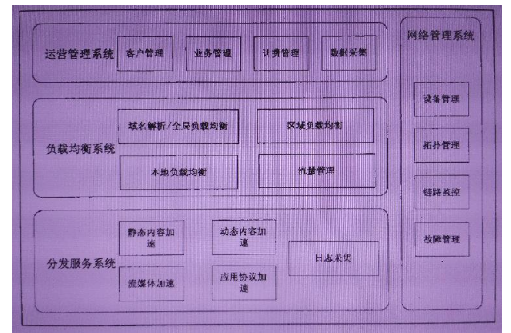

# CDN 内容分发网络

**概念**

CDN（Content Delivery Network）即[内容分发网络](https://baike.baidu.com/item/内容分发网络/4034265)。CDN是构建在现有网络基础之上的智能虚拟网络，依靠部署在各地的边缘服务器，通过中心平台的负载均衡、内容分发、调度等功能模块，使用户就近获取所需内容，降低网络拥塞，提高用户访问响应速度和命中率。

CND 一般包含：分发服务系统、负载均衡系统和管理系统。

**目的**：

解决因分布、带宽、服务器性能带来的访问延迟问题，适用于站点加速、点播、直播等场景。使用户可就近取得所需内容，解决 Internet网络拥挤的状况，提高用户访问网站的响应速度和成功率。

控制时延无疑是现代信息科技的重要指标，CDN的意图就是尽可能的减少资源在转发、传输、链路抖动等情况下顺利保障信息的连贯性。

CDN就是扮演着护航者和加速者的角色，更快准狠的触发信息和触达每一个用户，带来更为极致的使用体验。

