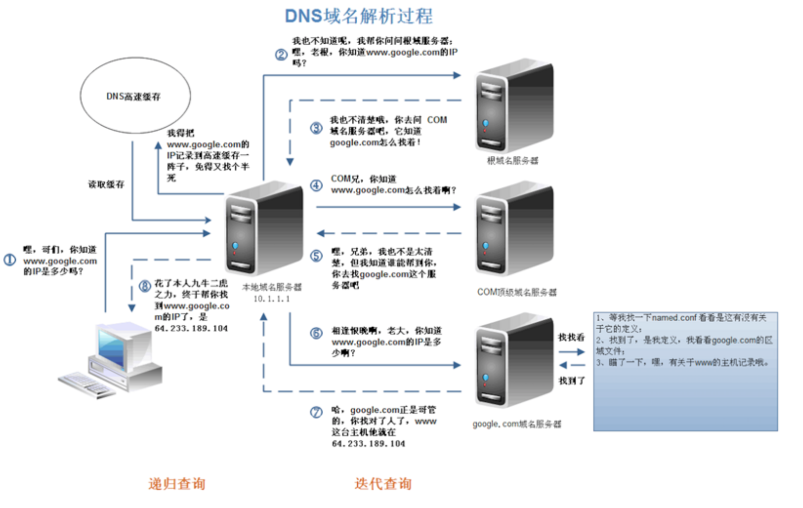
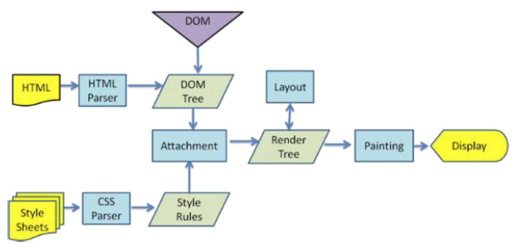
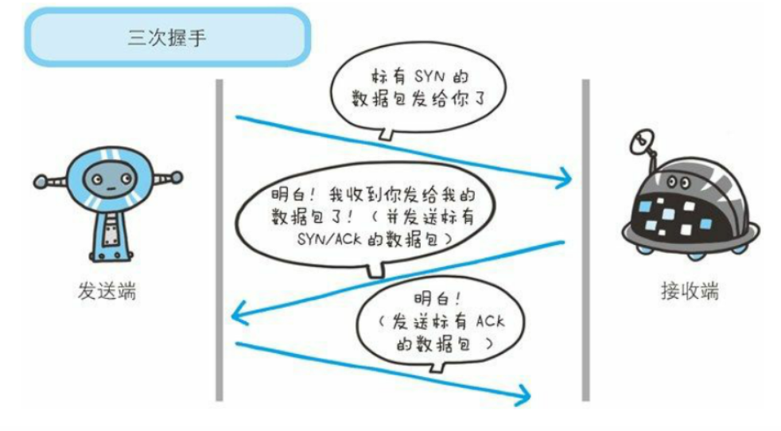

[TOC]

## 1 浏览器输入 url 地址>显示主页的过程

1 从域名注册服务进行 DNS 解析：请求 url 域名 > 服务端 IP地址；

2 服务端IP地址 > 服务端MAC地址

3 客户端：跟服务端，建立 TCP 连接；

4 客户端：向服务端，发送 HTTP 请求；

5 服务端：处理请求，并返回 HTTP 报文（HTML）

6 客户端：浏览器解析渲染界面（即显示HTML）

7 连接结束

### DNS解析IP：是一个递归查询的过程。

### 浏览器解析渲染界面

浏览器在收到HTML,CSS,JS文件后，下图对应的就是WebKit渲染的过程。浏览器是一边解析边渲染的。

## 2 各种协议与HTTP协议之间的关系

### TCP

HTTP协议是使用TCP作为其传输层协议的。

HTTP报文是包裹在TCP报文中进行传输的，当TCP出现瓶颈时，HTTP也会受到影响。

> **传输协议：**
>
> TCP 协议是一TCP (Transmission Control Protocol)和UDP(User Datagram Protocol)协议属于[传输层](https://baike.baidu.com/item/传输层)协议。
>
> - 其中TCP提供IP环境下的数据[可靠传输](https://baike.baidu.com/item/可靠传输/5588347)，它提供的服务包括[数据流](https://baike.baidu.com/item/数据流/3002243)传送、可靠性、有效流控、全双工操作和多路复用。通过面向连接、端到端和可靠的[数据包](https://baike.baidu.com/item/数据包/489739)发送。通俗说，它是事先为所发送的数据开辟出连接好的通道，然后再进行数据发送；
>
> - 而UDP则不为IP提供可靠性、流控或差错恢复功能。一般来说，TCP对应的是可靠性要求高的应用，而UDP对应的则是可靠性要求低、传输经济的应用。

### HTTP/HTTPS

**HTTP 报文是包裹在TCP报文中发送的**，服务器端收到TCP报文时会解包提取出HTTP报文。但是这个过程中存在一定的风险，**HTTP报文是明文**，如果中间被截取的话会存在一些信息泄露的风险。那么在进入TCP报文之前对HTTP做一次加密就可以解决这个问题了。HTTPS协议的本质就是HTTP + SSL(or TLS)。**在HTTP报文进入TCP报文之前，先使用SSL对HTTP报文进行加密**。从网络的层级结构看它位于HTTP协议与TCP协议之间。

### HTTP长连接、短连接

**在HTTP/1.0中，默认使用短连接：也就是说，客户端和服务器每进行一次HTTP操作，就建立一次连接，任务结束就中断连接。**当客户端浏览器访问的某个HTML或其他类型的Web页中包含有其他的Web资源(如JavaScript文件、图像 文件、CSS文件等)，每遇到这样一个Web资源，浏览器就会重新建立一个HTTP会话。

而从HTTP/1.1起，默认使用长连接，用以保持连接特性。使用长连接的HTTP协议，会在响应头加入这行代码: `Connection:keep-alive`

在使用长连接的情况下，当一个网页打开完成后，客户端和服务器之间用于传输HTTP数据的TCP连接不会关闭，客户端再次访问这个服务器时，会继续使用这一条已经建立的连接。Keep-Alive 不会永久保持连接，它有一个保持时间，可以在不同的服务器软件 (如Apache) 中设定这个时间。实现长连接需要客户端和服务端都支持长连接。

HTTP协议的长连接和短连接，实质上是TCP协议的长连接和短连接（因为HTTP是使用TCP作为其传输协议的）。

### TCP的三次握手、四次握手

TCP(Transmission Control Protocol)传输控制协议

TCP是主机对主机层的传输控制协议，提供可靠的连接服务，采用三次握手确认建立一个连接。位码即tcp标志位，有6种标示：

- SYN(synchronous建立联机) 
- ACK(acknowledgement 确认) 
- PSH(push传送) 
- FIN(finish结束) 
- RST(reset重置) 
- URG(urgent紧急)
- Sequence number(顺序号码) 
- Acknowledge number(确认号码)

原文链接：https://blog.csdn.net/qq_25948717/article/details/80382766

### TCP三次握手(创建连接）

为了准确无误地把数据送达目标处，TCP协议采用了三次握手策略。

#### *为什么要三次握手？*

三次握手的目的是建立可靠的通信信道，说到通讯，简单来说就是数据的发送与接收，而三次握手最主要的目的就是：**双方确认自己与对方的发送与接收是正常的**。

>第一次握手：Client 什么都不能确认，Server 确认了对方发送正常。
>
>第二次握手：Client 确认了：自己发送、接收正常，对方发送、接收正常；Server 确认了：自己接收正常，对方发送正常。
>
>第三次握手：Client 确认了：自己发送、接收正常，对方发送、接收正常；Server 确认了：自己发送、接收正常，对方发送接收正常。
>
>所以三次握手，就能确认双方收、发功能都正常，缺一不可。

#### *为什么要传回 SYN？*

接收端传回发送端所发送的 SYN 是为了告诉发送端，我接收到的信息确实就是你所发送的信号了。

>**SYN 是 TCP/IP 建立连接时使用的握手信号**。在客户机和服务器之间建立正常的 TCP 网络连接时，客户机首先发出一个 SYN 消息，服务器使用 SYN-ACK 应答表示接收到了这个消息，最后客户机再以 ACK（Acknowledgement，译为确认字符 ，在数据通信传输中，接收站发给发送站的一种传输控制字符。它表示确认发来的数据已经接受无误。 ）消息响应。这样在客户机和服务器之间才能建立起可靠的TCP连接，数据才可以在客户机和服务器之间传递。

#### *传了SNC，为啥还要传ACK？*

双方通信无误必须是两者互相发送信息都无误。传了 SYN，证明发送方到接收方的通道没有问题，但是接收方到发送方的通道还需要 ACK 信号来进行验证。

### TCP四次握手(关闭连接)

断开一个 TCP 连接，则需要四次挥手：

- 客户端：（发送请关闭连接）发送一个 FIN，用来关闭客户端到服务器的数据传送；
- 服务器：（收到，并ACK收到关闭的通知）收到这个 FIN，它发回一 个 ACK，确认序号为收到的序号加1 。（和 SYN 一样，一个 FIN 将占用一个序号）
- 服务器：（服务端关闭，并发送已关闭）关闭与客户端的连接，发送一个FIN给客户端
- 客户端：（收到，并ACK收到已关闭的告知）发回 ACK 报文确认，并将确认序号设置为收到序号加1

#### *为什么要四次握手*

任何一方都可以在数据传送结束后发出连接释放的通知，待对方确认后进入半关闭状态。当另一方也没有数据再发送的时候，则发出连接释放通知，对方确认后就完全关闭了TCP连接。

> 举个例子：A 和 B 打电话，通话即将结束后，A 说“我没啥要说的了”，B回答“我知道了”；但是 B 可能还会有要说的话，A 不能要求 B 跟着自己的节奏结束通话，于是 B 可能又巴拉巴拉说了一通，最后 B 说“我说完了”，A 回答“知道 了”，这样通话才算结束。