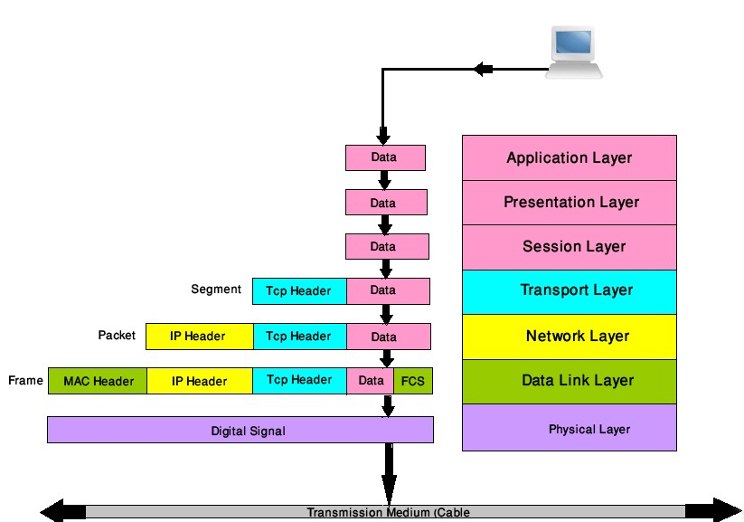

# 计算机网络编程基础

[TOC]

## OSI 7 层模型

**参考：**

- https://www.jianshu.com/p/f32cfd6c208b

- https://buildingautomationmonthly.com/what-is-the-osi-model/

OSI（Open System Interconnect，即开放式系统互联）， 一般都叫OSI参考模型，是ISO(International Organization for Standardization，即国际标准化组织)组织在1985年研究的网络互联模型。

OSI模型是构建IT所有部分的基础模型。它把[网络通信](https://baike.baidu.com/item/网络通信)的工作分为7层,分别是[物理层](https://baike.baidu.com/item/物理层),[数据链路层](https://baike.baidu.com/item/数据链路层),[网络层](https://baike.baidu.com/item/网络层),[传输层](https://baike.baidu.com/item/传输层),会话层,[表示层](https://baike.baidu.com/item/表示层)和[应用层](https://baike.baidu.com/item/应用层)。

### 1 TCP/IP模型 与 OSI 模型的关系

### 2 OSI 7层模型

- **Media Layers 媒体层（123层）** 这些层通常构成OSI模型的通信的物理和网络功能。
- **Host Layers主机层（4567层）** 这些层通常构成OSI模型的软件和应用程序端。

| Layer OSI 7层模型                       | Data 数据       | 描述                                                         | Protocol 协议                         |
| --------------------------------------- | --------------- | ------------------------------------------------------------ | ------------------------------------- |
| **7** **Application**  **应用层**       | data            | 为用户提供各种网络服务；                                     | HTTP/HTTPS、FTP、SSH、DNS、POP3、SMTP |
| **6** **Presentation**  **表现层**      | data            | **Syntax layer:**  数据各式转化、数据加密；                  | SSL, SSH, IMAP,  FTP, MPEG, JPEG      |
| **5** **Session**  **会话层**           | data            | **建立、管理、维护会话；**                                   | APIs, Sockets, WinSock                |
| **4** **Transport**  **传输层**         | Segments  段    | **建立、管理、维护主机端到端的连接**，为上层协议提供端到端的可靠和透明的数据传输服务，包括处理差错控制和流量控制等问题。 | TCP, UDP                              |
| **3** **Network**  **网络层**           | Packets  数据包 | IP选址及路由选择；                                           | IP, ICMP, RIP, IPSec, IGMP            |
| **2** **Data** **Link**  **数据链路层** | Frames  帧流    | 将比特组合成字节，再将字节组合成帧，使用链路层地址 (以太网使用MAC地址)来访问介质，并进行差错检测。 | ARP RARP IEEE802.3 PPP CSMA/CD        |
| **1** **Physical**  **物理层**          | Bits  比特流    | **Physical Structure:**  通过物理介质传输比特流。常用物理设备有：同轴电缆、fiber光纤、hubs集线器, repeaters中继器、调制解调器、wireless无线、网线、双绞线等； | FE自协商 Manchester   MLT-3 4A PAM5   |

## TCP、UDP协议

| 类型 | 是否面向连接 | 传输可靠姓 | 传输形式   | 传输效率 | 所需资源 | 应用场景         | 首部字节                 |
| ---- | ------------ | ---------- | ---------- | -------- | -------- | ---------------- | ------------------------ |
| UDP  | 无连接       | 不可靠     | 数据报文段 | 快       | 少       | 要求通信速度高   | 8个字节（由4个字段组成） |
| TCP  | 面向连接     | 可靠       | 字节流     | 慢       | 多       | 要求通信数据可靠 | 20-60                    |

### UDP

UDP（User Datagram Protocol，用户数据报协议），**是一种无连接的[传输层](https://baike.baidu.com/item/传输层)协议，提供面向事务的、简单不可靠信息的传送服务**，IETF RFC 768 [1] 是UDP的正式规范。UDP在IP报文的协议号是17。

在传送数据之前，不需要先建立连接，远程主机在收到UDP报文后，不需要给出任何确认。虽然UDP不提供任何可靠交付，但在某些情况下UDP却是一种最有效的工作方式。

UDP一般用于即时通信、多媒体数据流，不产生任何额外的数据，即使知道有破坏的包也不进行重发，如：QQ语音、QQ视频、QQ直播等。许多应用只支持UDP。**当强调传输性能而不是传输的完整性时，UDP是最好的选择**，如：音频、视频、多媒体应用。**在数据传输时间很短，以至于此前的连接过程成为整个流量主体的情况下，UDP也是一个好的选择。**

### TCP

TCP（Transmission Control Protocol，传输控制协议），**是一种面向连接的、可靠的、基于字节流的传输层通信协议**，由IETF的RFC 793 [1] 定义。

在传送数据之前必须先建立连接，数据传送结束后要释放连接。TCP不提供广播或多播服务。由于TCP要提供可靠的、面向连接的运输服务，这难免增加了许多开销，如确认、流量控制、计时器以及连接管理等，这不仅使协议数据单元的首部增大了很多，还要占用许多处理机资源。

(TCP的可靠体现在：TCP在传递数据之前，会有3次握手来建立连接，而且在数据传递时，有确认、窗口、重传、拥塞控制机制，在数据传完后，还会断开连接用来节约系统资源)

TCP一般用于文件传输、发送和接受邮件、远程登录等场景。

