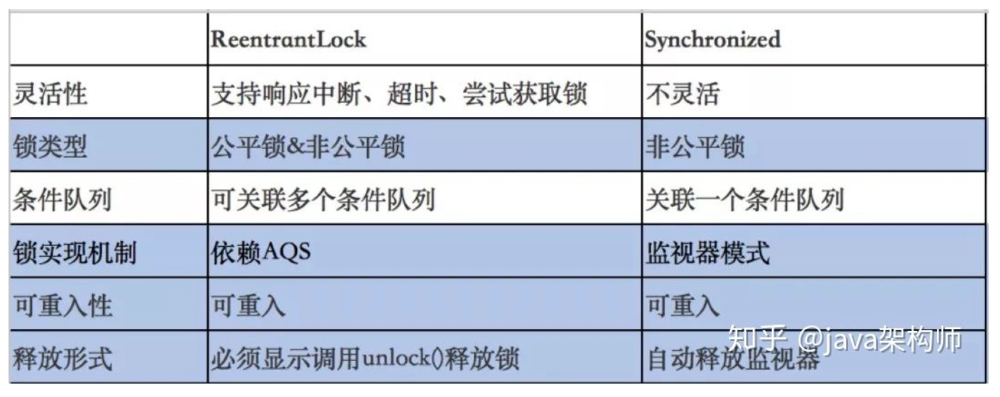
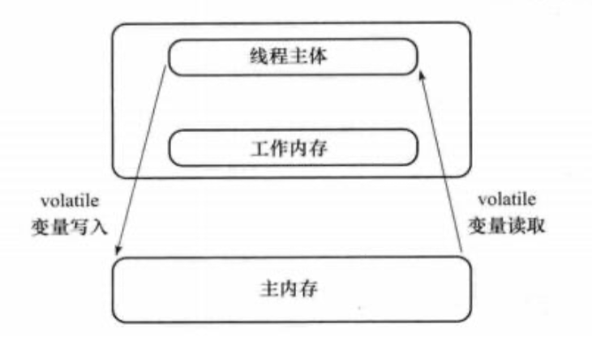
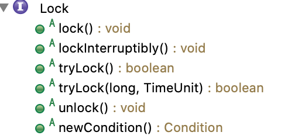

# Java多线程并发

[TOC]

并发编程主要涉及多进程、多线程、多任务以及资源共享的问题。这里着重介绍多线程、多任务及其资源共享。

**参考**：

- [JC author - Doug Lea's home page](http://gee.cs.oswego.edu/)
- Java Concurrency in Practice (Brian Goetz , ... , Doug Lea)
- Concurrent Programming in Java (Doug Lea) 
- [Java 并发编程网站](http://ifeve.com/doug-lea/)

- [Java并发原理与实战视频](https://www.bilibili.com/video/av43697557?p=5)

> JDK API学习方法提示：先看API doc，再看源码实现，在编码实验并使用jconsole监控效果。:)

## 背景：多线程的风险

**多线程的性能：**多线程用于提高性能，但多线程并不一定比单线程快。

单核cpu上也可以运行多线程，但是这些线程不是并行而是并发。因为cpu是分出多个小的时间片，来执行线程任务的，通过时间片的快速切换来达到并行的效果。cpu的核数越少，线程越多时，上下文的切换的成本就越大。

**多线程的活跃性问题**

- **死锁**

  哲学家吃饭问题：5个哲学家吃饭，1人只给1支筷子；如果大家同时吃饭，谁也不借给别人筷子，大家都不能吃饭；

- **饥饿**

  食堂排队买饭：买上的不走，那么后边就一直买不上。

  情景

  - 高优先级吞噬低优先级的时间片；（ setPriority() ）
  - 线程被永久堵塞在一个等待进入同步块的状态；
  - 等待的线程永远不被唤醒

- **活锁**

  两个人从河两边过独木桥，他们一相遇就同时后退，然后又在另一个独木桥相遇，然后又同时后退。循环往复，两人都过不了桥。


## 线程安全：问题与解决方法

#### 什么是线程安全（thread-safe）:

在多线程环境和单线程环境，都能保证正确性（复合预期，行为与其规范完全一致），就是线程安全的。

#### 线程安全问题出现的条件（缺一不可）：

- 多线程并行
- 共享一个资源
- 对资源进行了非原子性操作

无状态对象（无共享资源）一定是线程安全的。尽可能使用现有的线程安全对象（如AtomicLong）来管理类的状态。要保持状态的一致性，就需要在单个原子操作中更新所有相关的状态变量。(x++不是复合操作，不具有原子性，它包含读取-写入-修改三个操作)

#### 线程安全的解决方法：本章内容


## 0 并发编程理论基础

### 几种特性

#### 原子性 

即一个或多个操作，要么全部执行并且执行过程不会被任何因素打断，要么就都不执行。

经典例子就是银行账户转账问题：从账户A向账户B转1000元，那么必然包括2个操作：从账户A减去1000元，往账户B加上1000元。这2个操作必须要具备原子性才能保证不出现意外。

#### 可见性 

是指当多个线程访问同一个变量时，一个线程修改了这个变量的值，其他线程能够立即看到修改后的值。

#### 有序性 

即程序执行的顺序按照代码的先后顺序执行。

## 

### 先行发生原则（Happens-Before）

如果Java内存模型的有序性都只依靠volatile和synchronized来完成，那么有一些操作就会变得很啰嗦，但是我们在编写Java并发代码时并没有感受到，这是因为Java语言天然定义了一个“先行发生”原则，这个原则非常重要，依靠这个原则我们可以很容易地判断在并发环境下两个操作是否可能存在竞争冲突问题。

先行发生，是指操作A先行发生于操作B，那么操作A产生的影响能够被操作B感知到，这种影响包括修改了共享内存中变量的值、发送了消息、调用了方法等。

下面我们看看Java内存模型定义的先行发生原则有哪些：

（1）程序次序原则：按代码编写先后顺序

在一个线程内，按照程序书写的顺序执行，书写在前面的操作先行发生于书写在后面的操作，准确地讲是控制流顺序而不是代码顺序，因为要考虑分支、循环等情况。

（2）监视器锁定原则：锁的unlock>lock

一个unlock操作先行发生于后面对同一个锁的lock操作。

（3）volatile原则：变量的写>读

对一个volatile变量的写操作先行发生于后面对该变量的读操作。

（4）线程启动原则：线程的start()>线程体

对线程的start()操作先行发生于线程内的任何操作。

（5）线程终止原则：线程的其他操作>Thread.join()、Thread.isAlive()

线程中的所有操作先行发生于检测到线程终止，可以通过Thread.join()、Thread.isAlive()的返回值检测线程是否已经终止。

（6）线程中断原则：线程的

对线程的interrupt()的调用先行发生于线程的代码中检测到中断事件的发生，可以通过Thread.interrupted()方法检测是否发生中断。

（7）对象终结原则：对象的初始化完成>它的finalize()

一个对象的初始化完成（构造方法执行结束）先行发生于它的finalize()方法的开始。

（8）传递性原则：

如果操作A先行发生于操作B，操作B先行发生于操作C，那么操作A先行发生于操作C。

这里说的“先行发生”与“时间上的先发生”没有必然的关系。

比如，下面的代码：

```
int a = 0;
// 操作A：线程1对进行赋值操作a = 1;
// 操作B：线程2获取a的值
int b = a;
```

如果线程1在时间顺序上先对a进行赋值，然后线程2再获取a的值，这能说明操作A先行发生于操作B吗？

显然不能，因为线程2可能读取的还是其工作内存中的值，或者说线程1并没有把a的值刷新回主内存呢，这时候线程2读取到的值可能还是0。

所以，“时间上的先发生”不一定“先行发生”。

再看一个例子：

```
// 同一个线程中int i = 1;
int j = 2;
```

根据第一条程序次序原则， `inti=1;`先行发生于 `intj=2;`，但是由于处理器优化，可能导致 `intj=2;`先执行，但是这并不影响先行发生原则的正确性，因为我们在这个线程中并不会感知到这点。

所以，“先行发生”不一定“时间上先发生”。

## 

#### 死锁（Dead Lock）

**死锁的含义：**当线程T1持有锁L1并想获得锁L2的同时，线程T2持有锁L2并尝试所得锁L1，那么这两个线程将永远的等待下去，这种情况就是最简单的死锁。

**死锁产生的四个必要条件：**

- 互斥条件：指进程对所分配到的资源进行排它性使用，即在一段时间内某资源只由一个进程占用。如果此时还有其它进程请求资源，则请求者只能等待，直至占有资源的进程用毕释放。
- 请求和保持条件：指进程已经保持至少一个资源，但又提出了新的资源请求，而该资源已被其它进程占有，此时请求进程阻塞，但又对自己已获得的其它资源保持不放。
- 不剥夺条件：指进程已获得的资源，在未使用完之前，不能被剥夺，只能在使用完时由自己释放。
- 环路等待条件：指在发生死锁时，必然存在一个进程——资源的环形链，即进程集合{P0，P1，P2，···，Pn}中的P0正在等待一个P1占用的资源；P1正在等待P2占用的资源，……，Pn正在等待已被P0占用的资源。

**避免死锁的方法：**

- 一次性分配所有资源，这样就不会再有请求了：（破坏请求条件）
- 只要有一个资源得不到分配，也不给这个进程分配其他的资源：（破坏保持条件）
- 可剥夺资源：即当某进程获得了部分资源，但得不到其它资源，则释放已占有的资源（破坏不可剥夺条件）
- 资源有序分配法：系统给每类资源赋予一个编号，每一个进程按编号递增的顺序请求资源，释放则相反（破坏环路等待条件）

**检测死锁**

1 首先为每个线程程和每个资源指定一个唯一的号码；

2 然后建立资源分配表和线程等待表。

**检测死锁的工具**

1 jstack 命令：

jstack是java虚拟机自带的一种**堆栈跟踪工具**。jstack用于打印出给定的java进程ID或core file或远程调试服务的Java堆栈信息。

2 jconsole 工具

Jconsole是**JDK自带的监控工具**，在JDK/bin目录下可以找到。它用于连接正在运行的本地或者远程的JVM，对运行在Java应用程序的资源消耗和性能进行监控，并画出大量的图表，提供强大的可视化界面。


### 锁的分类

- 线程是否需要对资源加锁：乐观锁和悲观锁；
- 资源已经被锁定，线程是否阻塞：自旋锁
- 在嵌套调用中可以重复获取锁：可重入锁；
- 从多个线程并发访问资源，Synchronized 四种状态：**无锁**、**偏向锁**、 **轻量级锁** 和 **重量级锁**
- 多个线程获取锁的顺序是否根据排队顺序：公平锁和非公平锁；
- 多个线程能否获取同一把锁：排他锁和共享锁；

| （锁都是互斥的）                     | 可重入 | 可中断 | 公平策略 | 共享锁                        | 优点和风险                                                   |      |
| ------------------------------------ | ------ | ------ | -------- | ----------------------------- | ------------------------------------------------------------ | ---- |
| synchronized(内置锁/监视器锁)        | 是     | 否     | 不支持   | 不支持                        | synchronized 不需要手动解锁，但容易产生死锁。恢复程序的唯一方法，是重新启动程序；防止死锁的唯一方法，是在构造程序时避免出现不一致的锁顺序； |      |
| ReentrantLock(可重入锁)              | 是     | 是     | 支持     | 不支持                        | ReentrantLock是一种无条件的、可轮询的、可定时的、可中断的锁。但是必须手动unlock，如果忘记则会产生巨大风险。 |      |
| ReentrantReadWriteLock(可重入读写锁) | 是     | 是     | 支持     | 读-读共享，读-写、写-写互斥。 | 必须手动unlock，如果忘记则会产生巨大风险。                   |      |
| StampedLock                          | 否     |        |          |                               |                                                              |      |
|                                      |        |        |          |                               |                                                              |      |
|                                      |        |        |          |                               |                                                              |      |
|                                      |        |        |          |                               |                                                              |      |
|                                      |        |        |          |                               |                                                              |      |
|                                      |        |        |          |                               |                                                              |      |


## 1 synchronized(内置锁/监视器锁)：同步方法/代码块

>**锁的概念**
>
>- 锁有两种主要特性：***互斥（mutual exclusion）* 和*可见性（visibility）***。
>
> **互斥**即一次只允许一个线程持有某个特定的锁，因此可使用该特性实现对共享数据的协调访问协议，这样，一次就只有一个线程能够使用该共享数据。
>
> **可见性**要更加复杂一些，它必须确保释放锁之前对共享数据做出的更改对于随后获得该锁的另一个线程是可见的 —— 如果没有同步机制提供的这种可见性保证，线程看到的共享变量可能是修改前的值或不一致的值，这将引发许多严重问题。
>
>- **内置锁**：在Java中，每个对象都可以用作内置锁。synchronized给修饰的对象（方法或代码块）加内置锁。
>-  **显式锁**：在Java中，是Lock接口的实现，作用于代码块，需要手动加、解锁。
>
>加锁机制即可以确保**可见性**，又可以确保**原子性**。

synchronized是Java提供的重量级同步机制（该关键字的底层是hotspot JVM中通过C++来实现）；修饰方法和代码块，给修饰的对象加内置锁，使线程间互斥从而保证线程安全，既可保证操作的原子性，又可以保证共享资源的可见性。

synchronized，**在JavaSE1.6之前**，synchronized属于重量级锁，效率低下，因为监视器锁(monitor)是依赖于底层的操作系统的互斥锁（Mutex Lock）来实现的，Java 的线程是映射到操作系统的原生线程之上的。如果要挂起或者唤醒一个线程， 都需要操作系统帮忙完成，而操作系统实现线程之间的切换时需要从用户态转换到内核态，这个状态之间的转换需要相对比较长的时间，时间成本相对较高，这也是为什么早期的 synchronized 效率低的原因。**在 JavaSE1.6 之后**，为了减少获得锁和释放锁带来的性能消耗，而引入的偏向锁和轻量级锁，优化之后变得更轻量，且性能也更好；实际开发中使用 synchronized 关键字的场景比volatile多些。 

**使用方式：**

用于普通方法：对**当前对象实例**加锁，进入同步代码前要获得当前对象实例的锁；

用于静态方法：对**当前类对象**加锁，进入同步代码前要获得当前类对象的锁；

用于代码块：对**synchronized(指定的对象)**加锁，进入同步代码块前要获得给定对象的锁。

```java
//对当前类的实例加锁
synchronized void method(){
}
//对当前类对象加锁
synchronized static void staticMethod(){
}
//this 是当前类的实例, obj 
synchronized(this/obj){
}
```





## 2 volatile关键字：保证变量可见性

volatile 仅可修饰变量；volatile 变量可以确保可见性、有序性（确保变量在一个线程的更新操作通知到其他所有线程），但不具备原子性。

> **注意**：volatile 不具备原子性，这是 volatile 与 synchronized、java.util.concurrent.locks.Lock 最大的功能差异。

volatile还有一个作用是防止指令重排序；

> 指令重排序：对于没有依赖关系的指令进行重排序，来优化提升性能。
>
>  例如： int a=1; int b=2; int c=a+b; 三个语句中，可以重排序 int a=1; 和 int b=2; 来进行优化，但 int c=a+b;需要依赖前两个语句所以他的位置不能变。

在访问volatile变量时**不会执行加锁**操作，因此也就不会执行线程阻塞；

Java 的 volatile 关键字用于标记一个变量是“应当存储在主存”。更确切地说，每次读取volatile变量，都应该从主存读取，而不是从CPU缓存读取。每次写入一个volatile变量，应该写到主存中，而不是仅仅写到CPU缓存。



**synchronized与volatile比较**

- volatile是synchronized的轻量级实现，性能上：volatile优于synchronized。
- volatile只能用于变量，而synchronized可以修饰方法和代码块。
- volatile只能保证数据的可见性，但不能保证数据的原子性。synchronized关键字两者都能保证。
- 多线程访问，volatile不会发生阻塞（不加锁），而synchronized可能会发生阻塞（加锁）。

**volatile变量使用的必要条件（缺一不可）：**

- 对变量的写入操作不依赖变量的当前值，或者只有一个线程对变量执行更新操作；
- 该变量不会与其他状态变量一起纳入不变性条件；
- 访问变量时不需要加锁。

volatile变量的典型用法：用作状态标记，以判断是否退出循环。如下代码。

```
//将 volatile 变量作为状态标志使用
volatile boolean shutdownRequested; 
public void shutdown() { shutdownRequested = true; }

public void doWork() { 
    while (!shutdownRequested) { 
        // do stuff
    }
}
```

**参考：**[正确使用 Volatile 变量](https://www.ibm.com/developerworks/cn/java/j-jtp06197.html)

volatile变量来控制状态的可见性，通常比使用锁的代码更脆弱也更难以理解，要谨慎使用：因为volatile的语义不足以确保操作（如i++）的原子性，除非能够保证只有一个线程执行变量的写操作（Atomic原子变量提供了变量的 ‘读-改-写’ 的原子操作，常用作 ‘更好的volatile变量’。）。


## CAS 操作

**CAS(CompareAndSwap/CompareAndSet）比较并交换**。是用于实现多线程同步的**原子指令**。 Java1.5 开始引入了 CAS，主要代码都放在 java.util.concurrent.atomic 包下，通过 sun 包下的 Unsafe 类实现，而Unsafe类中的方法都是 native 方法，由 JVM 本地实现。

**CAS实现原理：**

CAS机制中使用了3个基本操作数：内存地址V，旧的预期值A，要修改的新值B。原理是：**当更新一个变量的时候：只有当变量的预期值A和内存地址V当中的实际值相同时，才会将内存地址V对应的值修改为B。这是作为单个原子操作完成的。**

**CAS的缺点：**

1 CPU开销较大：在并发量比较高的情况下，如果许多线程反复尝试更新某一个变量，却又一直更新不成功，循环往复，会给CPU带来很大的压力。

2 不能保证代码块的原子性：CAS机制所保证的只是一个变量的原子性操作，而不能保证整个代码块的原子性。比如需要保证3个变量共同进行原子性的更新，就不得不使用Synchronized了。


## 3 Atomic 原子类

### Atomic 原子类

这里的 Atomic 指一个操作是不可中断的。即使在多个线程一起执行时，一个操作一旦开始就不会被其他线程干扰。所以，所谓原子类说简单点就是具有原子操作特征的类。
原子类都在 包java.util.concurrent.atomic 下，如下。

```
基本类型：使用原子的方式更新基本类型
AtomicInteger:整形原子类 
AtomicLong:长整型原子类
AtomicBoolean :布尔型原子类

数组类型：使用原子的方式更新数组里的某个元素
AtomicIntegerArray:整形数组原子类 
AtomicLongArray:长整形数组原子类 
AtomicReferenceArray :引用类型数组原子类

引用类型
AtomicReference:引用类型原子类 
AtomicStampedRerence:原子更新引用类型里的字段原子类 
AtomicMarkableReference :原子更新带有标记位的引用类型

对象的属性修改类型 
AtomicIntegerFieldUpdater:原子更新整形字段的更新器
AtomicLongFieldUpdater:原子更新长整形字段的更新器
AtomicStampedReference:原子更新带有版本号的引用类型。该类将整数值与引用关联起来，可用于解决原 子的更新数据和数据的版本号，可以解决使用 CAS 进行原子更新时可能出现的 ABA 问题。
```

例子：AtomicLong

常用方法：

```java
public final long get() //获取当前的值
public final long getAndSet(long newValue)//获取当前的值，并设置新的值
public final long getAndIncrement()//获取当前的值，并自增
public final long getAndDecrement() //获取当前的值，并自减
public final long getAndAdd(int delta) //获取当前的值，并加上预期的值
public final boolean compareAndSet(long expectedValue, long newValue) //如果输入的数值等于预期值，则以原子方式将该值设置 为输入值(update)

public final void lazySet(long newValue)//最终设置为newValue,使用 lazySet 设置之后可能导致其他线 程在之后的一小段时间内还是可以读到旧的值。 
```

源码及原理

AtomicLong 类主要利用 CAS (compare and swap)、volatile 和 native 方法（unsafe的objectFieldOffset方法）保证可见性和原子操作，从而避免 synchronized 的高开销，使执行效率大为提升。

CAS 的原理是拿期望的值和原本的一个值作比较，如果相同则更新成新的值。UnSafe 类的 objectFieldOffset() 方法是一个本地方法，这个方法是用来拿到“原来的值”的内存地址，返回值是 valueOffset；value 是一个 volatile 变 量，在内存中可见。因此，JVM可以保证任何时刻任何线程总能拿到该变量的最新值。

```java
		/*
     * This class intended to be implemented using VarHandles, but there
     * are unresolved cyclic startup dependencies.
     */
    private static final jdk.internal.misc.Unsafe U = jdk.internal.misc.Unsafe.getUnsafe();
    private static final long VALUE = U.objectFieldOffset(AtomicLong.class, "value");

    private volatile long value;
```

使用：

```java
public class Sequence {
	private AtomicLong; 
  public Sequence()
  {
     value = new AtomicLong(0);
  }
	public Long getNext() {
		return value.getAndIncrement();
	}
	public static void main(String[] args) {
		Sequence seq = new Sequence();
		for (int i = 1; i <= 10; i++) {
			Thread t = new Thread() {
				@Override
				public void run() {
			  	System.out.println(Thread.currentThread().getName() + "---" + seq.getNext());
				}
			};
			t.start();
		}
	}
}
```


## 4 并发集合

The `java.util.concurrent` package includes a number of additions to the Java Collections Framework. These are most easily categorized by the collection interfaces provided:

### BlockingQueue (FIFO)

[`BlockingQueue`](https://docs.oracle.com/javase/8/docs/api/java/util/concurrent/BlockingQueue.html) defines a first-in-first-out data structure that blocks or times out when you attempt to add to a full queue, or retrieve from an empty queue.

### ConcurrentMap/ConcurrentHashMap

[`ConcurrentMap`](https://docs.oracle.com/javase/8/docs/api/java/util/concurrent/ConcurrentMap.html) is a subinterface of [`java.util.Map`](https://docs.oracle.com/javase/8/docs/api/java/util/Map.html) that defines useful atomic operations. These operations remove or replace a key-value pair only if the key is present, or add a key-value pair only if the key is absent. Making these operations atomic helps avoid synchronization. The standard general-purpose implementation of `ConcurrentMap` is [`ConcurrentHashMap`](https://docs.oracle.com/javase/8/docs/api/java/util/concurrent/ConcurrentHashMap.html), which is a concurrent analog of [`HashMap`](https://docs.oracle.com/javase/8/docs/api/java/util/HashMap.html).

### ConcurrentNavigableMap

[`ConcurrentNavigableMap`](https://docs.oracle.com/javase/8/docs/api/java/util/concurrent/ConcurrentNavigableMap.html) is a subinterface of `ConcurrentMap` that supports approximate matches. The standard general-purpose implementation of `ConcurrentNavigableMap` is [`ConcurrentSkipListMap`](https://docs.oracle.com/javase/8/docs/api/java/util/concurrent/ConcurrentSkipListMap.html), which is a concurrent analog of [`TreeMap`](https://docs.oracle.com/javase/8/docs/api/java/util/TreeMap.html).


## 5 Lock 接口的实现（显式锁）对代码块加、解锁

Lock接口是自 jdk1.5 添加的，Lock作用于代码块， 需要手动加锁 lock() 和解锁 unlock() 。Lock接口和实现类（ReentrantLock）都在包 java.util.concurrent.locks 中。

### Lock 接口

outline



```java
 /**
 * {@code Lock} implementations provide more extensive locking
 * operations than can be obtained using {@code synchronized} methods
 * and statements.  They allow more flexible structuring, may have
 * quite different properties, and may support multiple associated
 * {@link Condition} objects.
 *
 * <p>A lock is a tool for controlling access to a shared resource by
 * multiple threads. Commonly, a lock provides exclusive access to a
 * shared resource: only one thread at a time can acquire the lock and
 * all access to the shared resource requires that the lock be
 * acquired first. However, some locks may allow concurrent access to
 * a shared resource, such as the read lock of a {@link ReadWriteLock}.
 *
 * <p>The use of {@code synchronized} methods or statements provides
 * access to the implicit monitor lock associated with every object, but
 * forces all lock acquisition and release to occur in a block-structured way:
 * when multiple locks are acquired they must be released in the opposite
 * order, and all locks must be released in the same lexical scope in which
 * they were acquired.
 *
 * <p>While the scoping mechanism for {@code synchronized} methods
 * and statements makes it much easier to program with monitor locks,
 * and helps avoid many common programming errors involving locks,
 * there are occasions where you need to work with locks in a more
 * flexible way. For example, some algorithms for traversing
 * concurrently accessed data structures require the use of
 * &quot;hand-over-hand&quot; or &quot;chain locking&quot;: you
 * acquire the lock of node A, then node B, then release A and acquire
 * C, then release B and acquire D and so on.  Implementations of the
 * {@code Lock} interface enable the use of such techniques by
 * allowing a lock to be acquired and released in different scopes,
 * and allowing multiple locks to be acquired and released in any
 * order.
 *
 * <p>With this increased flexibility comes additional
 * responsibility. The absence of block-structured locking removes the
 * automatic release of locks that occurs with {@code synchronized}
 * methods and statements. In most cases, the following idiom
 * should be used:
 *
 * <pre> {@code
 * Lock l = ...;
 * l.lock();
 * try {
 *   // access the resource protected by this lock
 * } finally {
 *   l.unlock();
 * }}</pre>
 * @see ReentrantLock
 * @see Condition
 * @see ReadWriteLock
 *
 * @since 1.5
 * @author Doug Lea
 */
public interface Lock {
 /**
     * Acquires the lock.
     * <p>If the lock is not available then the current thread becomes
     * disabled for thread scheduling purposes and lies dormant until the
     * lock has been acquired.
     *
     * <p><b>Implementation Considerations</b>
     * <p>A {@code Lock} implementation may be able to detect erroneous use
     * of the lock, such as an invocation that would cause deadlock, and
     * may throw an (unchecked) exception in such circumstances.  The
     * circumstances and the exception type must be documented by that
     * {@code Lock} implementation.
     */
    void lock();
    
    /**
     * Releases the lock.
     *
     * <p><b>Implementation Considerations</b>
     * <p>A {@code Lock} implementation will usually impose
     * restrictions on which thread can release a lock (typically only the
     * holder of the lock can release it) and may throw
     * an (unchecked) exception if the restriction is violated.
     * Any restrictions and the exception
     * type must be documented by that {@code Lock} implementation.
     */
    void unlock();
```


### ReentrantLock 可重入锁（基于AQS） 

源码解析：

```java
ReentrantLock.java 代码片段 
/**
 * A reentrant mutual exclusion {@link Lock} with the same basic
 * behavior and semantics as the implicit monitor lock accessed using
 * {@code synchronized} methods and statements, but with extended
 * capabilities.
 *
 * <p>A {@code ReentrantLock} is <em>owned</em> by the thread last
 * successfully locking, but not yet unlocking it. A thread invoking
 * {@code lock} will return, successfully acquiring the lock, when
 * the lock is not owned by another thread. The method will return
 * immediately if the current thread already owns the lock. This can
 * be checked using methods {@link #isHeldByCurrentThread}, and {@link
 * #getHoldCount}.
 *
 * @since 1.5
 * @author Doug Lea
 */
public class ReentrantLock implements Lock, java.io.Serializable {
    private static final long serialVersionUID = 7373984872572414699L;
    /** Synchronizer providing all implementation mechanics */
    private final Sync sync;
  
    /**
     * Creates an instance of {@code ReentrantLock}.
     * This is equivalent to using {@code ReentrantLock(false)}.
     */
    public ReentrantLock() {
        sync = new NonfairSync();
    }

    /**
     * Creates an instance of {@code ReentrantLock} with the given fairness policy.
     * @param fair {@code true} if this lock should use a fair ordering policy
     */
    public ReentrantLock(boolean fair) {
        sync = fair ? new FairSync() : new NonfairSync();
    }
 }
```

使用方法：

```java
public class Sequence {
	private ReentrantLock lock;
  private int value;
  public Sequence(){
    lock = new ReentrantLock();
    value = 0;
  }
	public int getNext() {
		lock.lock();
		value++;
		lock.unlock();
		return value;
	}
}
```


### 自定义可重入锁（implements Lock）

```java
//可重入锁的实现
public class MyLock implements Lock {
	private boolean isLocked = false;
	private Thread lockedBy = null;
	private int lockCount = 0;

	@Override
	public synchronized void lock() {
		Thread currentLock = Thread.currentThread();
		while(isLocked && currentLock != lockedBy)//自旋
		{
			try {
				this.wait();
			} catch (InterruptedException e) {
				e.printStackTrace();
			}
		}
		isLocked = true;
		lockedBy = currentLock;
		lockCount ++;
	}
	
	@Override
	public synchronized void unlock() {
		if(lockedBy != Thread.currentThread())
		{
			lockCount--;
			if(lockCount == 0)
			{
				this.notify();
				isLocked = false;
			}
		}
	}
	//...
}

public class Sequence {
	private MyLock lock = new MyLock();
	public void a() {
		lock.lock();
		System.out.println("a.....");
		b();// 重入
		lock.unlock();
	}
	public void b() {
		lock.lock();
		System.out.println("b.....");
		lock.unlock();
	}

	public static void main(String[] args) {
		Sequence seq = new Sequence();

		Thread t1 = new Thread() {
			@Override
			public void run() {
				while (true)
					seq.a();
			}
		};
		Thread t2 = new Thread() {
			@Override
			public void run() {
				while (true)
					seq.a();
			}
		};
		t1.start();
		t2.start();
	}
}
//运行结果就是a()和b()方法中代码均可正常打印。
```


## 6 AQS 抽象队列式同步器 - 构建锁及其他同步组件的基础框架

java.util.concurrent.locks.AbstractQueuedSynchronizer（AQS）队列同步器：是用来构建锁或者其他同步组件的基础框架。

参考：https://www.zhihu.com/people/an-shi-yan-50

### AQS核心思想

AQS核心思想是：如果被请求的共享资源空闲，则将当前请求资源的线程设置为有效的工作线程，并且将共享资源设 置为锁定状态。如果被请求的共享资源被占用，那么就需要一套线程阻塞等待以及被唤醒时锁分配的机制，这个机制 AQS是用CLH队列锁实现的，即将暂时获取不到锁的线程加入到队列中。

> CLH(Craig,Landin,and Hagersten)队列(FIFO)：是一个虚拟的双向队列(虚拟的双向队列即不存在队列实例，仅存在结点之间的关联关系)。AQS是将每条请求共享资源的线程封装成一个CLH锁队列的一个结点(Node)来实现锁 的分配。

**基于AQS实现的锁有：在LOCK包中的相关锁(常用的有ReentrantLock、 ReadWriteLock)都是基于AQS来构建，一般我们叫AQS为同步器。**

### AQS源码核心点：

- **state 同步状态**：这是`AbstractQueuedSynchronizer`里一个万能的属性，具体是什么含义，全看你的使用方式，比如在`CountDownLatch`里，它代表了当前到达后正在等待的线程数，在`Semaphore`里，它则表示当前进去后正在运行的线程数；

  ```java
  private volatile int state;
  protected final int getState() {
       return state;
  }
  protected final void setState(int newState) {
       state = newState;
  }
  protected final boolean compareAndSetState(int expect, int update) {
       return STATE.compareAndSet(this, expect, update);
  }
  ```

- **CAS**: AQS里大量用了CAS（Compare and Swap）操作来修改state的值

- **LockSupport**: AQS里用了大量的LockSupport的park()和unpark()方法，来挂起和唤醒线程

- **同步队列和条件队列**：sync queue and condition queue，弄清楚这两个队列的关系，AQS也就弄懂大半

- **公平和非公平**：有线程竞争，就有公平和非公平的问题。锁释放的时候，刚好有个线程过来获取锁，但这时候线程等待队列里也有线程在等待，到底是给排队时间最久的线程呢(公平)，还是允许新来的线程参与竞争（不公平）？

​       AQS 通过内置的FIFO双向队列：来完成获取锁线程的排队工作

- 同步器包含两个节点类型的应用，一个指向头节点，一个指向尾节点，未获取到锁的线程会创建节点线程安全（compareAndSetTail）的加入队列尾部。同步队列遵循FIFO，首节点是获取同步状态成功的节点。


- 未获取到锁的线程将创建一个节点，设置到尾节点。如下图所示：


- 首节点的线程在释放锁时，将会唤醒后继节点。而后继节点将会在获取锁成功时将自己设置为首节点。如下图所示：


### 源码摘要：

```java
/*
 * @since 1.5
 * @author Doug Lea
 */
public abstract class AbstractQueuedSynchronizer
    extends AbstractOwnableSynchronizer
    implements java.io.Serializable {
{
    /**
     * Head of the wait queue, lazily initialized.  Except for initialization, it is modified only via method setHead.  Note: If head exists, its waitStatus is guaranteed not to be CANCELLED.
     */
    private transient volatile Node head;
    // Tail of the wait queue, lazily initialized.  Modified only via method enq to add new wait node.
    private transient volatile Node tail;
    //The synchronization state.
    private volatile int state;

		static final class Node {
        volatile Node prev;
        volatile Node next;
        volatile Thread thread;
        ...
		}
    
    /* @return {@code true} if there is a queued thread preceding the current thread, and {@code false} if the current thread is at the head of the queue or the queue is empty
     * @since 1.7
     */
    public final boolean hasQueuedPredecessors() {
        Node h, s;
        if ((h = head) != null) {
            if ((s = h.next) == null || s.waitStatus > 0) {
                s = null; // traverse in case of concurrent cancellation
                for (Node p = tail; p != h && p != null; p = p.prev) {
                    if (p.waitStatus <= 0)
                        s = p;
                }
            }
            if (s != null && s.thread != Thread.currentThread())
                return true;
        }
        return false;
    }
}
```


## 7 并发工具类

### Semaphore(信号量): 

允许多个线程同时访问，synchronized 和 ReentrantLock 都是一次只允许一个线程访问某个资源，Semaphore(信号量)可以指定多个线程同时访问某个资源。

**主要应用场景：**控制同时访问资源的线程数。如：多人抢占n个厕所坑位的的情景（这个例子有味道）。

#### acquire 、release、drainPermits()

默认情况下：

- int availablePermits()：当前可获得的所有 permits 的总数；
- 一次 acquire() 消耗一个 perimit，availablePermits() 减 1 ；

- 一次 release() 生产一个 permit，availablePermits() 加 1 ；
- int drainPermits()：获取当前可获得的所有 permits 数，并返回数量；如果当前 permits 数为负值，则全部 release ，返回 0 ； 

#### 初始perimits值 的几种情况：

- **为负值：**一开始所有线程acquire不到permit；多次release后直到availablePermits>=1，才可以得到permit。
- **为零：**一开始所有线程都acquire不到permit；一次release后直到availablePermits为1，才可以得到一个permit。
- **为正值：**一开始限制数量内的线程acquire可以到perimit；

#### Semaphore 的两种模式:

- **公平模式：** 调用acquire的顺序就是获取许可证(permit)的顺序，遵循FIFO；
- **非公平模式：** 抢占式的。

源码解析：

```java
 /*Semaphore.java 代码摘要*/
  //非公平模式构造方法
  public Semaphore(int permits) {
    sync = new NonfairSync(permits);
  }
  //自定义公平模式构造方法
  public Semaphore(int permits, boolean fair) {
    sync = fair ? new FairSync(permits) : new NonfairSync(permits);
  }

  /**  Acquires a permit from this semaphore, blocking until one is available, or the thread is {@linkplain Thread#interrupt interrupted}.
     * <p>Acquires a permit, if one is available and returns immediately, reducing the number of available permits by one.
     * <p>If no permit is available then the current thread becomes disabled for thread scheduling purposes and lies dormant until one of two things happens:
     * <ul>
     * <li>Some other thread invokes the {@link #release} method for this semaphore and the current thread is next to be assigned a permit; or
     * <li>Some other thread {@linkplain Thread#interrupt interrupts} the current thread.
     * </ul>
     * 
     * <p>If the current thread:
     * <ul>
     * <li>has its interrupted status set on entry to this method; or
     * <li>is {@linkplain Thread#interrupt interrupted} while waiting for a permit,
     * </ul>
     * then {@link InterruptedException} is thrown and the current thread's
     * interrupted status is cleared.
     * @throws InterruptedException if the current thread is interrupted
     */
    public void acquire() throws InterruptedException {
        sync.acquireSharedInterruptibly(1);
    }
```

API测试：

```
  	Semaphore sneg1 = new Semaphore(-1);
		System.out.println("original perimits= "+ sneg1.availablePermits());
		sneg1.release();
		System.out.println("after 1st release= "+ sneg1.availablePermits());
		sneg1.release();
		System.out.println("after 2nd release= "+ sneg1.availablePermits());
		sneg1.release();
		System.out.println("after 3nd release= "+ sneg1.availablePermits());
		sneg1.acquire();
		System.out.println("after 1st acquire= "+ sneg1.availablePermits());
	    
		Semaphore s2 = new Semaphore(2);
		System.out.println(s2.drainPermits() + " = " + s2.availablePermits());
		Semaphore sNeg2 = new Semaphore(-2);
		System.out.println(sNeg2.drainPermits() + " = " + sNeg2.availablePermits());

输出：
original perimits= -1
after 1st release= 0
after 2nd release= 1
after 3nd release= 2
after first acquire= 1
2 permit semaphore:2 = 0
-2 permit semaphore:-2 = 0
```

**使用例子：**

```java
public class SemaphoreTest {
	public static void test(int threadnum) throws InterruptedException {
        Thread.sleep(1000);// 模拟请求的耗时操作
        System.out.println("threadnum:" + threadnum);
    }
	public static void main(String[] args) {
	  final int allThreads = 40;
		ExecutorService threadPool = Executors.newFixedThreadPool(10);
		final Semaphore sph = new Semaphore(4);
		for(int i=0; i<allThreads; i++)
		{
			final int threadnum = i;
			threadPool.execute(() -> {
				try {
					//执行 acquire 方法阻塞，直到获得一个许可证
					sph.acquire();
					test(threadnum);
					//release 方法增加一个许可证，这可能会释放一个阻塞的acquire方法
					sph.release();
				} catch (InterruptedException e) {
					e.printStackTrace();
				}
			});
		}
	}
}
```


### CountDownLatch (倒计时器): 

是一个同步工具类，用来协调多个线程之间的同步。这个工具通常用来控制线程等待，它可以让某一个线程等待直到倒计时结束，再开始执行。 

**两种典型应用场景：**

**1 某一线程在开始运行前 等待n个线程执行完毕。**将 CountDownLatch 的计数器初始化为n ：`new CountDownLatch(n)`，每当一个任务线程执行完毕，就将计数器减1 `countdownlatch.countDown()`，当计数器的值变为0时，在`CountDownLatch上 await()` 的线程就会被唤醒。一个典型应用场景就是启动一个服务时，主线程需要等待多个组件加载完毕，之后再继续执行。

**2 实现多个线程开始执行任务的 最大并行性 。**注意是并行不是并发，强调的是多个线程在某一时刻同时开始执行。类似于赛跑，将多个线程放到起点，等待发令枪响，然后同时开跑。做法是初始化一个共享的 `CountDownLatch` 对象，将其计数器初始化为 1 ：`new CountDownLatch(1)`，多个线程在开始执行任务前首先 `coundownlatch.await()`，当主线程调用 countDown() 时，计数器变为0，多个线程同时被唤醒。

**不足：**CountDownLatch是一次性的，计数器的值只能在构造方法中初始化一次，之后没有任何机制再次对其设置值，当CountDownLatch使用完毕后，它不能再次被使用。

**使用方法：**

```java
public class CountDownLatchTest {
	public static void main(String[] args) throws InterruptedException {
		final int threadCount = 20;
		ExecutorService threadPool = Executors.newFixedThreadPool(5);
		final CountDownLatch countDownLatch = new CountDownLatch(threadCount);
		for (int i = 0; i < threadCount; i++) {
			final int threadnum = i;
			threadPool.execute(() -> {
				try {
					test(threadnum);
				} catch (InterruptedException e) {
					e.printStackTrace();
				} finally {
					countDownLatch.countDown();// 表示一个请求已经被完成
				}
			});
		}
		countDownLatch.await();//阻塞直到全部完成
		threadPool.shutdown();
		System.out.println("finish");
	}

	public static void test(int threadnum) throws InterruptedException   {
		Thread.sleep(1000);// 模拟请求的耗时操作
		System.out.println("threadnum:" + threadnum);
	}
}
```


### CyclicBarrier(循环栅栏): 

CyclicBarrier 和 CountDownLatch 非常类似，它也可以实现线程间的计数等待，但是它的功能比 CountDownLatch 更加复杂和强大。

主要应用场景和 CountDownLatch 类似。

CyclicBarrier 的字面意思是可循环使用(Cyclic)的屏障(Barrier)。它要做的事情是，让一组线程到达一个屏障(也可以叫同步点)时被阻塞，直到最后一个线程到达屏障时，屏障才会开门，所有被屏障拦截的线程才会继续干活。 

CyclicBarrier默认的构造方法是 CyclicBarrier(int parties)，其参数表示屏障拦截的线程数量，每个线程调用 await 方法告诉 CyclicBarrier 我已经到达了屏障，然后当前线程被阻塞，直到这个CyclicBarrier对象await拦截的线程数达到，才会继续往下执行。

**两种构造方法：**

```java
    /** 
     * @param parties the number of threads that must invoke {@link #await} before the barrier is tripped
     * @param barrierAction the command to execute when the barrier is tripped, or {@code null} if there is no action
     * @throws IllegalArgumentException if {@code parties} is less than 1
     */
    public CyclicBarrier(int parties, Runnable barrierAction) {
        if (parties <= 0) throw new IllegalArgumentException();
        this.parties = parties;
        this.count = parties;
        this.barrierCommand = barrierAction;
    }

    /**
     * @param parties the number of threads that must invoke {@link #await} before the barrier is tripped
     * @throws IllegalArgumentException if {@code parties} is less than 1
     */
    public CyclicBarrier(int parties) {
        this(parties, null);
    }
    
     /**
     * Waits until all {@linkplain #getParties parties} have invoked
     * {@code await} on this barrier.
     */
     public int await() throws InterruptedException, BrokenBarrierException {
        try {
            return dowait(false, 0L);
        } catch (TimeoutException toe) {
            throw new Error(toe); // cannot happen
        }
    }
    
    /**
     * Waits until all {@linkplain #getParties parties} have invoked {@code await} on this barrier, or the specified waiting time elapses.
     * <p>If the specified waiting time elapses then {@link TimeoutException} is thrown. If the time is less than or equal to zero, the method will not wait at all.
     * <p>If the barrier is {@link #reset} while any thread is waiting, or if the barrier {@linkplain #isBroken is broken} when {@code await} is invoked, or while any threa
     */
     public int await(long timeout, TimeUnit unit)
        throws InterruptedException,
               BrokenBarrierException,
               TimeoutException {
        return dowait(true, unit.toNanos(timeout));
     }
```

**使用方法**

```java
public class CyclicBarrierExample {
	private static final CyclicBarrier cyclicBarrier = new CyclicBarrier(5);
	public static void main(String[] args) throws InterruptedException {
		final int threadCount = 30;
		ExecutorService threadPool = Executors.newFixedThreadPool(10);
		for (int i = 0; i < threadCount; i++) {
			final int threadNum = i;
			Thread.sleep(1000);
			threadPool.execute(() -> {
				try {
					test(threadNum);
				} catch (Exception e) {
					e.printStackTrace();
				}
			});
		}
		threadPool.shutdown();
	}

	public static void test(int threadnum) throws InterruptedException, BrokenBarrierException{
		System.out.println("threadnum:" + threadnum + " is ready");
		try {
		   cyclicBarrier.await();
			//cyclicBarrier.await(5000, TimeUnit.MILLISECONDS);
			//当<5000时，等不够5个线程，便会进入异常处理；>=5000时正好等够了5个线程，便可以正常执行。
		} catch (Exception e) {
			System.err.println("-----CyclicBarrierException------");
		}
		System.out.println("threadnum " + threadnum + " is finish");
	}
}

```


## Exectors

### Executor Interfaces

The `java.util.concurrent` package defines three executor interfaces:

- `Executor`, a simple interface that supports launching new tasks.
- `ExecutorService`, a subinterface of `Executor`, which adds features that help manage the lifecycle, both of the individual tasks and of the executor itself.
- `ScheduledExecutorService`, a subinterface of `ExecutorService`, supports future and/or periodic execution of tasks.

Typically, variables that refer to executor objects are declared as one of these three interface types, not with an executor class type.

### Thread Pool

factory method in [`java.util.concurrent.Executors`](https://docs.oracle.com/javase/8/docs/api/java/util/concurrent/Executors.html)  or  [`java.util.concurrent.ThreadPoolExecutor`](https://docs.oracle.com/javase/8/docs/api/java/util/concurrent/ThreadPoolExecutor.html) or [`java.util.concurrent.ScheduledThreadPoolExecutor`](https://docs.oracle.com/javase/8/docs/api/java/util/concurrent/ScheduledThreadPoolExecutor.html) :

- The simple way to create an executor that uses a fixed thread pool is to invoke the [`newFixedThreadPool`](https://docs.oracle.com/javase/8/docs/api/java/util/concurrent/Executors.html#newFixedThreadPool-int-) 
- The [`newCachedThreadPool`](https://docs.oracle.com/javase/8/docs/api/java/util/concurrent/Executors.html#newCachedThreadPool-int-) method creates an executor with an expandable thread pool. This executor is suitable for applications that launch many short-lived tasks.
- The [`newSingleThreadExecutor`](https://docs.oracle.com/javase/8/docs/api/java/util/concurrent/Executors.html#newSingleThreadExecutor-int-) method creates an executor that executes a single task at a time.
- Several factory methods are `ScheduledExecutorService` versions of the above executors.

## Fork/Join

The fork-join framework allows to break a certain task on several workers and then wait for the result to combine them. It leverages multi-processor machine's capacity to great extent. Following are the core concepts and objects used in fork-join framework.

### Fork

Fork is a process in which a task splits itself into smaller and independent sub-tasks which can be executed concurrently. Syxntax:

```
Sum left  = new Sum(array, low, mid);
left.fork();
```

Here Sum is a subclass of RecursiveTask and left.fork() spilts the task into sub-tasks.

### Join

Join is a process in which a task join all the results of sub-tasks once the subtasks have finished executing, otherwise it keeps waiting. Syntax:

```
left.join();
```

Here left is an object of Sum class.

### ForkJoinPool

it is a special thread pool designed to work with fork-and-join task splitting. Syntax:

```
ForkJoinPool forkJoinPool = new ForkJoinPool(4);
```

Here a new ForkJoinPool with a parallelism level of 4 CPUs.

### RecursiveAction

RecursiveAction represents a task which does not return any value. Syntax:

```
class Writer extends RecursiveAction {
   @Override
   protected void compute() { }
}
```

### RecursiveTask

RecursiveTask represents a task which returns a value. Syntax:

```
class Sum extends RecursiveTask<Long> {
   @Override
   protected Long compute() { return null; }
}
```


