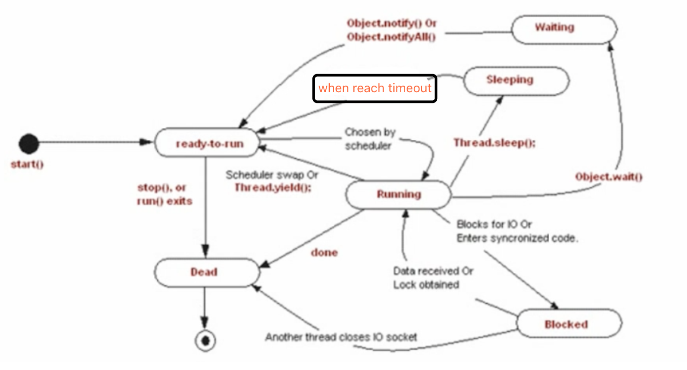

# Java线程的创建

[TOC]

并发编程主要涉及多进程、多线程、多任务以及资源共享的问题。这里着重介绍多线程、多任务及其资源共享。

**参考**：[Java并发原理与实战](https://www.bilibili.com/video/av43697557?p=5)


# 线程的状态



### 线程的状态：

1. 初始(NEW)：新创建了一个线程对象，但还没有调用start()方法。
2. 运行(RUNNABLE)：Java线程中将就绪（ready）和运行中（running）两种状态笼统的称为“运行”。
线程对象创建后，其他线程(比如main线程）调用了该对象的start()方法。该状态的线程位于可运行线程池中，等待被线程调度选中，获取CPU的使用权，此时处于就绪状态（ready）。就绪状态的线程在获得CPU时间片后变为运行中状态（running）。
3. 阻塞(BLOCKED)：表示线程阻塞于锁。
4. 等待(WAITING)：进入该状态的线程需要等待其他线程做出一些特定动作（通知或中断）。
5. 超时等待(TIMED_WAITING)：该状态不同于WAITING，它可以在指定的时间后自行返回。
6. 终止(TERMINATED)：表示该线程已经执行完毕。

### 几个方法比较：

- Thread.sleep(long millis)，一定是当前线程调用此方法，当前线程进入TIMED_WAITING状态，但不释放对象锁，millis后线程自动苏醒进入就绪状态。作用：给其它线程执行机会的最佳方式。
- Thread.yield()，一定是当前线程调用此方法，当前线程放弃获取的CPU时间片，但不释放锁资源，由运行状态变为就绪状态，让OS再次选择线程。作用：让相同优先级的线程轮流执行，但并不保证一定会轮流执行。实际中无法保证yield()达到让步目的，因为让步的线程还有可能被线程调度程序再次选中。Thread.yield()不会导致阻塞。该方法与sleep()类似，只是不能由用户指定暂停多长时间。
- thread.join()/thread.join(long millis)，当前线程里调用其它线程t的join方法，当前线程进入WAITING/TIMED_WAITING状态，当前线程不会释放已经持有的对象锁。线程执行完毕或者millis时间到，当前线程一般情况下进入RUNNABLE状态，也有可能进入BLOCKED状态（因为join是基于wait实现的）。
- obj.wait()，当前线程调用对象的wait()方法，当前线程释放对象锁，进入等待队列。依靠notify()/notifyAll()唤醒或者wait(long timeout) timeout时间到自动唤醒。
- obj.notify()唤醒在此对象监视器上等待的单个线程，选择是任意性的。notifyAll()唤醒在此对象监视器上等待的所有线程。
- LockSupport.park() / LockSupport.parkNanos(long nanos) ， LockSupport.parkUntil(long deadlines)，当前线程进入 WAITING/TIMED_WAITING 状态。对比 wait 方法,不需要获得锁就可以让线程进入 WAITING/TIMED_WAITING 状态，需要通过 LockSupport.unpark(Thread thread) 唤醒。

# 线程的创建

## 创建线程的基本方法：

### 1 继承Thread父类（作为Thread具体子类可直接执行）：

直接重写父类Thread的run方法。

### 2 实现Runnnable接口：

仅作为线程任务传给Thread执行。将任务与线程分离，以达到解耦；

### 3 通过匿名内部类创建线程

（实现Runnable接口和继承Thread都可）


#### Thread.java类详解：

几种构造方法：


```java
   // Thread.java 代码段
   public Thread(Runnable target) {
        this(null, target, "Thread-" + nextThreadNum(), 0);
    }
     /* @param  group
     *         the thread group. If {@code null} and there is a security
     *         manager, the group is determined by {@linkplain
     *         SecurityManager#getThreadGroup SecurityManager.getThreadGroup()}.
     *         If there is not a security manager or {@code
     *         SecurityManager.getThreadGroup()} returns {@code null}, the group
     *         is set to the current thread's thread group.
     *
     * @param  target
     *         the object whose {@code run} method is invoked when this thread
     *         is started. If {@code null}, this thread's run method is invoked.
     *
     * @param  name
     *         the name of the new thread
     *
     * @param  stackSize
     *         the desired stack size for the new thread, or zero to indicate
     *         that this parameter is to be ignored
     *
     * @param  inheritThreadLocals
     *         if {@code true}, inherit initial values for inheritable
     *         thread-locals from the constructing thread, otherwise no initial
     *         values are inherited
     *
     * @throws  SecurityException
     *          if the current thread cannot create a thread in the specified
     *          thread group
     *
     * @since 9
     */
    public Thread(ThreadGroup group, Runnable target, String name,
                  long stackSize, boolean inheritThreadLocals) {
        this(group, target, name, stackSize, null, inheritThreadLocals);
    }

    @Override
    public void run() {
        if (target != null) {
            target.run();
        }
    }
```

#### 线程的run()、setDaemon()、interpreted()：

1 当一个线程类同时实现Runnable和继承Thread时，只有重写的Thread的run方法会被执行（R unnbale）。

```
    //匿名内部类（同时实现Runnable并继承Thread）创建线程
		Thread t = new Thread(new Runnable() {
			@Override
			public void run() {
				System.out.println(" do runnable run..."); //not work
			}	
		}) {
			@Override
			public void run() {
				System.out.println(" do thread run..."); //this work
			}
		};
		
		t.start();
```

2 将线程设置为守护线程setDaemon(true)后，当主线程结束后守护线程也会结束。

```
public static void main(String[] args) {
		MyThread th1 = new MyThread("ThreadImpl1");
		MyThread th2 = new MyThread("ThreadImpl2");
		
		/* The JVM exits when the only threads running are all daemon threads.
		 * after setDaemon(true), th1 and th2 will terminate when main thread terminate
	   */
		th1.setDaemon(true);
		th2.setDaemon(true);
		
		th1.start();
		th2.start();
}
```

3 线程的终止使用interpreted（stop()已弃用，因为它只是让线程无限等待并未真正释放左右资源）

```java
public class MyThread extends Thread{
	@Override
	public void run() {
    //通过线程终止状态拍决定是否执行
		while(!interrupted()){
			System.out.println(getName()+ " is running");
		}
	}

	public static void main(String[] args) {
		MyThread th1 = new MyThread("ThreadImpl1");
		MyThread th2 = new MyThread("ThreadImpl2");

		th1.start();
		th2.start();
		
		//th1.stop();//Deprecated, 只是无限期等待并未释放所有资源，不是真正的停止
		th1.interrupt();//停止当前线程，并将终止状态interrupted置为true
	}
```


### 4 创建带返回值的线程：通过Callable和FutureTask

**实现Callable<V>（参数V是返回值的类型）接口，并使用FutureTask<V>**：作为带返回值并可以抛出异常的线程任务，传入Thread执行；

```java
/**
 * @Desc   有返回值且能抛出异常的线程
 * @Author github.com/liuyuanyuan
 */
public class MyCallable implements Callable<Integer> {

	@Override
	public Integer call() throws Exception {
		System.out.println("computing...");
		return 1;
	}

	public static void main(String[] args) {
		MyCallable ct = new MyCallable();
		FutureTask<Integer> ftask = new FutureTask<>(ct);//Runnable的实现，是线程任务
		Thread t = new Thread(ftask);
		t.start();
		System.out.println("can do other things here...");
		try {
			Integer result = ftask.get();//await until done and return
			System.out.println("result = " + result);
		} catch (InterruptedException|ExecutionException e) {
			System.err.println(e.getMessage());
			e.printStackTrace();
	    } 
	}
}
```


### 5 定时器(Timer)创建多线程

-  **java.util.Timer**

定期执行定时任务，适用于简单的处理。

```
public static void main(String[] args) {
		Timer timer = new Timer();
		timer.schedule(new TimerTask() {
			@Override
			public void run() {
				System.out.println("run timer task ");
			}
		}, 0, 1000);
}
```

- **Quartz**

- **Spring**

  

### 6 线程池创建多线程(以空间换时间)

```java
public static void main(String[] args) {
		//ExecutorService threadPool = Executors.newFixedThreadPool(3);//固定线程数
		ExecutorService threadPool = Executors.newCachedThreadPool();//智能线程数
		for(int i=1; i<=10; i++)
		{
			threadPool.execute(new Runnable(){
				@Override
				public void run() {
					System.out.println(Thread.currentThread().getName() + " is running..");
				}
			});
		}
		
		threadPool.shutdown();//shutdown all threads of the pool
	}
```

#### 创建线程池

《阿里巴巴Java开发手册》中强制线程池不允许使用 Executors/ExecutorService去创建，而是通过 ThreadPoolExecutor的方式，这样更加明确线程池的运行规则，规避资源耗尽的风险。

> Executors/ExecutorService返回线程池对象的弊端如下:
>
> - FixedThreadPool 和 SingleThreadExecutor : 允许请求的队列长度为 Integer.MAX_VALUE,可能堆积 大量的请求，从而导致OOM。
> - CachedThreadPool 和 ScheduledThreadPool : 允许创建的线程数量为 Integer.MAX_VALUE ，可能 会创建大量线程，从而导致OOM。

##### 通过ThreadPoolExecutor构造方法创建线程池（建议）：


#### 通过工具类Executors中的方法创建线程池：

(绿框中的方法)内部是通过ThreadPoolExecutor实现的。


### 7 Lambda表达式(since Java8)实现多线程

Lambda 表达式，也可称为闭包，它是推动 Java 8 发布的最重要新特性。

Lambda 允许把函数作为一个方法的参数（函数作为参数传递进方法中）。使用 Lambda 表达式可以使代码变的更加简洁紧凑。

```
public class LambdaThread {
	
	public static void main(String[] args) {
		List<Integer> values = Arrays.asList(10,20,30,40);
		int res = new LambdaThread().add(values);
		System.out.println("result=" + res);
	}

	public int add(List<Integer> values){
		//values.parallelStream().forEach(System.out::println);//并行打印，结果无序
		//values.parallelStream().forEachOrdered(System.out::println);//有序打印
		return values.parallelStream().mapToInt(i -> i).sum();	
	}
}
```


### 8 Spring Framework实现多线程

Eclipse创建Maven简单项目（preference-maven-installation&user config-create maven project - single project），进行Spring Framework（现在是SprintBoot2.2.4）的初始配置，参考官网 [Project - Spring Framework - Quick Start](https://start.spring.io)   和 [Developing Your First Spring Boot Application](https://docs.spring.io/spring-boot/docs/2.2.4.RELEASE/reference/html/getting-started.html#getting-started-first-application) 。

```java
@SpringBootApplication
@EnableAsync
public class AppConfig {
	
	//just for test
	public static void main(String[] args) {
		//SpringApplication.run(AppConfig.class, args);
		AnnotationConfigApplicationContext ac = 
				new AnnotationConfigApplicationContext(AppConfig.class);
		DemoService ds = ac.getBean(DemoService.class);
		ds.a();
		ds.b();
	}
}

@Service
public class DemoService {
	@Async
	public void a() {
		while(true) {
			System.out.println("a---");
			try {
				Thread.sleep(1000);
			} catch (InterruptedException e) {
				e.printStackTrace();
			}
		}
	}
	
	@Async
	public void b() {
		while(true) {
			System.out.println("b---");
			try {
				Thread.sleep(1000);
			} catch (InterruptedException e) {
				e.printStackTrace();
			}
		}
	}
}

```


