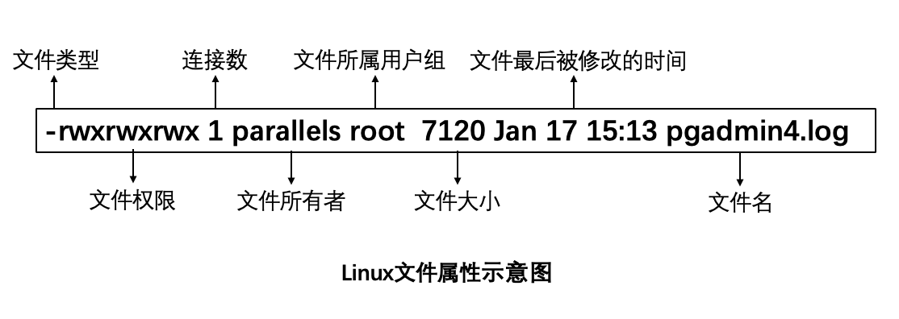
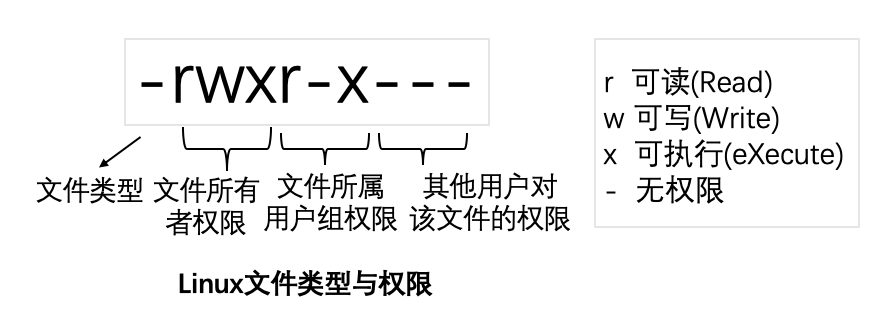

# Linux文件/目录及其权限

主要是针对用户和组的权限（rwx）设置，来控制对文件/目录的资源访问。本章主要介绍：

- 查看文件属性ls -al
- 修改文件所有者 chown
- 修改文件所属用户组 chgrp
- 权限对文件/目录的意义
- 修改文件/目录的权限 chmod

## 查看文件属性

ls是“list”的意思，该命令用来显示文件的名称及其属性。

每个文件一行数据，每行数据有10列。

注意：

ls -l 显示文件及其属性，但不包括隐藏文件；

要查看隐藏文件需要 -a选项，使用ls -al可以查看所有文件及其属性（隐藏文件是文件名前带. 的文件）。



##### 第一列是文件类型与权限（permission），共10个字符，中间无空格。



**格式：** <文件类型><文件所有者的权限><文件所属用户的权限><其他人对此用户的权限>

**文件类型（占1个字符）：**

| 符号 | 文件类型符号的含义                   |
| ---- | ------------------------------------ |
| d    | 代表目录（directory）                |
| -    | 代表文件夹                           |
| ｜   | 代表连接文件（linkfile）             |
| b    | 代表设备文件里面的可供存储的接口设备 |
| c    | 代表设备文件里面的串行端口设备       |

**权限（占9个字符）：**每3个为1组，按rwx顺序组合，没用权限用减号-替代。总共3组。

| 符号法 | 数字法 | 权限含义       |
| ------ | ------ | -------------- |
| r      | 4      | 可读 read      |
| w      | 2      | 可写 write     |
| x      | 1      | 可执行 execute |

##### 第二列表示有多少文件名连接到此结点

##### 第三列表示当前文件或目录的所有者账号名

##### 第四列表示这个文件的所属用户组

##### 第五列表示这个文件的容量大小，默认单位为B。

##### 第六列表示这个文件的创建文件日期或者最近的修改日期

##### 第七列为该文件名


## 修改文件所有者 chown

```
chown  [-R]  账号名  文件或目录
chown  [-R]  账号名:组名  文件或目录
参数-R：进行递归的持续更改，即连同子目录下的所有文件都更改。
```

## 修改文件所属用户组 chgrp

（暂略）

## 权限对文件/目录的意义

##### 权限对文件的意义

- r（read）：可以读取此文件的实际内容（如读取文本文件的文字内容等）；
- w（write）：可以编辑、新增或者修改该文件的内容（但不包含删除该文件）；
- x（eXecute）：该文件具有可以被系统执行的权限。

##### 权限对目录的意义

- r（read contents in directory）可以读取目录结构列表（可以查询文件名数据）。
- w（modify contents of directory）可以更改目录结构列表（新建、删除、重命名、移动）；
- x（access directory）用户可以进入该目录成为工作目录。

## 修改文件/目录的权限 chmod

##### 数字法：

```
chmod [-R] xyz 文件或目录

参数
-R：进行递归的持续更改，即连同子目录下的所有文件都更改。
xyz：表示三种身份（owner、group、others）各自的三个权限（r、w、x）的分数的组合分数。
```

##### 符号法：

```
chmod  [-R]  各身份的权限的处理  文件或目录

对各身份（u,g,o和a）的权限（rwx）的处理（=、+、-）:
身份符号：
  u表示owner
  g表示group
  o表示others
  a表示all，即所有身份
权限处理：
  = 设置权限
  + 增加权限
  - 去掉权限
```

 

例1：给目录dir1及其子目录，授予权限-rwxr-x---。

```shell
分析：
         owner = rwx = 4+2+1 = 7
         group = r-x = 4+0+1 = 5
         other = --- = 0+0+0 = 0

用数字法授权：chmod -R 750 dir1
用符号法授权：chmod -R u=rwx,g=rw  dir1
```

例2: 给文件file增加每个人都可以写入的权限：

```
chmod  a+w file
```

例3:将文件file的权限去掉而不更改其他属性：

```
chmod  a-w file
```


